# 汽车类

更新时间：

来源：https://developer.huawei.com/consumer/cn/doc/design-guides/cars-0000001930233436

汽车类应用主要包括首页、汽车详情、3D 看车、车辆对比等核心的应用场景。在此类场景中，用户能够选择其感兴趣的汽车品牌和其车型，在页面中观看各种参数、配件、功能等，甚至还能看 3D 汽车模型或者是更换喜欢的配色进行观察。此类应用旨在让用户在选车看车时，使用大屏设备有更优的体验。
 

#### 首页

 
首页 banner 在手机上使用轮播图的形式展示，在宽屏设备上使用延伸布局同时展示更多 banner 卡片。功能区入口图标通过延伸布局在宽屏上露出更多。卡片内容使用瀑布流布局，在宽屏显示更多列数，并支持双指缩放调整列数。
 

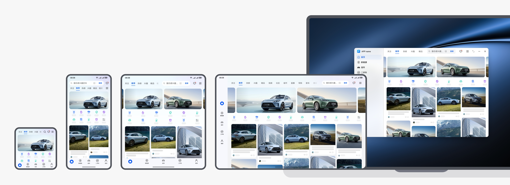

 

 
同时，建议在设备上支持 banner 沉浸式无边距的设计，为汽车类的营销头图广告带来更强冲击力，提升使用体验。
 

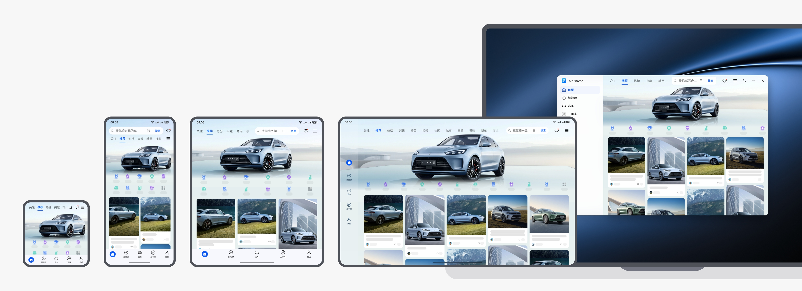

 

 

#### 选车

 
选车场景主要用于快速查找目标品牌与感兴趣的汽车。
 

 
范式一：在宽屏设备上，使用自适应布局，推荐区域可以展示更多的汽车品牌，提升浏览效率。
 

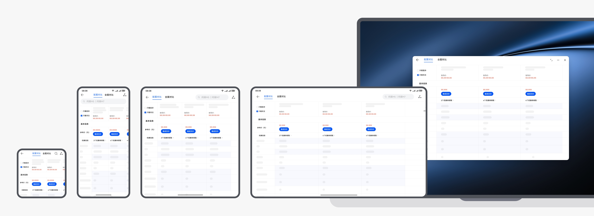

 

 
范式二：在宽屏设备上，建议分栏布局，提升效率。
 

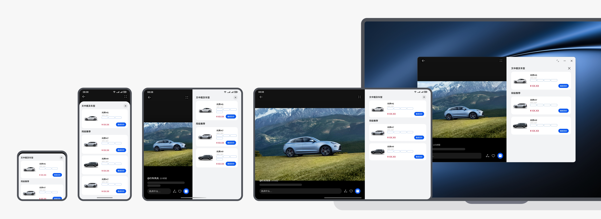

 

 

#### 车辆详情

 
车辆详情场景中，通常有顶部的商品图片，在平板上从选车列表到进入车辆详情时，可以展示更多商品信息。
 

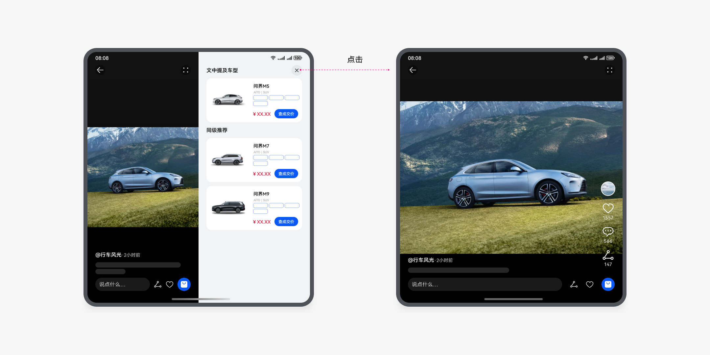

 

#### 全屏3D看车

 
在折叠屏上，建议使用沉浸式布局，提升全屏看车的使用体验。
 

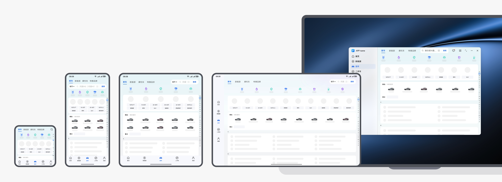

 

 
在平板设备上，可以显示更大的汽车 3D 模型图，视觉效果更佳。
 

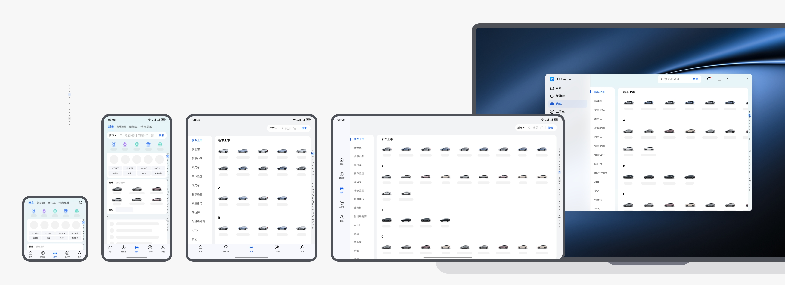

 

 
3D 沉浸式看车时，旋转车身可以从不同的视角欣赏汽车。
 

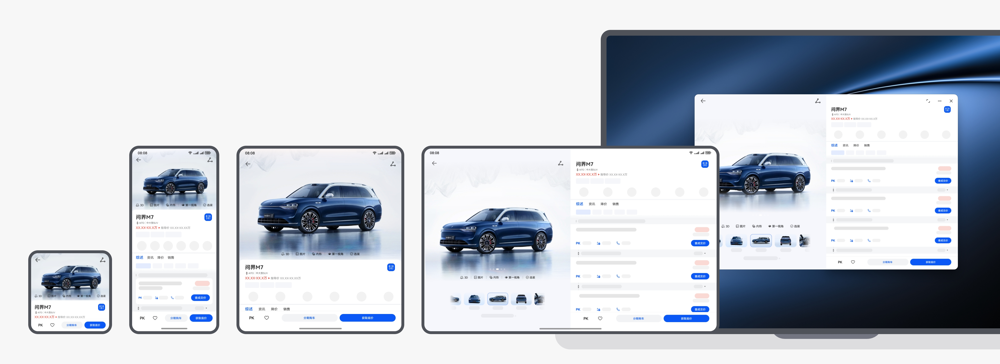

 

 

#### 询底价半模态

 
点击底部查询底价按钮时，使用半模态控件展示页面内容，在手机上使用底部向上的半模态面板，在宽屏设备上使用居中半模态面板。
 

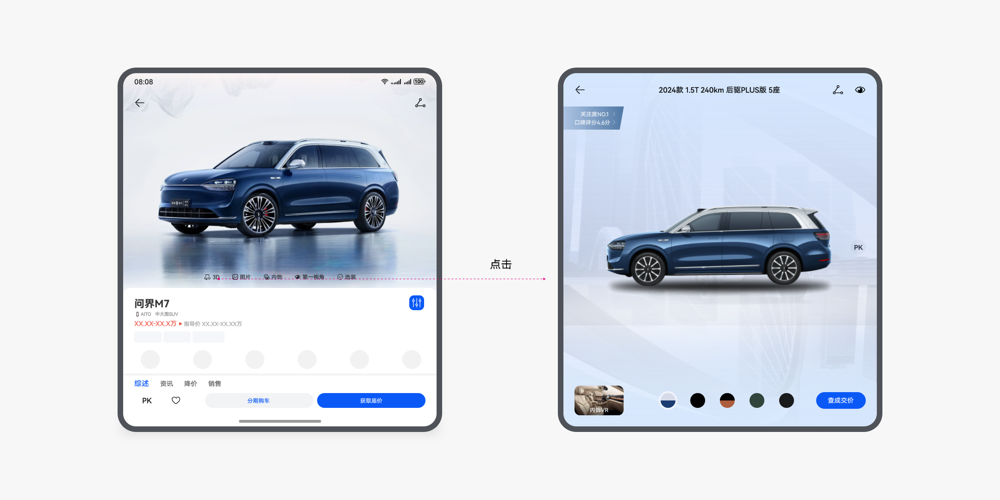

 
半模态面板的开发指南，请参阅 [API 参考 (bindsheet)](https://developer.huawei.com/consumer/cn/doc/harmonyos-references/ts-universal-attributes-sheet-transition)。
 

 

#### 汽车评分

 
进入评分页面，建议整体使用沉浸式背景，减少可视化的评分区域和用户评论区域的视觉割裂感，对比车型数据使用可视化展示，提升使用体验。
 

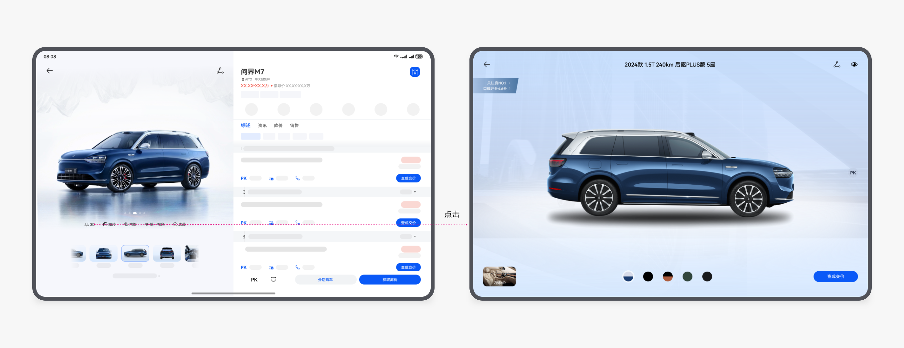

 

 

#### 汽车PK

 
汽车 pk 场景，多端设备上页面可以使用重复布局，手机上最多显示两个车辆的对比信息，建议在更宽的折叠屏及平板上能同时显示更多列内容。
 

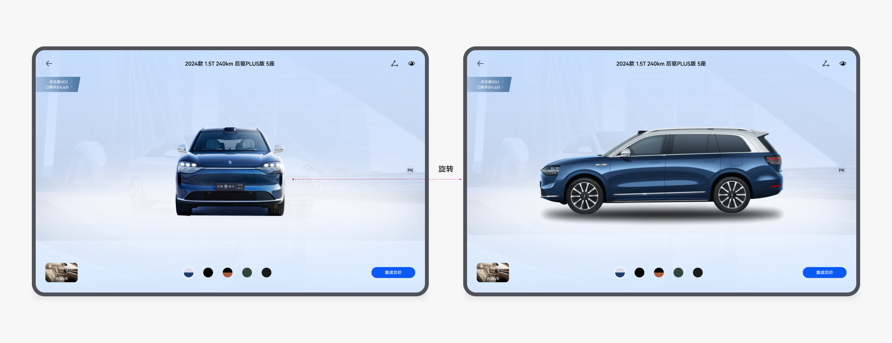

 

#### 视频购车

 
营销页面，在浏览文章/视频的同时，推送文章相关车辆，可以直接查询该车型的底价等。在手机上，使用底部半模态面板；在折叠屏上，建议使用 1:1 侧边面板展示推荐车型；在平板上，建议使用 3:2 的侧边面板展示推荐车型。
 

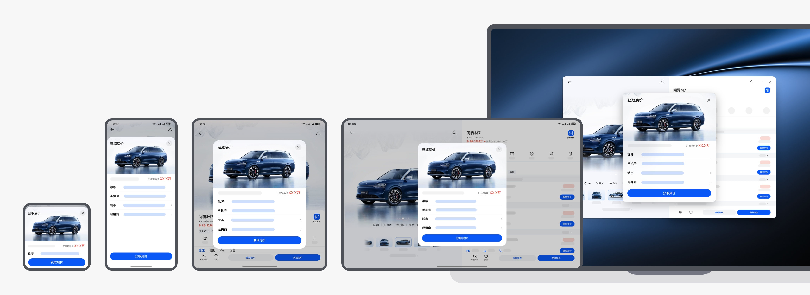

 

 
侧边面板可以关闭，或通过底部 icon 打开。
 

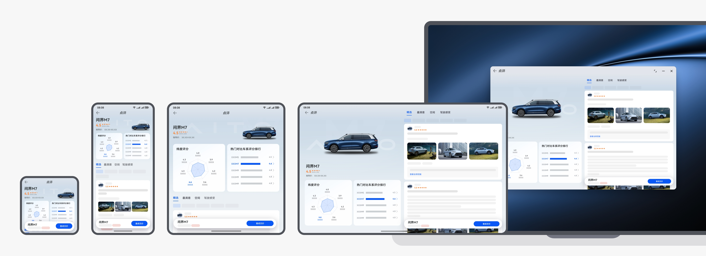
