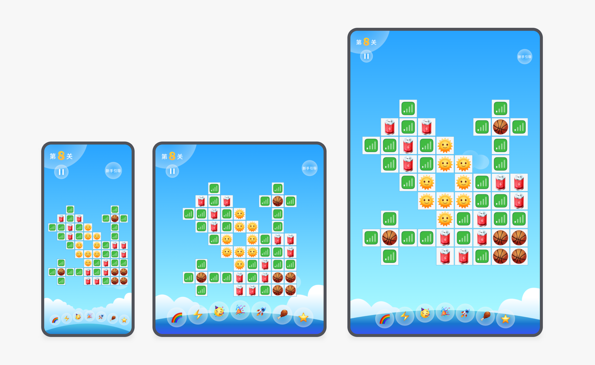
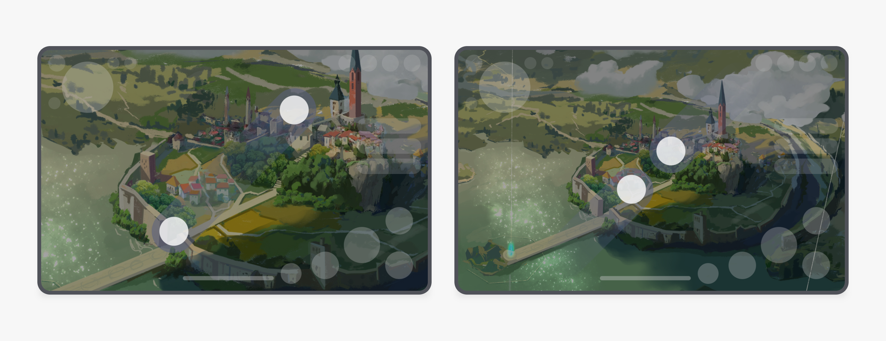
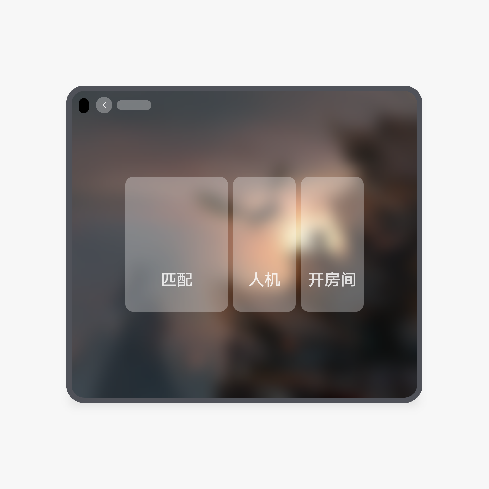

# 游戏类

更新时间：

来源：https://developer.huawei.com/consumer/cn/doc/design-guides/games-0000001930189974

游戏类应用注重用户的沉浸式体验，具有强互动性和操作性，在大屏设备上可以向用户展示更宽阔的游戏画面，提供更轻便高效的交互体验。
 

#### 游戏视野

 
游戏视野的大小对用户的游戏体验感是一个重要的影响因素，利用大屏的优势，合理适配视野能给用户带来更好的游戏体验；
 

#### 战绩浅层化

 
在折叠屏上，保证游戏视野的同时，纵向可增加游戏战绩展示。
  
|  |
| 推荐（在留黑区域显示辅助信息） |
|  |
| 不推荐（上下留黑） |
 
 

#### 补偿视野

 
手机视野基础上，折叠屏和平板横向缺失部分视野，纵向拓展部分视野，补偿和缺失的面积相似，整体视野同手机相似；
 
折叠屏横向缺失部分视野，纵向拓展部分视野。
 

 
平板横向缺失部分视野，纵向拓展部分视野。
 

 

 

#### 完美视野

 
在宽屏设备上，手机和折叠屏的横向视野保持一致，折叠屏纵向拓展部分视野。
  
|  |
| 推荐（手机和折叠屏的横向视野保持一致，折叠屏纵向扩展部分视野） |
|  |
| 推荐（手机和折叠屏的横向视野保持一致，平板纵向扩展部分视野） |
|  |
| 不推荐（直接等比放大，导致用户视野变小） |
|  |
| 推荐（休闲类游戏，在折叠屏和平板上适当放大） |
 
 

#### 任务并行

 
可通过分屏，实现多应用并行，在折叠屏上边聊边玩。
 

 
在平板上边购边玩或边聊边玩。
 

 

 
悬浮窗用于在已经有任务的基础上，临时处理另一个任务，或短时间任务并行。例如在玩游戏时浏览资讯等。
 

 

#### 拇指易用

 
结合人因，合理排布游戏操作按钮，提高用户操作效率。
  
|  |  |
| 推荐（高频按钮往容易触及的区域移动） | 不推荐（高频按钮位置偏下，触及困难） |
 
 

#### 双指缩放

 
对非对战类和无游戏公平性约束的游戏，游戏画面可通过双指缩放来调节大小，用户可获得更大游戏视野。
 

 

#### 挖孔避让

 
挖孔区在顶部时，挖孔区遮挡了操作或页面信息，需要避让挖孔区域；操作按钮需要往另一侧移动，同时避免侧边大量留白。
  
|  |  |
| 推荐（操作按钮避开挖孔区） | 不推荐（操作按钮和挖孔区重叠被遮挡，触及时会污染镜头 |
 
  
|  |  |
| 推荐（重要信息避开挖孔区，避免被遮挡） | 不推荐（重要信息与挖孔区重叠，被遮挡） |
 
  
|  |  |
| 推荐（重要信息避开挖孔区，避免被遮挡） | 不推荐（重要信息与挖孔区重叠，被遮挡） |
