# 电商购物类

更新时间：2025-07-01 03:19:34

来源：https://developer.huawei.com/consumer/cn/doc/design-guides/responsive-design-examples5-0000001930419478

购物、买菜等服务类型的应用或业务场景，旨在让用户享受高效的浏览和互动。这类场景的核心是浏览商品、商品比价、直播购，因此，在大屏设备上可以向用户展示更多的商品选择，提供更轻便高效的交互体验。此类应用有如下特点：

- 界面布局舒适美观
- 展示更多的商品信息
- 高效的详情对比
- 快捷流畅的界面交互
- 关键信息无干扰

## 首页

### 首页的沉浸广告

| 在电商购物应用中，首页通常会有入口图标和商品卡片等丰富的商品信息。通过对入口图标进行挪移或延展，商品卡片增加列数的方式高效适配多端设备尺寸，从而提升大屏设备上界面布局的舒适性、美观性和浏览效率。 |
| --- |
| 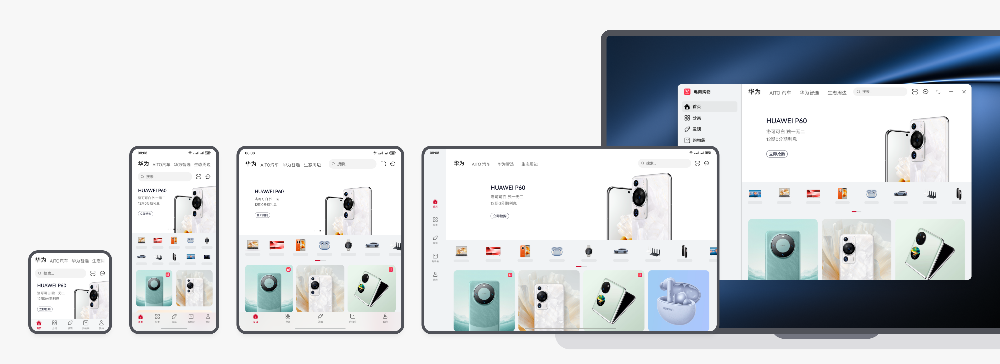 |

### 首页的卡片响应式布局

有多张卡片时，在宽屏设备上采用延伸布局以露出更多卡片。

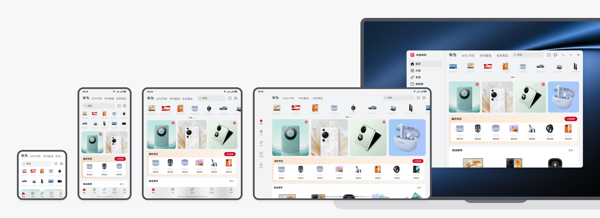

只有两张卡片时，在更宽的设备上卡片自适应形变。

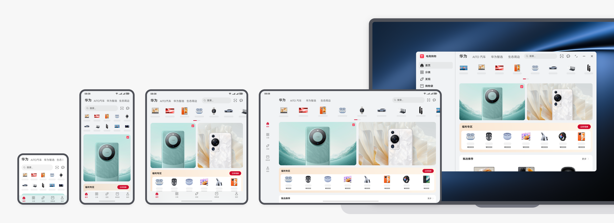

只有一张卡片时，在宽屏设备上卡片自适应形变 + 挪移布局范式一：

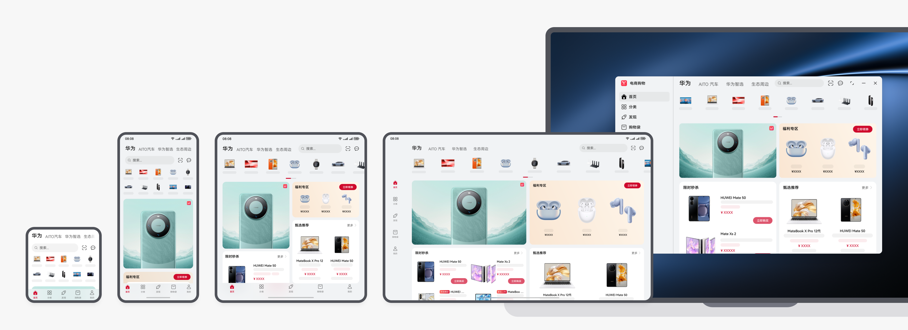

只有一张卡片时，在宽屏设备上卡片自适应形变 + 挪移布局范式二：

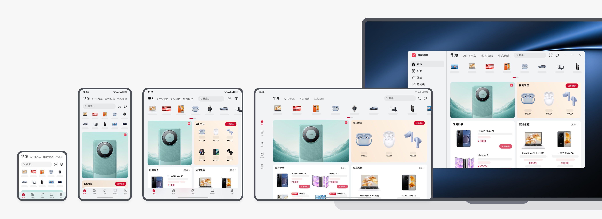

本场景的开发指南，请参阅一多开发实例（购物比价）-首页。

## 商品分类

商品分类页主要用于快速查找目标商品，在大屏设备上建议通过分栏布局提升查找效率。

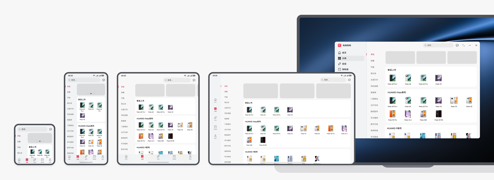

本场景的开发指南，请参阅一多开发实例 (购物比价)-商品分类页。

## 商品搜索

为了避免进入整屏搜索界面时产生的大面积跳转，同时也为了规避搜索联想词列表的留白问题，在折叠屏/平板上建议采用轻量化搜索体验。当用户点击搜索框/搜索按钮时，原地激活搜索框，使用搜索面板承载推荐内容和搜索联想词，保持界面布局的整体稳定性。

> [!NOTE]
> **注：应用根据自身业务属性决策是否在首页使用，推荐运用于二级频道页。**

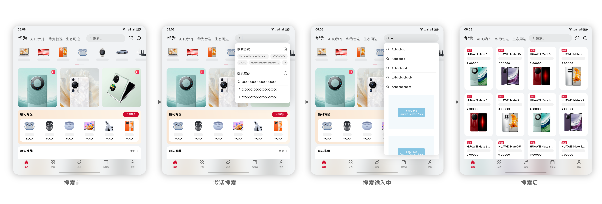

## 商品详情

商品详情页中通常有顶部的商品图片，在折叠屏上建议通过延伸布局露出更多商品图片，在平板上建议从商品列表到进入商品详情时，提供分栏体验，帮助用户更高效的查找商品。

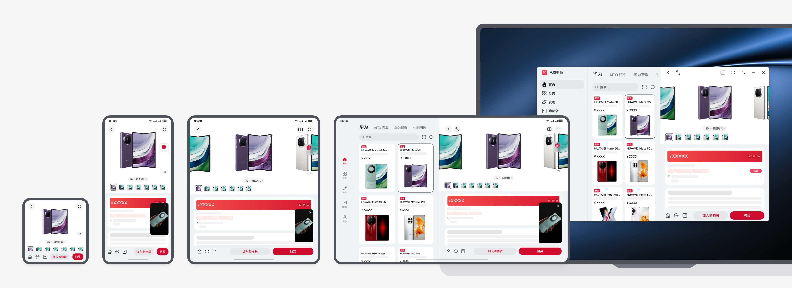

平板上分栏布局时，点击全屏按钮，进入全屏，显示全屏的挪移布局。

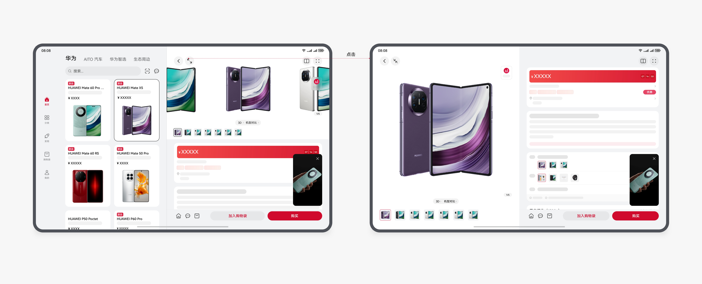

也可以为平板提供默认的全屏体验，点击商品卡片直接进入商品详情。

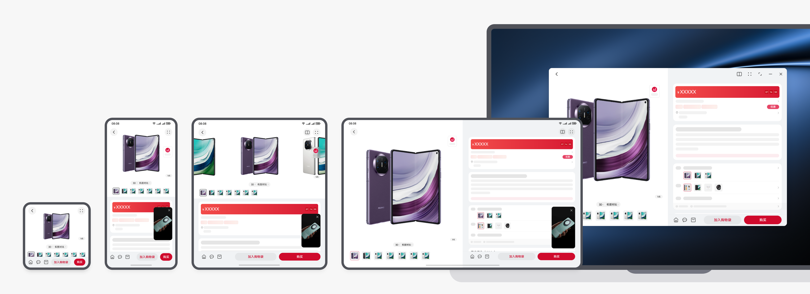

本场景的开发指南，请参阅一多开发实例 (购物比价)-商品详情页。

平板上挪移布局显示商品详情时，查看下一层级内容时，建议使用以下两种范式。

范式一：在商品详情页，点击评论等功能进入下一层级页面时，通过侧边面板显示下一层级内容：

范式二：在商品详情页，点击评论等功能进入下一层级页面时，原来的全屏界面被缩窄，右侧露出的面板上显示下一层级内容。

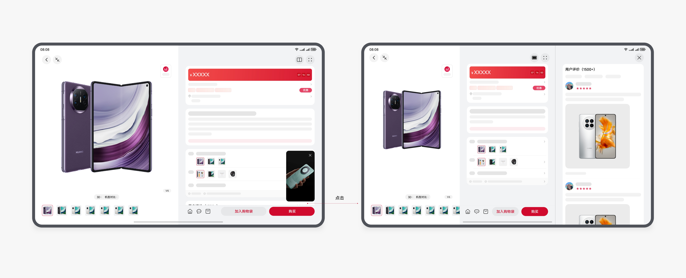

本场景的开发指南，请参阅一多开发实例 (购物比价)-商品详情侧边面板页。

## 分屏购物比价

查看商品详情时，在宽屏设备上，可点击应用内“分屏”按钮进行分屏，可满足同时查看两个商品的详细参数进行购物比价的诉求。

形成分屏后，“分屏”按钮自动切换为“全屏”按钮，可再次点击“全屏”按钮回到当前获焦窗口的全屏，退出另一侧的分屏任务。

多端的应用内分屏购物比价效果：

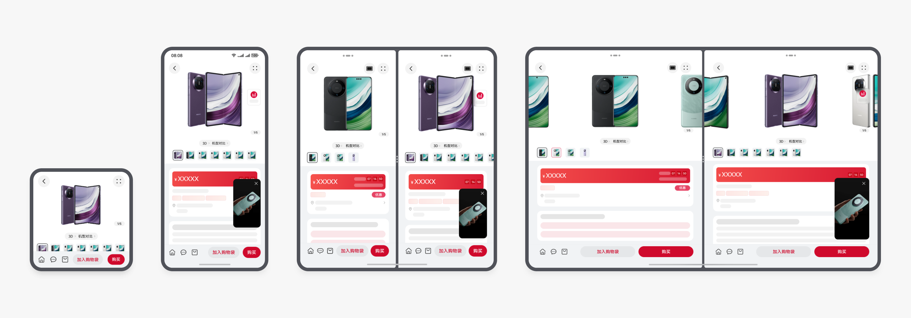

## 侧边面板咨询客服

在查看商品详情时，经常会有咨询客服的诉求，可采用侧边辅助面板显示客服对话等辅助信息，从而提升浏览效率，实现边看商品详情边聊天咨询的体验。

侧边面板同样可用于更多场景，例如在商品详情页临时打开购物车、查看评论、查看店铺信息等。

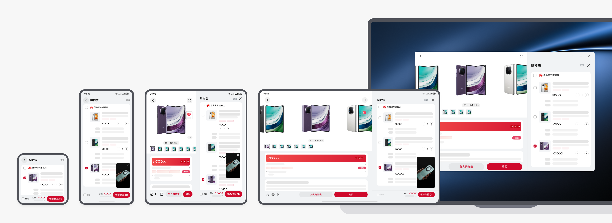

## 购物车

购物车页面通常用于快速查看并支付待购买的商品。折叠上可全屏适配显示更多关键参数信息，平板和更大尺寸的屏幕设备的显示区域较大，为避免界面留白较多信息过疏，建议采用重复布局、露出辅助信息等方式确保页面的使用效率。

范式一：重复布局

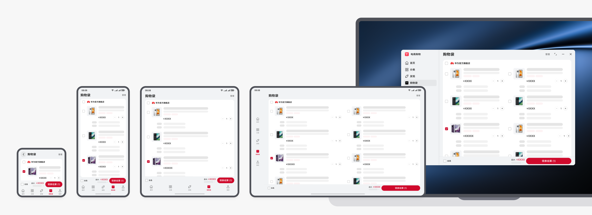

范式二：右侧露出辅助信息

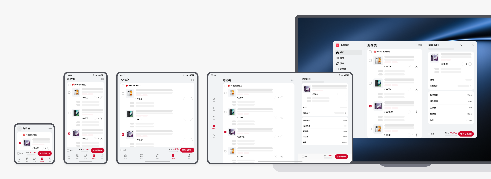

本场景的开发指南，请参阅一多开发实例 (购物比价)-购物车页。

| 范式三：从列表变卡片         查看商品详情时，有需要临时查看购物车内待支付商品的诉求，可利用侧边辅助面板显示购物车页面，提升浏览效率。         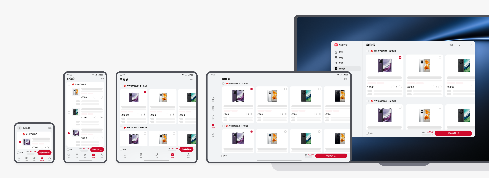 |
| --- |
|    |

## 浅层窗口支付

全屏商品详情支付时，采用浅层窗口可以有效避免大面积的页面跳转带来的体验中断。平板和折叠屏上调用居中的半模态控件；手机上调用底部半模态控件，来实现浅层窗口体验。

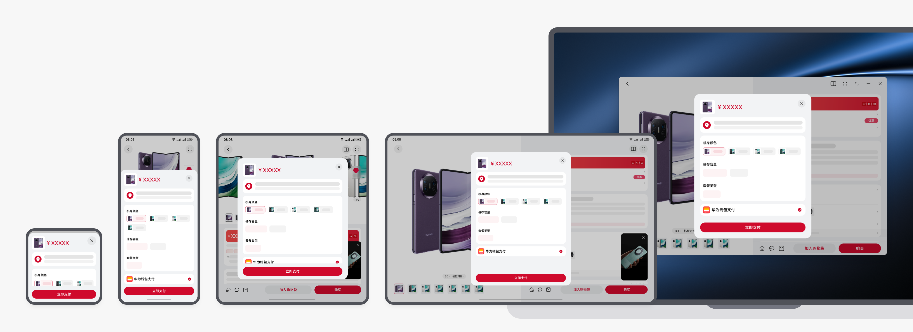

本场景的开发指南，请参阅一多开发实例 (购物比价)-商品支付页。

## 直播购物

直播购物在电商购物场景中很常见。

### 全屏直播间

直播画面和推荐的商品信息，在多端基于设备屏幕尺寸进行响应式适配。

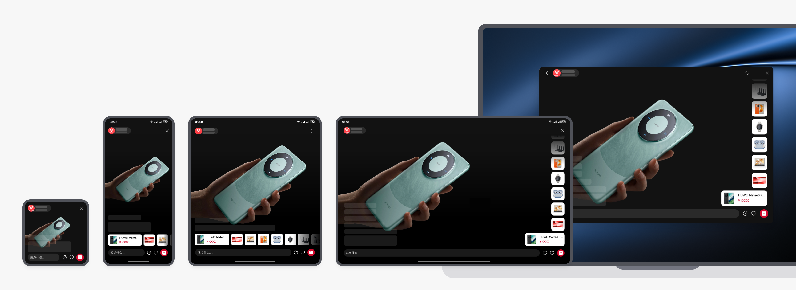

同一设备上，可根据直播画面比例进行自适应的布局适配。

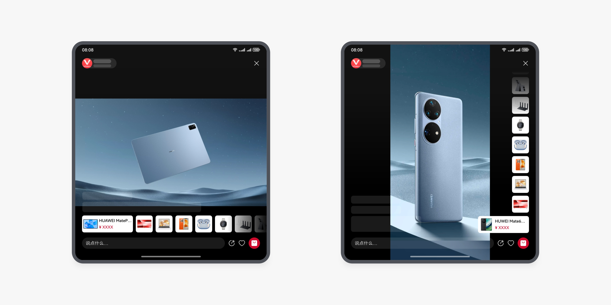

本场景的开发指南，请参阅一多开发实例 (购物比价)-直播间页。

### 边看边买

直播 + 商品详情

在看直播时，经常需要一边听商品讲解一边浏览商品信息，可利用侧边辅助面板查看商品详情，提升购买决策效率。

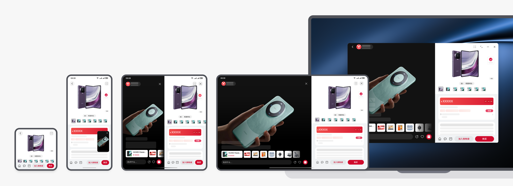

直播 + 直播间购物袋

看直播时，会有临时查看直播间中直播商品的诉求，通过侧边辅助面板可快速查看直播间购物袋直播商品，提高浏览效率。

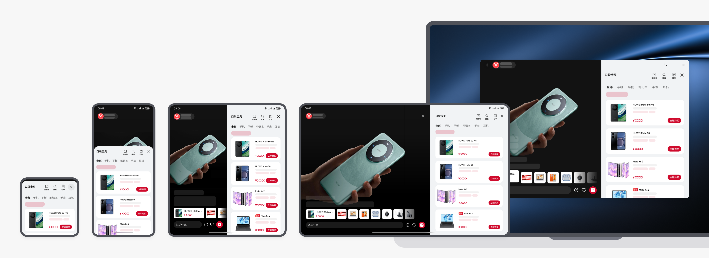

直播 + 支付

看直播时，可以通过侧边辅助面板直接进行支付，确保任务不会被中断和支付效率。

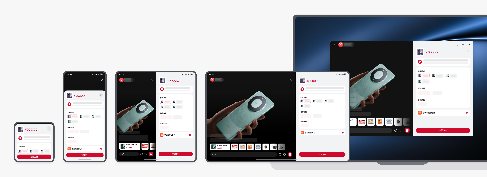

本场景的开发指南，请参阅一多开发实例 (购物比价)-直播侧边面板页。
