# 社交通讯类

更新时间：2026-01-12 02:41:30

来源：https://developer.huawei.com/consumer/cn/doc/design-guides/responsive-design-examples2-0000001793536901

社交通讯类场景主要包括社交动态、IM 对话、通话、会议等类型的应用和场景。此类场景旨在让用户享受高效的浏览和互动交互。需要避免因为部分元素显示过大，导致大屏幕上交互效率降低。建议重点关注首页、详情页、对话页、通话页等，有针对性地适配以提高用户体验。

## 分栏布局的 IM 对话

| IM 对话建议使用分栏布局，左侧消息列表，右侧消息详情。分栏布局时，左侧列表不变，右侧可切换显示下一层级内容。 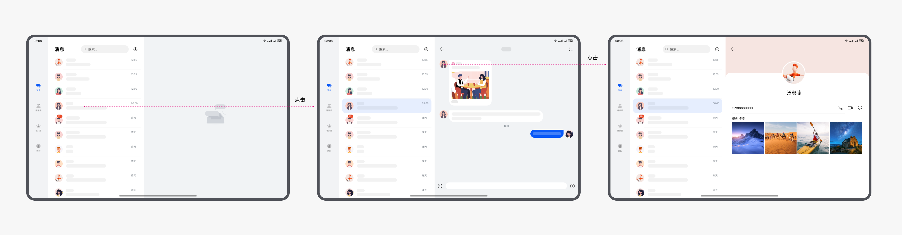 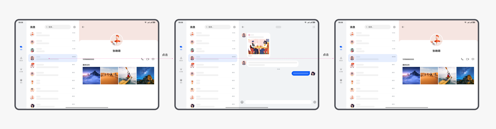 |
| --- |

IM 对话场景的多端设计示例：

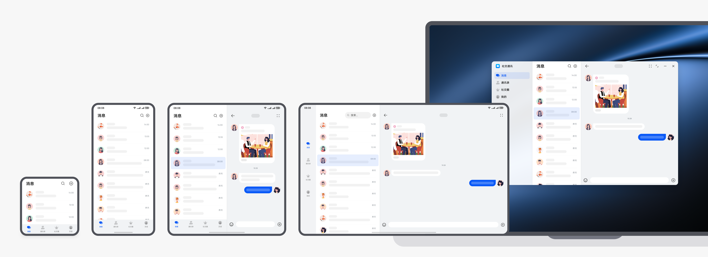

分栏的开发指南，请参阅一多开发实例 (即时通讯)。

## 应用内分屏

在应用内打开元服务、网页、文档、视频通话等内容，可以提供应用内分屏入口，实现边聊边买、边聊边看等任务并行的体验。IM 对话时打开元服务，提供应用内分屏的示例：

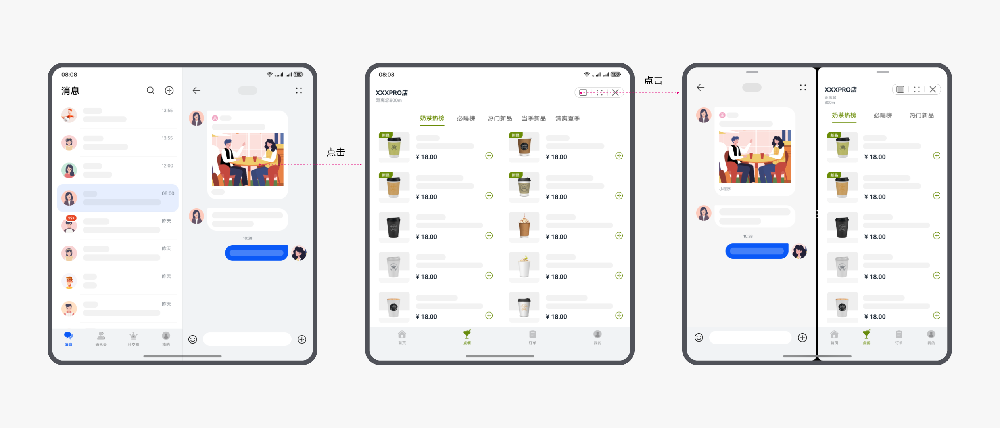

IM 对话时打开文档，提供应用内分屏的示例：

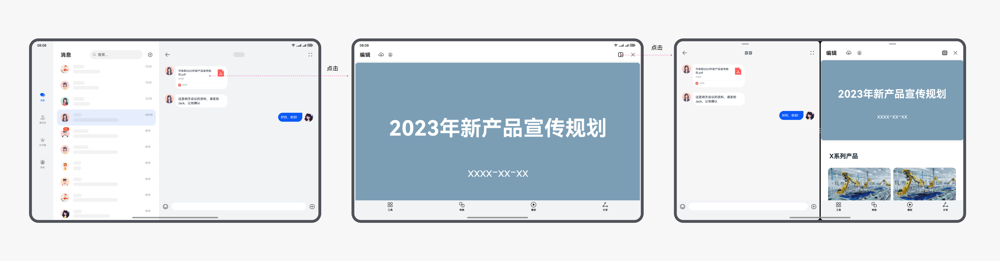

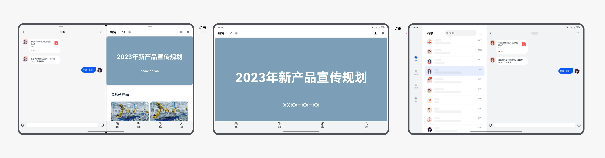

视频通话时露出分屏按钮，点击按钮后提供应用内分屏的示例：

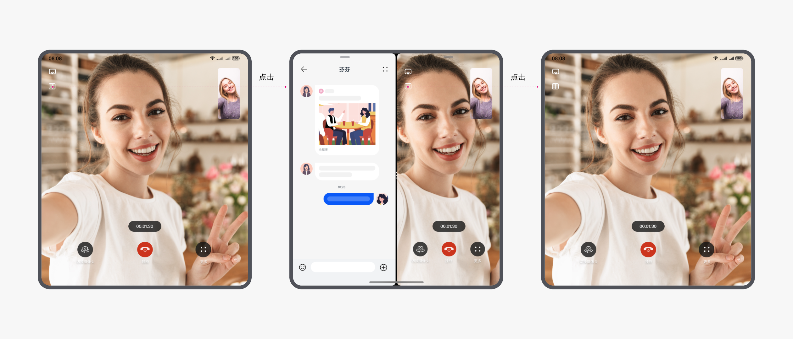

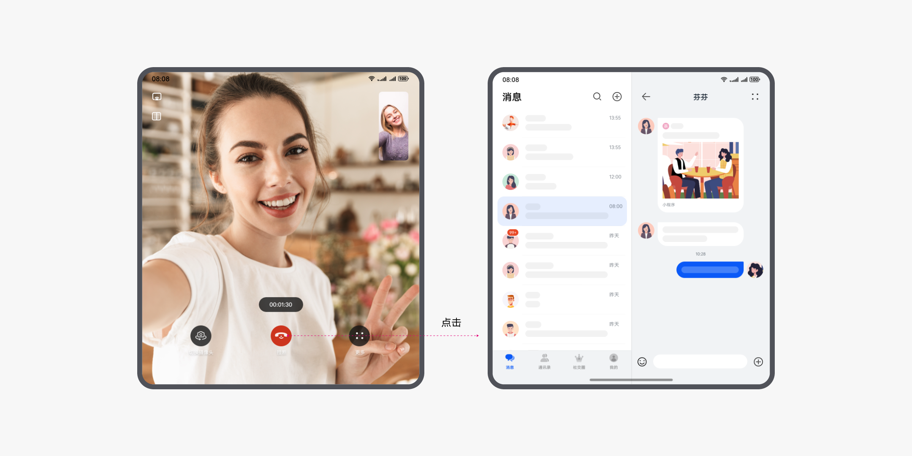

在折叠屏、平板、电脑上，都可以使用应用内分屏的示例：

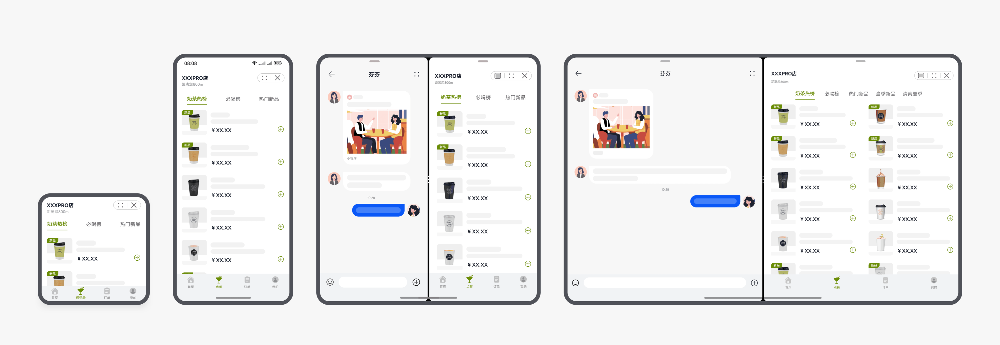

## 视频通话

### 双人视频通话

| 视频通话场景，尽可能提供全屏沉浸的视频画面。 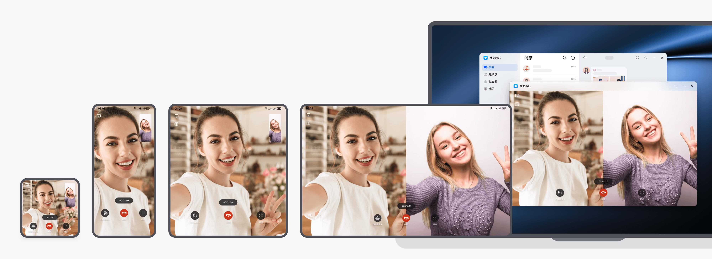 |
| --- |

视频通话需要适配悬停态，避免在中间折痕区域显示画面或操作按钮。上半屏显示视频画面，下半屏显示操作。需要避免视频通话悬停态时对方的取景画面被横过来。

范式一：

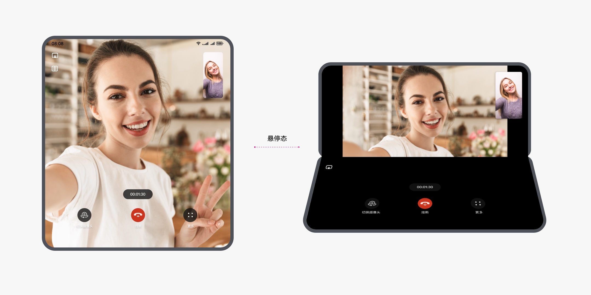

也可以在悬停时尽量提供沉浸式通话效果

范式二：

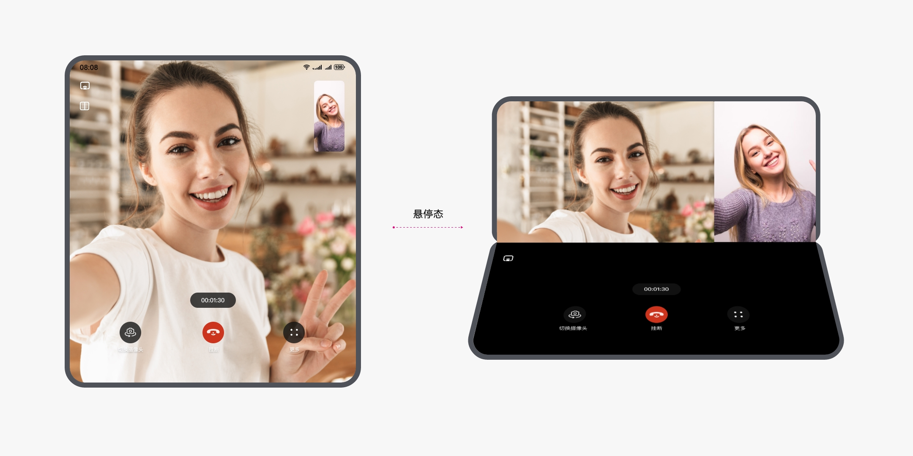

### 多人视频通话

| 多人通话时取景框可根据设备的物理尺寸进行响应式的布局设计，尽可能提供最大屏占比的舒适布局。 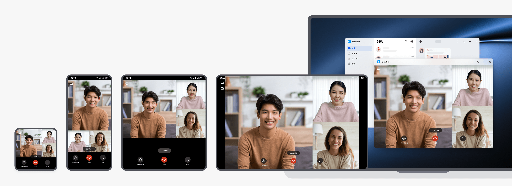 |
| --- |
|    |
| 取景框响应式布局的开发指南，请参阅[响应式布局。](https://developer.huawei.com/consumer/cn/doc/best-practices/bpta-multi-device-responsive-layout)  更多人的视频通话响应式布局示例： 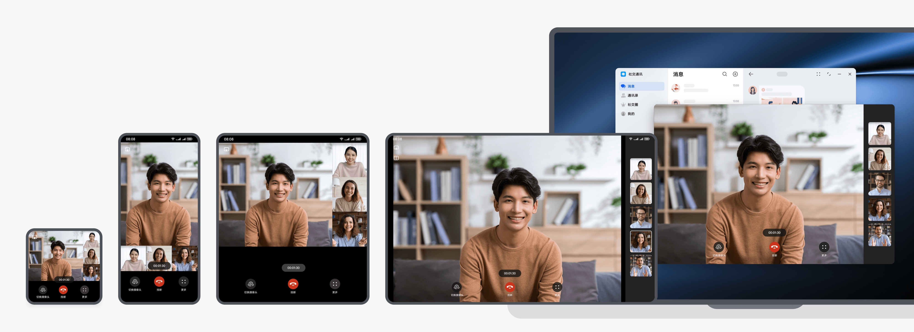 |
|    |
| 同一设备上取景画面，大小布局和均分布局的示例： |
| 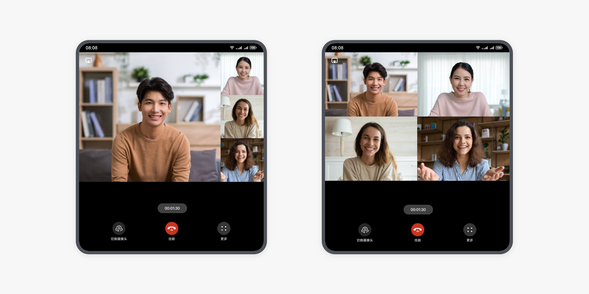 |

## 会议

### 会议的自适应布局

| 会议界面根据设备的屏幕宽度进行投屏画面和参会人信息的自适应布局。 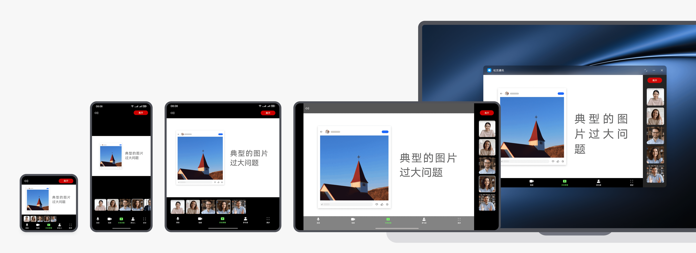 |
| --- |
|    |

在同一尺寸的设备上，根据投屏内容的比例进行自适应布局的示例：

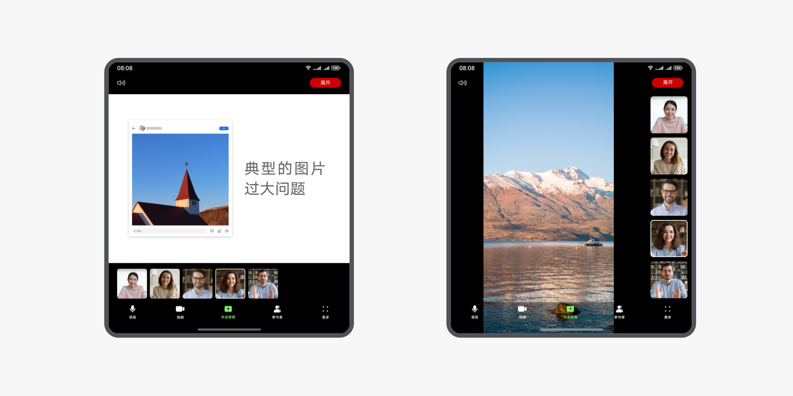

本场景的开发指南，请参阅典型场景布局。

### 会议的悬停适配

会议场景的悬停态设计。

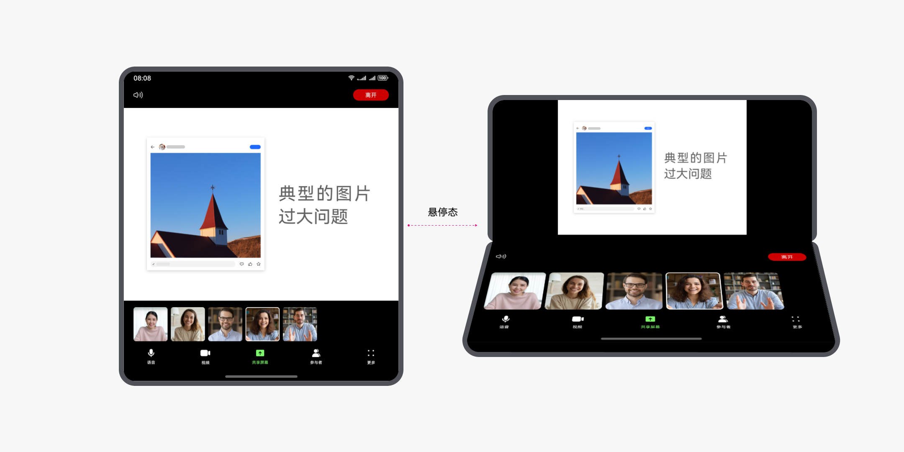

## 社交动态的图片布局

社交动态和新闻资讯类场景的图文布局比较类似，通常采用上文下图的布局。

### 单张图片/视频

在单张图片的场景下，图片与文字靠左对齐，采用上文下图的布局。

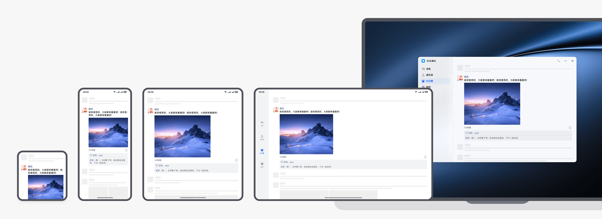

### 多张图片/视频延伸布局

有 3 张以上数量的图片时，采用延伸布局，可以横向滑动，查看更多图片。

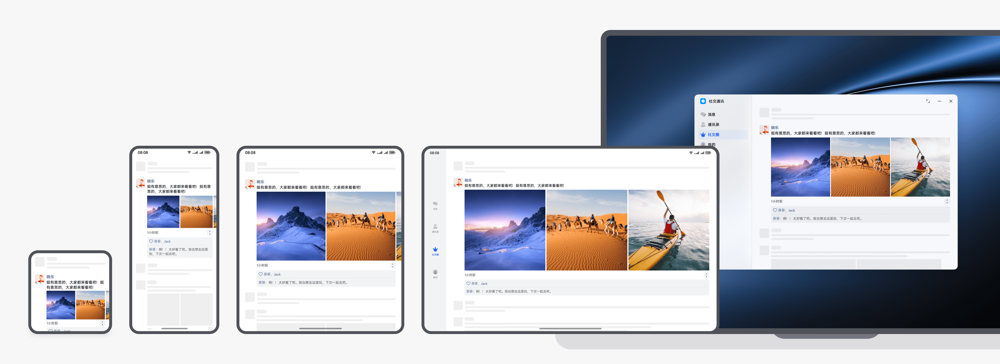

### 多张图片聚合宫格布局

多张图片聚合到一起显示，在宽屏设备上整体聚合图片的高度不要超过屏幕高度的 80% ，约 55% 高度为最佳。

多张图片聚合时，在宽屏设备上接受部分的留白或者通过图片的自适应裁剪减少留白。

6 张图片聚合的宫格布局，范式一：

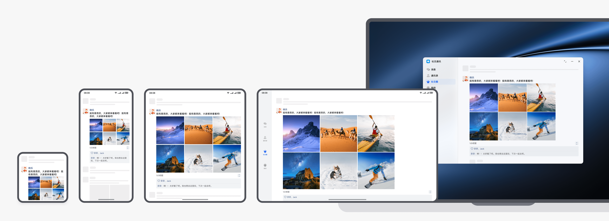

6 张图片聚合的宫格布局，范式二：

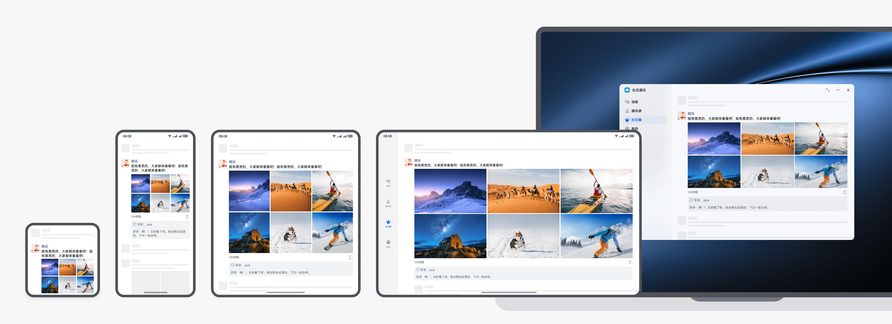

5 张或 7 张图片聚合，不可避免的会出现部分留白，如下图：

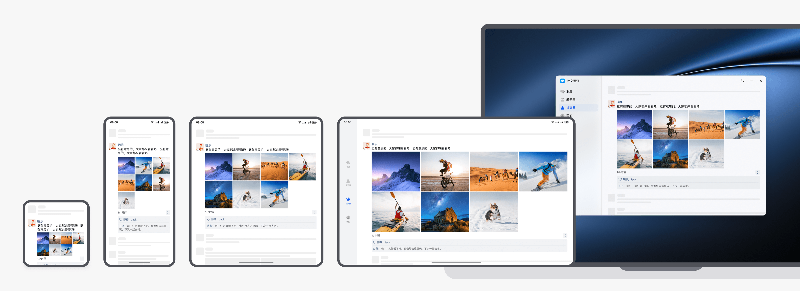

### 多张图片杂志化自适应布局

通过图片的自适应布局和基于设备宽度的智能裁剪能力，可以实现一种图片的杂志化自适应布局。

该布局下，优先让每张图片按照相同比例相同大小排布显示，当无法避免有留白情况时，允许部分图片放大显示，若依然无法避免有留白情况，则允许部分图片自适应形变裁剪，从而确保在宽屏设备上没有留白，尽可能利用宽屏设备空间。

需要注意整体图片的高度不要超过设备高度的 80%，约 55% 高度为最佳。

3 张图片杂志化布局的示例：

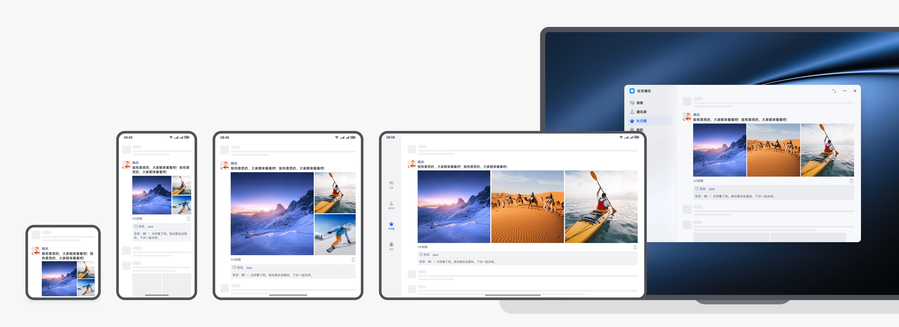

4 张图片杂志化布局的示例：

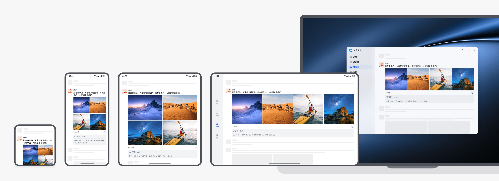

5 张图片杂志化布局的示例：

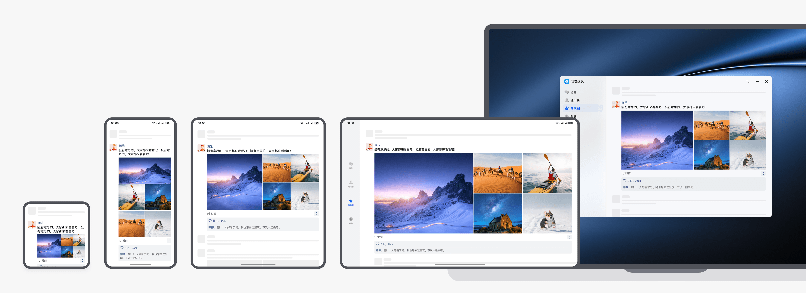

6 张图片杂志化布局的示例：

7 张图片杂志化布局的示例：

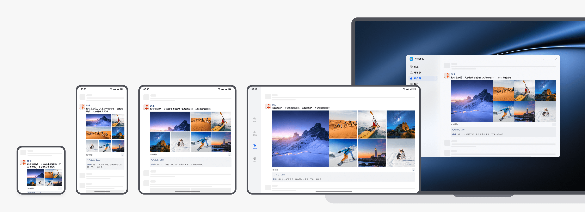

## 社交动态的卡片布局

### 动态卡片首页

单列卡片变宽

手机上的单列动态卡片，在宽屏设备上可露出更多辅助信息变成更宽的动态卡片。

单列卡片变分栏 + 瀑布流布局

手机上的顶部关注列表和动态卡片，在宽屏设备上挪移布局并形成分栏，在更宽的平板和更大尺寸的屏幕设备上可露出更多列的动态卡片，成为分栏加瀑布流布局。

分栏的开发指南，请参阅一多开发实例 (即时通讯)。

单列卡片变瀑布流布局

也可以直接从手机的单列卡片到宽屏设备的瀑布流结构，随着屏幕宽度的增加显示更多列数内容。

瀑布流组件的开发指南，请参阅 API 参考 (WaterFlow)。

### 社交详情

在宽屏设备上可利用屏幕宽度通过挪移布局将上下结构的内容变为左右结构。例如在折叠屏、平板上通过挪移布局实现边看边评的体验。

自适应能力的开发指南，请参阅典型场景布局。

折叠屏这种接近 1:1 的方形设备，可提供布局切换按钮，允许用户切换布局样式的示例：

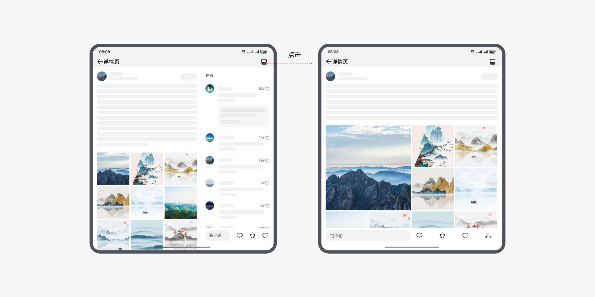

往上滑动浏览内容时自动隐藏标题栏、工具栏，提供沉浸浏览体验的示例：

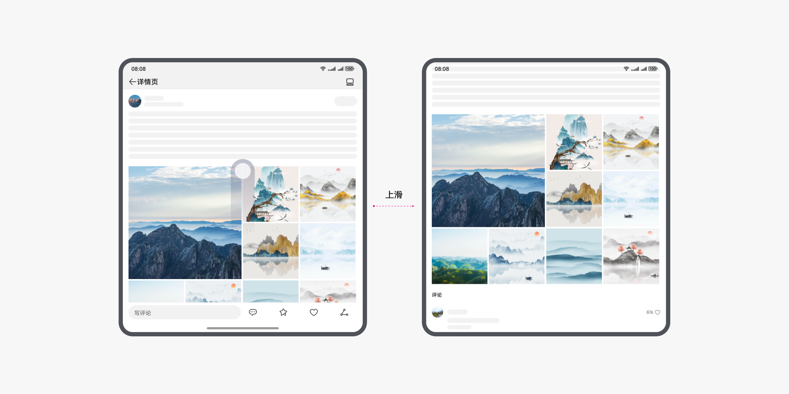

### 查看图片详情

多设备场景下，点击图片查看详情时，同样适用于边看边评的体验，即：点击评论按钮，在右侧的侧边面板显示评论内容；边看边评时也支持横向滑动切换下一张图片。

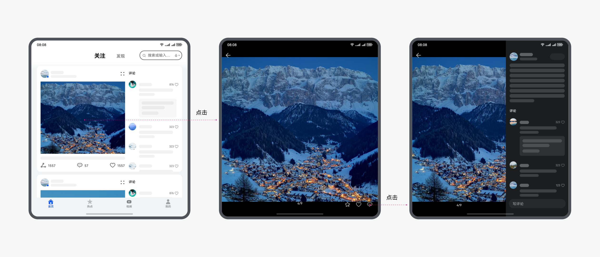

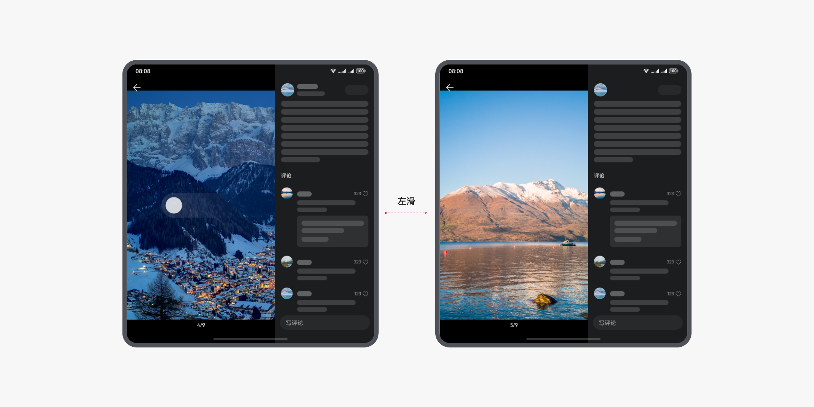
