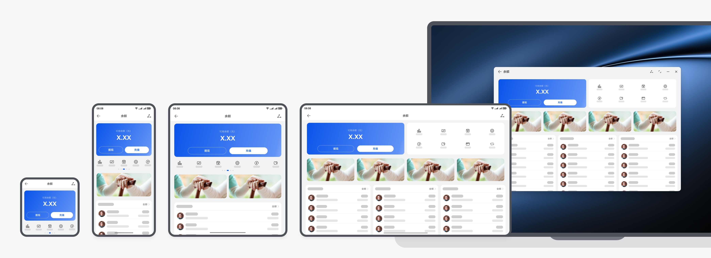
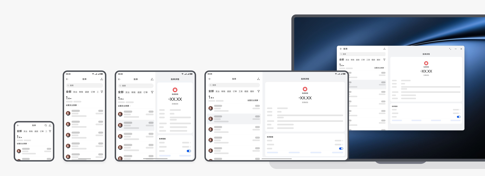
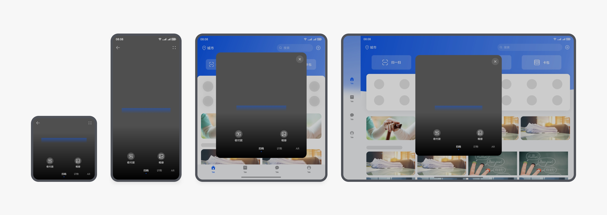
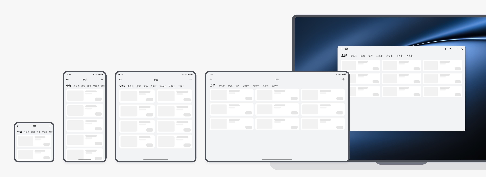
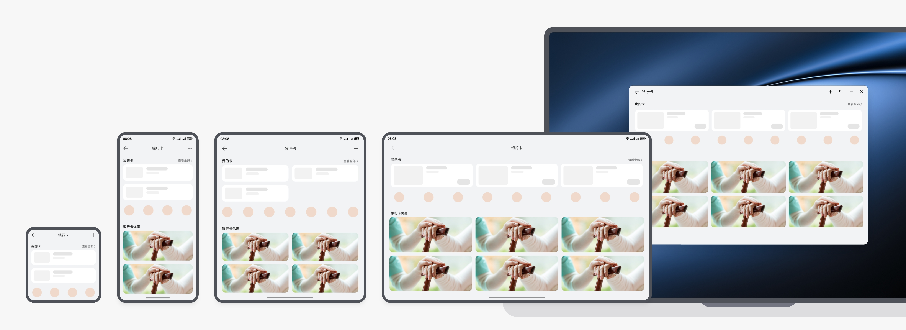
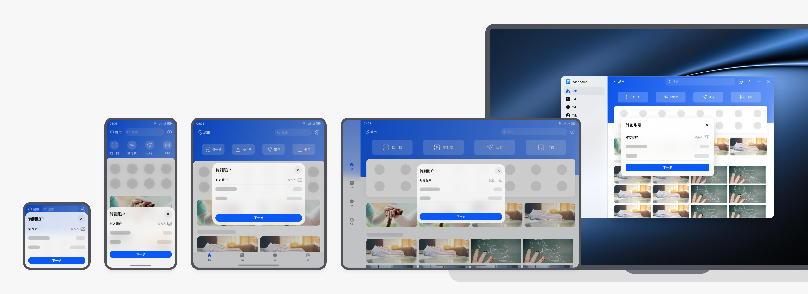

# 移动支付类

更新时间：

来源：https://developer.huawei.com/consumer/cn/doc/design-guides/mobile-payment-0000001957421613

移动支付类应用主要包括收付款、余额、账单、扫一扫、转账等典型业务场景。此类应用，在多端设备的设计适配过程中，需充分利用大屏设备优势，提升浏览和交互效率。
 
本场景的开发指南，请参阅[一多开发实例 (移动支付)](https://developer.huawei.com/consumer/cn/doc/best-practices/multi-mobile-payment)。
 

#### 首页

移动支付类应用，首页有入口图标、广告图、卡片等丰富的信息内容，在多端宽屏适配时可利用延伸布局和重复布局，充分利用大屏幕的优势，露出更多信息内容。
 
- 入口数量固定：若因为业务原因，入口图标数量固定不可增加时，可以通过图标背景的形变为宽屏设备提供更为美观舒适的布局，避免出现入口图标之间的留白间距过大。
- 入口数量自适应变化：入口图标数量随设备屏幕宽度自适应变化，在宽屏设备上一行显示更多的图标。

 

 
 

#### 收付款

页面窗口化：若页面内容元素较少，在宽屏设备适配时两侧可能出现较多留白时，可考虑通过浅层窗口的形式来承载原有页面，避免元素被不当放大、间距被过度拉伸，同时可有效减少页面大幅跳转，达成轻量交互的体验。
 

 
 

#### 余额页

挪移布局：余额页面在宽屏设备上可考虑使用挪移布局，将上下布局的页面元素，在宽屏设备上挪移变为左右布局的形式，从而避免卡片、列表等组件在宽屏设备上被横向过度拉伸。
 

 
 

#### 账单页

分栏布局：账单列表页在宽屏设备上可使用分栏布局，分栏左侧为账单列表，分栏右侧展示本月的收支分析数据可视化页面。
 

 
 

#### 扫一扫

浅层窗口：扫一扫在宽屏设备适配时，也可考虑使用浅层窗口的形式来承载，可有效减少宽屏设备页面大幅跳转，达成轻量交互的体验。
 

 
 

#### 卡包&银行卡

卡证类页面可以采用重复布局的形式，增加卡片显示列数，提升页面展示的信息量。例如直板机展示 1 列卡片，折叠屏展开态展示 2 列卡片，平板&电脑展示 3 列卡片。
 

 

 

 
在宽屏设备上横向展示更多列卡片的示例
 
 

#### 转账&支付

转账&支付类页面，在宽屏设备上可考虑通过浅层窗口的形式来承载原有的页面，即可避免元素过少导致的页面过多留白，又可减少页面大幅跳转，达成轻量交互的体验。
 

 
浅层窗口显示转账信息页面的示例
 

 

 
浅层窗口显示支付页面的示例
 
 

#### 服务卡片

推荐移动支付类应用，将本应用的核心功能或重要信息以服务卡片形式展示在桌面，用户通过点击即可一步直达对应的功能界面。
 

