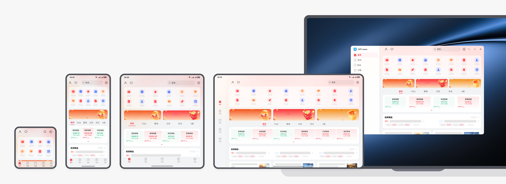
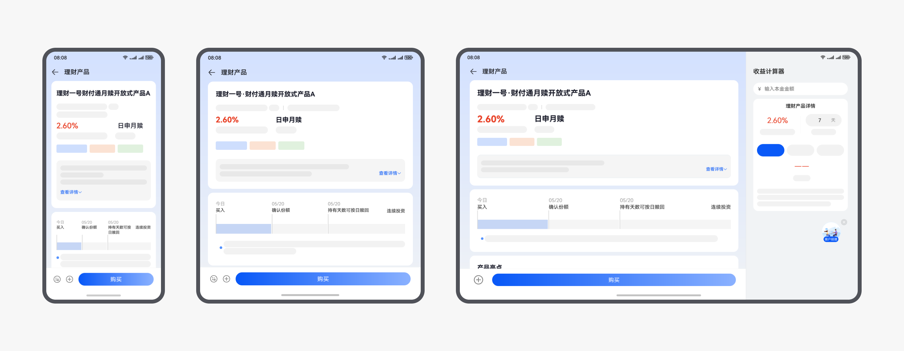
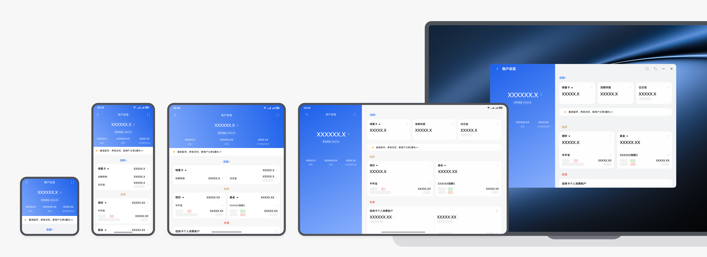
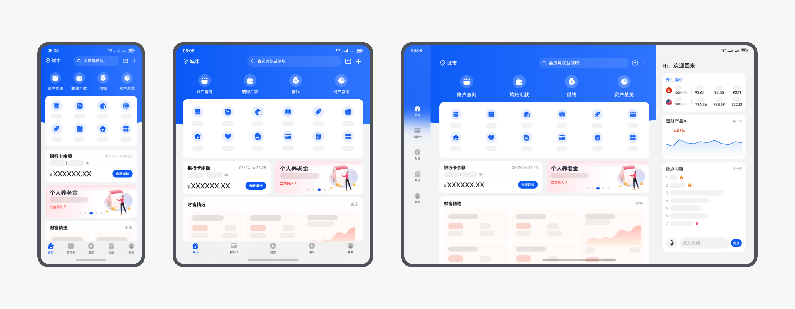
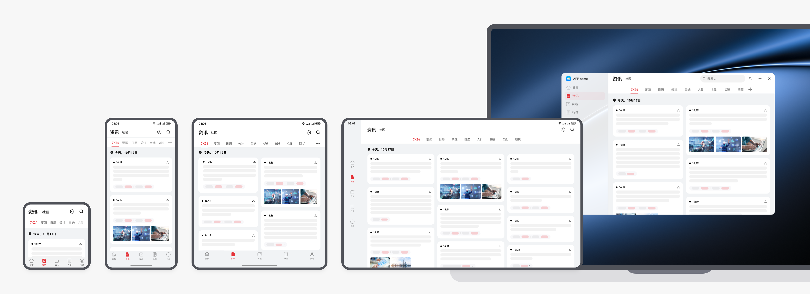
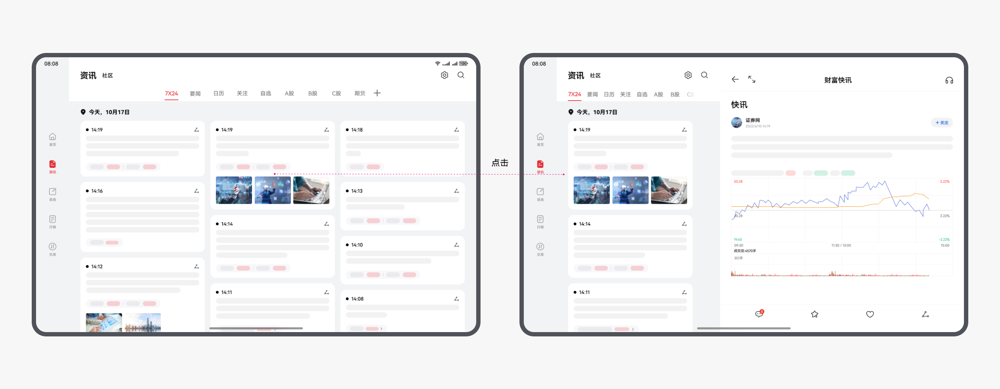
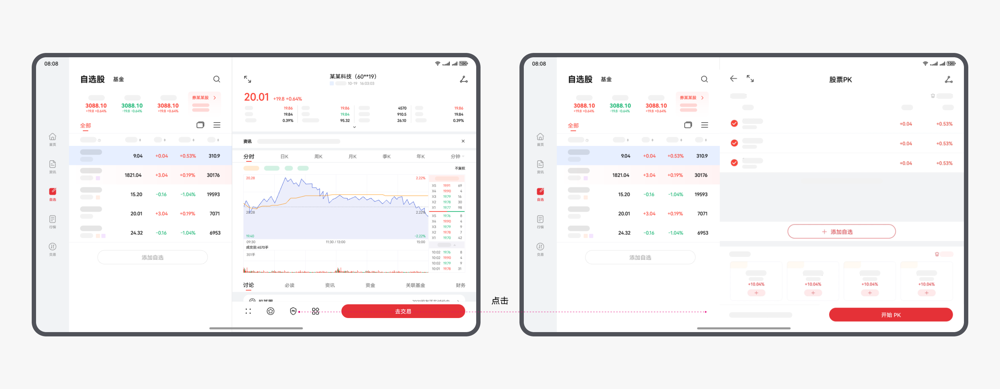
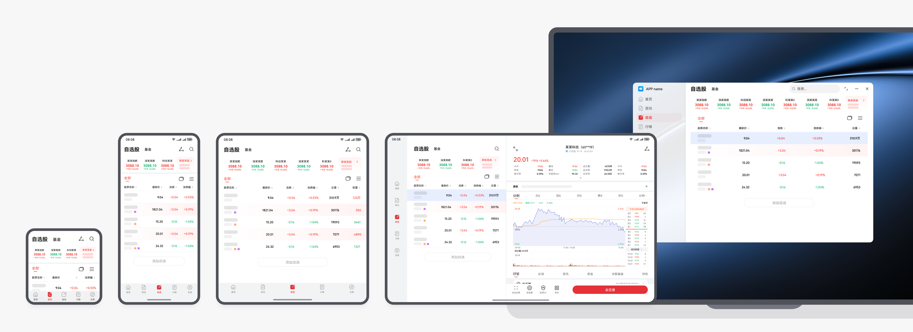
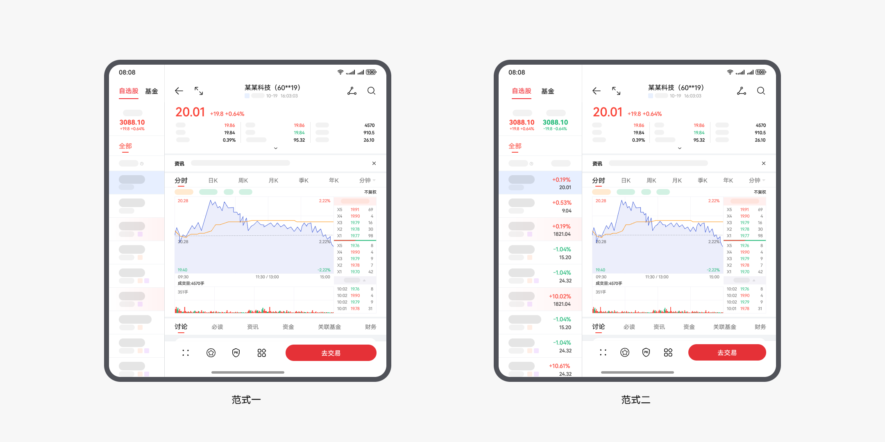
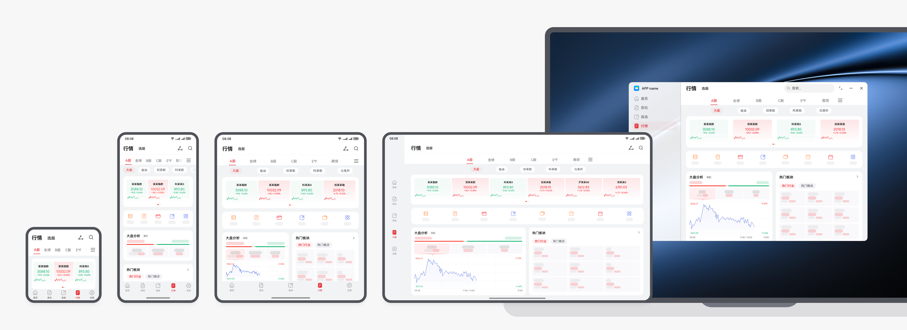

# 金融理财类

更新时间：

来源：https://developer.huawei.com/consumer/cn/doc/design-guides/responsive-design-examples6-0000001793536905

金融理财类应用的目的是让用户更加便捷地办理金融业务。常见的有银行理财，股票，基金等类型的应用和业务场景，核心场景有数据查看、交易、财经资讯阅读等。
 
此类型的应用在多端设备的使用过程中，不仅要保障用户在办理金融业务的过程中正常使用，也要尽可能提升大屏幕的交互效率。
 
金融理财类应用有以下特点：
 
- 丰富的信息聚合
- 图表数据高效展示
- 便捷高效的交互方式

 

#### 首页的自适应布局

金融类应用的首页有入口图标、广告图、数据卡片等丰富的信息内容，在多端宽屏适配时可利用延伸布局和重复布局，充分利用大屏幕的优势，露出更多信息内容。
 
 

  
| 银行理财类应用的首页通常会有图标、卡片和沉浸式广告图。在多端宽屏适配时，可通过延伸布局露出更多图标信息，当入口图标数量固定时，也可以通过图标背景的形变为宽屏设备提供更舒适的布局体验。 延伸布局的开发指南，请参阅自适应布局。 |
| 银行类应用建议在平板上，可在右侧展示更多的推荐内容，宽度可与直板机保持一致。 |
 
 

#### 金融资讯页

 

#### 列表变瀑布流

金融类应用中通常会有金融资讯内容。不同于一般的新闻，金融资讯对于阅读效率有更高的诉求。建议在宽屏设备上，可以通过瀑布流布局露出更多的最新资讯动态内容。
 

 
 

#### 瀑布流的分栏布局

在资讯的瀑布流页面，点击某一个资讯卡片时，可使用分栏布局显示新闻资讯详情。该布局为用户快速切换查看不同资讯内容提供了便利。
 

 
 

#### 自选股

 

#### 高效的分栏布局

自选股等金融类页面，在宽屏设备上可通过分栏布局提供更高效的股票信息切换的体验。
 

 
分栏的多端设计，在看行情的场景中，折叠屏可查看更多数据，平板端采用分栏布局。
 

 

 
折叠屏上该类型页面，同样也可以使用分栏布局，有以下两种分栏布局样式的建议：
 

 
分栏组件的开发指南，请参阅[一多开发实例 (银行理财)。](https://developer.huawei.com/consumer/cn/doc/best-practices/multi-financial-app#section1796912148314)
 
 

#### 宫格卡片的多股同列

自选股页面，通常会有多股同列功能，可以使用多个卡片的宫格布局同时显示更多股票信息，利用宽屏优势露出更多列数内容。
 

 
 

#### 卡片的延伸形变和挪移布局

金融类应用中卡片类型较多，在宽屏设备上，可灵活使用卡片的延伸、形变或挪移布局。
 
卡片的延伸布局：在宽屏设备上，变成更长的卡片露出更多信息；
 
卡片的形变：在宽屏设备上露出下一层级信息，卡片的形状发生变化；
 
卡片的挪移布局：从上下的卡片变为左右结构的卡片。
 

 
下图为卡片从手机到宽屏设备，进行延伸布局 + 形变 + 挪移布局的示例：
 

 
 
下图为卡片形变+挪移布局的示例：
 

 
 List 组件的开发指南，请参阅 [API 参考 (List)。](https://developer.huawei.com/consumer/cn/doc/harmonyos-references/ts-container-list)
 

#### 理财详情页

理财详情页，在平板上可把收益计算器页面呈现在右侧，宽度与直板机保持一致。
 

 
 

#### 账户页的挪移布局

 
账户页面在宽屏设备上可使用挪移布局，从而避免在宽屏设备上内容仅横向延伸过于单调。
 

