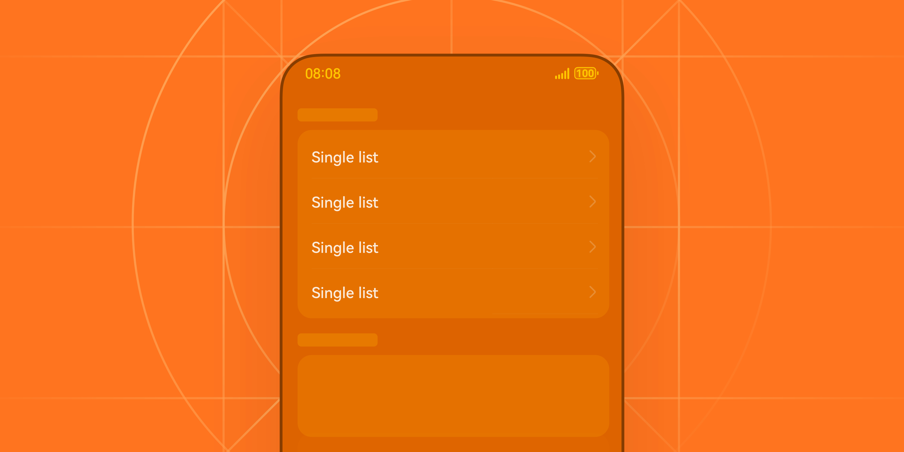
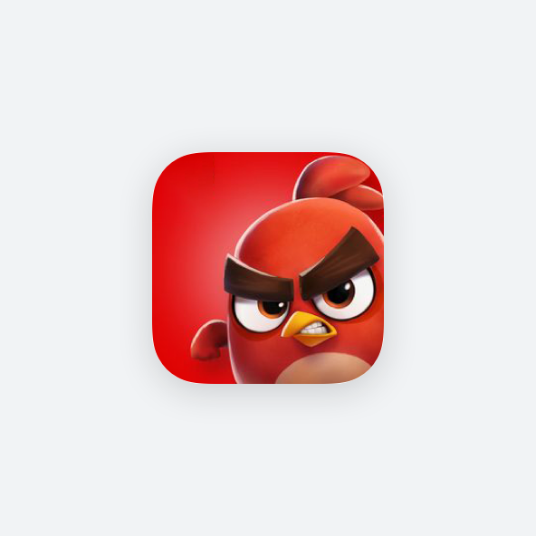
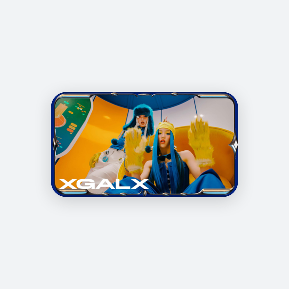
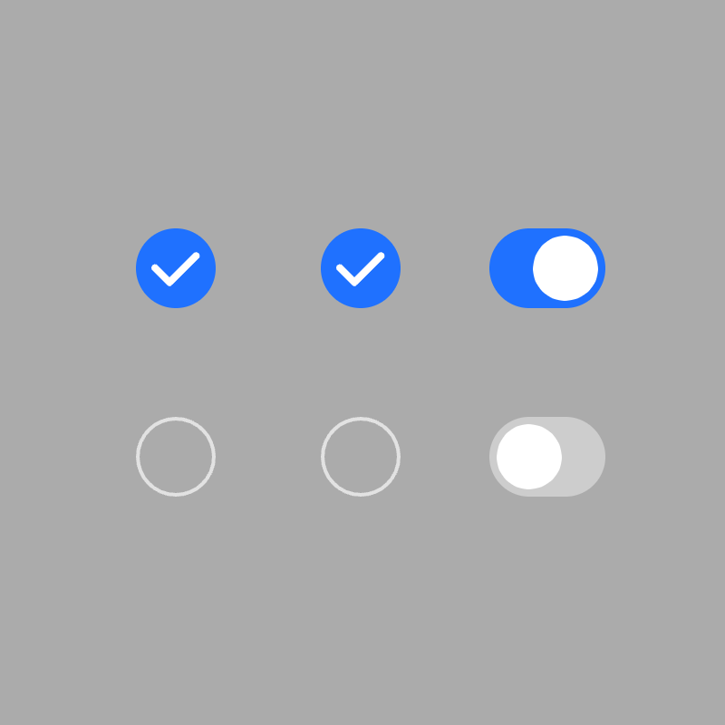
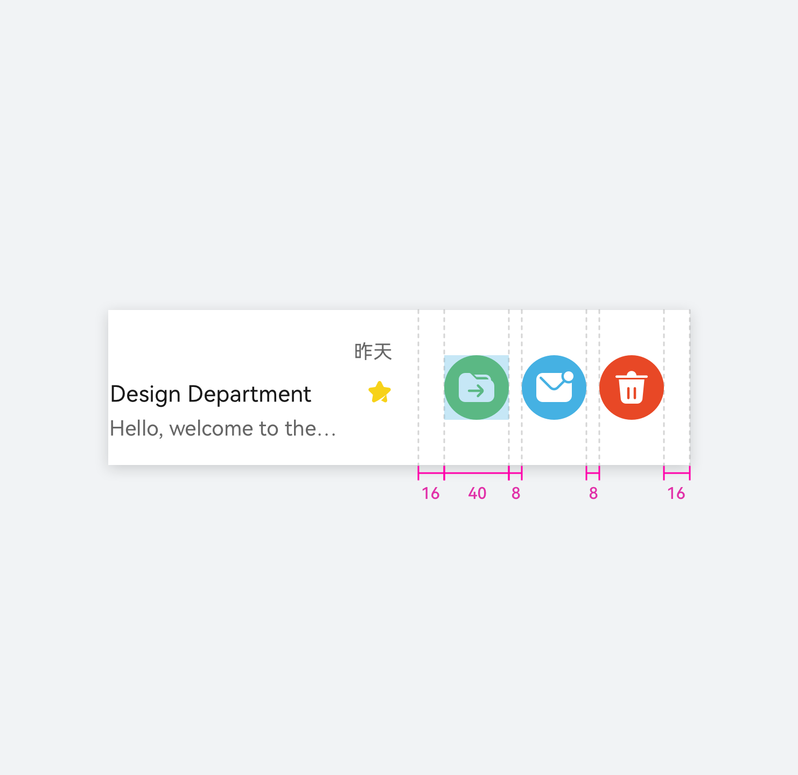
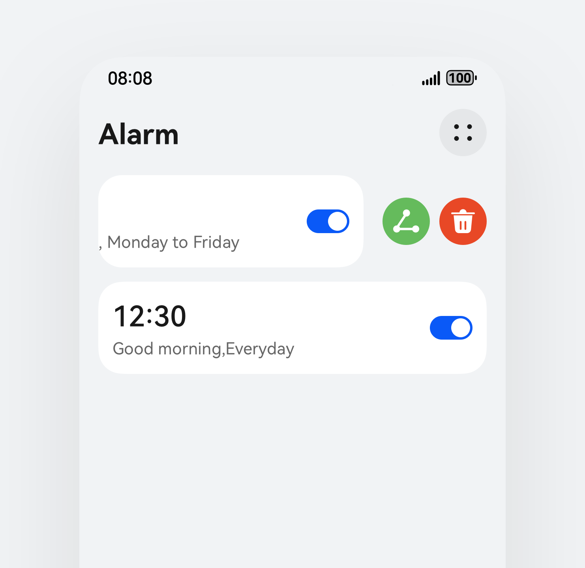
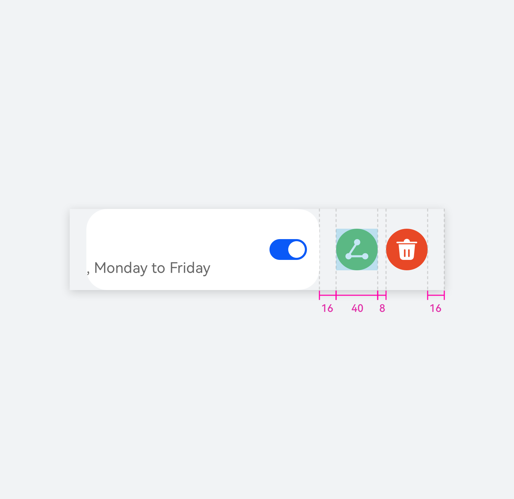

# 列表

更新时间：

来源：https://developer.huawei.com/consumer/cn/doc/design-guides/list-0000001929853910

列表是展示重复性内容的常用界面元素，良好的列表设计可以提高用户的浏览和查找效率。列表的通用组件能力可以参阅 [List](https://developer.huawei.com/consumer/cn/doc/harmonyos-references/ts-container-list) 控件规格，关于列表的布局能力以及组合能力可以参阅 [ListItem](https://developer.huawei.com/consumer/cn/doc/harmonyos-references/ts-container-listitem) 以及 [ListItemGroup](https://developer.huawei.com/consumer/cn/doc/harmonyos-references/ts-container-listitemgroup) 文档。
 

 
列表控件包含一系列相同宽度的列表项，适合连续、多行呈现同类数据，例如图片和文本。列表作为可以按组展示信息的控件，也提供多种交互的能力，例如长按出菜单 (可参考 [bindContextMenu](https://developer.huawei.com/consumer/cn/doc/harmonyos-references/ts-universal-attributes-menu#bindcontextmenu12) 开发文档) 或可以滑动列表进行删除、置顶、收藏等功能。
 

##### 如何使用

优秀的列表设计需要在内容展示、视觉美感和交互体验之间寻求平衡，以满足不同场景和设备的需求。因此，开发者需要更多注意列表内容的结构是否清晰，能否帮助用户轻松识别到核心内容。
 

 
**清晰的列表结构**
 
当列表出现在同一界面或是同一分组时，请使用一致的视觉样式，如间距、对齐方式等。通过文本大小、颜色对比来区分不同层级的列表项，从而达到突出核心内容的目的，除此之外，可以在列表右侧提供一些交互选项，确保每个列表的内容与交互事件是独立分区的。当内容条目或种类过多时，适当使用分组或分类有助于用户快速定位内容，可以使用[子标题](https://developer.huawei.com/consumer/cn/doc/harmonyos-references/ohos-arkui-advanced-subheader)展示分组标题。
 

 
**易于阅读和识别**
 
在复杂的界面结构和列表信息中，突出显示关键信息才能使用户能够快速获取核心内容。首先要精简列表的文本数量，若文本内容较长，可以提炼核心文本作为一级文本，其他的文本用较淡的颜色和更小的字体展示在下方。对于较长的列表项可考虑使用多行布局，如果有一段描述文本可以拆分成多个列表项，请务必将这些列表成组显示。
 

 
**明确的选择反馈**
 
用户对于列表操作需要提供明确的反馈状态，因此开发需要定义列表的点击态、选中态以及激活态等事件。不同的状态要有明显的视觉变化，如颜色变化、勾选状态等。
 
交互状态
  
|  |  |  |  |  |
| 悬浮态 | 点击态 | 选中态 | 不可用态 | 获焦态 |
 
 
 

##### 组件规则

 

##### 视觉规则

 
优先显示列表中的文本，文本作为列表类组件和核心传递内容，是重要组成部分，因此，在文本的布局、排列、色彩以及内容自适应上，都需要着重关注。
 

 
文本的描述应当简洁、精炼，这可以大幅度的减少因为文本描述而导致的换行、布局调整等问题，同时保持界面的整洁度。如果列表中的内容由大量文本组成，需要考虑文本的展示结构是否可以分级显示，或是作为辅助文本出现在列表的下方，而不是整体都展示在列表内。
 

 
**信息层次**
 
根据信息的重要性，使用不同的字体大小、颜色和粗细来区分。详细可以参考[视觉](https://developer.huawei.com/consumer/cn/doc/design-guides/color-0000001776857164)规范中对于文本色的使用，分别使用一级文本、二级文本和三级文本来对内容做段落的区分。
 

 
次要信息可使用较小的字体或灰色字体，同时，如果应用中的列表有明确的分类规格，可以使用[子标题](https://developer.huawei.com/consumer/cn/doc/harmonyos-references/ohos-arkui-advanced-subheader)来对列表内容进行分组，这样是有效的对界面布局进行划分，提高用户的阅读效率和界面信息展示的密集程度。
 

 
**适度的装饰与布局**
 
适量使用图标、缩略图等装饰元素，有助于快速识别和理解。对于大部分的效率型应用，列表的展示更多是作为信息入口提供给用户，用户看见的应该是明确表意的文本信息，而不是各式各样用于表意的图标或者插画。
 

 
对于其他大部分内容应用来说，列表内的装饰很大程度上可以为界面的美观度增光添彩，但需避免过度装饰，从而影响内容的可读性。配图的选择和尺寸占比与列表的宽高有直接关系，开发者需要在界面展示信息密度和设计效果中做取舍。
 

 
内容密度越高、结构越复杂，列表之间所需要的间距就需要越大，因此列表的行高需要根据内容的复杂程度进行一定的处理。为了保障视觉感受的一致性，不要将不同结构和布局的列表强制放在同一个分组中，这种行为会造成视觉上内容的不对齐，影响正常的阅读效率。
 

 
**响应式布局**
 
开发者需要根据不同屏幕尺寸动态调整列表的布局，在较小屏幕上可考虑使用单列布局或隐藏次要信息，当屏幕占比较大时，可以选择分栏布局展示。同时，针对屏幕拉伸场景下，列表内的左右元素也需要进行对应的适配，确保文本和元素的对齐方式不发生变化。
 

##### 可横滑列表

对于列表内容的更多交互行为可以通过横滑列表触发，开发者可以将删除、转发、收藏等行为展示在滑动后的列表布局中，请参考开发者文档中关于 [SwipeAction](https://developer.huawei.com/consumer/cn/doc/harmonyos-references/ts-container-listitem#swipeaction9) 的相关描述进行布局规格的自定义。
 

 
横滑后的布局中建议使用表意明确的图标进行展示，避免用户的主观猜测。同时，请克制滑出的内容数量，一般情况滑动后出现的操作数量宽度不大于列表宽度的一半，最多不超过三至四个选项，选项过多会造成滑动触发困难，滑动所需的距离阈值通常为操作区宽度的二分之一，因此，请选择核心且重要的列表行为作为操作项。
 
**列表式**
  
|  |  |
 
 
**卡片式**
  
|  |  |
 
 
 

##### 设备差异

 

##### 手机设备

 
**左侧元素**
  
| Badge 8×8vp | 系统图标 支持 16x16、24x24vp | 头像 支持 40、48、56vp | 1:1 预览图 支持 48、56、72、96vp |
| 应用图标 支持 48、56、64vp | 16:9 预览图 保持最长边 96vp | 13:18 预览图 小尺寸：默认高度 64vp 大尺寸：默认高度 96vp | 3:4 预览图 小尺寸：默认高度 64vp 大尺寸：默认高度 96vp |
 
 
**右侧元素**
 
右侧支持功能图标或文本或图标 + 文本的组合。常见样式见右侧。
 
右侧元素与中间列表内容保持 12vp 间隔。
 

 

 
**效率型列表**
 
效率型列表主要以“纯文本”以及“纯文本 + 图标”的样式呈现，右侧元素可按需组合。
 
效率型列表在默认参数下通用高度为 48vp、56vp、64vp、72vp 和 96vp，特殊场景可按需增减。
 

 

 
**内容型列表**
 
内容型列表主要以图片资源与文本混排的形式呈现，右侧元素可按需组合。
 
内容型列表由于展示图片所需高度更多，因此通用高度为 64vp、72vp、80vp、96vp 和 120vp，特殊场景可按需增减。
 

 

##### 电脑设备

 
**左侧元素**
  
| Badge | 系统图标 | 头像 | 1:1 预览图 |
| 应用图标 | 16:9 预览图 | 13:18 预览图 | 3:4 预览图 |
 
 
**右侧元素**
 
右侧支持功能图标或文本或图标 + 文本的组合。常见样式见右侧。
  
|  |  |  |
 
 

##### 穿戴设备

 
用于展示重复性内容的常用界面元素。
 

 
**圆形表：**
 
**左侧元素**
  
| Badge 尺寸：8*8vp，与图标右上对齐 颜色：引用 warning（#E84026） | 大图标、应用图标、头像、封面 46*46vp，圆形 | 可操作图标 图标大小：28*28vp 热区大小：46*46vp 图标颜色：引用 icon_secondary（#FFFFFF，66%） |
 
 
**右侧元素**
  
| 指示图标 图标大小：28*28vp 热区大小：整行响应 图标颜色：引用 icon_secondary（#FFFFFF，66%） | 选择类图标 | 操作图标 图标大小：28*28vp 热区大小：46*46vp 图标颜色：引用 icon_primary（#FFFFFF，100%） |
 
 
单行列表
 

 

 
双行列表
 

 

 
三行列表
 

 

 
**方形表：**
 
**左侧元素**
  
| Badge 尺寸：6*6vp，与图标右上对齐 颜色：引用 warning（#E84026） | 大图标、应用图标、头像、封面 35*35vp，圆形 | 可操作图标 图标大小：28*28vp 热区大小：40*40vp 图标颜色：引用 icon_secondary（#FFFFFF，66%） |
 
 
**右侧元素**
  
| 指示图标 图标大小：28*28vp 热区大小：整行响应 图标颜色：引用 icon_secondary（#FFFFFF，66%） | 选择类图标 | 操作图标 图标大小：28*28vp 热区大小：40*40vp 图标颜色：引用 icon_primary（#FFFFFF，100%） |
 
 
单行列表
 

 

 
双行列表
 

 

 
三行列表
 

 

##### 开发文档

[List](https://developer.huawei.com/consumer/cn/doc/harmonyos-references/ts-container-list)
 
[ListItem](https://developer.huawei.com/consumer/cn/doc/harmonyos-references/ts-container-listitem)
 
[ListItemGroup](https://developer.huawei.com/consumer/cn/doc/harmonyos-references/ts-container-listitemgroup)
 
[Subheader](https://developer.huawei.com/consumer/cn/doc/harmonyos-references/ohos-arkui-advanced-subheader)
 
[HdsListItem](https://developer.huawei.com/consumer/cn/doc/harmonyos-references/ui-design-hdslistitem)
 
[HdsListItemCard](https://developer.huawei.com/consumer/cn/doc/harmonyos-references/ui-design-hdslistitemcard)
