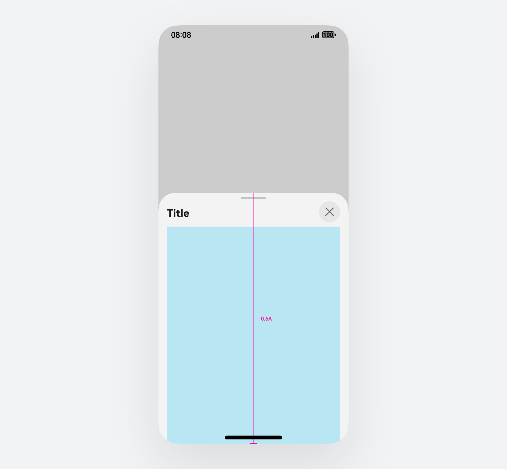
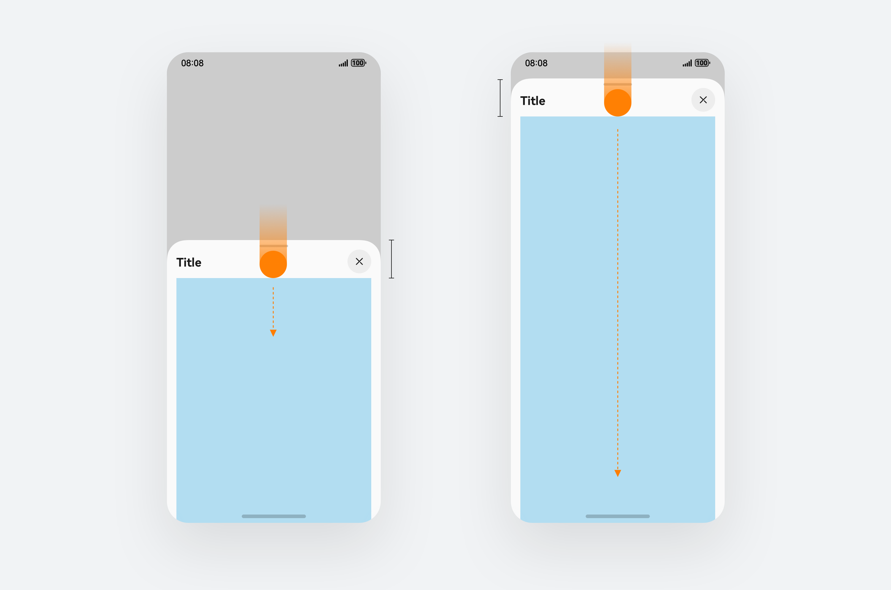

# 半模态面板

更新时间：

来源：https://developer.huawei.com/consumer/cn/doc/design-guides/bindsheet-0000001956852753

半模态面板是一种介于模态窗口和非模态窗口之间的设计元素，常用于需要用户注意但不完全阻断用户操作的场景。半模态面板应允许用户通过点击面板外部区域或特定的关闭按钮来关闭，且面板内的操作应尽量简化，避免复杂的交互流程。半模态的使用在手机端、平板及电脑设备中都极为广泛，在 HarmonyOS NEXT 中的半模态窗口会跟随设备屏幕和应用窗口的展示比例进行适当的布局适配，为用户提供最佳的使用体验。开发指导链接：详情可参照 [BindSheet](https://developer.huawei.com/consumer/cn/doc/harmonyos-references/ts-universal-attributes-sheet-transition#bindsheet) 相关文档介绍。
 

 

##### 如何使用

按照面板出现时是否支持与主线界面进行操作，可以将半模态面板分为两种类型：
 
模态型：此类型面板出现时，自带遮罩显示，用户无法与其下方的界面进行交互；
 
非模态型：此类型面板不显示遮罩，用户既可以与面板交互，也可以与其下方的界面进行交互。
 
  
|  |  |
| 模态型 | 非模态型 |
 
 

##### 构成

根据目标设备的不同，包含以下形态：
 
**底部面板**
 
直板手机的呈现形态
 
  
| 竖屏显示 1、操作提示 (在面板尺寸包含多档位时自动显示) 2、标题 (业务可配置) 3、内容区 (可显示为 1-3 个档位) 4、遮罩 5、关闭按钮 |  |
|    |    |
| 横屏显示 1、标题 (业务可配置) 2、内容区 3、遮罩 4、关闭按钮 (默认显示) |  |
 
 
**居中面板**
 
在折叠机 (展开态) 和平板上的默认呈现形态，业务也可根据实际需要修改为以跟手面板形态显示
  
| 横、竖屏 1、标题 (业务可配置) 2、内容区 (没有档位切换) 3、遮罩 4、关闭按钮 (默认显示) |  |
 
 
**跟手面板**
 
在电脑上的默认呈现形态，业务也可根据实际需要修改为以居中面板形态显示
  
| 横、竖屏 1、标题 (业务可配置) 2、内容区 (没有档位切换) 3、关闭按钮 (默认显示) 4、箭头 (自动指向触发位置) |  |
 
 

##### 交互规则

**底部面板的多档位变化**
 
半模态面板的高度规则较为灵活，开发者可以使用固定高度，或者可以在两个档位之间来回切换，例如默认使用中档位，上滑半模态或向上拖动拖拽条即可变为最大档位。对于开发者的实际使用场景，也可以通过完全自定义半模态高度来完成最佳体验效果。
 
使用面板时，将获得默认中档位高度
 
- Large：屏幕/窗口高度-信号栏-8
- Medium：60%屏幕/窗口高度
- Free：可完全自定义展示高度

 
 

 

 
**底部面板的滑动响应优先级**
  
| 在内容区域滑动时 1.内容处于最顶部 (内容不可滚动时以此状态处理) 上滑时，优先向上扩展面板档位，如无档位可扩展，则滚动内容 下滑时，优先向下收缩面板档位，如无档位可收缩，则关闭面板 2.内容处于中间位置 (可上下滚动) 上/下滑时，优先滚动内容，直至页面内容到达底部/顶部 3.内容处于底部位置 (内容可滚动时) 上滑时，呈现内容区域回弹效果，不切换档位 下滑时，滚动内容直至到达顶部 |  |
|    |    |
| 在标题栏区域滑动时 1.上滑时 短滑向上切换至相邻较大档位 长滑可跨档位直接切换至最大状态 2.下滑时 短滑向下切换至相邻较小档位 长滑可跨档位直接关闭面板 |  |
 
 
**面板的跳转**
  
| 同一面板内页面转换 标题栏：左侧显示页面层级信息 切换动效：面板不变，内容自右往左刷新 返回手势：逐级回退至上一步，直到关闭面板 关闭按钮：直接关闭整个面板 |  |
|    |    |
| 多重面板 标题栏：显示新面板的标题，与之前面板无关 切换动效：从底部弹出新的面板 返回手势：先响应上层面板，逐级回退直到关闭上层面板，再操作下层面板 关闭按钮：先关闭上层面板，再关闭下层面板 |  |
 
 

##### 视觉规则

半模态面板的通用布局与应用界面的设计基本无异，更多需要关注的是内容的展示与半模态在界面中的高度占比关系。半模态会自带标题区域、关闭按钮与拖拽条，这些固定结构会展示在半模态内容布局的上方，因此，在界面设计时需要考虑内容之间的避让关系。
 

 
**明确的导航布局**：
 
半模态面板通常会展示在界面蒙层之上。面板内的颜色使用应与应用的整体配色方案一致，确保视觉一致性。除此之外，还需要清晰的导航逻辑，半模态面板会自带关闭按钮、标题文本和拖拽条，其中关闭按钮会出现在任意一级面板中，标题栏的展示效果需要区分是同层级面板还是跨层级面板，根据半模态的界面层级深度，判断是否需要为用户提供带返回的导航标题。
 

 
**响应式设计**：
 
半模态面板的内容要支持针对单一设备下不同布局的响应式设计，在 HarmonyOS 中存在左右分屏、上下分屏、悬浮窗等系统特性场景，需要保证在这些场景下半模态内部的布局结构不发生显示错乱，布局叠加等问题。半模态面板容器层会基于展示窗口的宽度和高度做动态计算，包括在展示窗口中的自动避让规则。
 

 
**多层级的布局展示**：
 
同层级面板：这类场景一般为通过多级标题栏的方式，在同一个半模态面板中进行多个页面层级的跳转。这种跳转方式可以有效的减少半模态弹出的层级数量，并提供直接关闭半模态的操作选项，避免页面层级过多带来的返回困难。
 
跨层级面板：除半模态内转场以外，也可以选择弹出多个半模态面板来解决界面跳转的问题，同时，如果开发者定义了不同的弹出框高度，也会造成在界面显示中第一层级无法覆盖第二层级的现场，出现多个半模态重叠显示的问题。因此建议开发者默认使用最大比例的弹出框面板，或是统一不同层级的面板高度。
 
 

 
**标题区规格**
  
|  |  |
| 单行标题 | 双行标题 |
 
 

##### 半模态比例与显示布局

**手机**
 
**直板机通用尺寸规格**
  
|  |  |  |
| Size-Regular 默认最大尺寸高度距离信号栏保持 8vp 间距 | Size-Medium 高度为屏幕高度的 60% | Size-Free 可自定义半模态高度尺寸或据内容高度自适应 |
 
  
|  |
| 手机横屏时保持宽度 480vp 最大宽度，高度距离屏幕顶部 8vp 安全间距 |
 
 
 
**平板通用尺寸规格**
 
在大于 600vp 设备断点以上时，半模态变更为窗口模式，在屏幕居中显示，分栏及分屏场景下依然遵循全屏居中规格。
  
|  |
| 半模态默认高度为 560vp，宽度默认为 480vp，背景覆盖蒙层 |
|    |    |
|  |  |
| 半模态最小高度为 320vp | 半模态最大高度为屏幕短边的 90% 高度 |
|    |    |
|  |
| 半模态内容在更大屏幕上可以选择使用 Popup 容器承载，容器宽度保持默认 400vp，高度与半模态形式规格一致。半模态的尖角始终与指向目标保持 8vp 间距。 |
 
 
**电脑设备**
 
在电脑设备中半模态的最大高度规则始终保持为窗口高度的90%，跟随窗口高度拉伸。
 

 

##### 开发文档

[bindSheet](https://developer.huawei.com/consumer/cn/doc/harmonyos-references/ts-universal-attributes-sheet-transition#bindsheet)
 
[bindSheetCover](https://developer.huawei.com/consumer/cn/doc/harmonyos-references/ts-universal-attributes-modal-transition#bindcontentcover)
 
[Navigation](https://developer.huawei.com/consumer/cn/doc/harmonyos-references/ts-basic-components-navigation)
