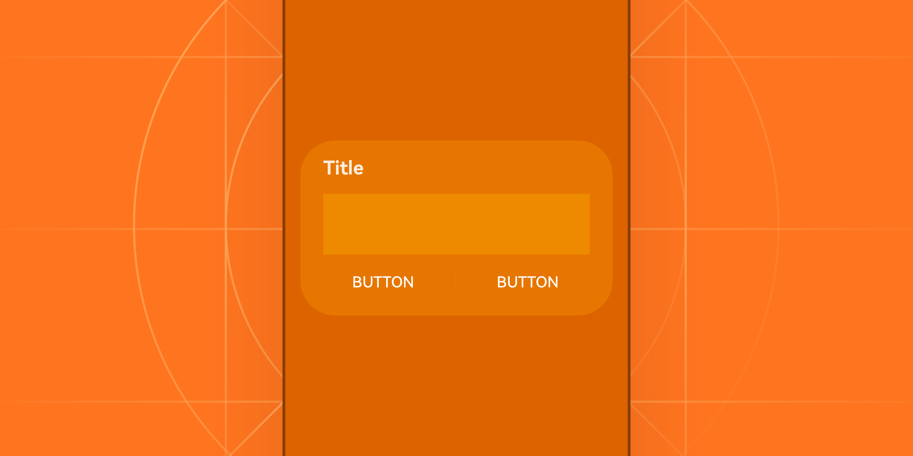
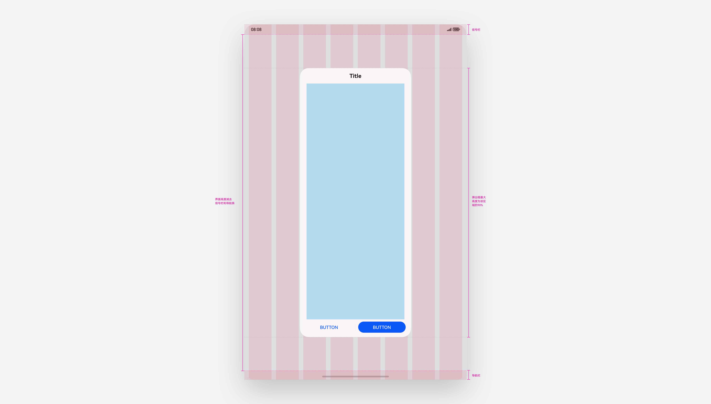
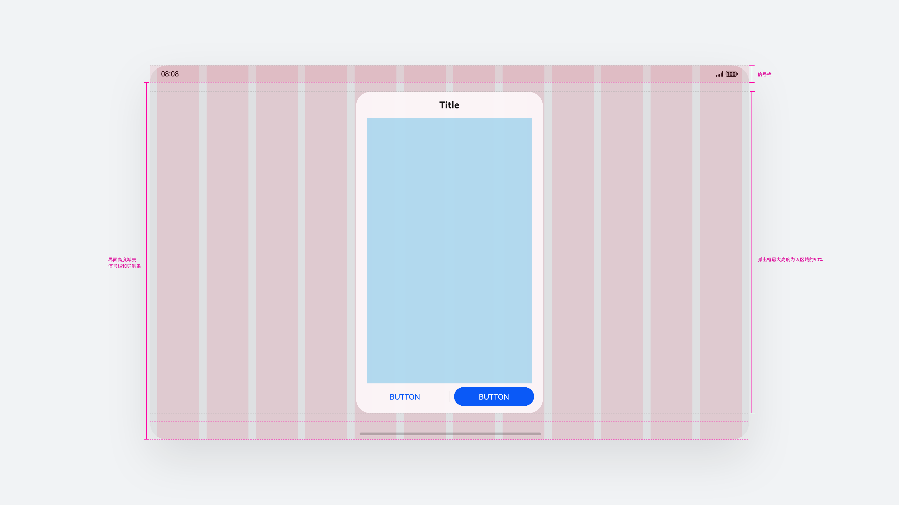
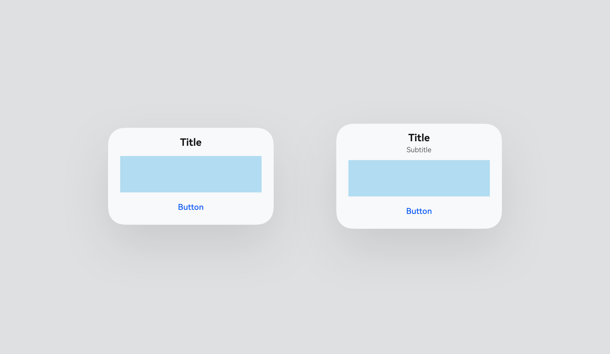
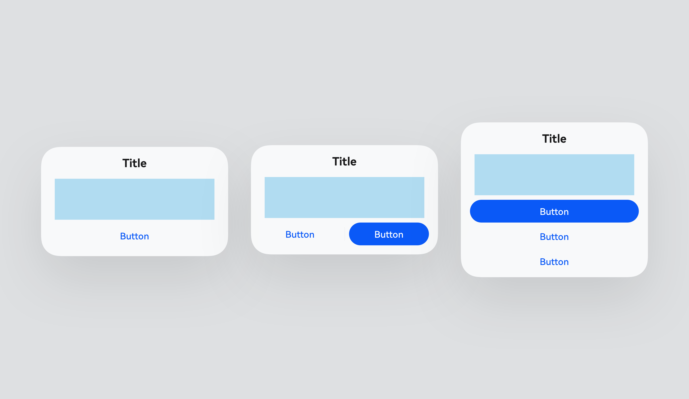
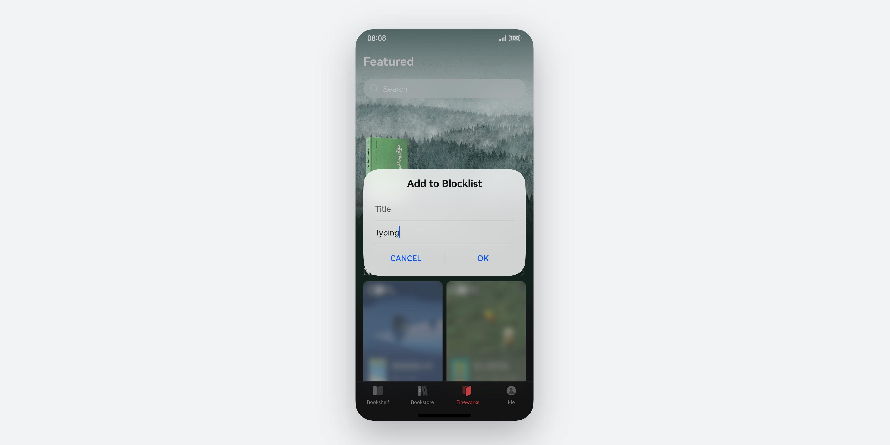

# 弹出框

更新时间：

来源：https://developer.huawei.com/consumer/cn/doc/design-guides/dialog-0000001957012569

弹出框是一种模态窗口，在弹出框消失之前，用户无法操作其他界面内容，是一种对用户在进行界面交互过程中干扰性比较强的控件。通常弹出框用来展示用户当前需要执行的操作或必须关注的信息，其他情况不建议使用弹出框，可考虑应用内通知等其他非模态窗口控件。
 

 
弹出框的内容通常是不同控件进行组合布局。如：文本 (可带格式，如缩进，链接，粗体等)、列表、输入框、网格、图标或图片。HarmonyOS NEXT 中提供了系统默认风格的通用弹出框控件，布局样式可参考 [AdvancedDialog](https://developer.huawei.com/consumer/cn/doc/harmonyos-references/ohos-arkui-advanced-dialog)  组件，开发者也可以完全自定义弹出框，可参考 [CustomDialog](https://developer.huawei.com/consumer/cn/doc/harmonyos-references/ts-methods-custom-dialog-box) 控件。
 

 

##### 如何使用

弹出框内容样式的划分上主要分为选择类和确认类，选择类多为不同组件样式的合集，使用场景为提供多个可选项内容让用户进行选择，可能是列表形式或是宫格形式，内容一般以开发自定义为主。确认类多为提示类内容，多为文本的组合，通过文本描述当前的使用场景让用户判断是否允许执行某一项命令。
 
  
| 选择类弹出框 弹框中以列表或网格的形式提供可选择的内容，选择一项或多项。 |  |
| 带图形弹出框 必要时可通过图形化方式展现确认框，以便用户更好理解或认同确认内容。 |  |
| 带输入弹出框 需要用户输入内容时使用。无输入内容时，确认按钮置灰。 |  |
| 信息弹出框 操作未正确执行 (如网络错误、电池电量过低)，或未正确操作时 (如指纹录入)，反馈的错误或提示信息。尽量在弹框中给出解决问题的选项、入口或帮助链接。选择查看内容详情时，如查看文件详情。或是需要在继续操作前了解的信息，如权限提示框。 |  |
| 操作确认弹出框 触发一个将产生严重后果的不可逆操作时。如删除、重置、取消编辑、停止等。 触发的操作包含一些需用户知道的影响，或关联设置项状态会产生变化时。如允许开发设置、允许 USB 调试、设置无密码锁屏会关闭指纹校验等。触发的操作需满足某些前提条件时，显示解决前提条件的推荐确认框。如开启应用锁才能关联指纹、先安装某应用才能进行操作等。 |  |
 
 

##### 组件规则

 

##### 控件构成
 
| 基础构成 弹出框由三部分区域构成：标题区、操作按钮区以及内容区。 |  |
| 标题区 纯标题 (单/双行标题） |  |
| 按钮操作区 默认按钮宽度不超过弹框宽度，按钮左右布局。按钮组合数量超过三个及以上时，按钮改为上下布局，布局顺序由左至右修改为从下至上。 在需要强调的场景下，按钮可使用带蓝色背景填充的效果，强调按钮支持模块自定义。 |  |
 
 
 

##### 视觉规则

 
弹出框的结构主要分为标题区、内容区、按钮区三个部分，其中内容区属于必选项，在一定可视范围内允许开发者自定义要展示的内容和复杂布局。
 
内容区通常是不同控件进行组合布局，例如：文本、列表、输入框或图片，常用于选择或确认信息。内容区的描述一般为需要用户确认的内容，让用户明确操作弹窗后可能会产生的影响、效果、影响范围等。
 
标题与按钮操作区虽然作为可选项，但通常使用场景中，都需要给用户提供明确的可操作指示。
 

 
**布局和层次**
 
中心显示：弹出框作为窗口类容器，对用户操作的打断性较强，为了保障在多设备场景下的体验一致，通常居中显示在屏幕或窗口容器中，确保用户注意力集中。在一些特殊场景下，例如在较大屏幕中，为了减少用户操作路径过长，可通过跟手弹窗进行展示，弹出框的弹出位置需要与目标物本身的相对位置有关联性。
 
层次分明：在移动端设备中，通常使用全屏蒙层或窗口蒙层来解决弹出框与界面背景的层级差异，在电脑设备上，为了避免蒙层面积过大带来的视觉突兀感，通常使用阴影、边框等视觉效果区分弹出框与界面内容。
 

 
**尺寸和比例**
 
节制的自适应规格：弹出框的内容应根据设备屏幕的比例自适应，避免过大或过小。开发者通常需要注意弹出框内容的布局规格，通常是两端对齐、居中对齐或者是文本的换行对齐。
 
最大以及最小尺寸：设置合理的最大和最小尺寸，确保内容可读且不溢出。通常情况弹出框应该有一个固定的计算规则，同时应当定义其在较大屏幕或窗口中的最大比例，避免弹出框无节制的跟随变大。
 

 
**视觉一致性**
 
品牌风格：弹出框中的颜色、字体、按钮样式应与整体品牌风格一致。鼓励开发者与设计师进行有品牌调性的风格化设计，点缀性的使用品牌色对高亮文本、按钮进行填充，避免大面积的使用。
 
一致布局：保持应用内的弹出框在界面布局上的一致性，如标题、内容、按钮的排列方式。避免在同一应用内使用不同风格、布局、结构的弹出框类型，结构以及样式上的差异容易误导用户是否仍然在操作属于应用内的界面，减少体验上的割裂。
 

##### 模糊材质

 
弹窗默认附带模糊材质效果，使用 COMPONENT_ULTRA_THICK，可参考 [backgroundBlurStyle](https://developer.huawei.com/consumer/cn/doc/harmonyos-references/ts-universal-attributes-background#blurstyle9) 接口枚举类型。
 

 

##### 设备差异

**电脑设备**
 
 
电脑设备的控件整体设计风格相较于移动端，使用更小的圆角。
 

 

 
在 电脑设备中弹出框会自带阴影，分为获焦态与失焦态，用来区分当前操作的窗口层级。
  
| 获焦弹出框 | 失焦弹出框 |
 
 

##### 布局规则

 
弹出框的宽度默认通用计算方式为：屏幕/窗口宽度-两侧 Margin = 弹出框宽度。
 
当屏幕设备基于默认手机 360vp 宽度缩小或拉伸时，同样基于上述计算规则进行自适应，当最大宽度达到 400vp 时不再继续响应伸缩。
 
弹出框最大高度= 0.9*(屏幕高度-信号栏-导航栏)，在电脑设备场景下高度按照子窗口的整体高度计算。
 

##### 手机设备

  
| 手机竖屏效果 |  |
|    |    |
| 手机横屏效果 |  |
 
 

##### 折叠设备

  
| 折叠屏竖屏效果 |  |
|    |    |
| 折叠屏横屏效果 |  |
 
 

##### 平板设备

  
| 平板竖屏效果 |  |
|    |    |
| 平板横屏效果 |  |
 
 

##### 电脑设备

  
| 弹出框最大高度= 0.9*窗口内容层 应用弹出框位置在窗口内容层区域居中显示 桌面弹出框位置在桌面区域居中显示 |  |
 
 

##### 穿戴设备
 
| 智能穿戴的弹出框是一种全屏模态窗口，对用户在进行界面交互过程中干扰性比较强。 |  |
| 弹出框支持三种布局样式，包括仅描述文本、标题+描述文本及图标+描述文本。 |  |
 
 
 

##### 响应式布局

 
弹出框按照屏幕宽度断点规格进行不同屏幕大小设备上自适应适配。
 
**手机****设备**
 
全屏显示弹窗
 
默认计算方式为：屏幕宽度-两侧 Margin = 弹窗宽度
 
当屏幕设备基于默认手机 360vp 宽度缩小或拉伸时，同样基于上述计算规则进行自适应，当最大宽度达到 400vp 时不再继续响应伸缩
 

 

 
分屏显示弹窗
 
当弹窗出现在分屏场景下时，弹窗默认以当前窗口总体宽度减去当前设备两侧 Margin 为显示宽度
 

 

 
**电脑设备**
 
电脑弹出框宽度固定，不跟随父窗口变化而改变尺寸。
 

 

 

##### 开发文档

[CustomDialog](https://developer.huawei.com/consumer/cn/doc/harmonyos-references/ts-methods-custom-dialog-box)
 
[advanced.Dialog](https://developer.huawei.com/consumer/cn/doc/harmonyos-references/ohos-arkui-advanced-dialog)
 
[PromptAction](https://developer.huawei.com/consumer/cn/doc/harmonyos-references/js-apis-promptaction)
