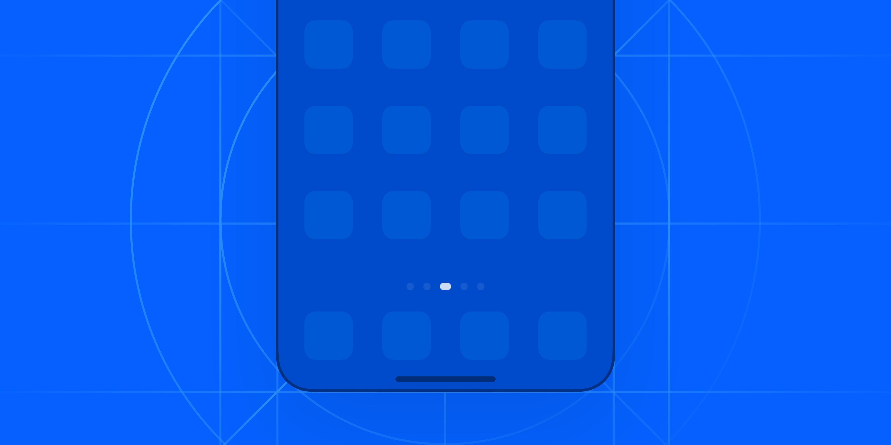
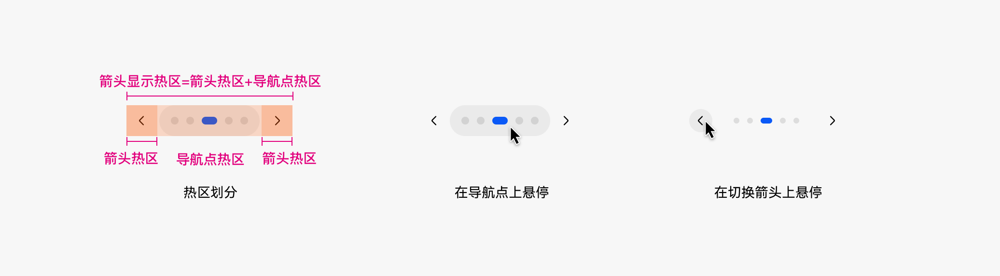
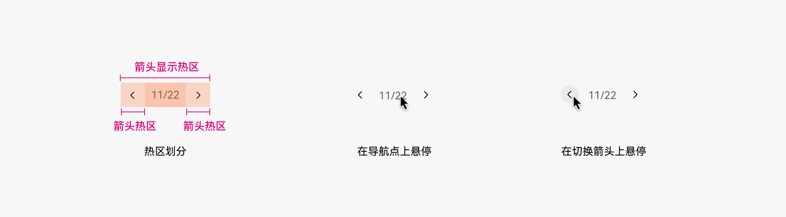
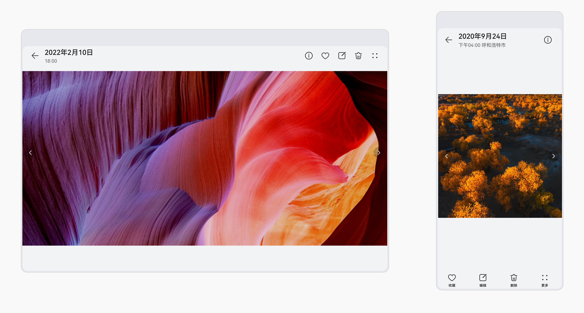
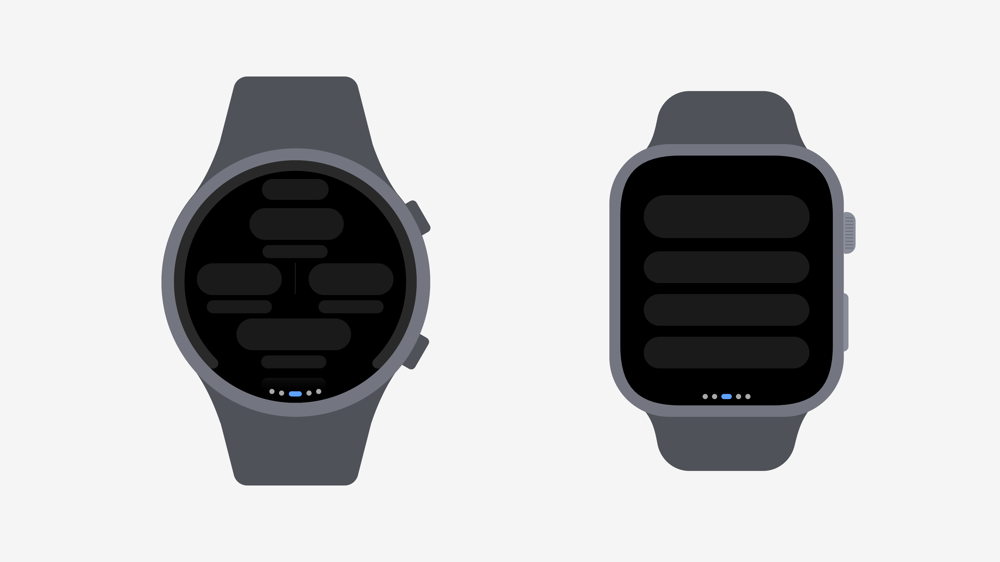
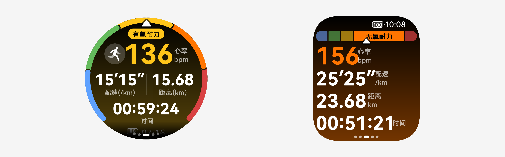

# 导航点

更新时间：

来源：https://developer.huawei.com/consumer/cn/doc/design-guides/swiper-0000001956947629

导航点是用于界面设计中的常用导航类控件，通常用于展示多个视图、界面内容之间的切换关系。通过导航点可以直观的告诉用户当前内容的数量，且指示当前内容所处位置。导航点导航的内容都是处于同等重要的位置。开发相关描述请参考 [Swiper](https://developer.huawei.com/consumer/cn/doc/harmonyos-references/ts-container-swiper) 文档。
 

 

 

##### 如何使用

**按顺序浏览多个页面或内容时，用户对内容数量及当前页面所处位置需要感知的场景，使用导航点。**导航点的形式取决于内容的数量。导航点应与内容视图或页面保持同步，当前所在视图或页面对应的导航点应高亮或突出显示。用户可以通过点击或滑动导航点来切换视图或内容页面，交互响应应及时且流畅。
 

 
**如果内容视图或页面数量较多，导航点可以设置为循环滚动，即从最后一个导航回到第一个。**导航点的交互行为应在同一产品内保持一致，避免在不同场景下行为不一致造成用户困惑。
 

 
 

##### 视觉规则

**导航点的形状通常为圆形或其他简单几何形状，避免使用复杂图形。**通用导航点通常由一系列小圆点组成，每一个独立的圆点代表一个界面或内容。导航点应大小适中，既不能过大占用过多空间，也不能过小影响可见性。
 

 
**当前所在视图或页面对应的导航点应有明显的视觉区分，如填充颜色、放大等方式。**通常情况下，激活态的小圆点会以明显的色彩对比度、高亮色等突出的方式区隔与其他圆点。当用户切换不同小圆点时，也会有明显的动效变化来传递事件的发生。导航点的颜色应与产品整体视觉风格相协调，避免使用过于鲜艳的颜色影响美观度。
 
**导航点的布局应合理，避免遮挡重要内容。**如果展示界面中的运营区域，一般会展示在 Banner 卡片的中下方或左下角，全界面时一般居中布局，展示在文本信息下方。
 

 
**类型**
 
**圆点导航点**
 
用于页面数量较少的场景。圆点个数代表界面数量，高亮点指示当前页面所处位置。当鼠标移动到导航点上悬停时，导航点左右侧出现切换箭头，并且导航点整体呈现悬停效果，增加悬浮态背板。当移动到指向箭头上时，箭头会增加背板悬浮态效果。
 

 

 
**数字导航点**
 
用于页面数量较多的场景，让用户清晰的知道目前所看内容的位置。前置位数字为当前所在的页数信息，后置位数字为总体页数信息。当鼠标移动到数字上悬停时，数字导航点左右侧出现切换箭头。当移动到指向箭头上时，箭头会增加背板悬浮态效果。
 

 

 
**切换箭头**
 
用于左右滑动查看内容，用户对内容数量无需感知的场景。例如图库查看图片页，应用商店详情页。
 

 
 
**智能穿戴****导航点**
 
导航点用来指示当前界面所处的位置，在智能手表导航逻辑上综合了一般底部导航和轮播导航的优势，位于内容下方，以小圆点为构成样式。
 

 
使用方式：
 1. 进入应用即出现导航点，无操作状态 2s 自动消失；触控屏幕或者使用表冠交互即可再次调出导航点。
2. 导航点不做默认播放，当用户左右滑动时，则应直接展现相应的页面，或者刷新当前的页面。
3. 导航点数量与横向切屏页面数量相同，单屏需做导航点数量限制。
 

 

##### 开发文档

[Swiper](https://developer.huawei.com/consumer/cn/doc/harmonyos-references/ts-container-swiper)
