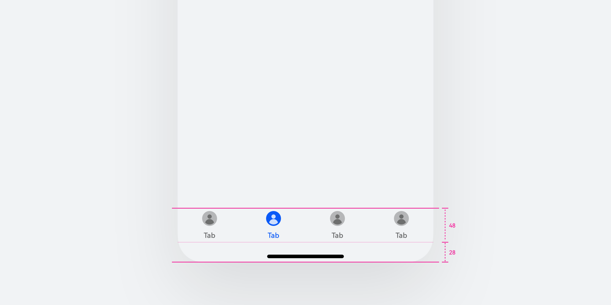
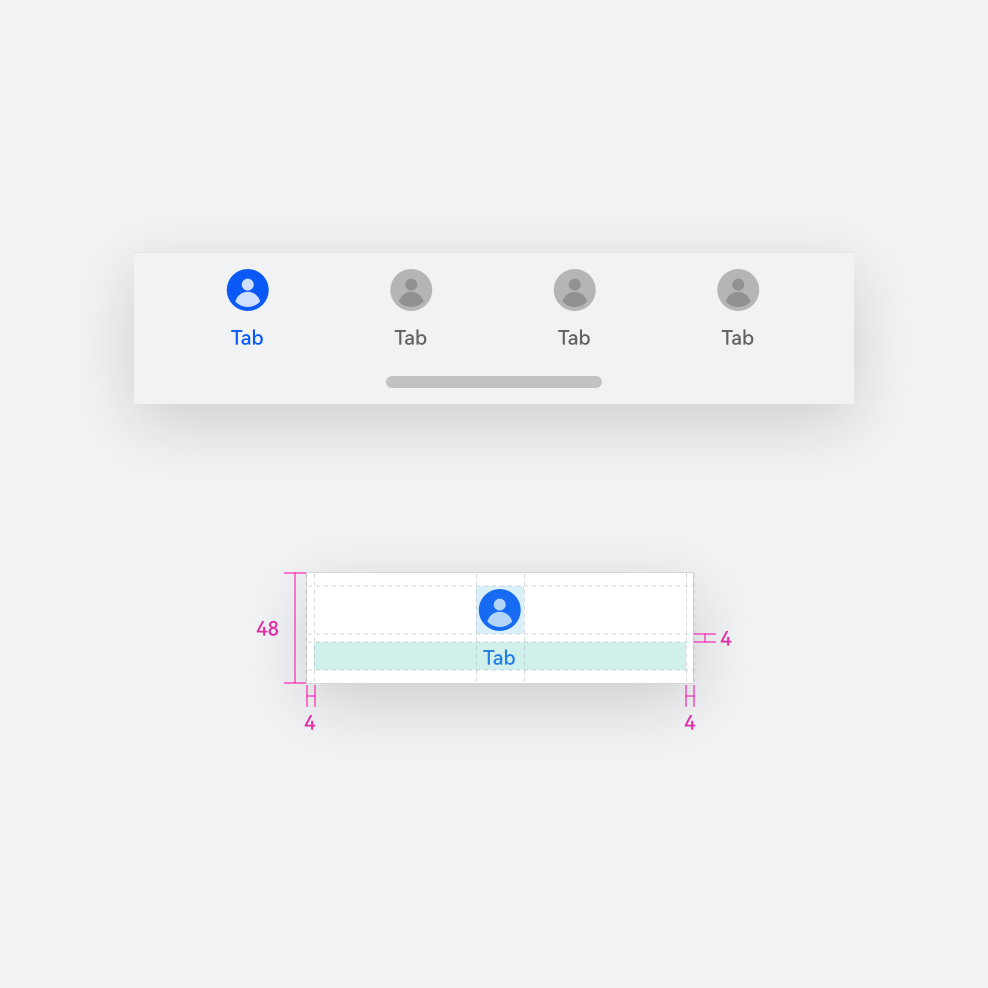
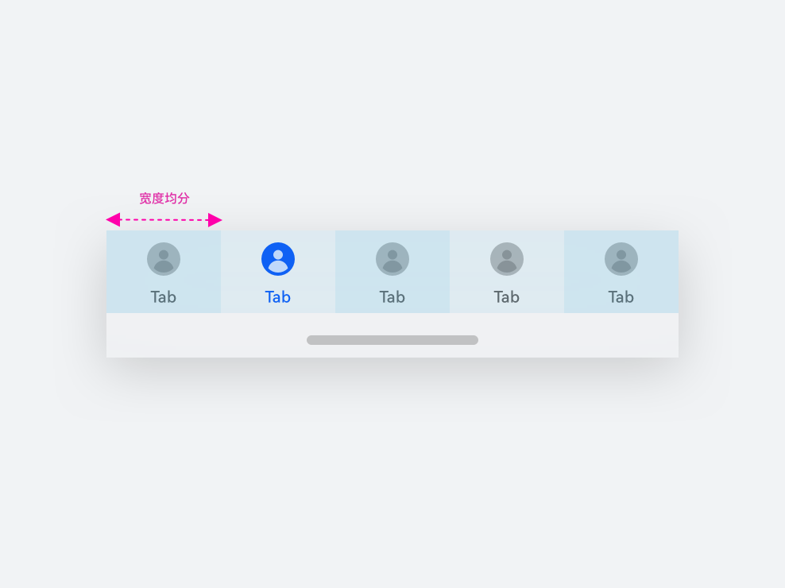
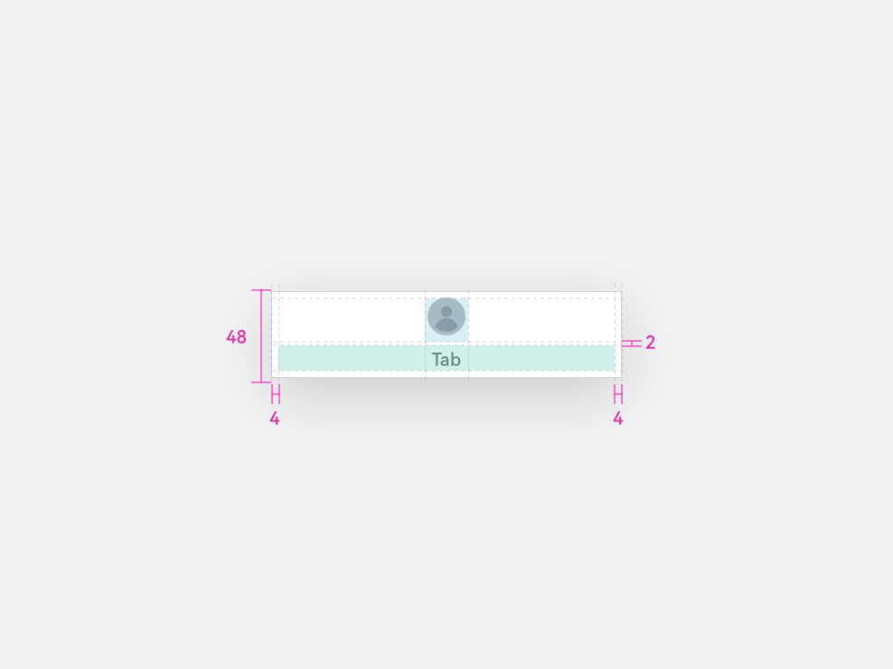

# 底部页签

更新时间：

来源：https://developer.huawei.com/consumer/cn/doc/design-guides/bottomtab-0000001956787789

移动设备中最常见的应用级导航控件，开发相关描述请参考 [Tabs/BottomTabBarStyle](https://developer.huawei.com/consumer/cn/doc/harmonyos-references/ts-container-tabs) 文档。

#### 如何使用

**底部页签是一种常见的界面导航结构，通常位于应用程序屏幕的底部。**通过点击页签项，用户可以快捷地访问应用的不同分类界面。根据使用场景及设备类型，底部页签将会呈现为不同设计样式。

**避让系统导航条。**在 HarmonyOS Next 的系统界面底部会固定显示导航条，因此，在自定义底部页签样式的时候需注意避让导航条区域，避免应用的文本或图标信息与导航条重叠。控件在默认情况下会避让导航条，底部页签组件整体高度会扩展至导航条区域，但底部页签的按键热区与导航条热区互相独立。底部页签默认高度为 48vp，如果开发者需要自定义底部页签的样式和结构，可以通过 [expandSafeArea](https://developer.huawei.com/consumer/cn/doc/harmonyos-references/ts-universal-attributes-expand-safe-area) 了解能力规格。

**避免大量的使用页签数量。**通常情况下一个应用程序会包含 3-5 个同等重要的功能模块，这些模块之间彼此互斥。过多页签数量会增加复杂度并缩减单个页签的可点击区域，造成基础功能上的使用障碍，同时增加用户的认知复杂度。一般情况选择 4 个以下页签数量，针对特征性的运营设计可以使用 4+1 的模式进行自定义，即四个基础功能页签和一个运营性页签。

|  |  |
| 默认页签样式 图标大小默认为 24*24vp | 自定义运营页签样式 图标居中对齐显示，保证上下安全间距为 4vp |

**页签标签应使用简洁的文字或图标表达，让用户一目了然。**被激活的页签应有明确的视觉反馈，如使用品牌高亮色显示，或增加激活动效提升设计细节和品质感。避免在页签中放置次要或高级功能入口，以免分散用户注意力，对于未激活的页签应当弱化展示效果，通过降低透明度或者将颜色置灰来对图标和文本进行处理。在文本的处理上要减少字符串的使用，在 2-4 个字符串以内明确概述页签的功能，英文和多语言场景下尽量使用一个单词或一个词组来展示。

**使用 HarmonyOS Symbol 来展示图标信息**

在底部页签中可以替换系统 [Symbol](https://developer.huawei.com/consumer/cn/doc/harmonyos-references/ts-basic-components-symbolglyph) 样式来更灵活的展示图标信息，这种方式更匹配文本的展示效果，同时提供点击反馈，更直接的展示界面设计的细节。开发者可以在 [HarmonyOS Symbol](https://developer.huawei.com/consumer/cn/design/harmonyos-symbol/) 开源网站上查询目前已经存在的图标样式。

#### 组件规则

#### 视觉规则

**动态与反馈**

点击切换页签时需要明确的切换行为告知，若点击当前页签，界面会回滚至页面顶部或指定位置。页签在切换时，选中态有细微的点击弹跳动效，推荐使用[Symbol（BounceSymbolEffect-EffectDirection.DOWN）](https://developer.huawei.com/consumer/cn/doc/harmonyos-references/ts-basic-components-symbolglyph#bouncesymboleffect12)。有关底部页签展示 Symbol 能力接口和动效能力可查阅 [TabBarSymbol](https://developer.huawei.com/consumer/cn/doc/harmonyos-references/ts-container-tabcontent#tabbarsymbol12对象说明) 开发文档。

**模糊材质**

底部页签可以通过模糊材质实现更高级的视觉效果。

使用 Ark UI 的底部页签控件，实现模糊效果之前需要配置底部页签 [barOverlap](https://developer.huawei.com/consumer/cn/doc/harmonyos-references/ts-container-tabs#baroverlap10) 属性为 true，将底部页签覆盖在内容区之上，再通过 [barBackgroundColor](https://developer.huawei.com/consumer/cn/doc/harmonyos-references/ts-container-tabs#barbackgroundcolor10) 和 [barBackgroundBlurStyle](https://developer.huawei.com/consumer/cn/doc/harmonyos-references/ts-container-tabs#barbackgroundblurstyle11) 属性结合实现，模糊材质本身已经包含一层背景色，因此 barBackgroundColor 需要设置为透明度模式，否则也会被模糊材质影响。如果你希望自定义模糊效果，可以通过 [BackgroundEffectOptions](https://developer.huawei.com/consumer/cn/doc/harmonyos-references/ts-universal-attributes-background#backgroundeffectoptions11) 进行对容器背景效果的自定义。

使用 HDS 底部页签控件，默认带有模糊背板属性。同时，HDS 的底部页签控件，提供了两种模糊类型：

 - 背板模糊：对底部页签的背景进行均匀的模糊处理，模糊强度一致，边界清晰，用于强调控件与内容的层级分隔。
 - 渐变模糊：模糊效果在空间维度上呈现渐强/渐弱的变化，模糊边界柔和，用于增强页面沉浸感。

HDS 底部页签控件开发相关描述请参阅 [HDS Tabs](https://developer.huawei.com/consumer/cn/doc/harmonyos-references/ui-design-hdstabs) 文档。

**背板模糊**

在底部页签中，背板模糊作为独立视觉层级存在，与内容层形成悬浮空间关系，适用于页面内容与底部页签产生交叠的场景。

**通过提亮压暗增强色彩活力。**底部页签的背板模糊默认带有提亮压暗属性，能够激发色彩活力，提高背板通透度。

**通过分割线提高内容边界可识别性。**为避免视觉认知障碍问题，默认情况下，模糊背板上边缘带有一条 1 px 的分割线。

**通过微动效增强内容触底的暗示。**当页面内容离开底部页签区域后，默认触发模糊 & 分割线渐变隐藏，增强触底操作的心理暗示。

**渐变模糊**

渐变模糊与页面内容的融合度更高，通过弱化视觉边界，以延展页面空间，但渐变模糊会增高页签占用面积、降低页签内容可读性，因此仅适用于部分特定场景。

#### 布局规则

#### 手机设备

**布局结构**

该布局适用于直板机竖屏、折叠机展开态横竖屏和平板竖屏，默认单个组件宽度根据个数在内容宽度内水平均分，最多允许放 5 个。文字范围在单个页签范围内两边保持安全间隔。

|  |  |

**左右结构**

在一些特殊场景下，例如手机进入横屏状态，此时的屏幕显示区域处于高度较矮、宽度较宽的场景时，为了更有效的利用可展示区域，底部页签可以修改为左右布局来进行展示。可以查阅底部页签的 [LayoutMode](https://developer.huawei.com/consumer/cn/doc/harmonyos-references/ts-container-tabcontent#layoutmode10) 接口进行了解，配置其样式为 HORIZONTAL。需要注意，当布局修改为左右布局时，文本会从默认的 10vp 放大为 12vp，从而达到文本与图标视觉上的协调性。

**分栏布局跟随导航结构**

在业务的实际使用场景下会出现应用使用分栏布局进行适配，此时底部页签需要跟随应用导航结构明确展示层级，使用跟随应用的一级分栏，避免底部页签的展示始终凌驾于全量界面之上。

#### 平板设备

**平板横屏布局**

平板横屏情况下，底部页签可以通过 Tabs 组件的 [Vertical](https://developer.huawei.com/consumer/cn/doc/harmonyos-references/ts-container-tabs#vertical) 属性配置为竖状侧边导航，侧边导航固定在页面左侧。也可以通过动态配置规则，基于屏幕断点规则，当断点属于 840vp 以下时使用底部页签，在 840vp 以上时使用侧边页签。

**使用分割线区隔内容**

基于应用的场景和规则，如果需要明确区分页签与内容区的边界时，可以使用分割线来进行区分，通过 [divider](https://developer.huawei.com/consumer/cn/doc/harmonyos-references/ts-container-tabs#divider10) 接口进行配置。

#### 开发文档

[Tabs](https://developer.huawei.com/consumer/cn/doc/harmonyos-references/ts-container-tabs)

[HdsTabs](https://developer.huawei.com/consumer/cn/doc/harmonyos-references/ui-design-hdstabs)

[TabContent](https://developer.huawei.com/consumer/cn/doc/harmonyos-references/ts-container-tabcontent)

[Navigation](https://developer.huawei.com/consumer/cn/doc/harmonyos-references/ts-basic-components-navigation)

[HdsNavigation](https://developer.huawei.com/consumer/cn/doc/harmonyos-references/ui-design-hdsnavigation)

[ExpandSafeArea](https://developer.huawei.com/consumer/cn/doc/harmonyos-references/ts-universal-attributes-expand-safe-area)

[HdsSideBar](https://developer.huawei.com/consumer/cn/doc/harmonyos-references/ui-design-hdssidebar)
