# 标题栏

更新时间：2025-09-19 02:18:17

来源：https://developer.huawei.com/consumer/cn/doc/design-guides/titlebar-0000001929628982

标题栏是布局在界面顶部的导航类控件，用于呈现界面名称和操作入口。开发相关描述请参考 Navigation/Title 文档。

## 如何使用

标题栏用于展示当前页面的标题和状态信息。使用标题栏显示当前界面的名称和操作入口，标题栏的样式会极大影响内容首屏显示的效率，不同类型的界面可以匹配不同的风格，具体可参考下方控件构成相关内容。

明确当前标题的导航层级，给予用户重要提示。系统导航的基础逻辑应当明确一级目录的唯一性，非一级页面要有明确返回导航或者关闭操作，防止用户在使用应用的过程中丢失导航路线。

合理使用右侧可操作区域，适当提供可操作选项。放置与当前页面相关的操作按钮，如搜索、分享、设置等，操作按钮应与当前页面内容密切相关，避免提供与应用不相关的操作内容。如果应用的操作项过多，请不要全部展示出来，可以通过展示“更多”图标来提供菜单选项，简化界面复杂度，详情可参考 menus 能力规格。

标题栏的高度应保持一致，以确保良好的交互体验。标题栏控件在 HarmonyOS NEXT 上默认单行高度为 56vp，强调型标题栏为 112vp，开发者需要根据自身业务需要选择不同类型的标题栏，可以通过 NavigationTitleMode 来进行配置，其中 Free 样式为动态布局，标题栏会根据手势滑动动态缩小高度，Mini 与 Full 均为固定样式。

标题栏文本的呈现应简洁明了。标题的描述应准确反映当前页面的内容和状态，不要用过长的字符串来展示标题信息，标题展示的文本信息应该是当前页面的概述和分类。文本过长不仅影响布局和美观度，也会在阅读体验上产生影响。除此之外，标题文字应使用醒目的字体大小和颜色，与背景形成足够对比，在系统默认风格的标题栏中使用加粗字体来展示其重要性。

## 组件规则

### 组件构成

一级页标题

标题栏一般由标题和右侧功能图标组成，在一级标题栏下左侧不可以出现返回标题，若在 Mini 样式下默认带上返回图标，需要通过 hideBackButton 隐藏其显示。标题栏的使用通常与系统信号栏的布局相邻，在默认情况下标题栏的背景色会延伸至信号栏区域，通过 expandSafeArea 接口可以实现安全区的避让。

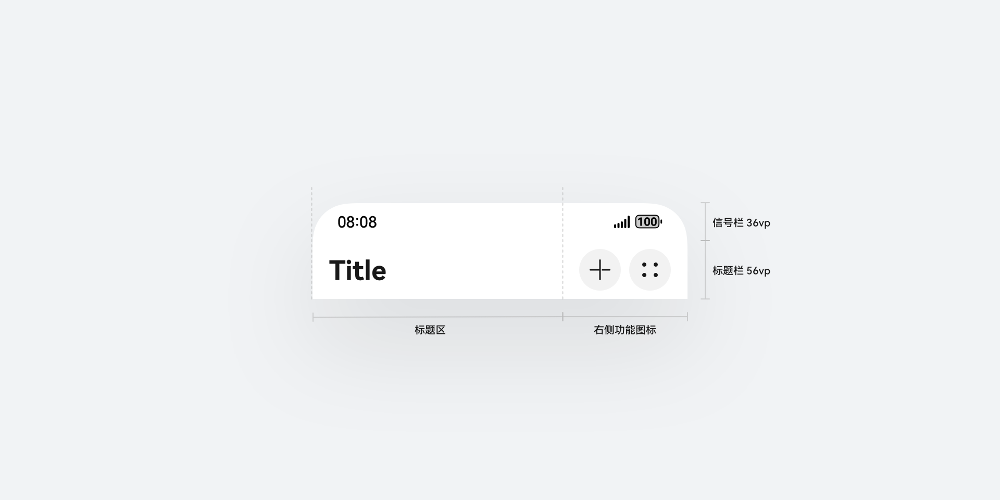

强调型标题栏

主要用于一级界面突出标题区域，在没有特殊要求的情况下，模块的一级界面应该使用强调型标题栏。

支持显示单行标题、双行标题、强调型标题样式。

| 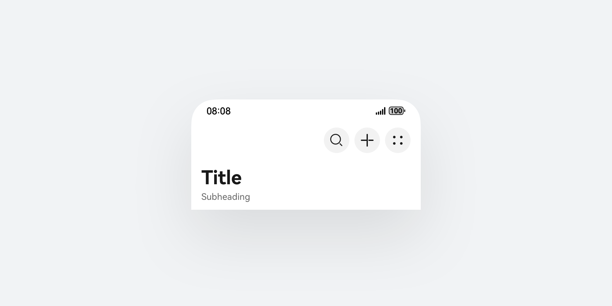 | 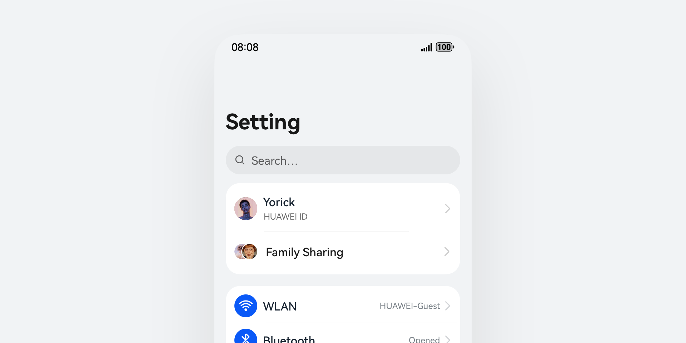 |
| --- | --- |

普通型标题栏

用于不需要突出标题的场景。当界面上方主要区域为图形化展示时，应该使用普通标题栏。

支持单行标题和双行标题两种样式。

| 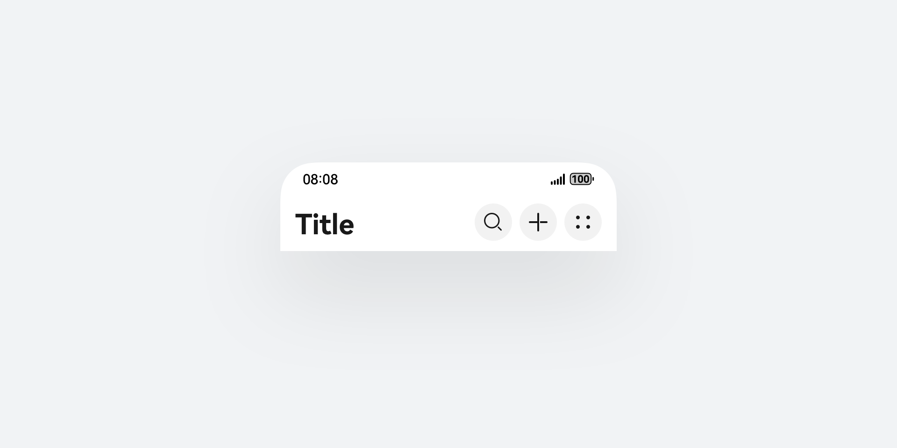 | 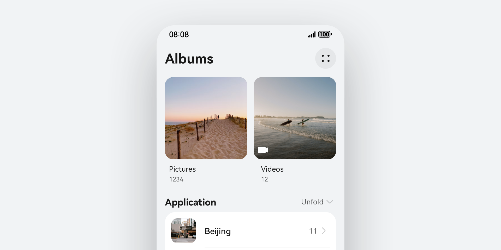 |
| --- | --- |

抽屉型标题栏

用于展示不同的分类，可以快捷地进行切换、查找。抽屉型在不同尺寸设备上呈现的效果略有差异，手机端为侧边遮罩层，平板端等大屏设备为分栏界面布局。通常效率型、办公类及内容型应用较为常用。抽屉标题栏需要配合 SideBarContainer 结合使用。

| 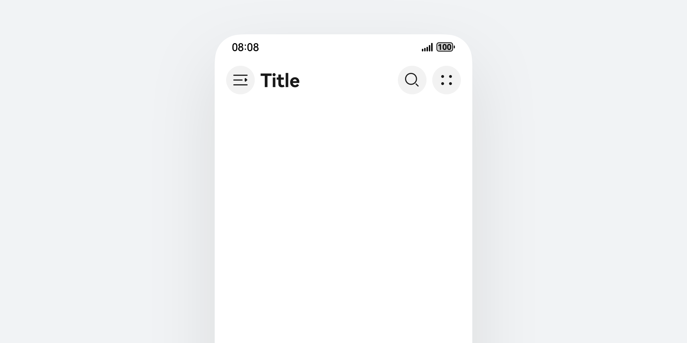 |  |
| --- | --- |

二级页标题

除一级界面、编辑界面和选择界面外，所有其他界面都展示二级页标题。二级标题栏通常使用 NavDestination 控件组合使用，NavDestination 是子页面的根容器控件，用于显示 Navigation 的内容区。

| 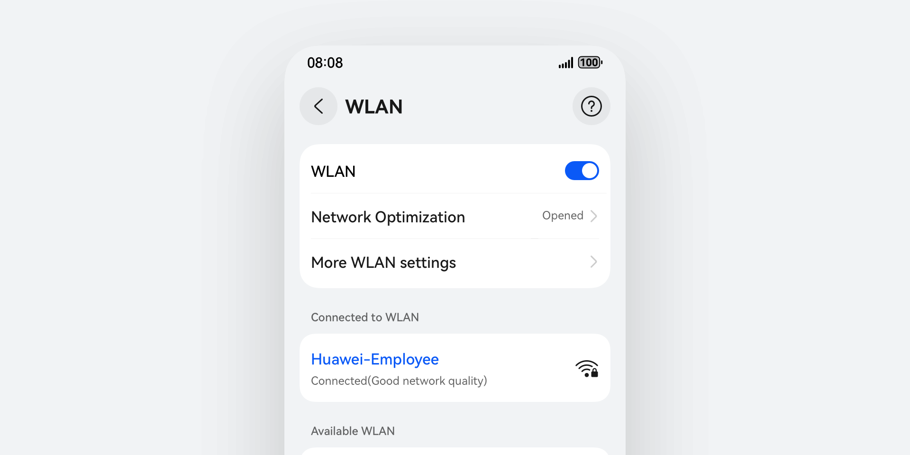 |    |
| --- | --- |

编辑界面

当需要对界面内容进行编辑时，使用编辑界面标题栏。详情能力可参考 EditableTitleBar 控件相关能力。

编辑界面标题栏一般使用左侧关闭右侧确认的布局形式，在一些需要大量编辑文本的场景下可以使用返回按钮。

| 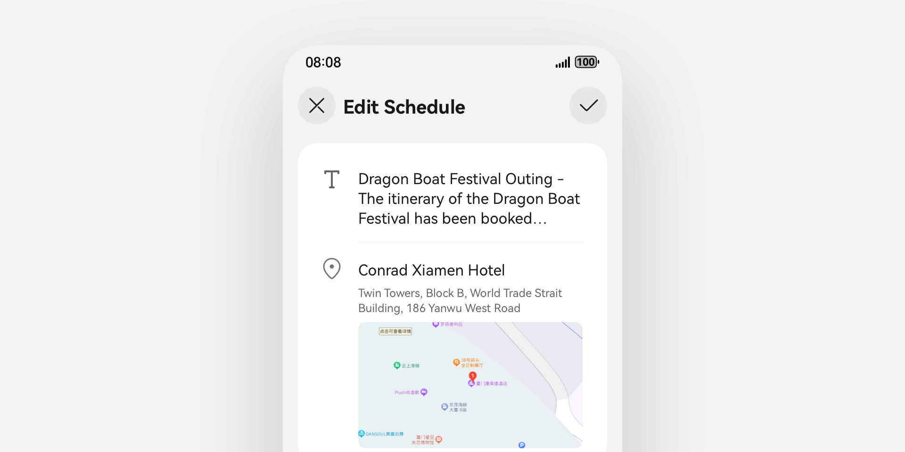 | 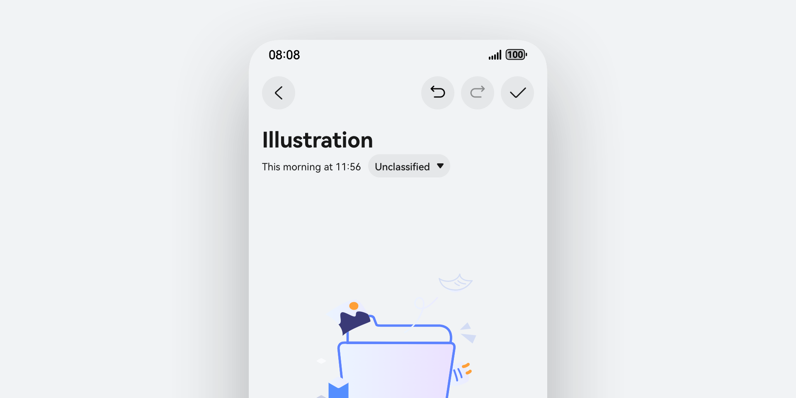 |
| --- | --- |

### 视觉规则

模糊材质

标题栏可以通过模糊材质实现更高级的视觉效果，HDS 标题栏控件默认背板带有模糊材质。同时，该控件提供了两种模糊类型：

- 通用模糊：组件对标题栏的背景进行均匀的模糊处理，模糊强度一致，边界清晰，用于强调控件与内容的层级分隔。
- 渐变模糊：模糊效果在空间维度上呈现渐强/渐弱的变化，模糊边界柔和，用于增强页面沉浸感。

HDS 标题栏控件开发相关描述请参阅 HDS Navigation 文档。

直接模糊

在标题栏中，通用模糊作为独立视觉层级存在，与内容层形成悬浮空间关系，适用于页面内容与标题栏产生交叠的场景。

标题栏的通用模糊默认带有提亮压暗属性，能够激发色彩活力，提高背板通透度。

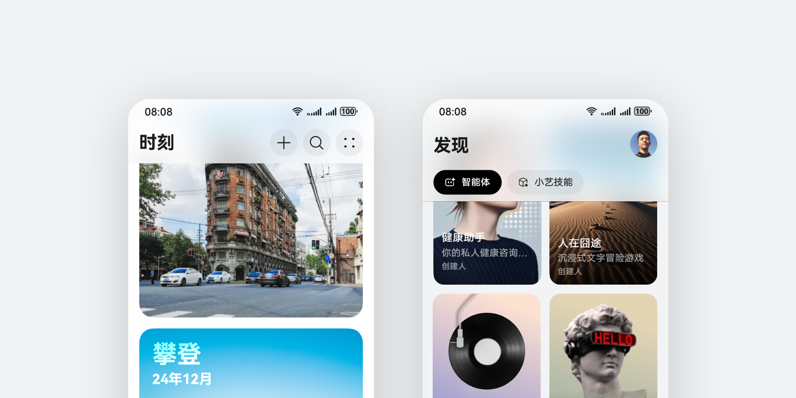

为提高内容边界可识别性，避免视觉认知障碍问题，默认情况下，模糊背板下边缘带有一条 1 px 的分割线。

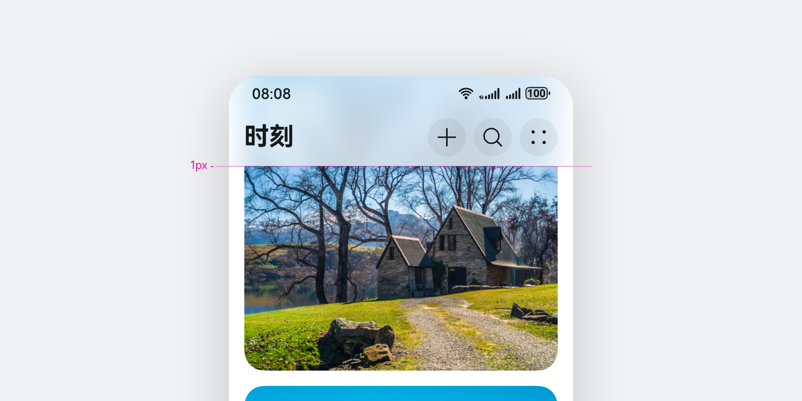

半模态标题栏在满足内容与标题区产生重叠关系时，采用通用模糊类型，提升半模态页面质感。

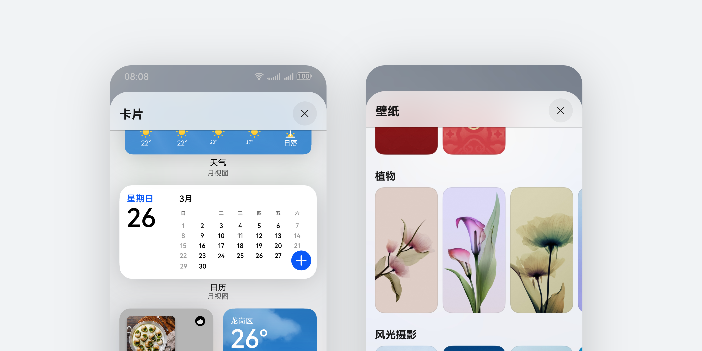

渐变模糊

渐变模糊与页面内容的融合度更高，通过弱化视觉边界，以延展页面空间，但渐变模糊会增高页签占用面积、降低页签内容可读性，因此仅适用于部分特定场景。

渐变模糊默认带有黑色渐变蒙层，用于提高标题栏可识别度。

渐变的颜色蒙层支持自定义修改颜色，在不同场景下，可通过匹配背景颜色增强页面沉浸感。

标题栏支持添加自定义组件，如添加自定义内容，模糊背板会随着标题栏高度变化而变化，分割线始终位于模糊背板下边缘。

跟手与反馈

直接模糊和渐变模糊类型都具备两种模糊跟手生效的方式：

- 直接生效
- 过渡生效

直接生效

滑动内容进入/离开标题栏区域过程中，模糊背板和分割线透明渐变出现/消失。此方式适用于非沉浸式场景。

当页面内容进入/离开标题栏区域时，默认触发模糊 & 分割线渐变显示/隐藏，增强触顶操作的心理暗示。

过渡生效

滑动前后标题栏内容发生颜色/状态变化，滑动过程中，线性跟手变化。此方式仅适用于沉浸式到非沉浸式相互切换的场景。

堆叠与模糊材质

使用ark UI的标题栏组件，除了通用的布局规格以外，也提供了可堆叠样式，开发者可以通过 BarStyle 配置其属性为 STACK 来改变标题栏的布局层级。使用了堆叠样式后，界面中的内容便可以穿透到组件下方。在 NavigationTitleOptions 中将标题栏背景色设置为透明度，同时使用 backgroundBlurStyle 属性配置其模糊样式的枚举，结合堆叠样式和模糊属性实现标题栏的整体模糊效果。

| 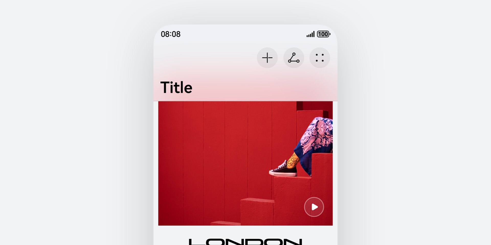 | 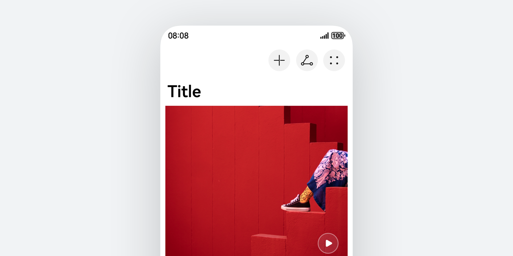 |
| --- | --- |
| 普通深浅模式下，模糊按照整个控件区域呈现，可以扩展至信号栏区域。 模糊生效时，在标题栏底部会有一条分割线投影，用于明确区分布局边界。 | 当模糊效果不生效时，背景色与界面融为一体。需确保模糊材质内的填充色与界面背景色一致。 |

## 设备差异

### 手机设备

横屏

标题栏布局与竖屏一致，右侧图标为竖屏下 Toolbar + Appbar 上所有功能图标的集合。

手机端除 Launcher 模块，信号栏默认不显示，标题栏紧贴屏幕开始显示，高度为 56 vp。

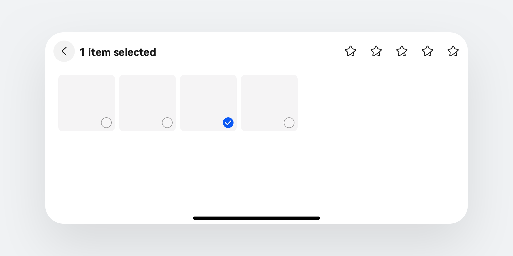

分栏

标题栏在其可用区域内，按照竖屏规则布局。

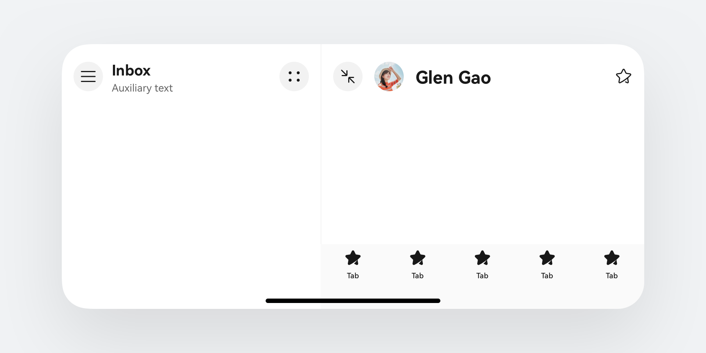

### 平板设备

平板竖屏布局

规则与手机一致，在标题栏使用上没有特殊规则，适配主要以拉伸适配为主，充满整个容器宽度。

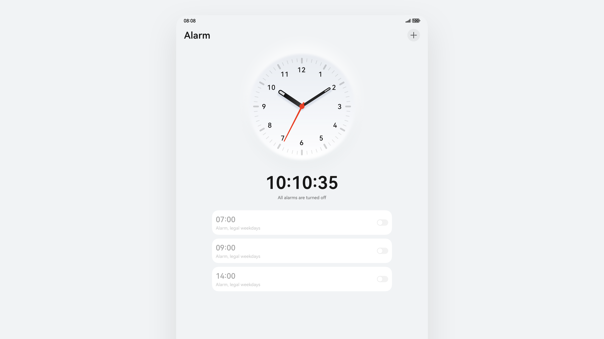

平板横屏分栏布局

在一些效率型应用中，开发者为了呈现更多内容，需要对界面布局进行分栏处理。分栏布局可以通过 NavigationMode 接口能力，并配置 Split 样式属性。开发者也可以使用 Auto 属性样式来动态布局分栏规格，当窗口宽度大于等于 600vp 时，采用Split模式显示；窗口宽度小于600vp时，采用Stack模式显示。在 HarmonyOS NEXT 版本中定义了跨设备的断点式布局规格，详情可以阅读视觉规范中布局章节了解详情。

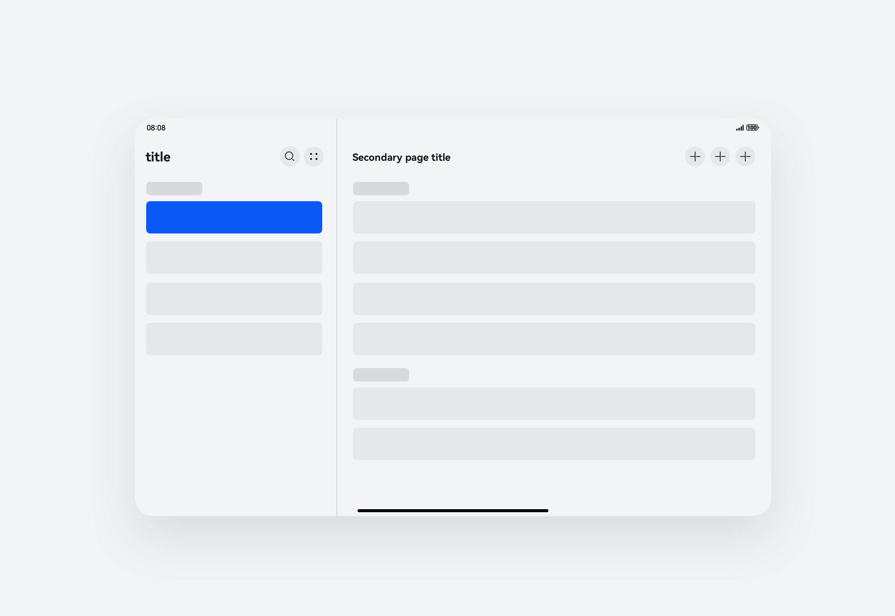

### 电脑设备

在电脑场景下，标题栏使用更小的字体提高界面信息密度，同时去掉了圆形底板。

强调型标题栏

主要用于一级界面突出标题区域

支持显示单行标题、双行标题

| 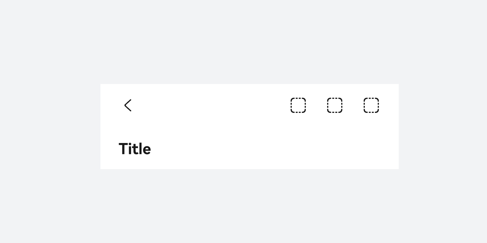单行标题 | 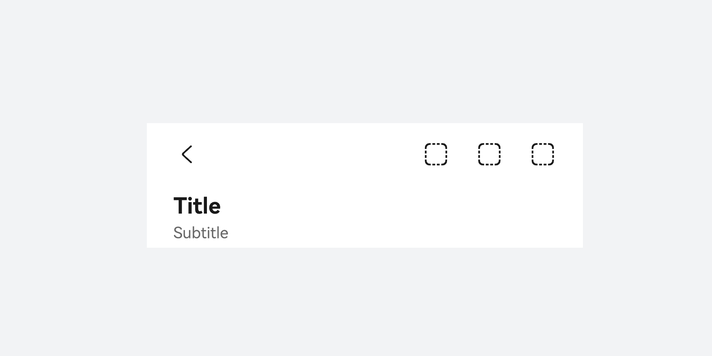双行标题 |
| --- | --- |

普通型标题栏

用于不需要突出标题的场景。当界面上方主要区域为图形化展示时，应该使用普通标题栏。

支持单行标题和双行标题两种样式。

| 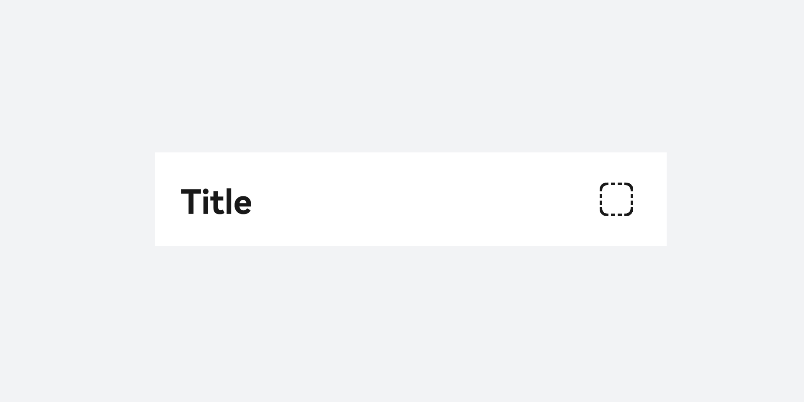单行标题 | 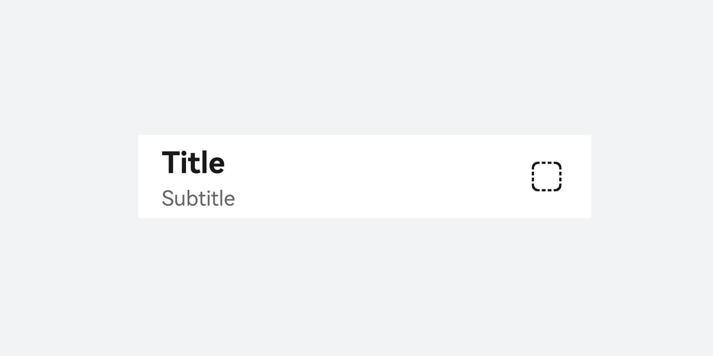双行标题 |
| --- | --- |

| 抽屉型标题栏 用于展示不同的分类，可以快捷地进行切换、查找。抽屉型在不同尺寸设备上呈现的效果略有差异，手机端为侧边遮罩层，平板端等大屏设备为分栏界面布局。通常效率型、办公类及内容型应用较为常用。 | 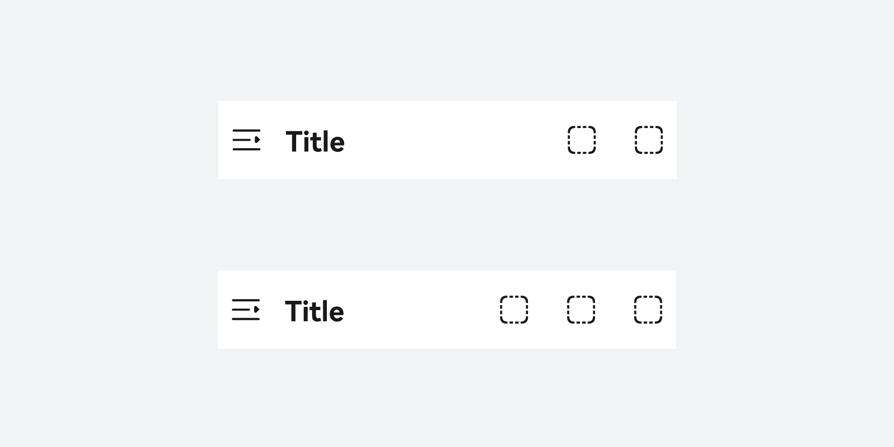 |
| --- | --- |
| 二级页标题 除一级界面、编辑界面和选择界面外，所有其他界面都展示二级页标题。 | 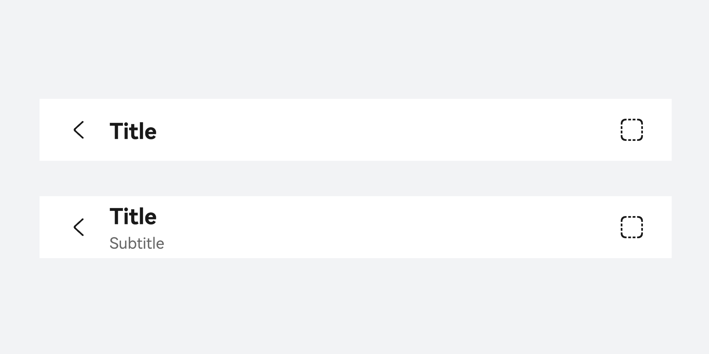 |
| 编辑界面 当需要对界面内容进行编辑时，使用编辑界面标题栏。 | 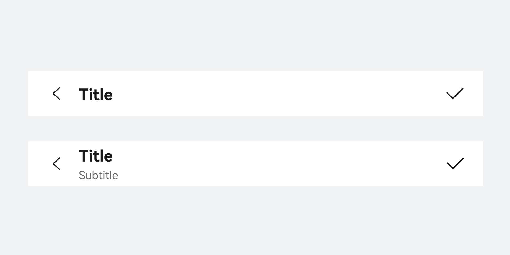 |

普通标题栏：左侧元素

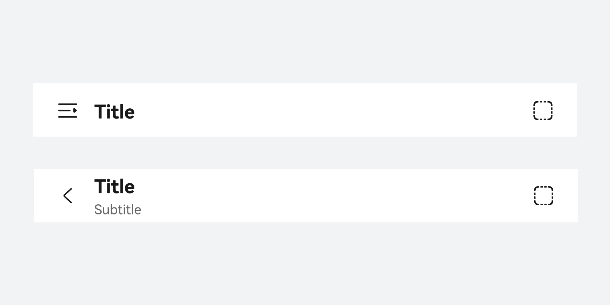

普通标题栏：右侧元素

最多同时支持 3 个图标 (含菜单)。

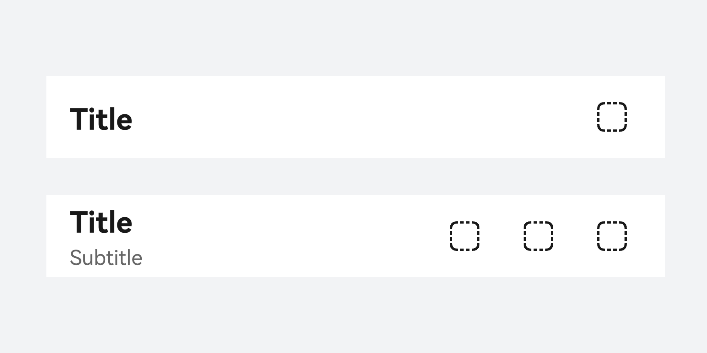

普通标题栏：中间元素

支持放置工具栏、分段按钮等控件

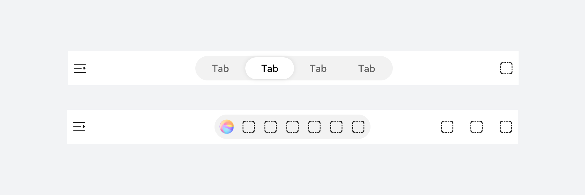

强调型标题栏

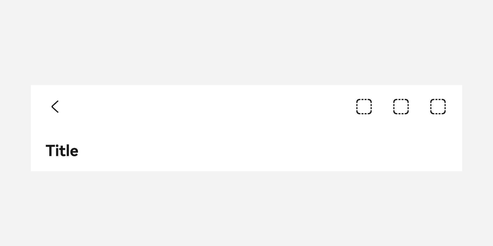

### 穿戴设备

标题栏用于指示当前页面的位置。在方表上，标题栏存在如一/二级标题栏的区分。

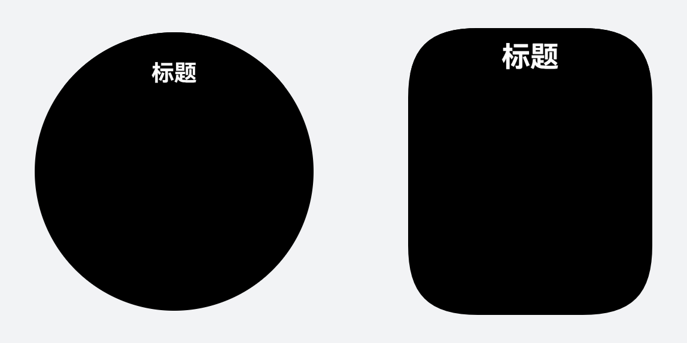

圆形表

单行标题：文字19vp，可换2行（特殊场景可不换行或换更多行），放不下则缩小字号至 18vp、15vp，还放不下则用“...”截断。

双行标题：文字19vp，不支持换行，文本超长则先缩小字号至18vp、15vp，最后考虑最大区域内跑马灯显示。

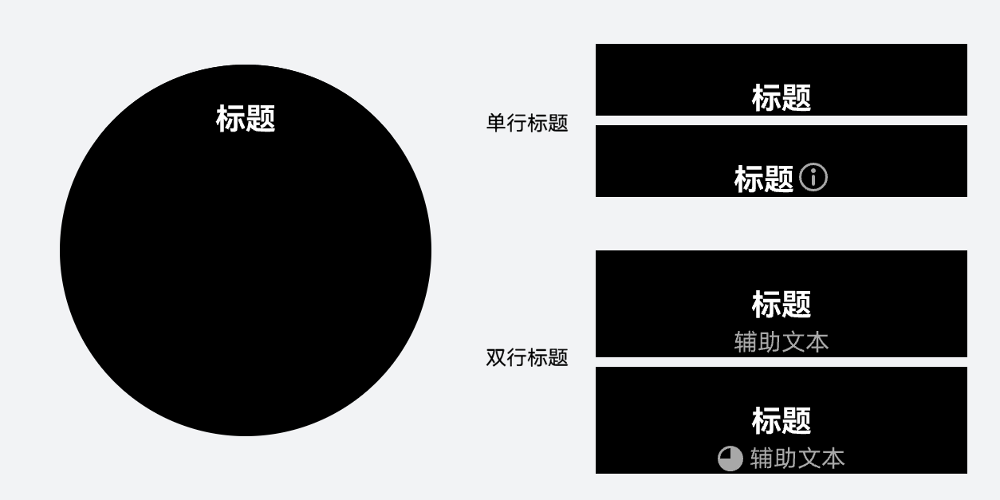

方形表

居中大标题栏：适用于功能明确且内容少的首屏页面。文字24vp，可换2行（特殊场景可不换行或换更多行），放不下则缩小字号至 19vp、18vp，还放不下则用“...”截断。

居中小标题栏：适用于内容较多的页面。文字15vp，不可换行，放不下则缩小字号至 13vp，还放不下跑马灯显示。

标题+时间戳：适用于具有时效性的图表/数据页面。文字15vp，不可换行，放不下则缩小字号至 13vp，还放不下跑马灯显示。

对称型标题栏：适用于高频功能的分发。文字15vp，不可换行（无辅助文本可换2行），放不下则缩小字号至 13vp还放不下则用“...”截断。

二级标题栏：适用于二/三级页面。文字15vp，可换2行（有辅助文本不可换行），放不下则缩小字号至 13vp还放不下则用“...”截断

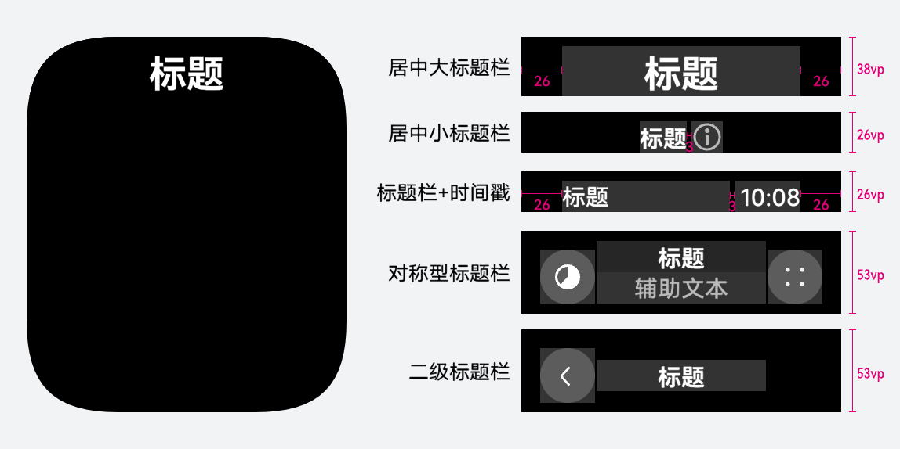

## 开发文档

Navigation

HdsNavigation

NavDestination

HdsNavDestination

SideBarContainer

HdsSideBar

EditableTitleBar
