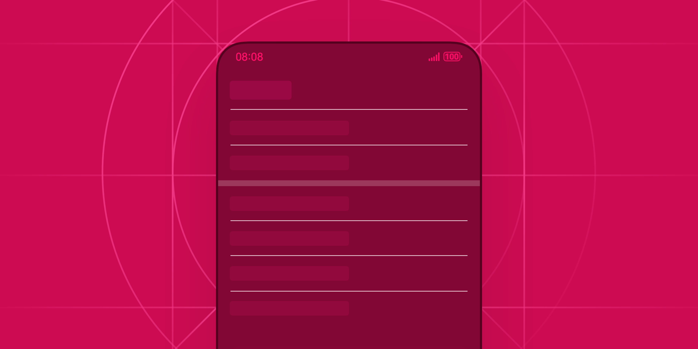
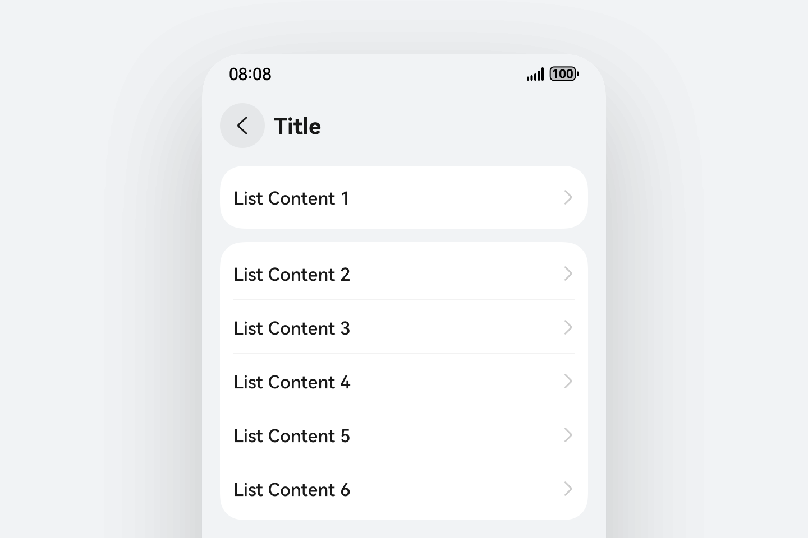
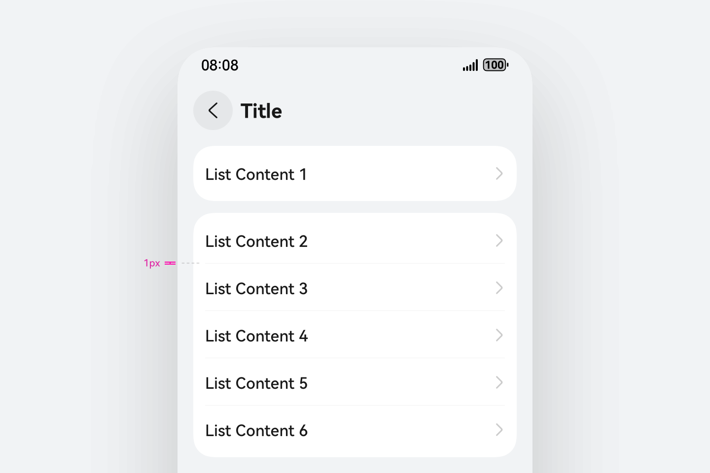
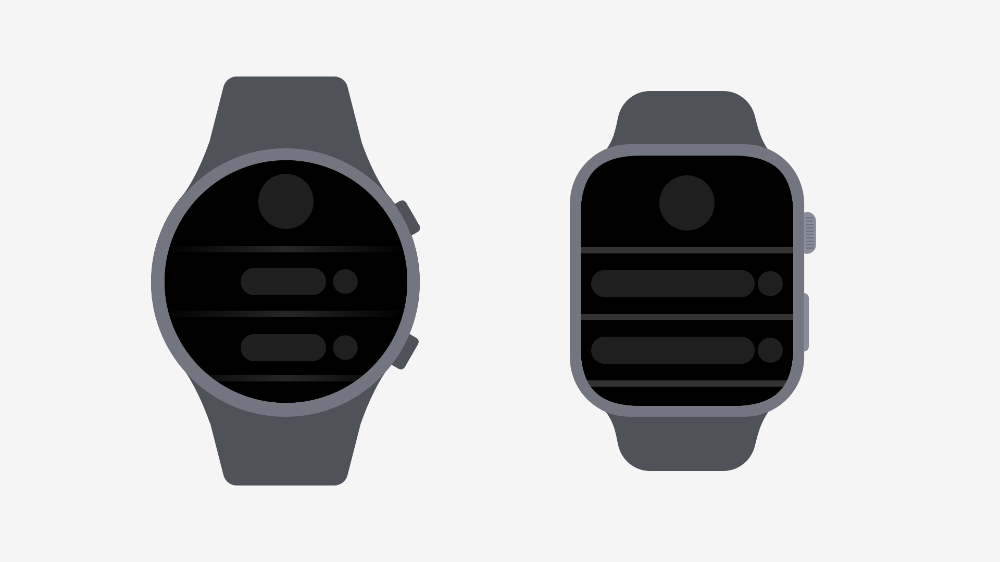
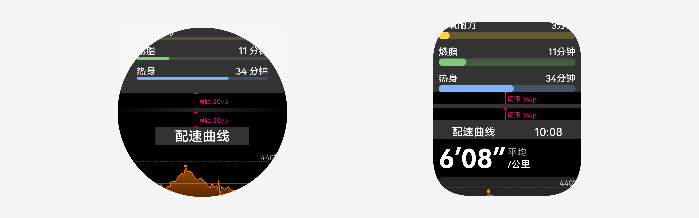
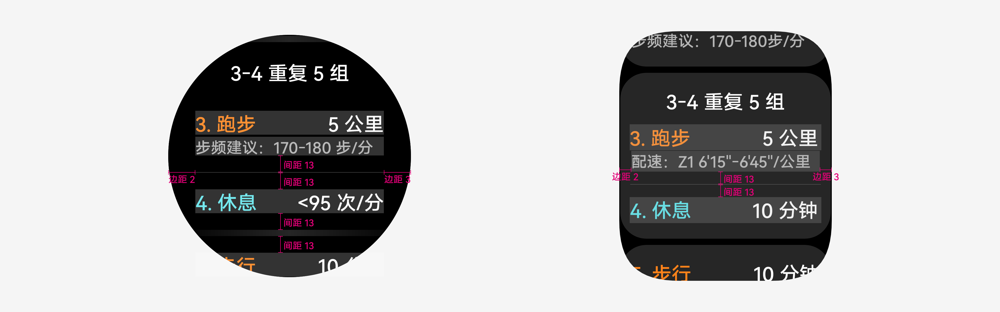

# 分隔器

更新时间：2025-08-19 02:55:50

来源：https://developer.huawei.com/consumer/cn/doc/design-guides/divider-0000001956815469

分隔器主要用于区分不同内容元素和组别，可用于列表或界面布局。分割线相关基础属性配置参考 Divider 文档。

## 如何使用

明确分类与使用场景。分隔器是一个可动态定义的展示类组件，开发者可以配置控件的颜色、宽度以及高度，用于不同使用场景。一般情况下，系统界面中对分隔器的使用分为两类：分隔条和分割线。分隔条属于层级较高且显示面积更大的分隔器类型，主要用于成组模块的区分或是有明确功能分类差异的界面结构。分割线的使用场景更为普遍，层级结构也更低，对于界面的布局影响以及显示影响也更小。

| 使用分割线区分列表布局 |  |
| --- | --- |

不要影响层级结构。无论使用分割线还是分隔条，应避免将该组件展示在内容的最上方或最下方。分隔器作为区分内容的组件，如果内容相邻的布局没有可区分的内容，则不展示。

合理定义展示参数。不要定义过粗的分割线和分隔条。无论是哪种分隔器类型，其目的都在于提示用户，可以通过 strokeWidth 来对分隔器的粗细进行配置。除此之外，请使用低对比度的色彩，可以使用不透明度对色彩进行处理。

| 分割线默认使用 1px 高度 |  |
| --- | --- |

智能穿戴分隔器

分隔不同内容块/内容元素。可用于列表或界面布局。分为分割条和分割线。

分割条

分割线

## 开发文档

Divider
