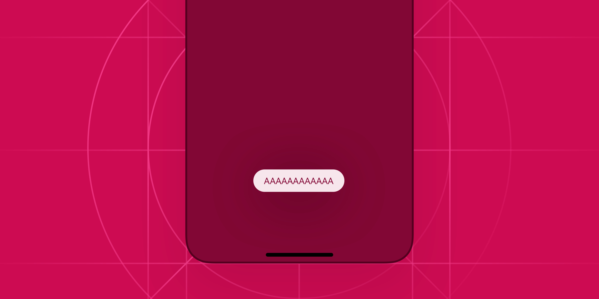
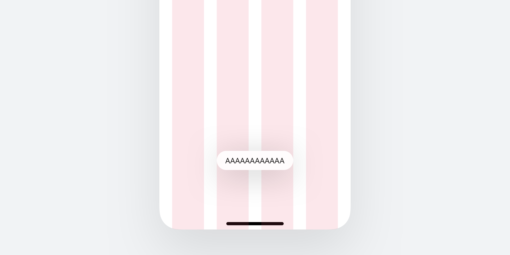
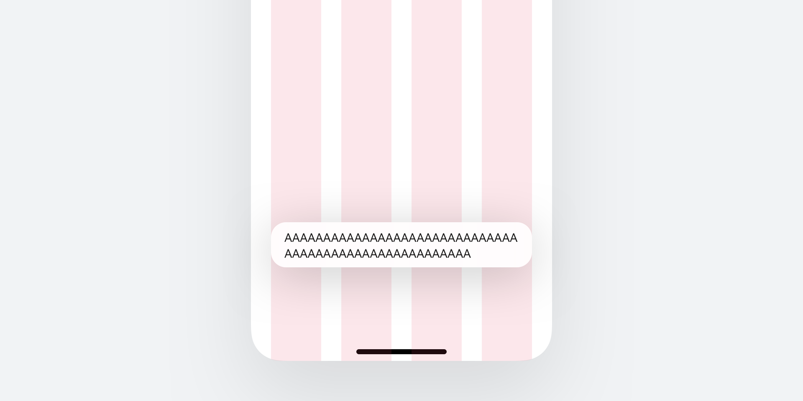
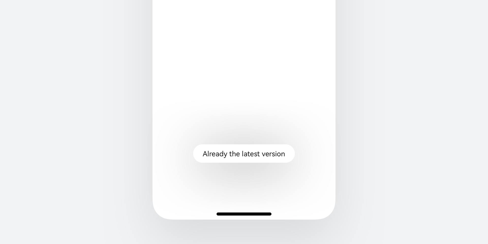
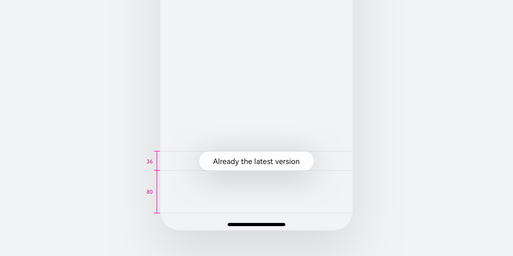
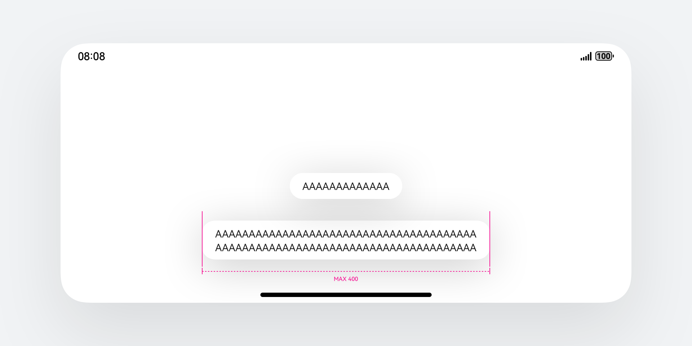

# 即时反馈

更新时间：2026-02-10 09:33:00

来源：https://developer.huawei.com/consumer/cn/doc/design-guides/toast-0000001929656648

用于在屏幕底部或中部显示一个操作的轻量级反馈。开发相关能力请参照 [PromptAction](https://developer.huawei.com/consumer/cn/doc/harmonyos-references/arkts-apis-uicontext-promptaction#showtoast) 文档中的 showToast 用法。
 

 

 

##### 如何使用

**即时反馈是一种临时性的消息提示框，用于向用户显示简短的操作反馈或状态信息。**它通常会在屏幕的底部或顶部短暂地弹出，并在一段时间后自动消失。即时反馈的主要目的是提供简洁、不打扰的信息反馈，而不会干扰用户当前的操作流程。
 

 
**合理使用弹出场景，而不是频繁的提醒用户。**可以针对以下常用场景使用即时反馈操作，例如，当用户执行某个操作时及时结果反馈，用来提示用户操作是否成功或失败；或是当应用程序的状态发生变化时提供状态更新等。
 

 
**注意文本的信息密度，即时反馈展示时间有限，应当避免长文本的出现。**Toast 控件的文本应该清晰可读，字体大小和颜色应该与应用程序的主题相符。除此之外，即时反馈控件本身不应该包含任何可交互的元素，如按钮或链接。
 

 
**杜绝强制占位和密集弹出的提示。**即时反馈作为应用内的轻量通知，应当避免内容布局占用界面内的其他元素信息，如遮盖弹出框的展示内容，从而迷惑用户弹出的内容是否属于弹出框。再或者频繁性的弹出信息内容，且每次弹出之间无时间间隔，影响用户的正常使用。也不要在短时间内频繁弹出新的即时反馈替代上一个。即时反馈的单次显示时长不要超过 3 秒钟，避免影响用户正常的行为操作。
 

 
**遵从系统默认弹出位置。**即时反馈在系统中默认从界面底部弹出，距离底部有一定的安全间距，作为系统性的应用内提示反馈，请遵守系统默认效果，避免与其他弹出类组件内容重叠。特殊场景下可对内容布局进行规避。
  
|  |  |
| 底部提示 | 指定位置提示 |
 
 
 

##### 布局规则

**手机**
 
**响应式布局**
 
即时反馈默认宽度跟随文本宽度展示，基于设备宽度差异，最大宽度按照"窗口或屏幕宽度-两侧 Margin"来计算，当控件最大拉伸到 400 vp 宽度 时不再跟随放大。
  
|  |  |
| 手机竖屏 默认宽度：基于文本宽度自适应 | 手机竖屏 最大宽度：屏幕宽度-两侧 Margin |
 
 
**跟随系统色彩模式**
  
|  |  |
| 浅色模式 | 深色模式 |
 
 
**距离窗口底部默认高度**
  
|  |  |
| 弹出位置距离底部 80vp 单行情况高度为 36vp | 当底部有导航条时 弹出位置距离虚拟导航栏顶部 80vp |
 
 
**手机横屏规格**
 

 

 
**平板**
 
**平板竖屏**
 

 
**平板横屏**
 

 

 
**电脑设备**
 
在电脑设备上圆角规格与手机有差异，同时会默认提供一圈描边色用于提升识别性。
 
宽度比例拉伸规则遵从通用规格。
  
|  |  |
| 浅色模式 | 深色模式 |
 
 
**智能穿戴即时反馈**
 
用于在屏幕中部显示一个操作的轻量级反馈。
 

 

 
**视觉规则**
 
· 文本上下左右安全距离：10vp
 
· 文本超长规则：先换行，默认最多3行（特殊情况可更多行）；放不下则缩小3级，再放不下则用“...”截断。
 

 

 
 

##### 开发文档

[PromptAction](https://developer.huawei.com/consumer/cn/doc/harmonyos-references/arkts-apis-uicontext-promptaction#showtoast)
