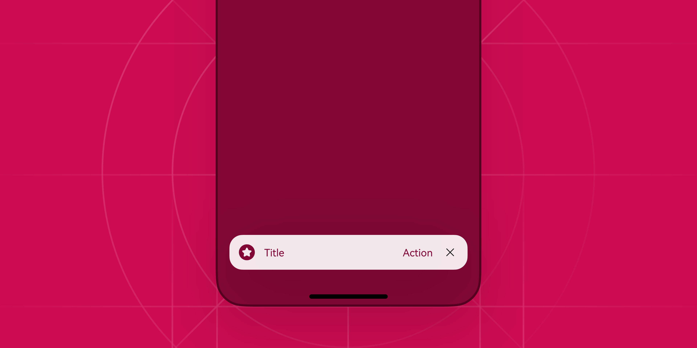
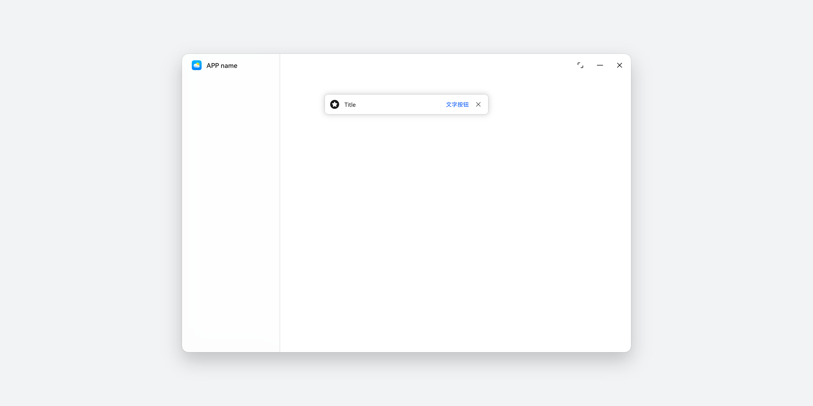
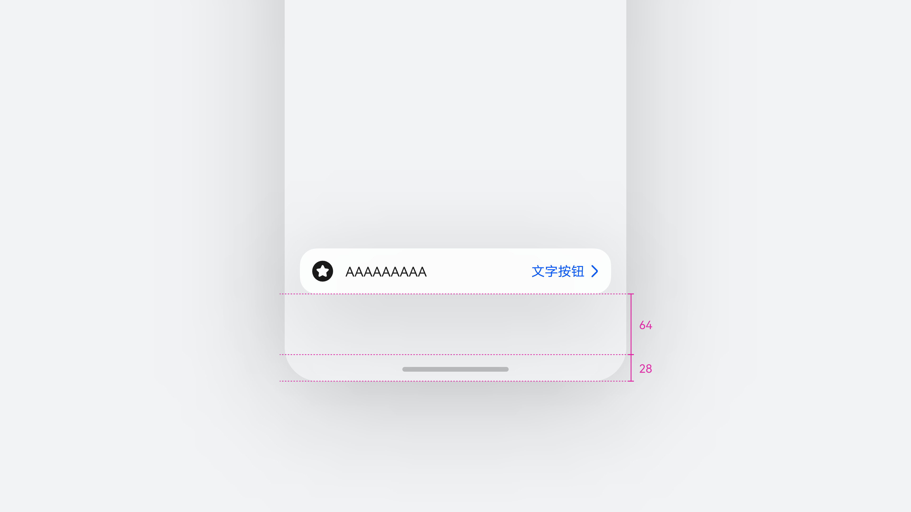
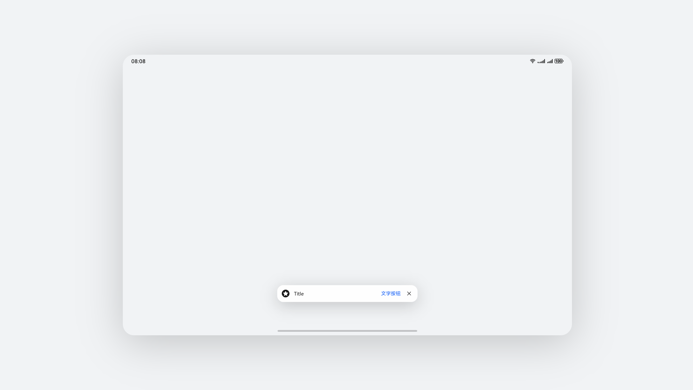

# 即时操作

更新时间：

来源：https://developer.huawei.com/consumer/cn/doc/design-guides/component_snackbar-0000002340726169

即时操作组件位于屏幕底部或固定位置，用于提供操作结果反馈、状态变更提示或轻量级通知。该组件支持自动关闭或手动关闭功能，确保不影响页面其他操作。
 
开发文档请参阅 [HDS SnackBar](https://developer.huawei.com/consumer/cn/doc/harmonyos-references/ui-design-hdssnackbar) 文档。
 

 

##### 如何使用

 
**即时操作是一种轻量的弹出类组件。**用于向用户显示即时信息的同时，提供简单的操作，如“撤销”“重试”。它通常会在屏幕的底部，不随页面滚动，不影响用户对页面的操作。
 

 
**根据配置类型可分为两种模式：定时关闭模式和常驻模式。**定时关闭模式支持配置5~10秒自动消失，为了减少对用户的干扰，应做到滑动屏幕时自动关闭即时操作组件。常驻模式通常用于提示登录、获取权限等对用户操作体验更重要的信息，需要提供关闭按钮。
  
|  |  |
| 定时关闭模式 | 常驻模式 |
 
 
**视觉规则**
 
**视觉效果**
 
**使用材质提升组件的沉浸感。**使用半透明材质能够在保障前景元素可读性的基础上，提升应用的沉浸感体验，避免过于突出的背景颜色影响页面的视觉感受。
 
**采用投影增强组件的空间感****。**即时操作组件以悬浮态存在时，通常使用投影强调信息层级，避免与页面过度融合。
 

 

 
**跟随系统色彩模式**
 
即时操作元素颜色支持系统深浅模式配置，同时前景元素支持配置主题色。
  
| 系统浅色模式 | 系统深色模式 |
 
 
**布局规则**
 
**手机****竖屏**
 
默认情况下，即时操作宽度为基于宽度设备差异适应窗口宽度，最大宽度按照“窗口或屏幕宽度 - 两侧 Margin”来计算，当控件最大拉伸到400vp 宽度时不再跟随放大。
  
| 弹出位置距离底部导航条 92 vp | 存在底部页签的场景建议弹出位置距离底部页签 16 vp |
 
 
**手机横屏**
 

 
手机横屏情况下，宽度默认最大400 vp
 

 
**平板**
 
平板场景下，底部避让高度与手机规则相同，默认宽度最大400vp。
  
| 平板横屏 | 平板竖屏 |
 
 
**电脑****设备**
 
在电脑设备上圆角、投影规格与手机有差异，同时默认会提供一圈描边用于提升识别性。
 

 

##### 开发文档

[HdsSnackBar](https://developer.huawei.com/consumer/cn/doc/harmonyos-references/ui-design-hdssnackbar)
