# 子标题

更新时间：2025-06-20 00:27:40

来源：https://developer.huawei.com/consumer/cn/doc/design-guides/subheader-0000001929816012

用来组织界面内容，根据层级将其划成区块，并概括该区块内容。子标题样式及属性配置信息请参考 SubHeader 文档。

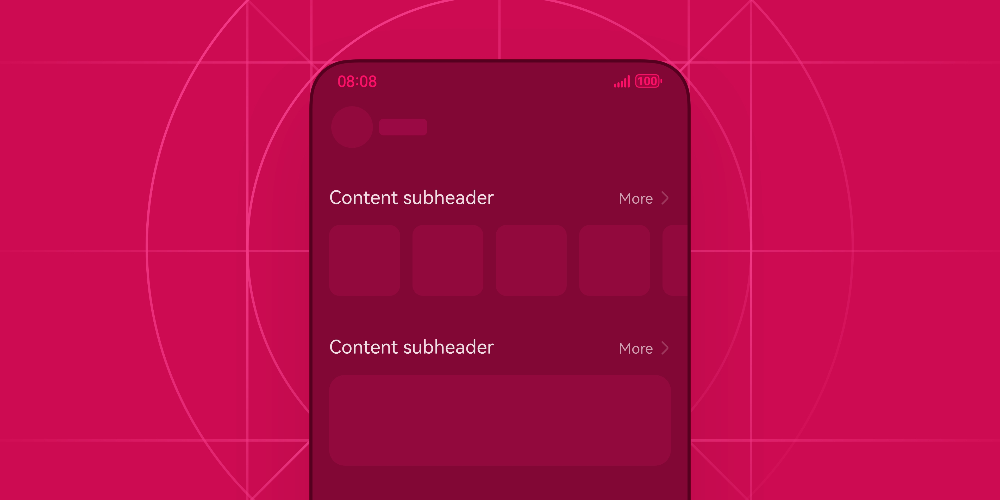

## 如何使用

子标题控件是一种用于显示次级标题或分组标题的文本元素。它通常位于被分组内容的头部，用于对分组内容进行概述并进行更多行为操作。例如：在设置页中对设置选项进行分类。子标题控件也会用于内容型界面，在内容运营界面一般会在子标题右侧提供查看更多的入口选项，方便用户进行页面跳转。

子标题应简洁明了。子标题的内容描述一般不超过 4-5 个字，过长的标题文本会影响界面布局的合理性，也会影响内容阅读的效率。子标题应与主标题有明显的层级区分，可通过字号、颜色、粗细等方式实现。并且，子标题与其下方的内容应有适当的间距，以保证可读性。

合理配置右侧功能选项。当子标题右侧仅有一个操作功能时，建议使用文本按钮；当右侧有两个功能及以上时，可以使用不同样式的图标表示。需要跳转新页面查看更多内容时，使用“ ‘更多’ 文本 + 右箭头”的形式。例如：阅读、音乐的播放列表场景。在一个应用程序的界面中，建议只使用一种类型的子标题，可以有效率提升阅读舒适度，以及用户对界面功能的预期。

类型

子标题分为两种常见类型：列表子标题和内容子标题。这两者的主要区别在于左侧文本的大小、颜色和字重。

列表型子标题为小文本，色彩对比相对较低，多使用于效率型界面，例如设置页，用于对不同功能项进行成组区分并描述分类用意。列表型子标题的定位主要为界面中的点缀项，不应该过于显眼。

内容型子标题多用于界面运营，其特点主要为文本字号更大，字重更粗。当用户阅读时能较明显地感知到其体量感，起到强调内容的作用，适合用于那些需要用户主动关注的业务场景。

| 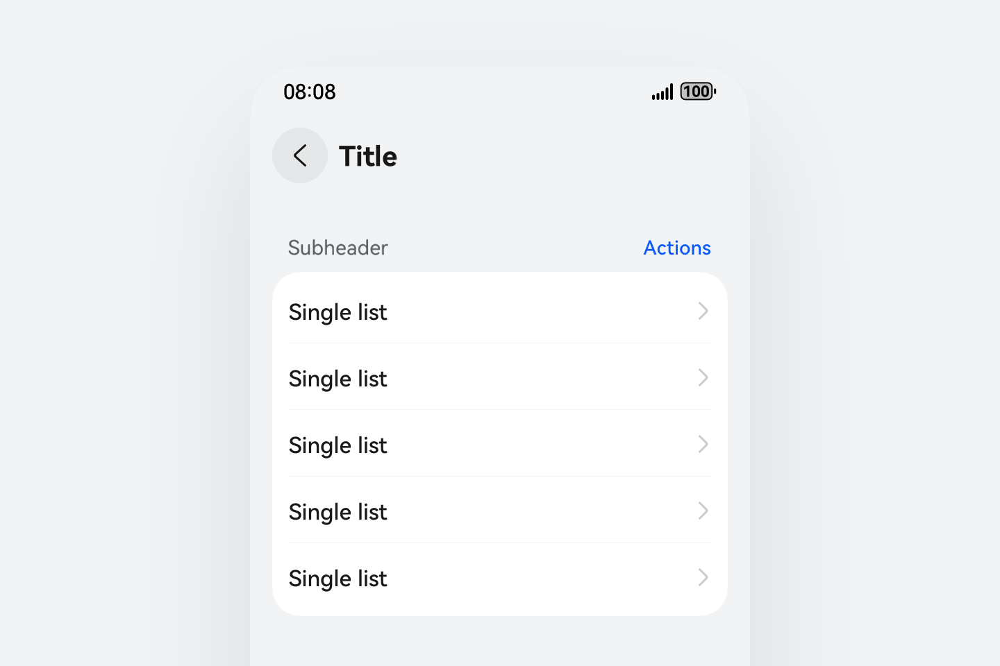 | 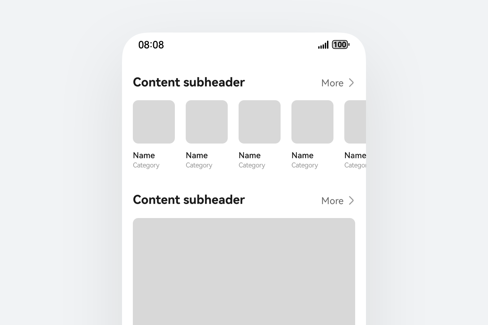 |
| --- | --- |
| 列表子标题示意图 | 内容子标题示意图 |

默认样式

子标题作为组合类组件，分为左侧元素和右侧元素，开发者可以自定义两边元素进行自由混搭。

| 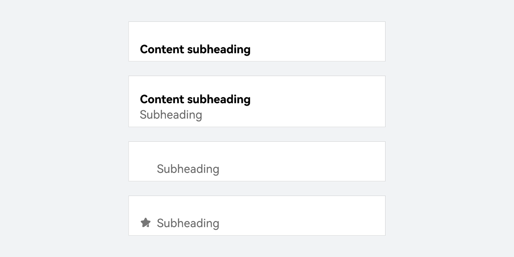 | 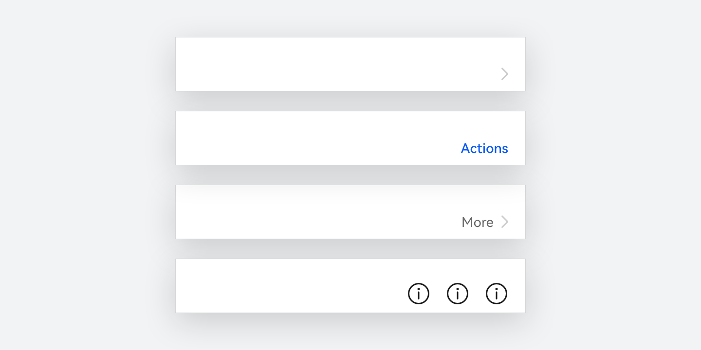 |
| --- | --- |
| 左侧元素 左侧一般为展示文本内容，分为主标题和辅助标题两种，均可单独使用。 | 右侧元素 右侧多为功能性元素，以执行操作行为为主，主要通过点击事件激活对应的跳转和命令执行行为。 |

布局规则

| 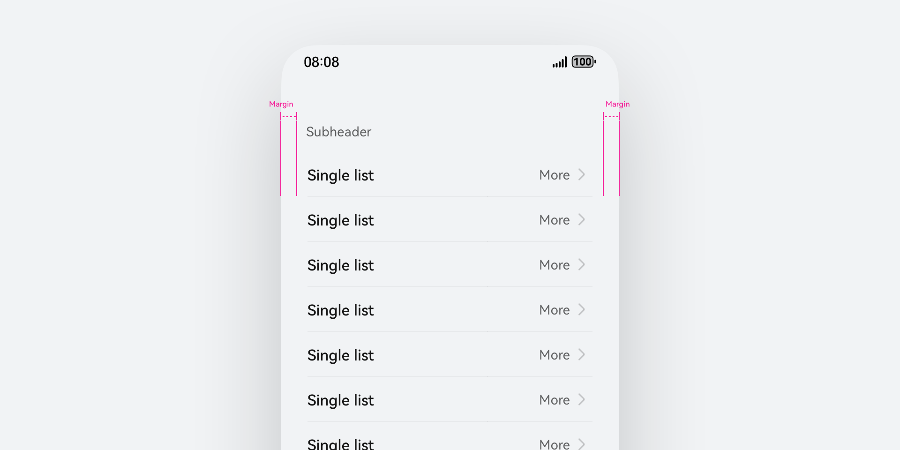 | 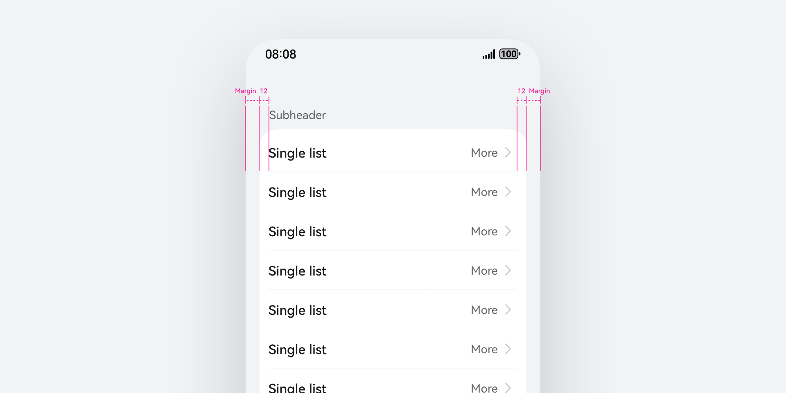 |
| --- | --- |
| 列表子标题默认与文本对齐，可能出现内容直接显示在界面中或出现在卡片组合内。无论哪种出现方式，列表子标题始终与文本保持对齐。 | 在无卡片背板的界面中，子标题默认与文本左右对齐，按照设备默认 margin 进行布局。 |
|    |    |
| 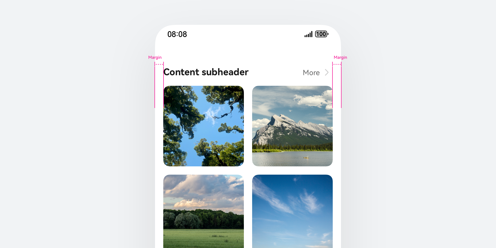 | 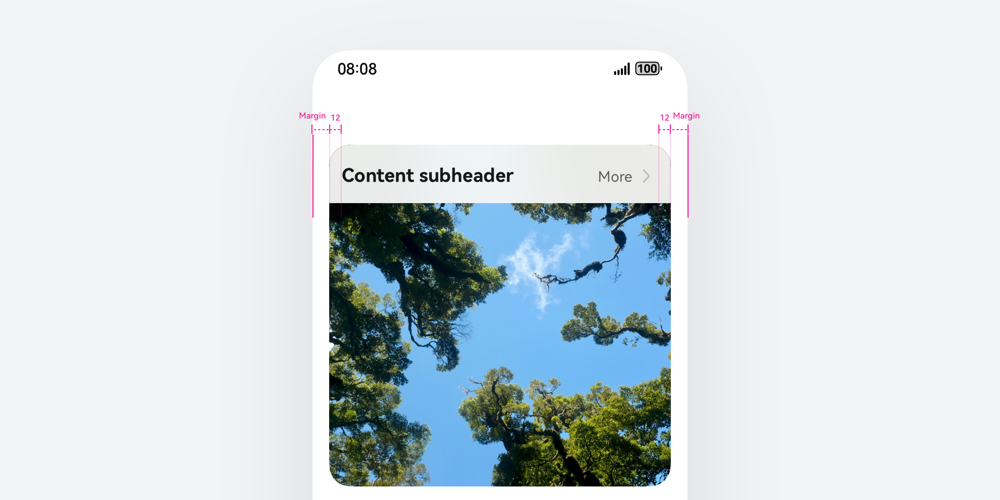 |
| 内容子标题始终与界面宫格、卡片、图片边缘对齐。当内容子标题出现在多个宫格组合上方时，默认与宫格左侧对齐处理。 | 若内容子标题使用在卡片场景内，默认左右预留 12vp 间距。 |

穿戴设备子标题

用来组织界面内容，根据层级将其划成区块，并概括该区块内容。

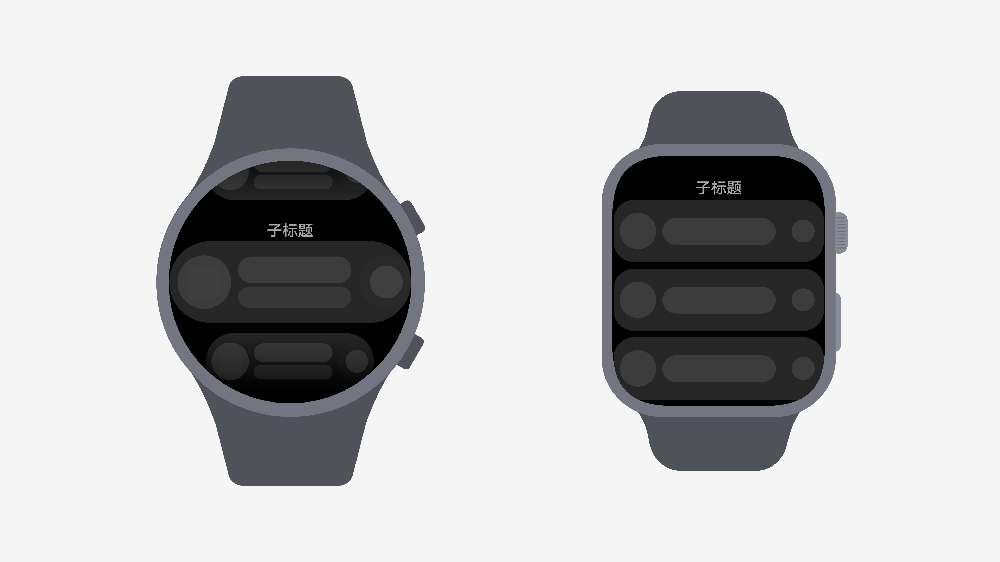

视觉规则

· 文字左右居中对齐，底对齐。

· 文字为15vp。超长文本状态下，先换行（建议最多 3 行），放不下 缩小 3 级；再放不下就截断。

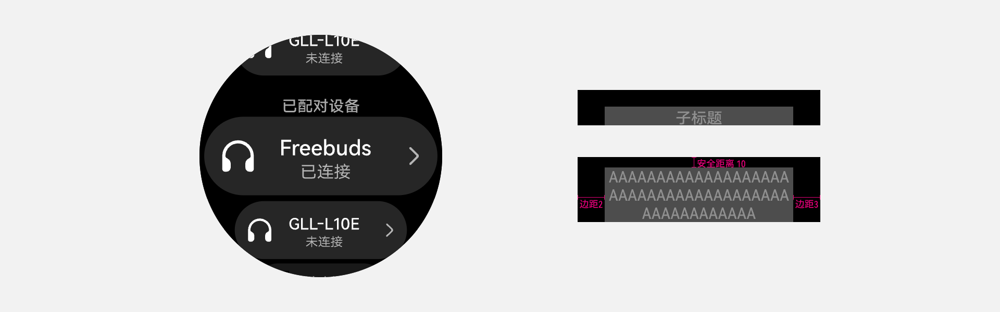

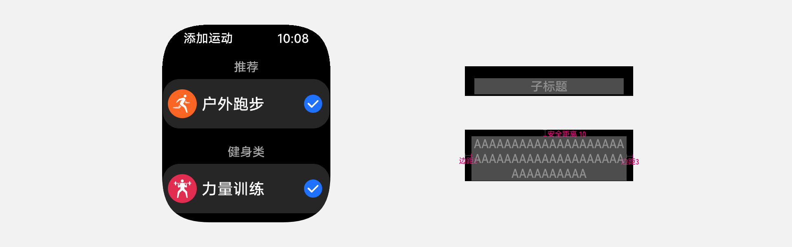

## 开发文档

SubHeader
