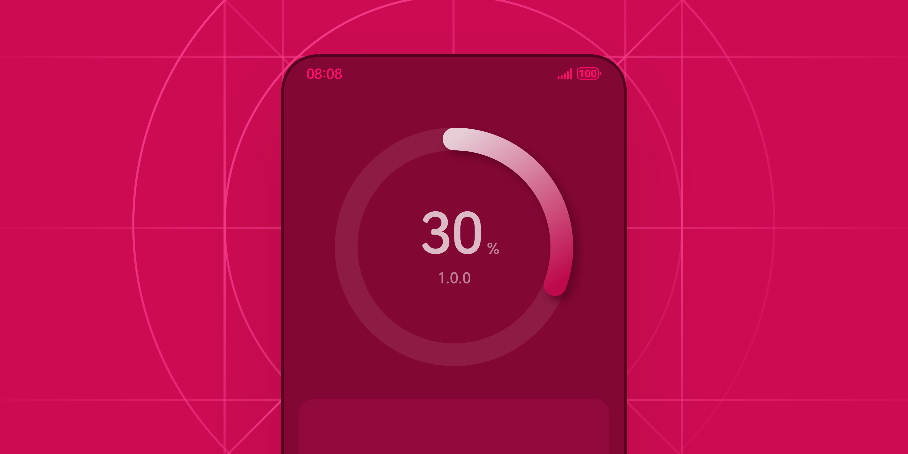
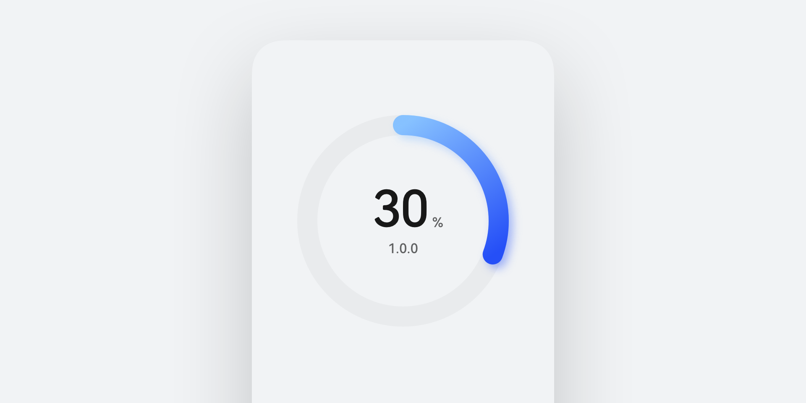
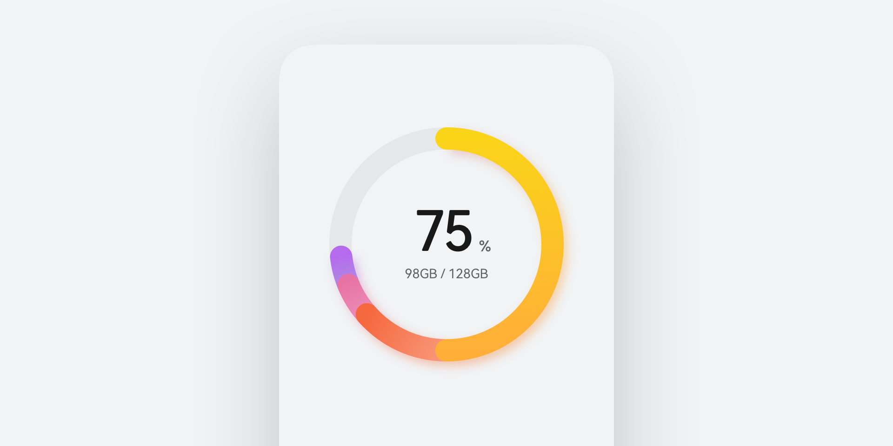

# 数据可视化

更新时间：

来源：https://developer.huawei.com/consumer/cn/doc/design-guides/datapanel-0000001956815481

将传统数据转换成可视化的图形，把隐藏在数据中的信息以更加直观、友好、视觉化的方式直接展现于用户面前，提升用户获取数据信息的效率。环形进度数据开发相关能力请参考 [DataPanel](https://developer.huawei.com/consumer/cn/doc/harmonyos-references/ts-basic-components-datapanel) 文档，图标类数据开发相关能力请参考 [Gauge](https://developer.huawei.com/consumer/cn/doc/harmonyos-references/ts-basic-components-gauge) 文档。
 

 

 

#### 如何使用

**数据可视化类组件主要用于展示应用收集数据的分类处理结果，体现数据整体的参数或各种分类的参数。**例如展示某个指标在一段时间内的变化趋势，如股票走势图、天气温度变化图等。再或者对比不同数据集在同一时间段内的变化情况，如不同产品销量对比图。
 

 
**选择合适的数据展示样式。**针对不同场景下数据结构，有的可能是整体占比，有的可能是多个数据维度，因此，需要针对数据结构的不同选择合适的组件样式。数据组别较多的可以通过多个线形进度条组合，单个数据占比的可优先使用环形。
 

 
**合理使用颜色。**若应用需要展示的数据分类较多，则需要提供多个分类明显的色彩进行展示。数据条控件的颜色应与所展示数据的含义相符，如绿色表示上升，红色表示下降等。或是可自定义一组套系色彩，呈现品牌自己的色彩风格。
 

 
 

#### 类别

目前数据可视化对应的组件样式分为进度形、占比形、范围形和线形四大类。
  
|  |  |  |  |
| 进度形 | 占比形 | 范围形 | 线形 |
 
 
在进行设计时，数据条的线条宽度应与屏幕尺寸相适应，避免过粗或过细。也可以根据数据含义使用渐变色等视觉效果，增强数据可读性和色彩的细腻程度。当存在多条数据线时，应为每条线分配独特的颜色，避免混淆。
  
| 进度类 进度类有两个场景。一种是加载进度类，在数据有无明显进度加载时使用，如获取网络数据时的加载；另一种是实时进度类，在数据有明显进度加载时使用，如安装包的下载。 |  |
|    |    |
| 占比类 占比类适合在有多个数据总和时使用，可突出数据总和后各个数据的占比，从而突出表现各自份额。 |  |
|    |    |
| 范围类 范围类适用于显示一定数值范围内的某个具体数值或实际进度情况。数值环的两侧可分别指示数据范围的最小值和最大值。范围类控件调用 Gauge 组件来实现。 |  |
|    |    |
| 线形数据条 控件默认通过蒙层剪裁的方式对占比数据整体进行剪裁，提供 4vp 小圆角，满足正常场景下的显示。 针对不同高度两侧数据极小时，如上图右侧，均属于正常现象，当开发者修改圆角大小或数据条高度时，两侧数据会被挤压显示控件，数据正常现象，若不可接受可撑高数据条或缩小圆角解决。 |  |
 
 
 

#### 界面布局

为了保证进度类、占比类的数据圈在不同设备进行合理的响应式变化，可以根据短边规则计算出其大小，再根据线性、居中等布局规定其位置。大小和位置是布局下需首要关注的重点。
 

 
**短边计算规则**
 
资源大小按照短边来计算。
 
竖屏上下布局时：将屏幕一分为二后，对比宽 (w) 和高 (h)，数值较小的为短边。
 
横屏左右布局时：左右分别减去 48vp 边距后，在剩余区域内按比例等分，在等分较窄的一边里，对比宽 (w) 和高 (h)，数值较小的为短边。
 

 

 
短边规则可以根据屏幕的面积大小，来提供更为合理的响应式布局。
 
如同为手机竖屏情况下，针对屏幕小的手机会缩小上半部分圈的大小，让下半部分的内容展示出更多。
 

 

 
线性数据条在不同的容器内通过控制展示高度、宽度以及圆角属性，设计出更符合界面布局风格的控件样式。
  
|  |  |  |
| 大卡片或全屏中使用场景 | 小卡片中较高数据条场景 | 小卡片中缩小数据条场景 |
 
 
 

#### 开发文档

[DataPanel](https://developer.huawei.com/consumer/cn/doc/harmonyos-references/ts-basic-components-datapanel)
 
[Gauge](https://developer.huawei.com/consumer/cn/doc/harmonyos-references/ts-basic-components-gauge)
