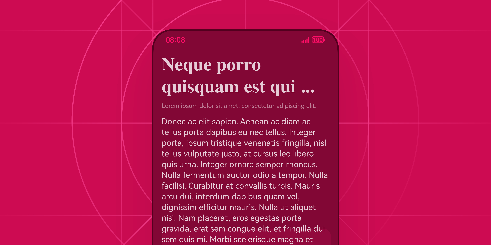
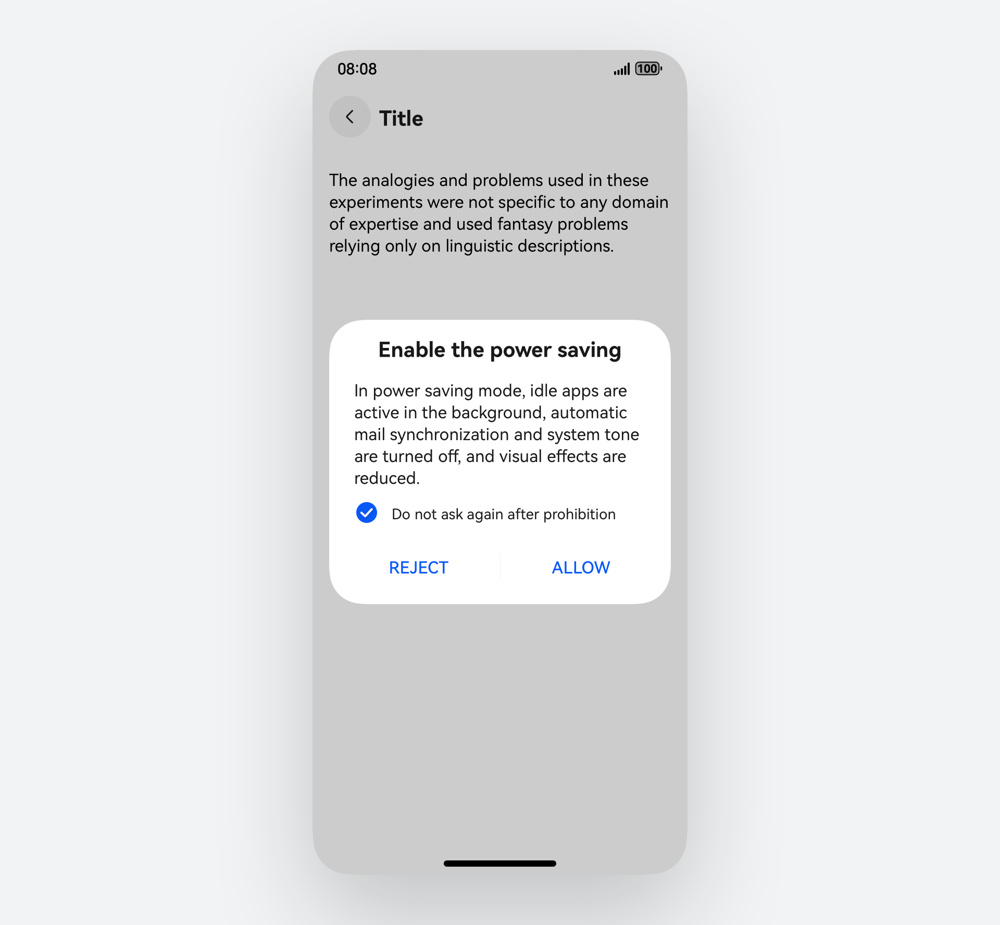
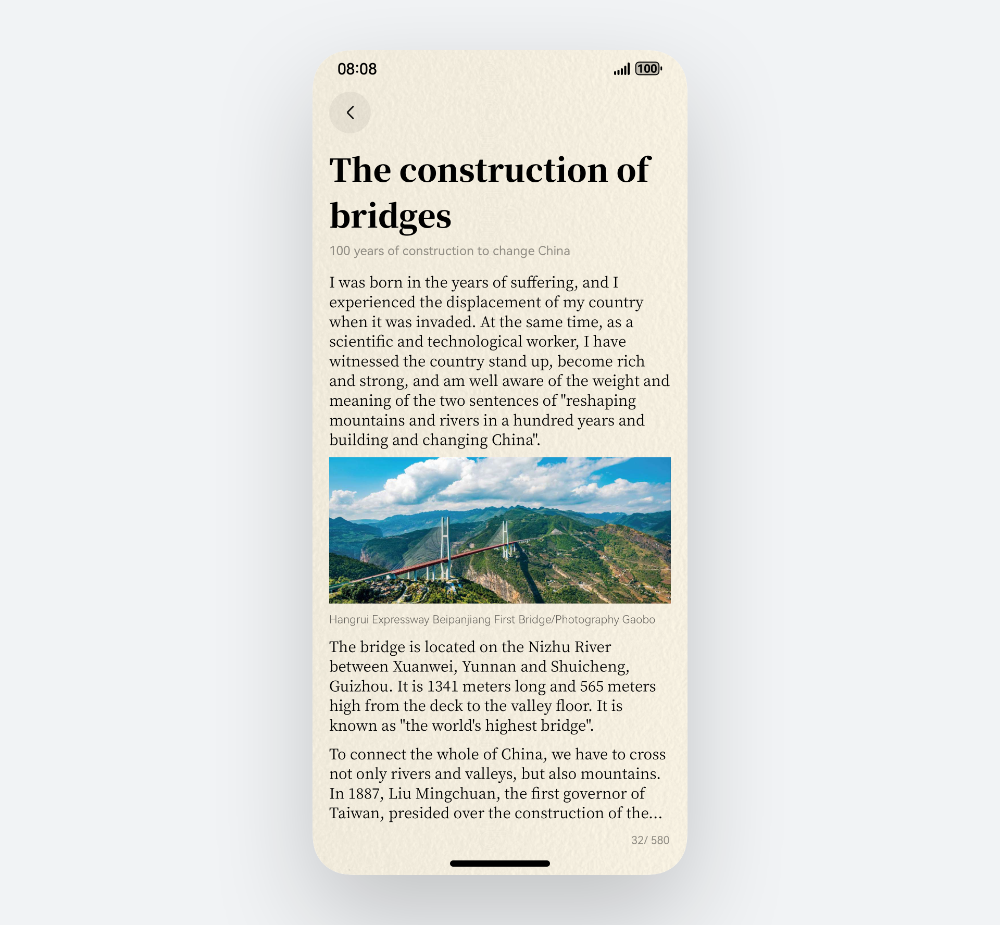
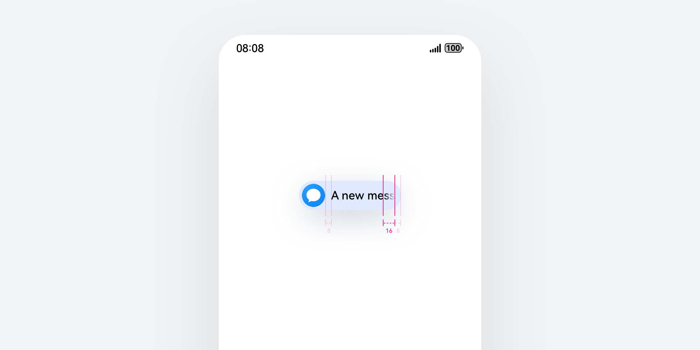
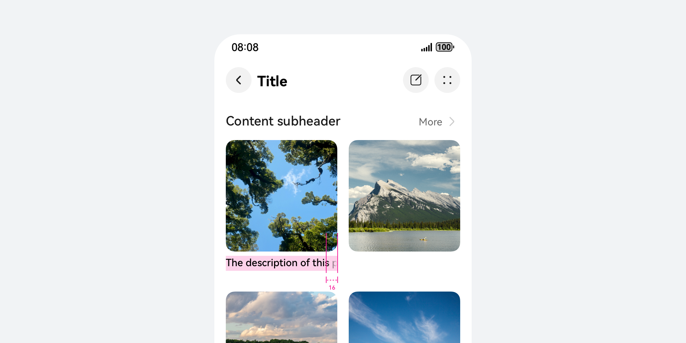

# 文本

更新时间：2025-06-20 00:27:40

来源：https://developer.huawei.com/consumer/cn/doc/design-guides/text-0000001956975261

文本控件用于呈现一段信息，可以任意布局在界面中，并可作为段落文本用于界面功能中。文本基础属性设置参考 Text 文档，富文本规格参考 RichText 文档。

## 如何使用

文本有多种界面对齐方式，分为左对齐，右对齐，居中对齐和两端对齐。请结合文本在本土语言语境下的使用逻辑进行展示，默认文本左对齐。当需要使用文本进行特殊场景设计时，尽量避免多种对齐方式的同时使用导致的阅读困难。同时，开发者可以赋予文本不同字体、字重、颜色、大小等属性，用来表示不同信息层级。一个页面内的文本样式不宜超过 3 种。

文本可以作为大段落场景展示，当文本数量超长或超出了控件容器的可显示区域时，需要提供可滑动能力帮助文本完整展示。文本还提供可动态滚动的能力，可以使用 textOverFlow 接口能力实现，同时支持图片与文本混合布局的跑马灯效果。

如果你需要一个可编辑的文本能力，可以使用 TextArea 控件来进行操作。作为一个提供多行输入文本的组件，当用户输入的文本内容超过组件宽度时会自动换行显示。同时，该组件具备内容自适应高度和宽度的默认属性。

|  |  |
| --- | --- |
| 文本在系统界面中的使用属于基本设计元素，可以调整文本的对齐方式、大小、字重等属性，进行排版布局 | 文本可以通过修饰字体样式、间距等参数，进行多样化的排版设计 |

文本超长滚动规格

在界面设计中若遇到文本显示不下的场景，通常我们会对文本进行换行或省略处理。但在某些场景下，文本完整显示属于基本要求，这时可以使用 textOverFlow 属性对文本进行滚动处理。文本滚动属于动态处理行为，可能涉及到功耗增加等问题，开发者可以对滚动次数进行限制。例如：每次激活仅滚动一次，当界面重新进入、加载时再次触发文本滚动。

|  |  |
| --- | --- |
| 文本超长需要滚动时不可换行，渐隐区域从文本消失位置算起向前扩展 16vp，透明度从 0% 到 100% 进行渐变 | 不同界面布局中可能存在不同对齐方式，但文本渐隐始终计算文本区域，文本以外的 Margin、Padding 等间距均不计入渐隐范围 |

## 开发文档

Text

RichText

TextArea

TextInput

TextClock
