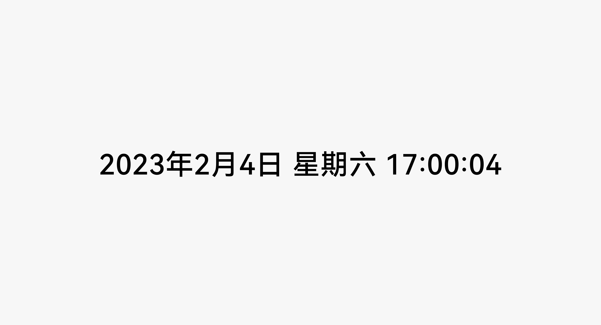

# 文本时钟

更新时间：2026-03-11 06:16:00

来源：https://developer.huawei.com/consumer/cn/doc/design-guides/textclock-0000001929656652

通过文本形式显示当前日期或时间，支持 12 小时制或 24 小时制的日期或时间显示。相关开发能力可参考 [TextClock](https://developer.huawei.com/consumer/cn/doc/harmonyos-references/ts-basic-components-textclock) 文档。
 

 

 

##### 如何使用

以字符串格式实时显示当前的日期或时间。
 

 
**默认样式**
 
日期 (年月日星期) 与时间 (时分秒) 支持多种子样式拼装组合
  
|  |  |
| 24 小时制 | 12 小时制 |
 
 
**日期格式**
 
日期格式默认提供以下子样式供使用
  
| 默认样式 | 格式 | 效果 |
| 样式一 | yyyy 年 M 月 d 日 EEEE | 2023 年 2 月 4 日 星期六 |
| 样式二 | yyyy 年 M 月 d 日 | 2023 年 2 月 4 日 |
| 样式三 | M 月 d 日 EEEE | 2 月 4 日 星期六 |
| 样式四 | M 月 d 日 | 2 月 4 日 |
 
 
年、月、日支持简写或全写两种方式，星期默认应使用完整星期 (例如：星期六)，显示空间不足时才考虑使用简写星期 (例如：周六)。
  
|    | 格式 | 效果 |
| 年 | yyyy (完整年份) | 2023 年 |
|    | yy (年份后两位) | 23 年 |
| 月 | MM (完整月份) | 02 月 |
|    | M (月份) | 2 月 |
| 日 | dd (完整日期) | 04 日 |
|    | d (日期) | 4 日 |
| 星期 | EEEE (完整星期) | 星期六 |
|    | E、EE、EEE (简写星期) | 周六 |
 
 
**自定义日期格式**
 
除默认样式外，也允许开发者自行拼接组合显示格式，即：年、月、日、星期可拆分为子元素，开发者可自行排布组合 (下表样式仅作示例，不作为默认样式提供)
  
| 自定义样式 | 格式 | 效果 |
| 示例一 | MM/dd/yyyy | 02/04/2023 |
| 示例二 | EEEE MM 月 dd 日 | 星期六 02 月 04 日 |
 
 
日期间隔符提供以下几种格式供选择
 
* 除以上间隔符样式外，也允许开发者自定义间隔符样式。例如：自定义间隔符为“，” 则显示为 2023，2，4
  
| 间隔符 | 格式 | 效果 |
| 年月日 | yyyy 年 M 月 d 日 | 2023 年 2 月 4 日 |
| / | yyyy/M/d | 2023/2/4 |
| - | yyyy-M-d | 2023-2-4 |
| . | yyyy.M.d | 2023.2.4 |
 
 
**时间格式**
 
时间格式支持 24 小时制或 12 小时制两种显示方式，默认提供以下子样式供使用
 
* 格式说明
 
- H：小时 (0~23) h：小时 (1~12)
- m：分钟
- s：秒
- SSS：毫秒
- a：上午/下午 (仅在 12 小时制中有效)

  
| 默认样式 | 时制 | 格式 | 效果 |
| 样式一 | 24 小时制 | HH:mm:ss (时:分:秒) | 17:00:04 |
|    | 12 小时制 | aa hh:mm:ss (时:分:秒) | 上午 5:00:04 |
|    |    | hh:mm:ss (时:分:秒) | 5:00:04 |
| 样式二 | 24 小时制 | HH:mm (时:分) | 17:00 |
|    | 12 小时制 | aa hh:mm (时:分) | 上午 5:00 |
|    |    | hh:mm (时:分) | 5:00 |
| 样式三 | / | mm:ss (分:秒) | 00:04 |
| 样式四 | / | mm:ss.SS (分:秒:厘秒) | 00:04.91 |
| 样式五 | / | mm:ss.SSS (分:秒.毫秒) | 00:04.536 |
 
 
**自定义时间格式**
 
除默认样式外，也允许开发者自行拼接组合显示格式，即：时、分、秒、毫秒可拆分为子元素，开发者可自行调整顺序或设定显示格式。
  
| 自定义样式 | 格式 | 效果 |
| 示例一：上/下午放在时间后 | hh:mm:ss aa | 5:00:04 上午 |
| 示例二：只显示小时数 | HH | 17 |
 
 
**属性**
 
- 可配置时制 (12 小时制/24 小时制)
- 可配置时区
- 可配置文本大小、字重、颜色、样式 (继承 Text 的属性)
- 可配置文本时钟的背景颜色

  
|  |  |  |
| 浅色模式 | 深色模式 | 沉浸式模式 |
 
 
 

##### 开发文档

[TextClock](https://developer.huawei.com/consumer/cn/doc/harmonyos-references/ts-basic-components-textclock)
