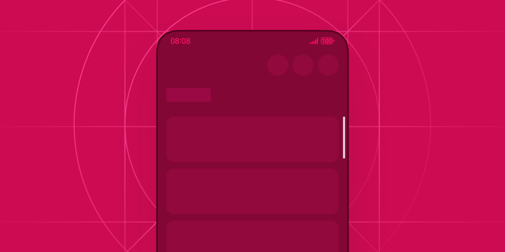
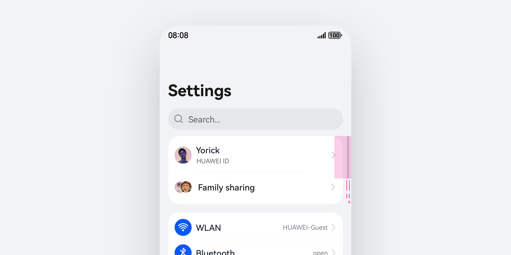
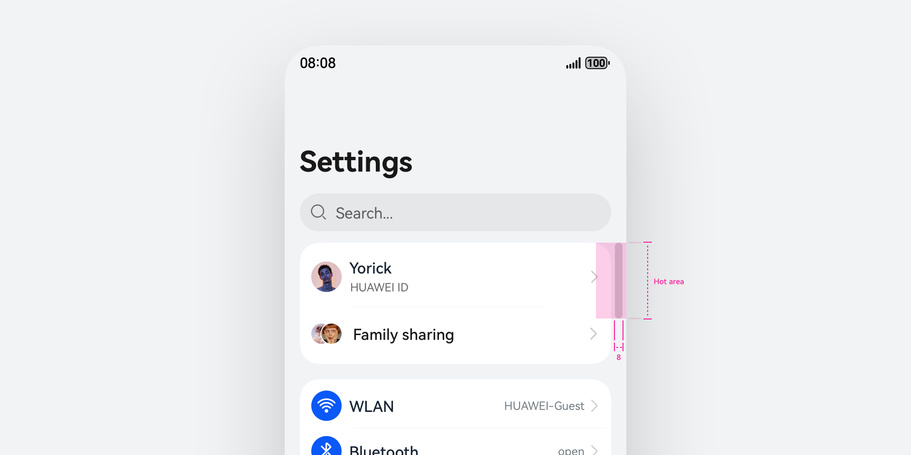
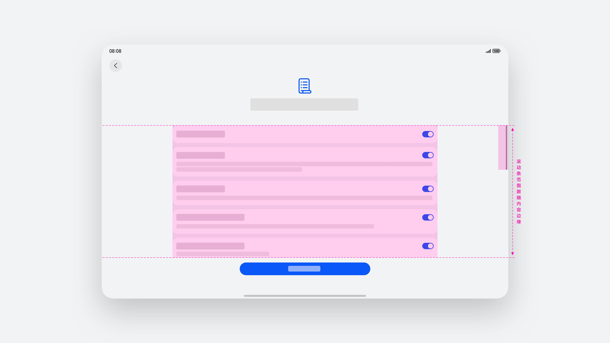
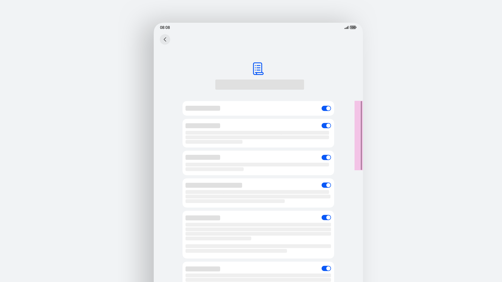
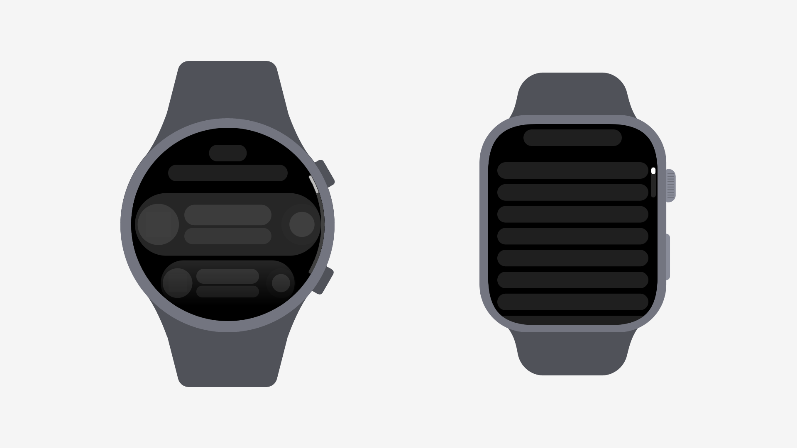
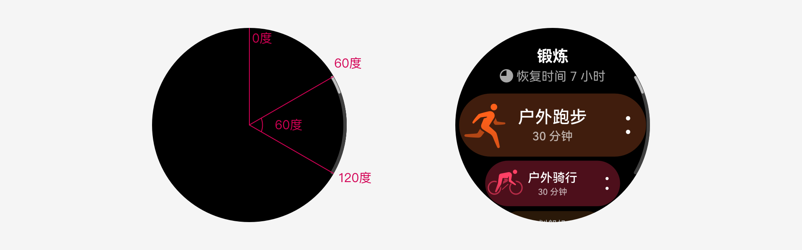
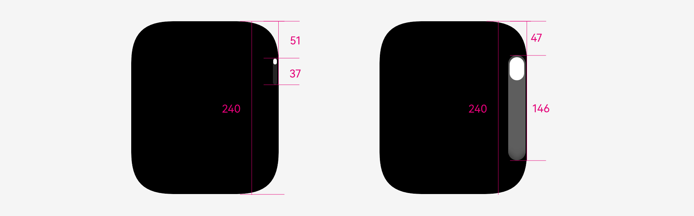

# 滚动条

更新时间：2025-06-20 00:27:40

来源：https://developer.huawei.com/consumer/cn/doc/design-guides/scrollbar-0000001956815473

滚动条控件用于显示当前界面视图所在位置，并提供滚动视图时动态展示位置变化进度的功能。滚动条通常出现在内容区域大于实际可视区域时，允许用户垂直或水平滚动查看其余内容的场景。开发能力相关请参考 ScrollBar 文档。

## 如何使用

滚动条的显示需要给予用户明确预期。当用户初次进入界面/弹框/可滚动界面，若界面内容超出显示区域，显示滚动条，无任何操作，2 秒后消失。滚动条高度为动态高度：滚动条高度反映当前可视内容占整个内容的高度比例，高度是动态变化的，内容高度越高，滚动条高度越小。

当页面内容超出内容显示区域长度时，会显示竖向/横向的滚动条。若用户需快速定位内容，可拖拽滚动条；在电脑设备上可点击滚动条空白区域进行快速跳转。

在电脑设备上存在两种滚动条的展示规则。在默认规格中，初次进入界面时出现滚动条，无操作 2 秒后滚动条消失。滚动鼠标滚轮或双指滑动触控板时，滚动条出现，无操作 2 秒后滚动条消失。另外一种则是常驻于界面中，始终保持显示。

根据应用使用场景，使用合适的滚动条样式。可以通过 ScrollBarOptions 中的 direction 属性配置滚动条组件的滚动方向，可以配合横向界面较多的业务场景来使用。

## 布局规则

手机

| 操作/操作对象 | 滚动条 |
| --- | --- |
| 点击 | 显示 Press 效果 |
| 悬浮 | 显示 Hover 效果 |
| 滑动 | 内容区滑动 |
| 拖拽 | 上下/左右拖拽滚动条，内容区滑动 |

滚动条热区大小规则

在触屏交互场景，滚动条的点击热区扩大至 32vp，以便提升交互的准确性。

|  |  |
| --- | --- |
| 未激活 高度随内容自动计算，最小高度 48vp | 激活 热区：32vp 宽，高度自动变化滚动条 |

当滚动条使用在较宽界面场景时，避免滚动条的展示位置在界面中过于孤立，通常布局在屏幕边缘的右侧。同理，如果在分栏或者分屏场景内，也采用同样的展示规则。

|  |  |
| --- | --- |
| 滚动条上端与内容上边缘对齐 ，滚动范围在内容边缘内。 | 滚动条宽度：4vp，距离屏幕/窗口边缘 4vp。 |

电脑设备

键鼠操作

| 交互输入 | 操作 | 反馈 |
| --- | --- | --- |
| 键盘 | 方向键上 | 页面向上滑动 |
|    | 方向键下 | 页面向下滑动 |
| 鼠标 | 左键悬浮 | 显示 Hover 效果 |
|    | 左键拖拽 | 控制页面滑动方向 |
|    | 左键点击滚动条空白区 | 控制页面 |
|    | 左键长按滚动条空白区 | 控制页面 |
|    | 滚轮上滑 | 页面向上滑动 |
|    | 滚轮下滑 | 页面向下滑动 |
| 触控板 | 双指上滑 | 页面向上滑动 |
|    | 双指下滑 | 页面向下滑动 |

当显示规则为【常驻显示】时，支持光标点击交互：

- 当光标移入滚动条区域，点击空白区时，触发一次页面滑动，内容区滚动一屏；
- 当光标停留在空白区某一点长按时，每 100ms 激活一次页面滚动，内容区持续滑动至点击位置。

智能穿戴滚动条

一般位于界面右侧，随页面滚动显示当前所处的位置。当前根据智能穿戴各设备硬件差异，滚动条样式也会有所区分

如何使用

· 初次进入界面/弹框/可滚动界面，若界面内容超出显示区域，显示竖向滚动条，无任何操作，2 秒后消失。

· 滚动条高度为动态高度：滚动条长度反映当前可视内容占整个内容的高度比例，高度是动态变化的，内容高度越长，滚动条高度越短。

滚动条显示规则

高度随内容自动计算。

## 开发文档

ScrollBar
