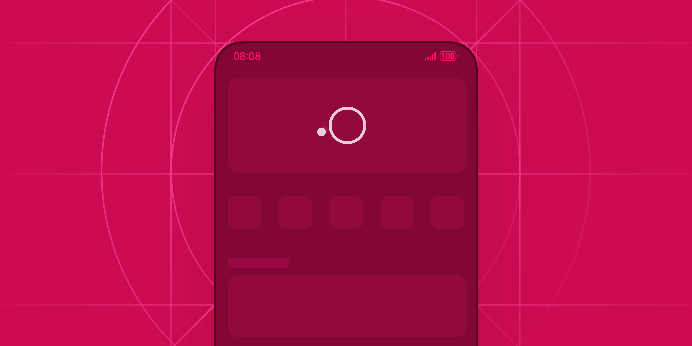
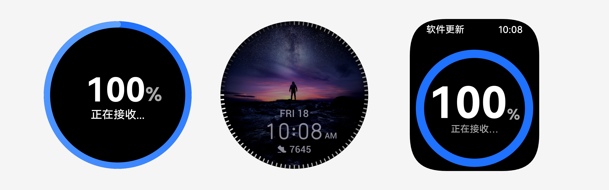
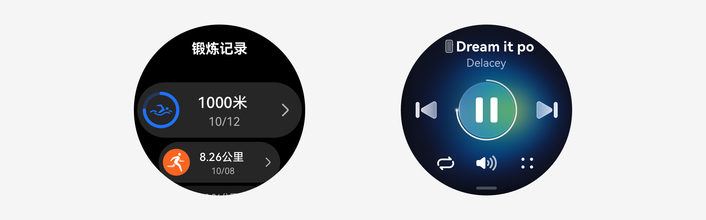
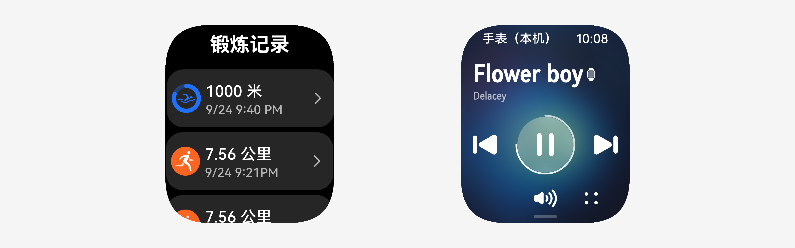
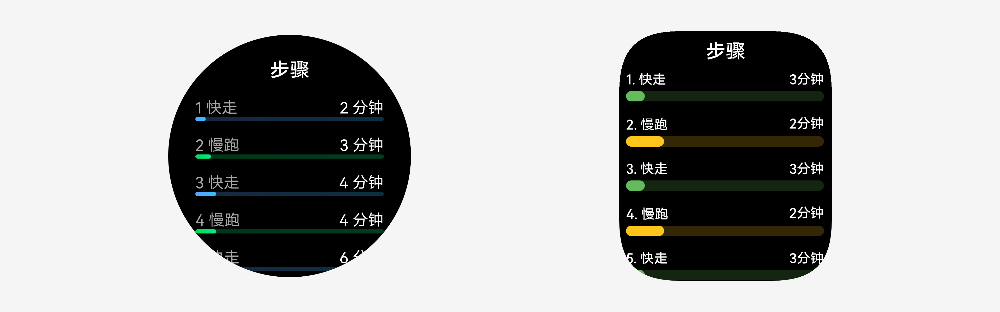

# 进度条

更新时间：2025-11-20 08:36:54

来源：https://developer.huawei.com/consumer/cn/doc/design-guides/progress-0000001929656644

进度条是一种常见的移动端的进度控制类控件，用于在界面中告知用户 App 在载入内容或执行长时间操作时未卡死。无明确进度条 (HarmonyOS 特征动效) 请参考 LoadingProgress 文档，有明确进度条参照 Progress 文档。

## 如何使用

仅在有内容需要加载或用户需要等待时才使用。根据业务使用场景展示进度过程，例如加载数据或内容时（网页加载、视频缓冲等）。除内容加载以外，还包括上传或下载文件、安装或更新应用程序时，以及处理耗时较长的任务时（数据处理、文件传输等）。

合理使用进度样式。进度条应该清晰地反映当前操作的进度状态，让用户了解剩余时间。对于已知总量的操作，进度条应显示准确的完成百分比。对于未知总量的操作，应使用无限循环的动画进度条。进度条应紧跟操作，实时更新进度。

给出明确的视觉反馈。需要明确区分加载进度的整体进度和实时进度两种色彩，过于相近的颜色会误导用户无法判断当前的进展。可以结合应用自身品牌色，确保应用的视觉风格整体一致。

有明确进度。处理有明确进度的数据信息时，使用有具体完成状态的进度条样式，例如线性进度条和圆形进度条。可以在 ProgressStyle 中查询到全部分类的对应描述。

有明确进度在实际使用时需要搭配界面内容信息。由于进度状态可以查询，开发者可通过搭配具体的数据进展，进一步提升用户的阅读效率。

| 线性进度条数据加载动效，对应 linear Style | 如果实际进度小于 400ms 完成，实际表现要用 400ms 的线性进度条动画。 |
| --- | --- |
|    |    |
| 胶囊形进度条数据加载动效，对应 Capsule Style头尾两端处，进度条展示由弧形变成直线和直线变成弧形的过程。中段处，进度条正常往右走的过程。 | 圆形进度条数据加载动效，对应 Eclipse Style |

## 设备差异

### 穿戴设备

智能穿戴进度条

- 圆形进度条主要是通过文本说明当前操作，根据使用场景及执行任务的不同调整信息布局。
- 线性进度条相对圆形进度多样的布局方式，主要采用“上方文本+下方线形进度指示”形式。

圆形进度条：实时性进度显示。

圆形进度条：记录型进度显示。

直线进度条：记录型进度显示。

无明确进度

无明确进度一般用于全页面加载状态或数据连接时状态，这类场景都属于无法明确给出结束时间，用户等待时间可能较长。可以通过提供明确的文本信息，起到安抚用户的作用，或提供其他功能选项，明确解释等待时间较长的原因。无明确进度可以参考 LoadingProgress 文档使用。

| 用于组件组合场景 | 用于全页面加载场景 |
| --- | --- |

## 开发文档

Progress

LoadingProgress
