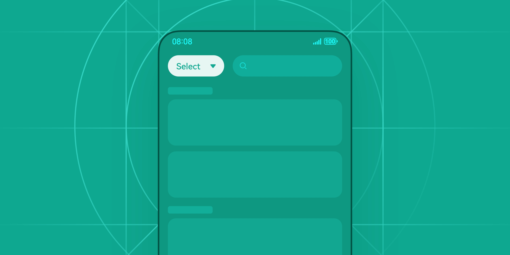
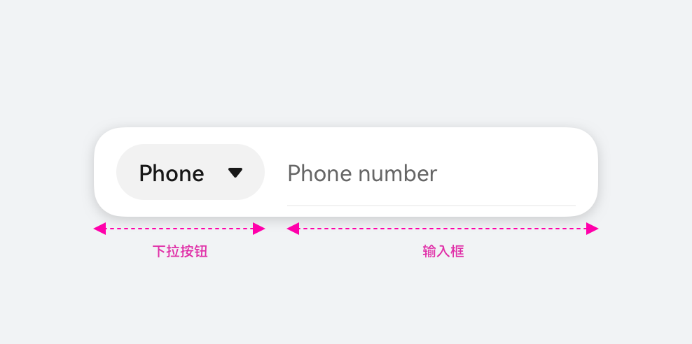
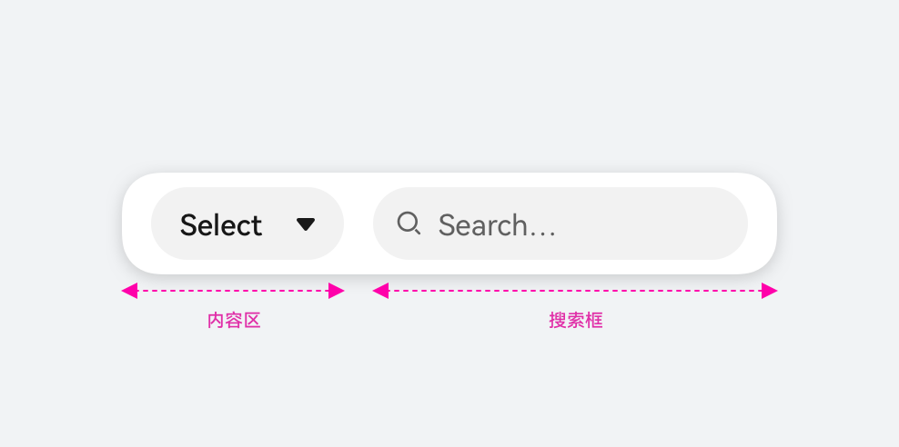
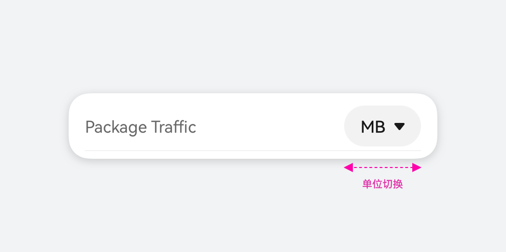

# 下拉按钮

更新时间：

来源：https://developer.huawei.com/consumer/cn/doc/design-guides/select-0000001957001873

下拉按钮可让用户在多个选项之间选择。开发相关描述请参考 [Select](https://developer.huawei.com/consumer/cn/doc/harmonyos-references/ts-basic-components-select) 文档。
 

 

##### 如何使用

 
需过滤当前界面内容、快速切换类型 (如存储位置) ，或选项内容 (如设置密保问题) 时，使用下拉按钮。
 

 
**下拉按钮和输入框**
 

 

 
**下拉按钮和搜索框**
 

 

 
**单位切换**
 

 

 

##### 视觉样式

**手机**
  
|  |  |
| Large Size | Small Size |
 
 
**电脑设备**
  
|  |  |
| Large Size | Small Size |
 
 
**下拉菜单**
  
|  |  |
| 菜单使用通用 Menu 组件进行组合 选中状态使用勾选图标进行标记，菜单默认与下拉按钮左侧对齐，保持 8vp 间距 | 当下拉按钮与菜单保持宽度一致时，菜单继承下拉按钮宽度，下拉按钮内的文本和下拉箭头保持两侧对齐适配 |
 
 
 

##### 开发文档

[Select](https://developer.huawei.com/consumer/cn/doc/harmonyos-references/ts-basic-components-select)
