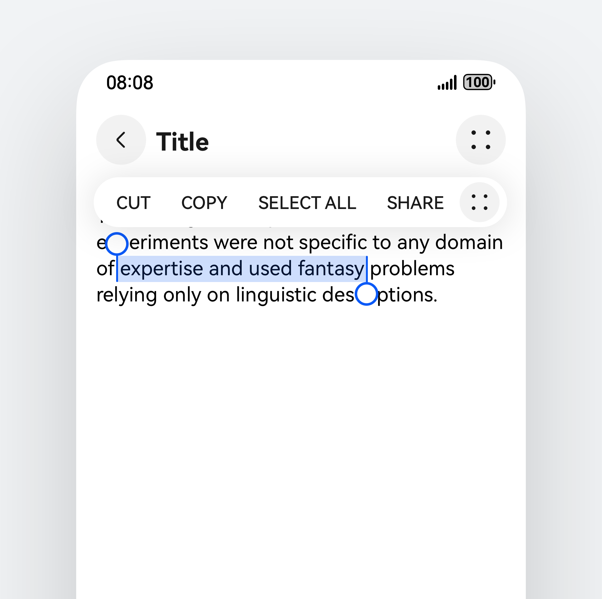
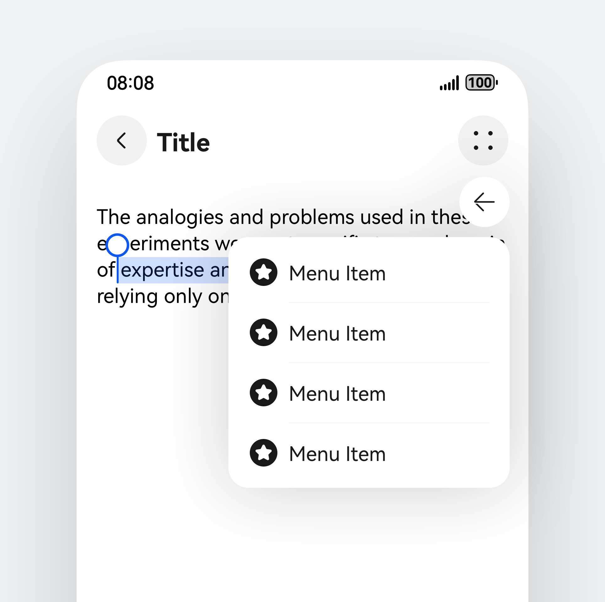
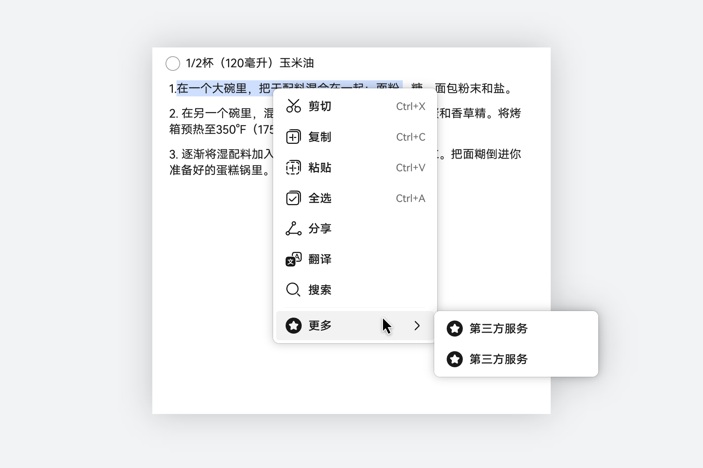
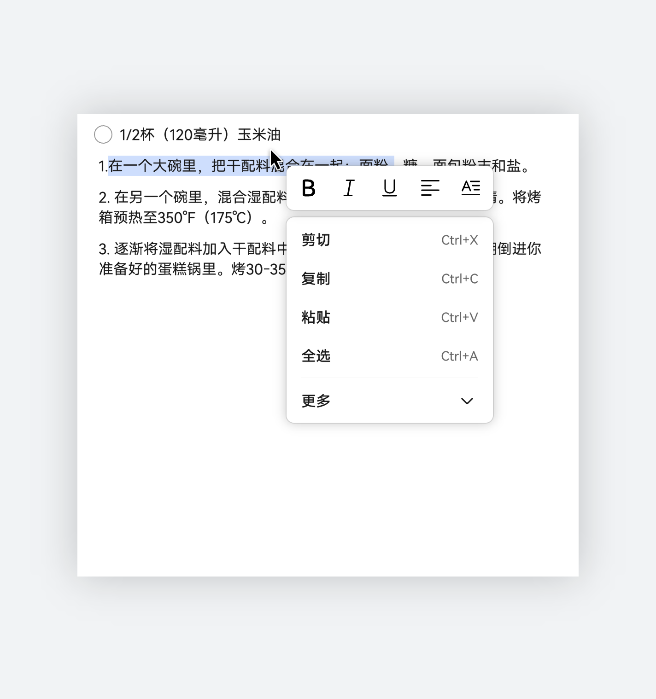
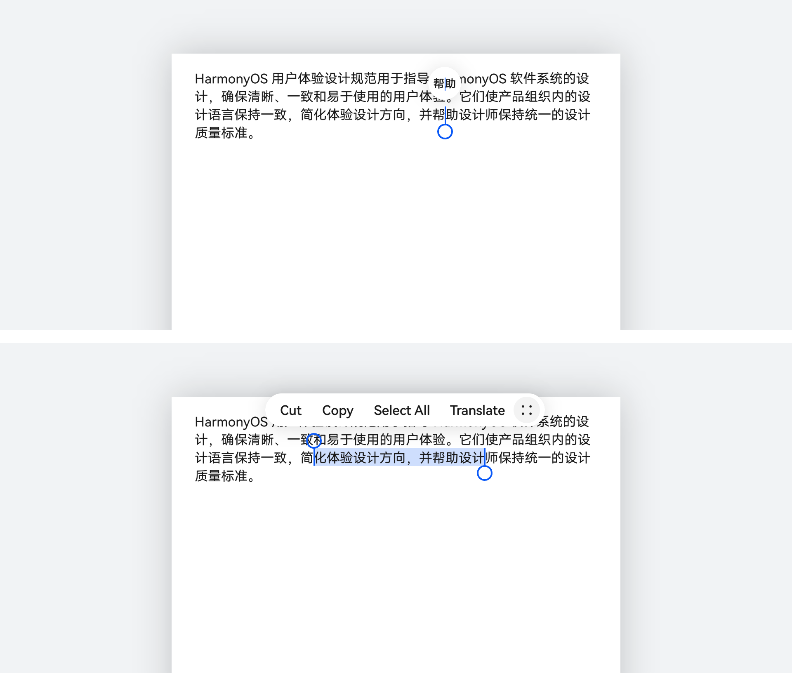
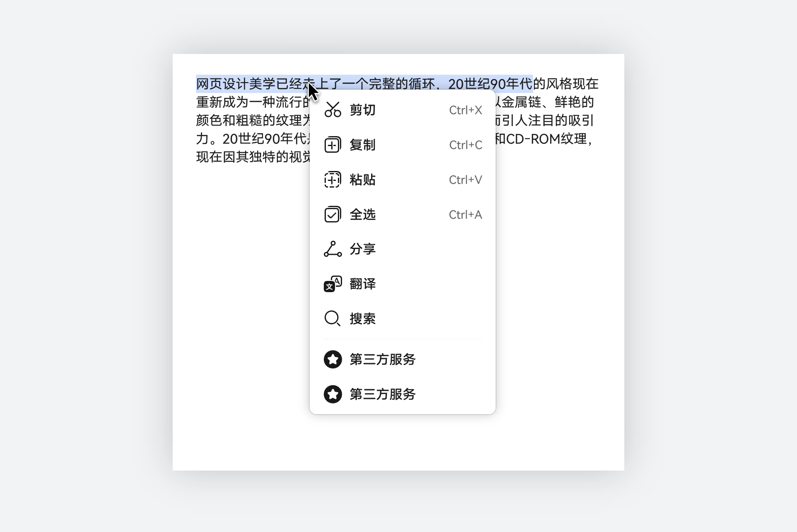

# 文本选择菜单

更新时间：2025-06-20 00:27:40

来源：https://developer.huawei.com/consumer/cn/doc/design-guides/textselection-0000001956842049

选中的文本以高亮的文字块呈现，通过手柄来调整文本的选择范围。操作菜单置于文本之上。开发相关描述请参考 bindSelectionMenu和  SelectionMenu 文档。

## 如何使用

文本编辑时，需支持文本选择工具。例如信息、邮件、备忘录、浏览器等页面。

文本选择具备插件机制，可扩展功能。例如：安装了翻译软件，可动态增加选词翻译功能；安装了搜索软件，可动态增加搜索功能。

菜单主要功能：剪切，复制，粘贴和更多。选择“更多”时，变成二级菜单，显示更多操作。

菜单上的功能操作顺序：剪切，复制，粘贴，全选，翻译，分享，搜索，其他操作。文本选择强相关功能：“剪切”，“复制”，“粘贴”，“全选”，不放入“更多”中。

菜单上三方应用提供的操作，全部放到“更多”中。

## 视觉规格

手机

|  |  |
| --- | --- |
| 文本选择菜单 | 点击”更多“图标出现二级菜单 |

电脑设备

|  |  |
| --- | --- |
| 文本二级菜单 | 带字体编辑的文本选择 |

设备差异

|  |  |
| --- | --- |
| 触控操作 | 鼠标操作 |

| 特性 | 手机 | 电脑设备 |
| --- | --- | --- |
| 样式 | 文本有手柄 菜单横向显示 | 文本无手柄 菜单上下文菜单显示 |
| 翻译、搜索等扩展功能 | “更多”里 | 二级菜单 |
| 可配置项 | 翻译、扩展等功能 | 除翻译、扩展等功能外，还支持可配置项，具体见“菜单” |
| 交互 | 点击 | 见“菜单”控件 |

## 开发文档

SelectionMenu

bindSelectionMenu
