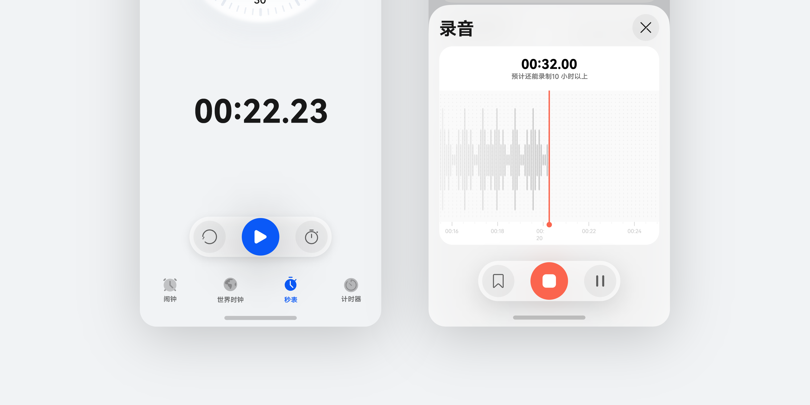
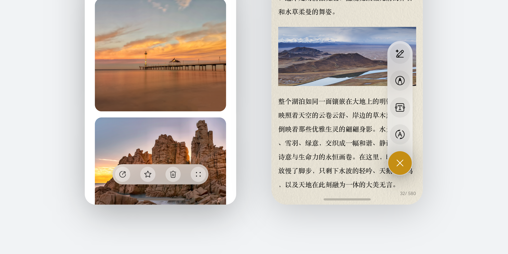
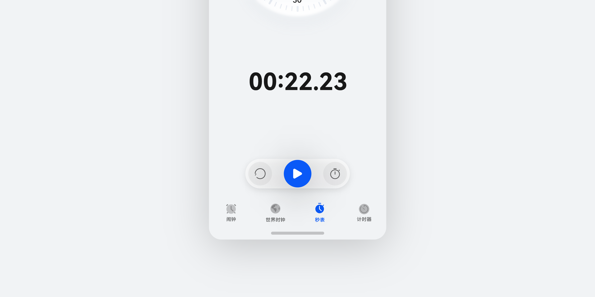
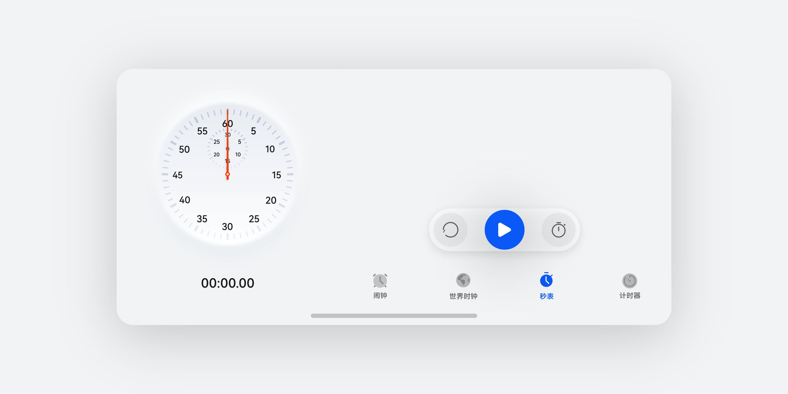
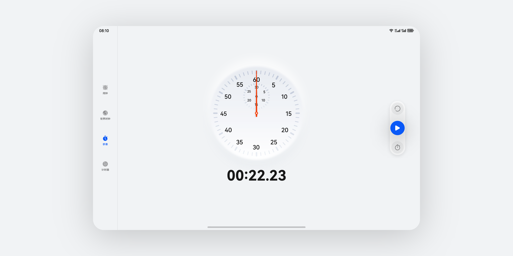
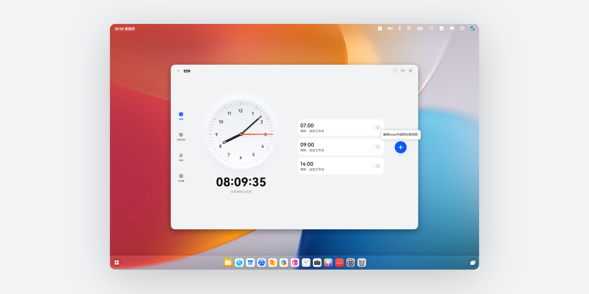

# 核心操作栏

更新时间：

来源：https://developer.huawei.com/consumer/cn/doc/design-guides/component_actionbar-0000002306891560

核心操作栏悬浮在页面下方，是用于承载核心操作和功能的系统组件。开发信息请参阅 [HDS Action Bar](https://developer.huawei.com/consumer/cn/doc/harmonyos-references/ui-design-hdsactionbar) 文档。
 

 

##### 如何使用

 
**操作栏用于承载当前页面的核心操作。**一般悬浮于页面底部，根据用户操作和页面状态变化配置多个核心操作，从而提供配合用户当前行为的功能，提升核心操作的便捷性。
 

 
**扩展能力支持更多场景应用的可能性。**操作栏支持修改图标按钮大小、去掉主按钮、侧边布局，自定义能力使操作栏能够拓展实现更多体验。
 

 
**材质和投影提升页面沉浸感受。**组件背板默认带有模糊材质和投影，能够提高该组件的悬浮感和可识别性。
 

 

 

 

 

 
**多设备场景**
 
采用默认操作栏进行多设备场景布局时，根据页面场景进行布局选择，推荐使用以下布局规则。
 
**手机****竖屏**
 

 

 
**手机横屏**
 

 

 
**Pad**
 

 

 
**电脑设备**
 
键鼠交互模式下，鼠标停留在操作按钮上，呼出 Tips 说明操作名称。
 

 

##### 开发文档

[HdsActionBar](https://developer.huawei.com/consumer/cn/doc/harmonyos-references/ui-design-hdsactionbar)
