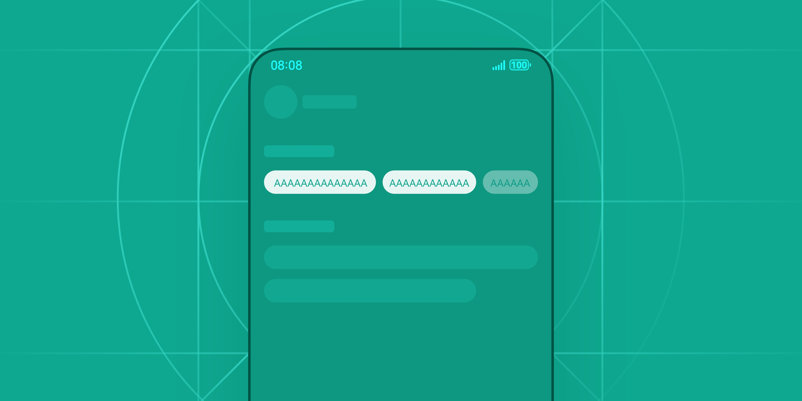
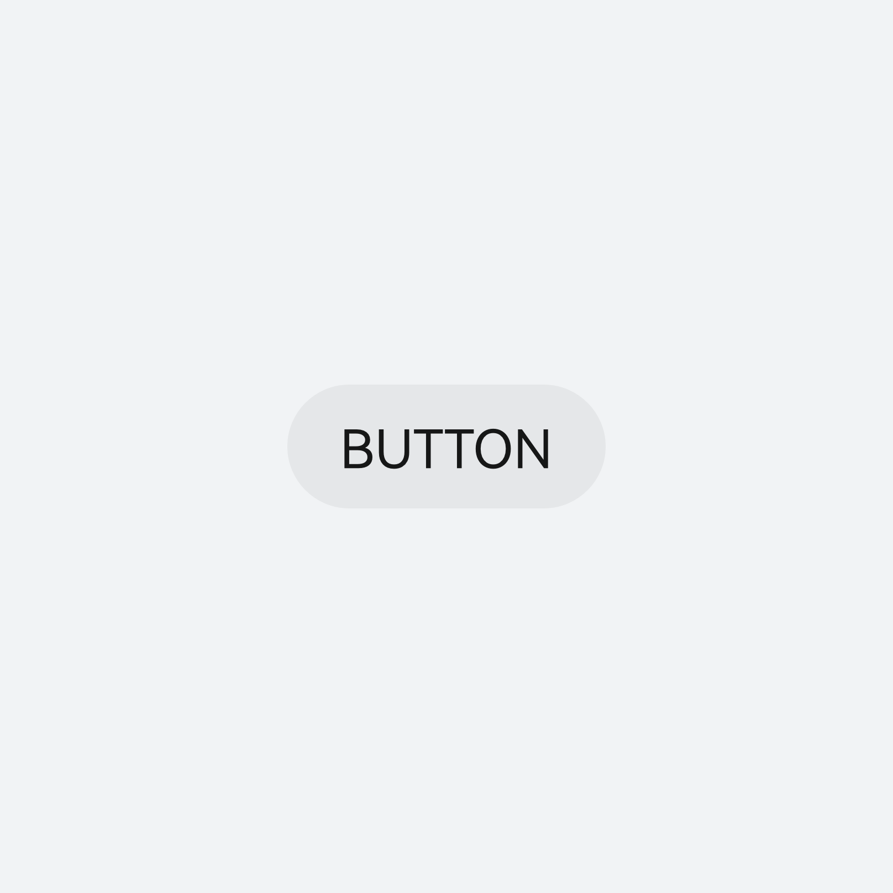
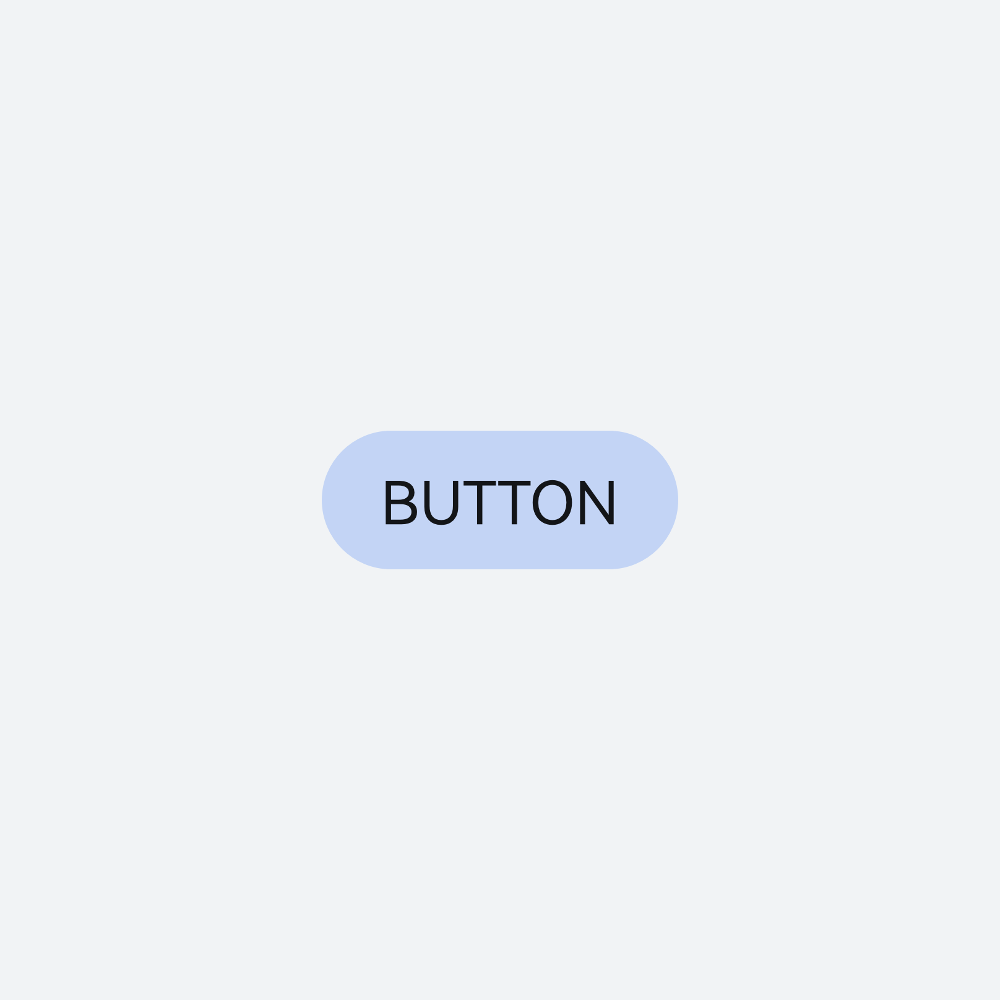
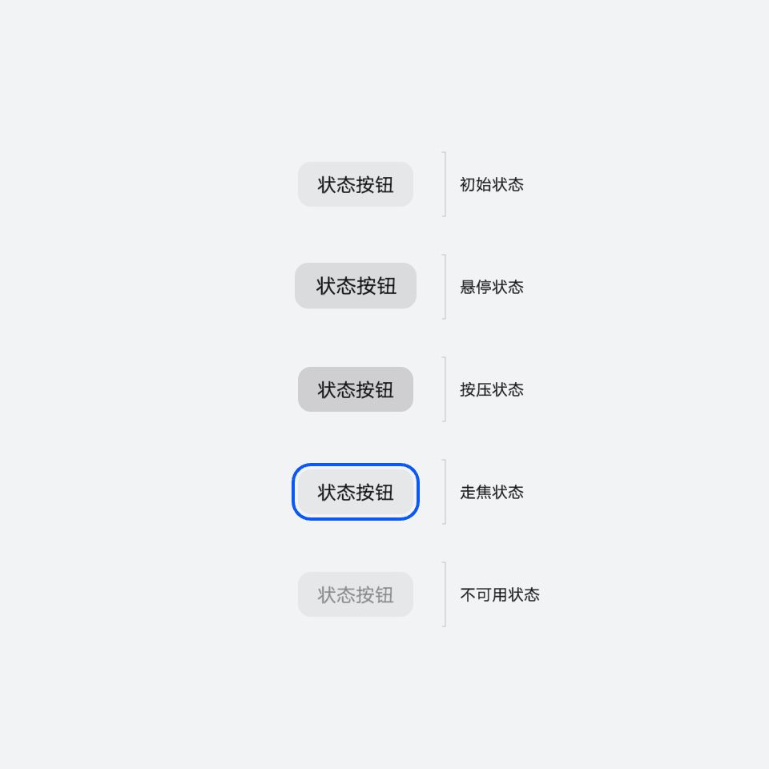
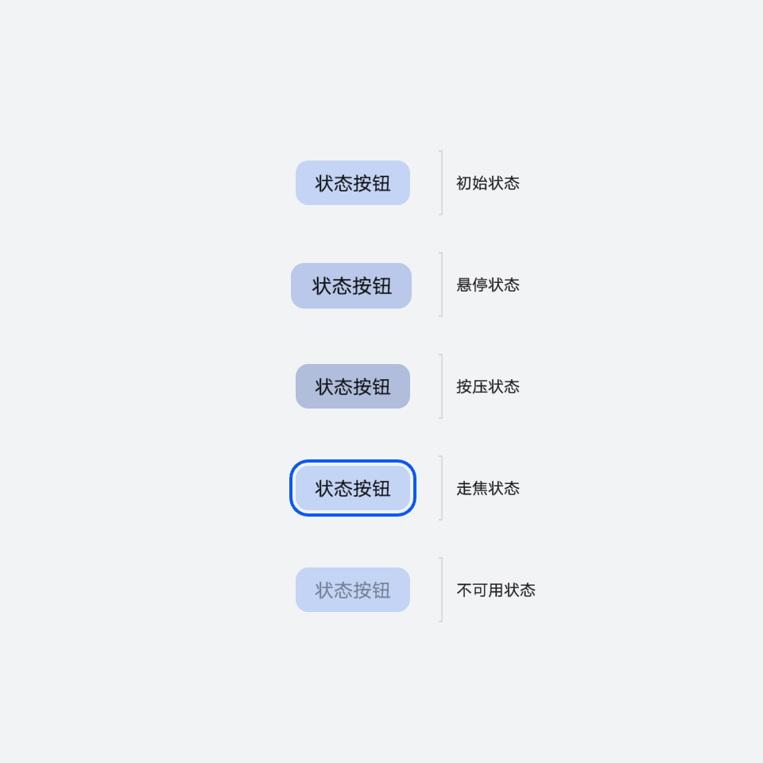

# 状态按钮

更新时间：2025-06-20 00:27:40

来源：https://developer.huawei.com/consumer/cn/doc/design-guides/togglebutton-0000001956842045

状态按钮用于从一组选项中进行选择，并可能在界面上实时显示选择后的结果。通常这一组选项都是由状态按钮构成。开发相关描述请参考 Toggle文档。

## 如何使用

状态按钮有已选择和未选择两种状态。

状态按钮不单独使用，通常由多个状态按钮组成一组选择项。

多个状态按钮作为单选选择时，只能有一个状态按钮处于选择状态，并作为当前的选择。

多个状态按钮也可以组成多选选项，每个状态按钮都可以被选择，根据业务的需求，也可以设定其中某些状态按钮为互斥状态，即选择一个后，另一个状态按钮就自动设置为未选择状态。

## 视觉规则

手机

|  |  |
| --- | --- |
| 未选择状态 | 选择状态 |

电脑设备

在电脑设备上圆角规格与手机有圆角参数差异

|  |  |
| --- | --- |
| 未选择状态 | 选择状态 |

## 开发文档

Toggle
