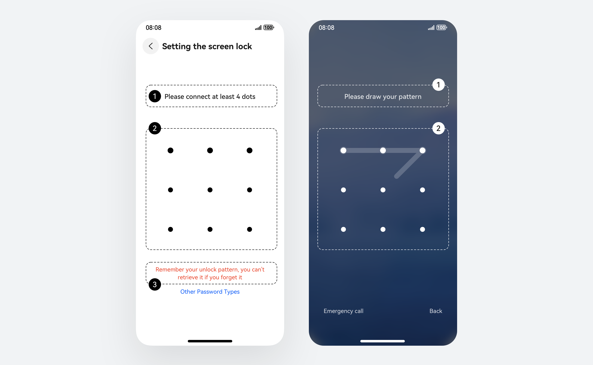
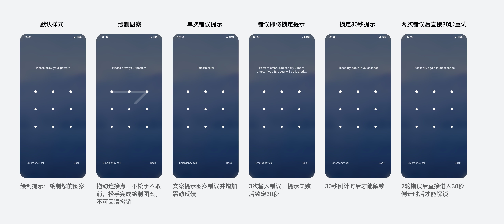
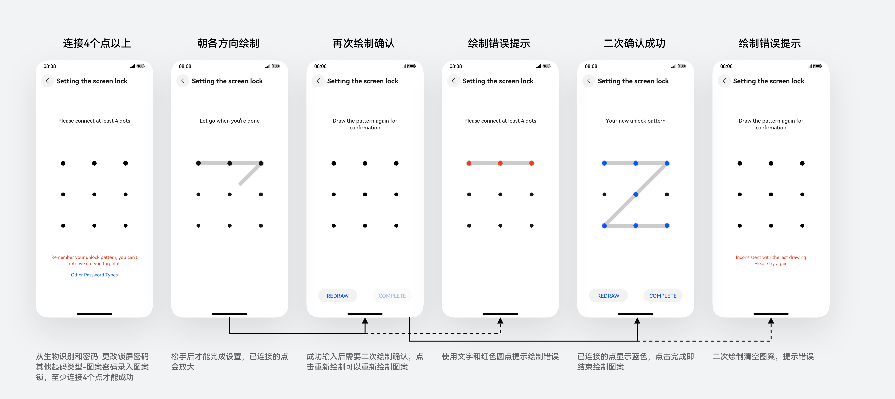

# 图案锁

更新时间：2026-03-11 06:16:00

来源：https://developer.huawei.com/consumer/cn/doc/design-guides/patternlock-0000001929853902

这是一种通过绘制图案的行为作为解锁方式的控件。开发能力相关可参考 [PatternLock](https://developer.huawei.com/consumer/cn/doc/harmonyos-references/ts-basic-components-patternlock) 文档。
 

 

 

#### 如何使用

**图案锁作为一种输入类控件，与其他输入型组件最大区别在于通过手势绘制图形作为输入方式。**可用于界面锁屏、私密文件夹、密码验证等场景下使用。也可以和其他密码类型混合使用，如人脸识别、指纹可同时在锁屏解锁时和图案锁使用。
 

 
**搭配简要的文字说明。**图案锁的使用需要搭配一定的文本解释，让用户知道当前解锁状态。例如密码输入是否正确，还有几次输入机会等等。
 

 
**基于界面的使用场景差异定制适合的颜色样式。**图案锁可以使用在任何界面场景，对于纯色界面、沉浸式界面、包括深浅模式下都需要开发者匹配对应使用场景的颜色，确保界面的美观度。
 

 
 

#### 基础构成及场景示意

  
| 序号 | 标题 | 描述 |
| 1 | 操作提示文本 | 位于图案锁圆点的上方，用于提示操作。 |
| 2 | 图案锁圆点 | 用于连接形成图案的圆点。 |
| 3 | 次要操作提示文本 | 位于图案锁圆点的下方，常用于提示异常操作。 |
 
 
 
**锁屏场景**
 

 

 
**图案录入场景**
 

 

 

#### 开发文档

[PatternLock](https://developer.huawei.com/consumer/cn/doc/harmonyos-references/ts-basic-components-patternlock)
