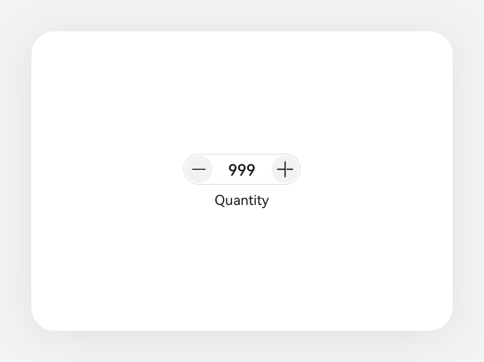
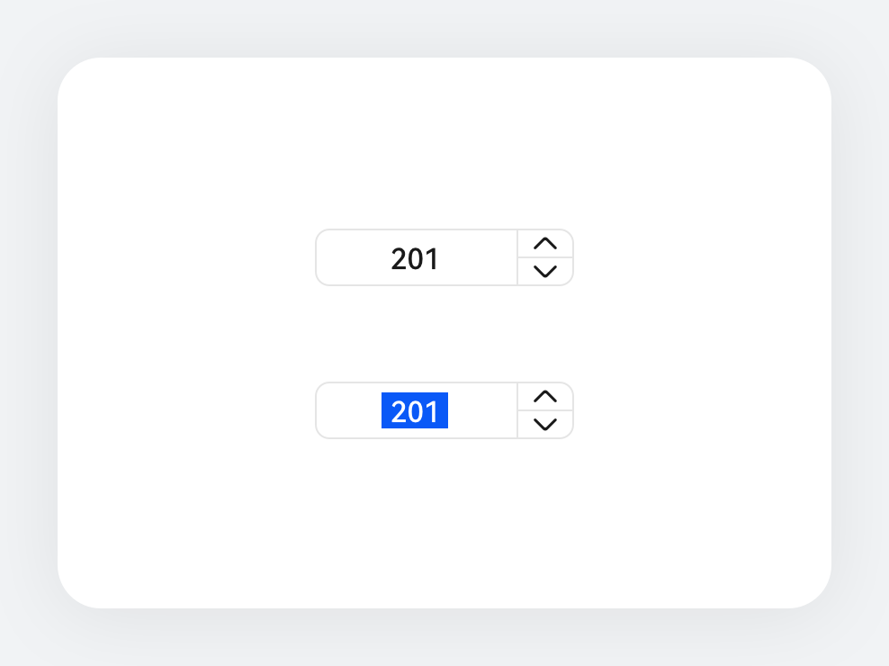
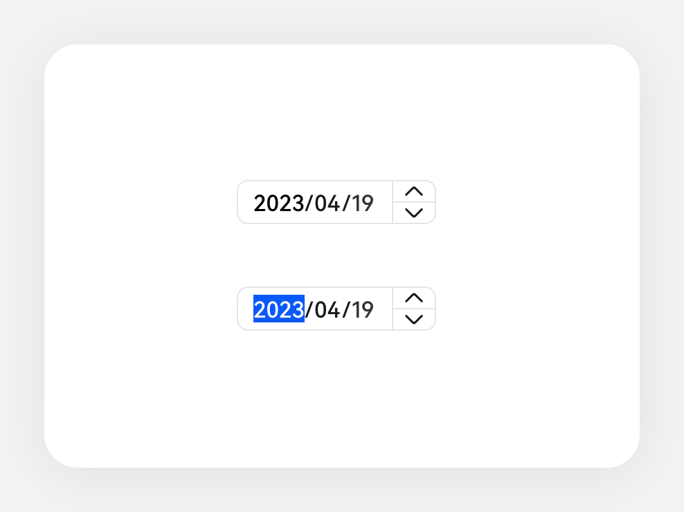

# 数字加减

更新时间：2025-08-14 12:13:38

来源：https://developer.huawei.com/consumer/cn/doc/design-guides/counter-0000001929853284

数字加减控件是一种常见的输入控件,用于在移动端应用中输入或调整数值。开发能力相关可参考 Advance.Counter 和 Counter 文档。

## 如何使用

聚焦控件使用场景，用于精确调节数值的场景。如商品数量、使用次数、人数、空调温度、健身活动目标卡路里数等场景。

涉及敏感数据信息或易操作失误场景，同合理的规避方案。控件应设置合理的最小值和最大值限制，防止输入非法数值。考虑是否需要支持手动输入数值的功能，通过使用内联输入样式来实现业务诉求，对于涉及金额等重要数值，建议增加确认弹窗等操作，以防止误操作。

类型

| 列表型 整列布局，数字显示和调节按键分开或结合。 |  |
| --- | --- |
|    |    |
| 紧凑型 (上下布局型) 数值标签显示在操作区域下方，一行可布局多个或和其他控件搭配使用，布局较为紧凑时可以考虑此类型。 |  |
|    |    |
| 数字内联型 主要使用在电脑设备中精细调节， 以箭头图标呈现。可以通过 [CounterType](https://developer.huawei.com/consumer/cn/doc/harmonyos-references/ohos-arkui-advanced-counter#countertype) 中的 INLINE 类型进行配置。 |  |
|    |    |
| 日期内联型 支持在该组件内使用日期计数的样式，通过 [DateStyleOptions](https://developer.huawei.com/consumer/cn/doc/harmonyos-references/ohos-arkui-advanced-counter#datestyleoptions) 来配置其展示格式范围。在日期模式场景下通过键鼠操作时，文本内容的首选项获取焦点，按方向左右键按顺序遍历，当焦点在文字上时可以通过键盘输入，方向键可以上下穿透走焦。 |  |

## 开发文档

Counter

Advance.Counter
