# 文本框

更新时间：2025-06-20 00:27:40

来源：https://developer.huawei.com/consumer/cn/doc/design-guides/textinput-0000001957012557

文本框允许用户输入文本、选择文本。支持输入文本、数字或者混合格式的数据。单行文本输入类组件相关能力请参考 TextInput 文档，多行场景请参考 TextArea 文档。

## 如何使用

文本框应该有明确的标签或占位符，指示用户应该输入什么样的信息。对于敏感信息(如密码)，应该使用掩码字符来保护隐私，开发者可以在 InputType 中查询到有关密码、邮件、号码等特定格式的样式类型。如果有特定的输入格式要求(如电话号码、邮箱地址等)，应该提供相应的验证和反馈。

展示合理的文本提示反馈。在文本未输入前提供对应的提示文本，明确告知用户当前输入的信息类型、或者可填充内容。提示文本应当精简且直接点明主题，不要作内容运营或者诱导性提示。提示文本的样式规格可参考 placeholder 相关文档。

合理展示和切换输入状态。当用户开始输入时，光标应该自动聚焦在文本框内，开发者可以配置 cancelButton 来提供一键清空操作。对于无效的输入,应该给出明确的错误提示和解决方案，可以使用控件中的 showError 接口来进行配置。

根据业务场景需要选择单行输入或是多行输入。实现多行输入有几种方式，一种是在 TextInput 中通过指定最大行数来提供有固定范围的行数约束，另外一种是使用 TextArea 控件来实现多行文本输入，当输入的文本内容超过组件宽度时会自动换行显示，在 TextArea中如果开发者未设置高度，则控件无默认高度，跟随文本自适应内容，宽度未设置时，则默认撑满容器最大宽度。

展示主题配置。在文本输入场景下会出现输入光标、文本选中、拖拽手柄等操作项，这些控件样式都会继承系统默认色彩风格。开发者可以通过配置 caretColor 和 selectBackgroundColor 两个接口的颜色来配置针对应用自身的主题色样式。

| 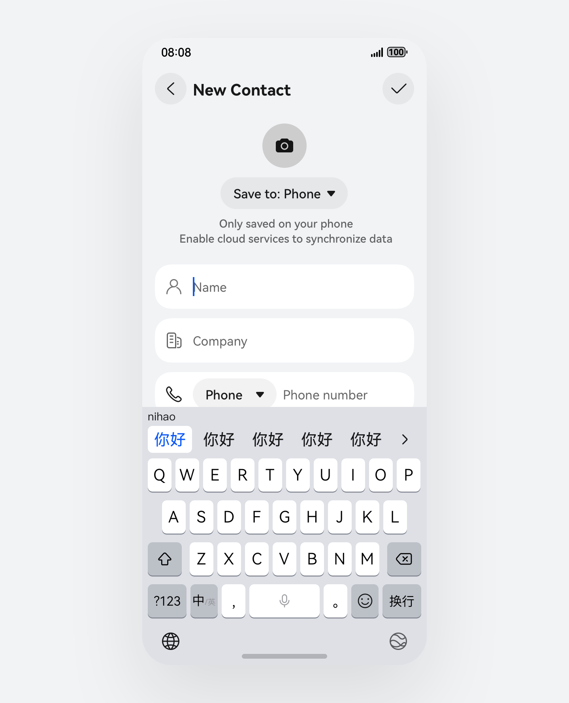 | 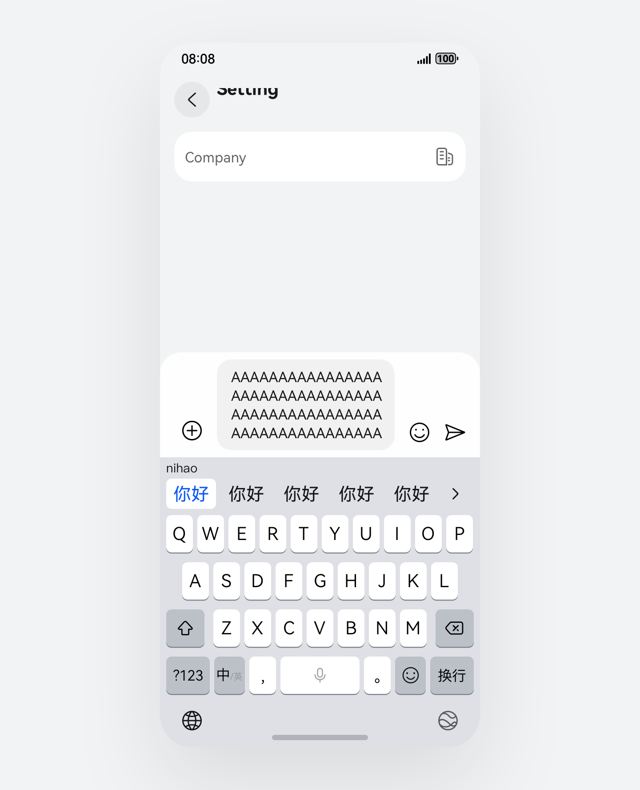 | 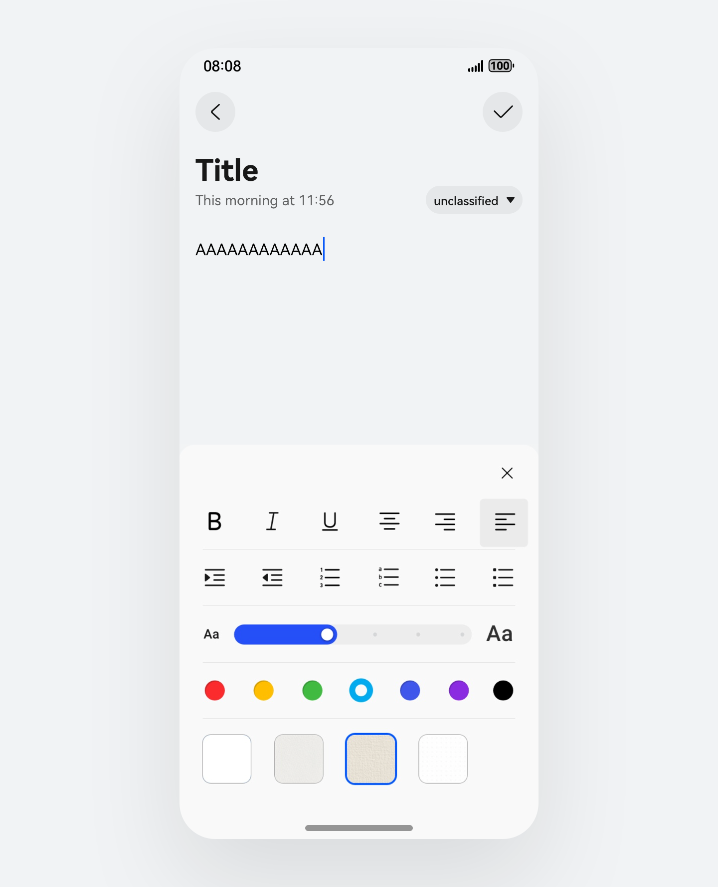 | 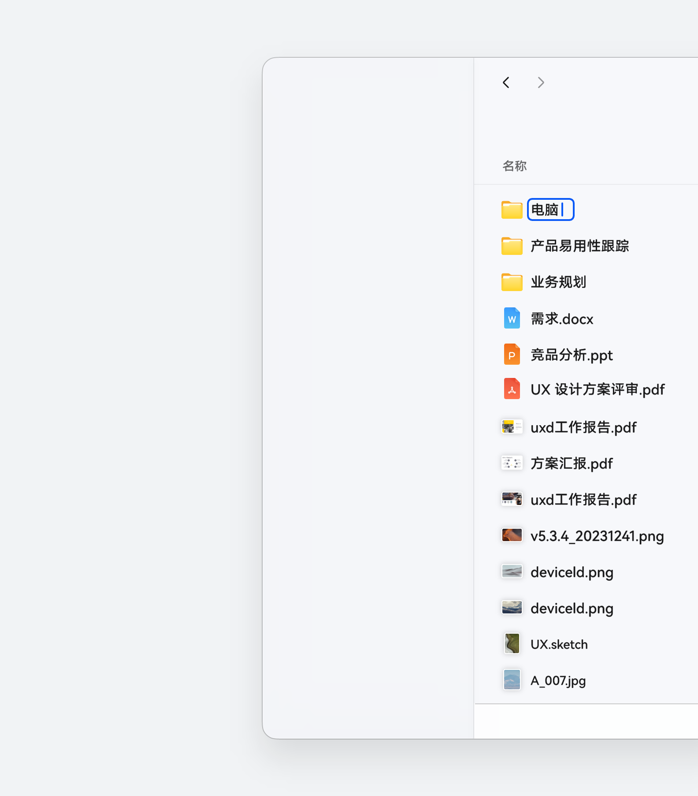 |
| --- | --- | --- | --- |
| 单行文本框 | 多行文本框 | 全宽文本框 | 内联输入框 |

## 文本框样式

手机

| 单行文本框 输入小文本块使用单行文本框，支持显示带图标、带单位、带*号标记必填项、带自动推荐、带帮助文本、带错误信息、字符计数器、格式化输入功能等样式。 当文本输入光标到达输入区域最右边，框中内容会自动向左推挤。 当文本长度超过文本框宽度时，可在输入框横滑文本，不出现光标。 进行有默认推荐文本的操作时 (新建文件夹、另存、重命名等)，初始状态文本全选，方便删除。若直接保存导致名称重复，使用错误提示。 | 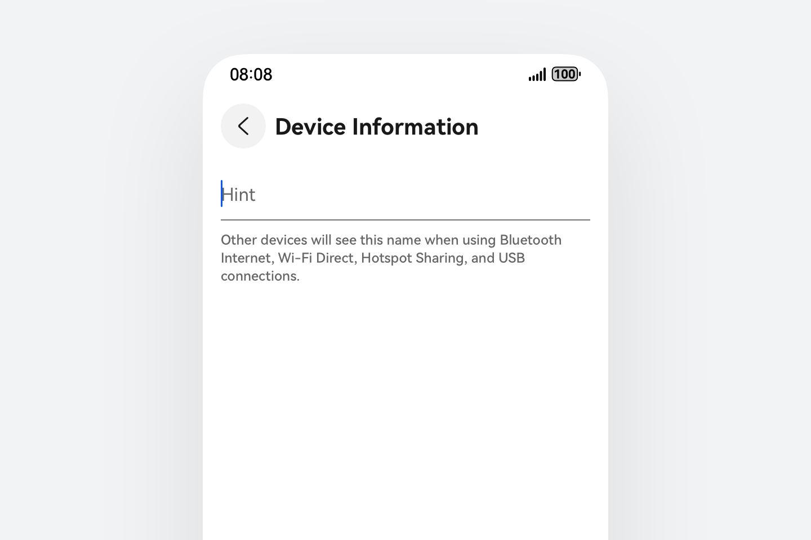 |
| --- | --- |
|    |    |
| 多行文本框 使用场景：适用于容纳大量文本的紧凑布局。 框体高度分为固定和可扩展两种： 1.框体高度可扩展。如短信输入框，高度随输入的文字扩展，最大达到 10 行后，新输入的文字换行形成新的一行，已有文本向上移动，文本可垂直滚动，滚动时显示滚动条。 2.框体高度固定。默认初始时以多行文本框的样式显示，高度固定。文本高度超过框体高度时，继续输入文字，新输入的文字换行形成新的一行，文本可垂直滚动，滚动时显示滚动条。 | 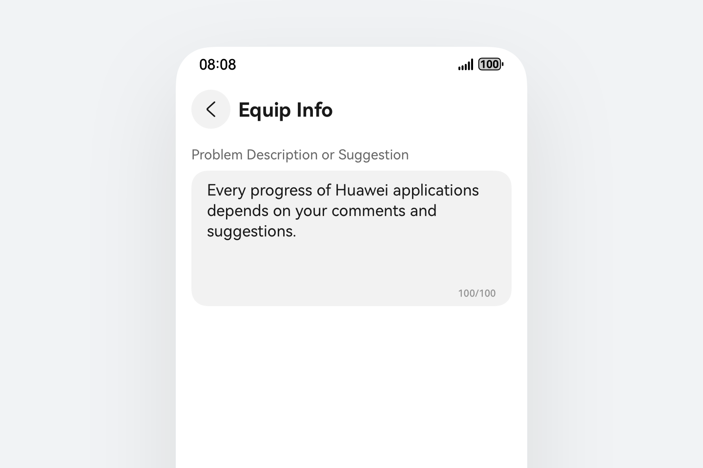 |
|    |    |
| 全宽文本框 适合固定多行的输入。 文本可以显示多行，不以框体或线性形式呈现。 文本可有多种样式：不同字体、大小，颜色；粗体、斜体、加下划线等。 | 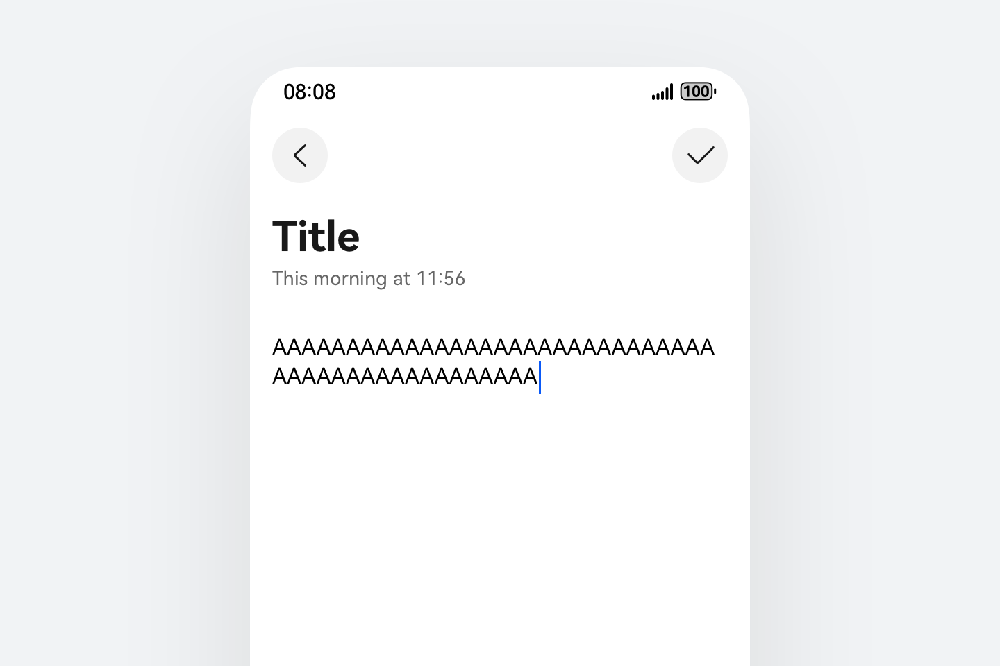 |
|    |    |
| 带图标的文本框 右侧图标直接作用于文本内容。常用图标有显示隐藏、清除文本、语音输入、发送验证码。 清除文本图标在输入文本后出现；显示隐藏图标、其他图标可根据业务场景需要常驻。 | 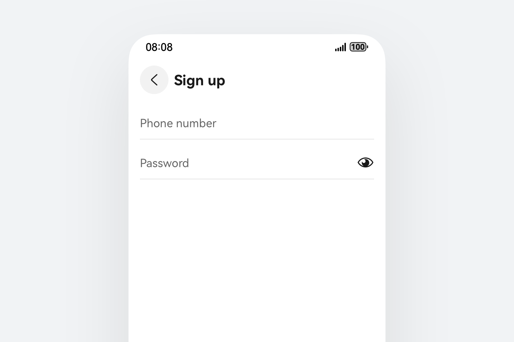 |
|    |    |
| 错误类型 用户输入错误时，系统给出实时提示，帮助用户修正错误。输入存在错误时，可在输入框下方显示错误信息，说明如何修复。 场景如下：格式不对，如邮件格式、超出输入长度、字符不合法，如用户名中不允许使用某些字段、与已有项重复，已有文件名等。 | 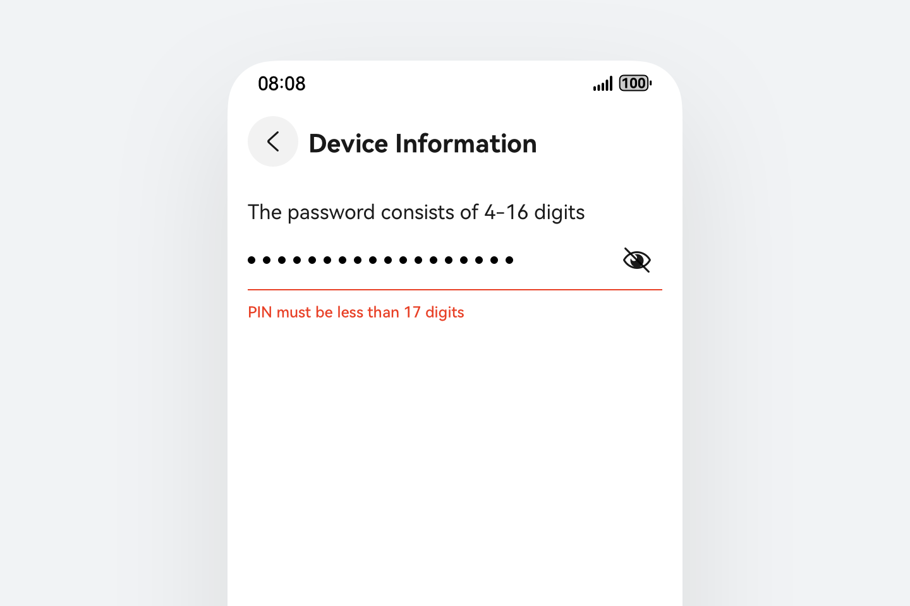 |
|    |    |
| 字符计数器 若文本框有最大字符长度的限制时，可以使用字符计数器。字符计数器放置在框体内或下划线下方。 文本默认右对齐，显示已输入的字符和字符限制之间的比例 (格式为：已输入字符/字符限制)。 若用户输入刚好达到最大字符长度，字符计数器和框体不变红；若用户继续超长输入计数器和框体抖动变红。 密码输入不使用字符计数器。 | 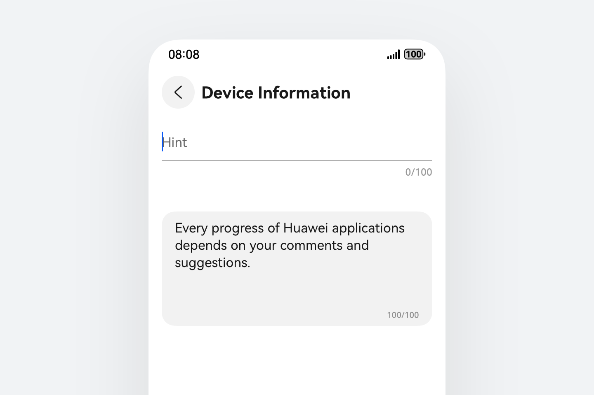 |
|    |    |
| 密码的显示与隐藏 隐藏密码：与账号相关或具有很强的私密性要求的情况下，需要默认使用掩码来显示密码。 明示密码：需要对外提供公共服务时 (共享 WLAN 热点供他人使用) ，或使用公共服务时 (如：咖啡店提供的 WLAN 热点密码) 用到的密码，用户需要直观的查看密码，并在设备上进行输入密码，此时密码使用明文。 | 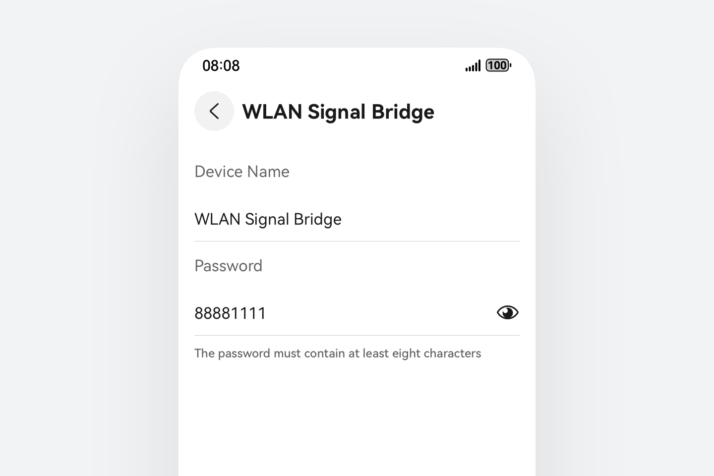 |

电脑设备

| 单行文本框 输入小文本块使用单行文本框，支持显示带图标、带单位、带*号标记必填项、带自动推荐、带帮助文本、带错误信息、字符计数器、格式化输入功能等样式。 在 2in1 设备中，单行文本框使用小圆角底板，以体现设备风格。 | 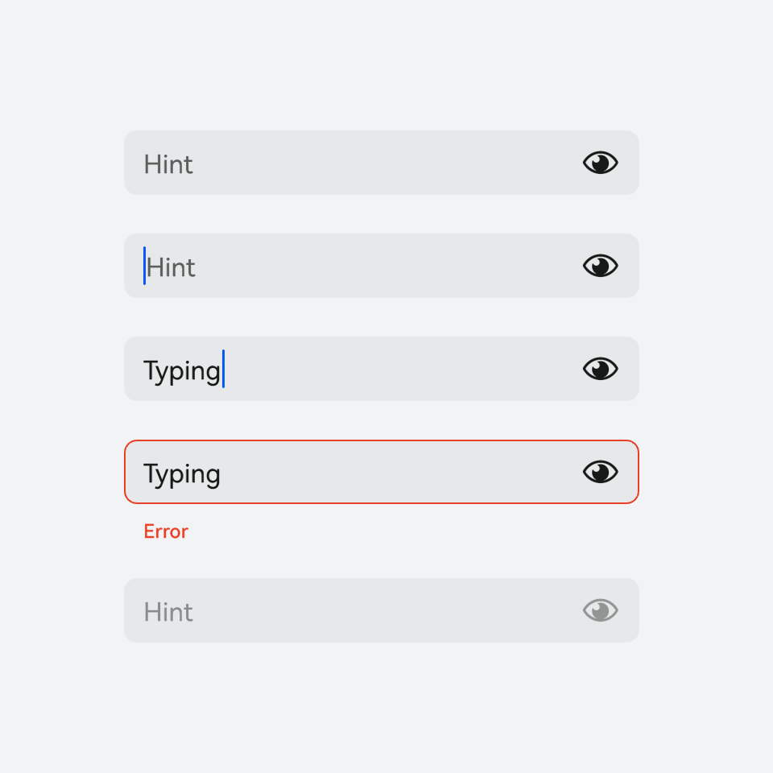 |
| --- | --- |
| 多行文本框 使用场景：适用于容纳大量文本的紧凑布局。 框体高度分为固定和可扩展两种： 1.框体高度可扩展。如短信输入框，高度随输入的文字扩展，最大达到 10 行后，新输入的文字换行形成新的一行，已有文本向上移动，文本可垂直滚动，滚动时显示滚动条。 2.框体高度固定。默认初始时以多行文本框的样式显示，高度固定。文本高度超过框体高度时，继续输入文字，新输入的文字换行形成新的一行，文本可垂直滚动，滚动时显示滚动条。 | 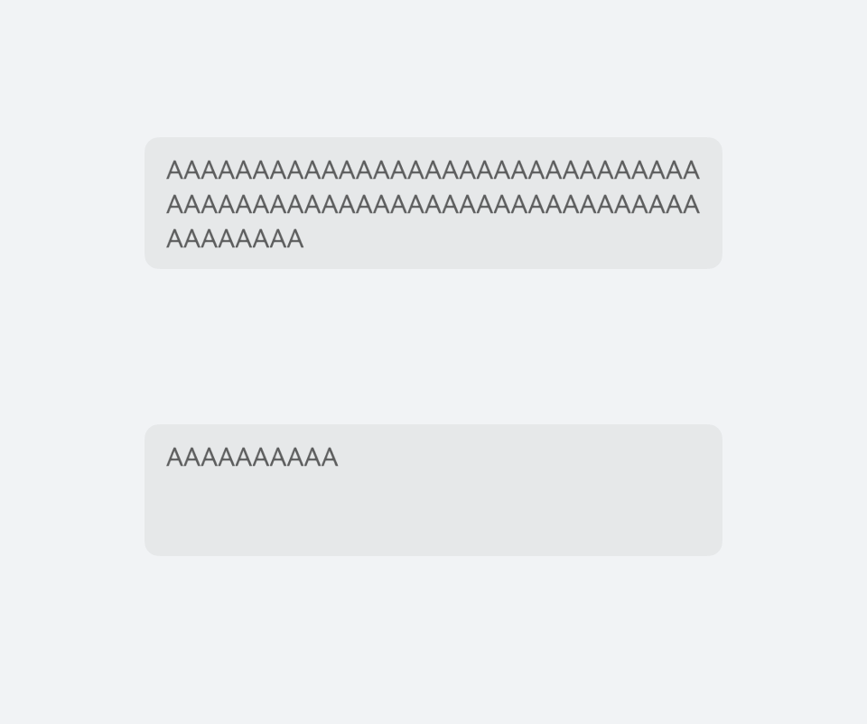 |
| 内联输入样式 在宫格列表场景中，文本框和图标图片组合呈现时使用，如：文件管理器和桌面图标重命名。 | 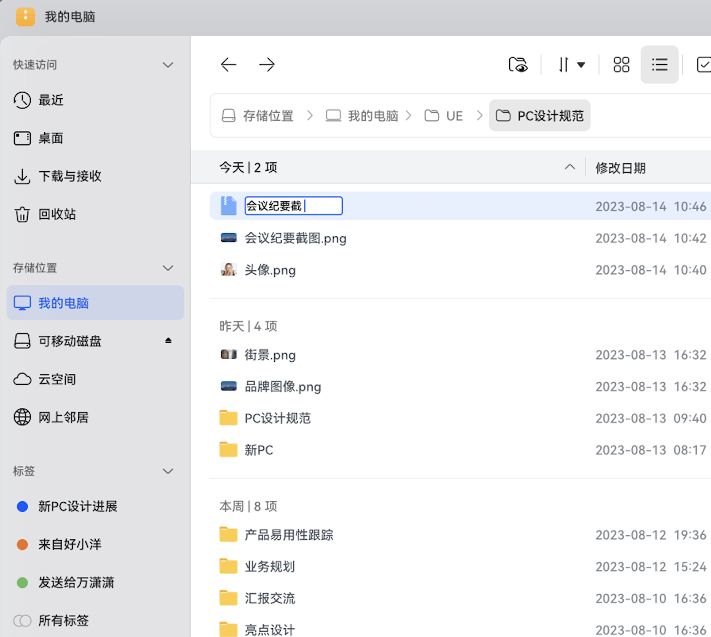 |

内联输入的单/多行文本的使用规则

单行文本

根据文本宽度和高度定义编辑态时的文本框宽度和高度。单行文本支持超长展示。默认文本全部选中，不显示光标，可直接输入。再次点击取消选中文本时，显示光标。

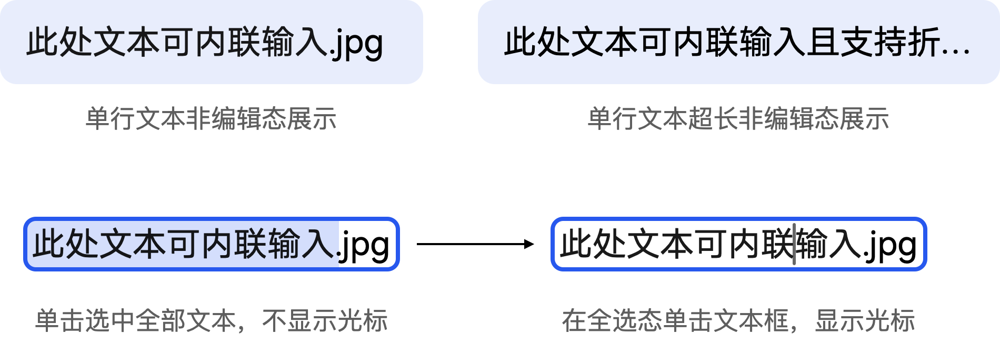

多行文本

点击文本框后多行显示文本，默认选中全部文本，不显示光标。支持应用自定义内联文本框的最大高度值，超出最大高度时，文本框右侧生成滑动条。点击任意处，取消选中文本，显示光标，方向键可移动光标。

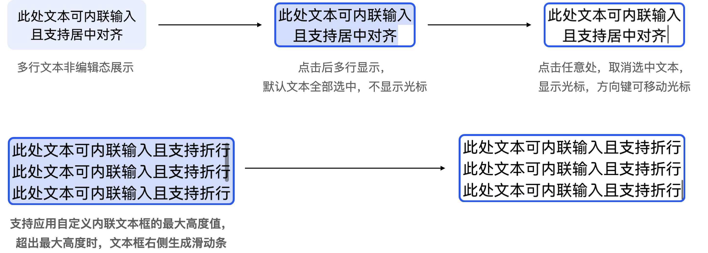

穿戴设备文本框

文本框允许用户输入文本、选择文本。支持输入文本、数字或者混合格式的数据。支持多行文本显示。

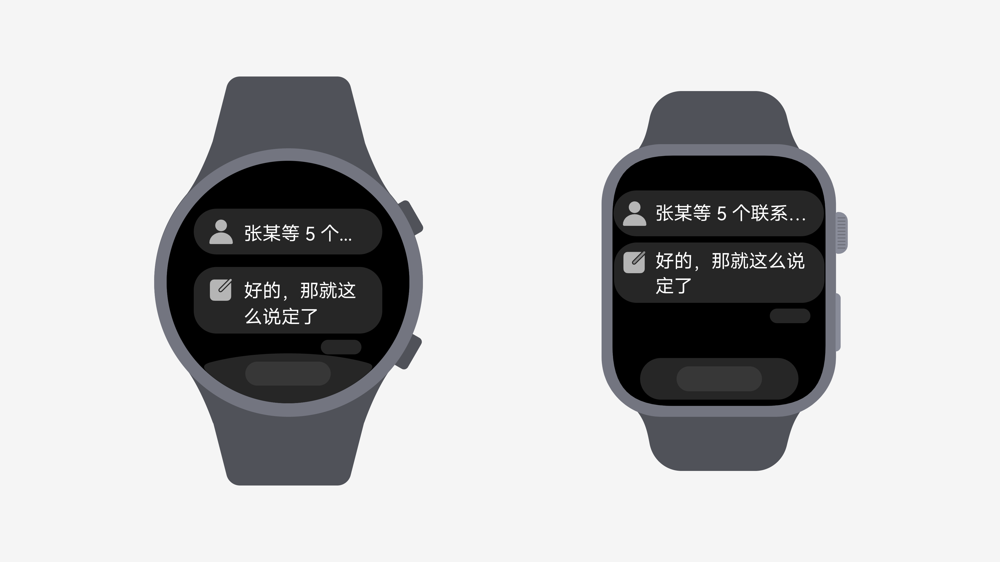

## 开发文档

TextInput

TextArea
