# 分段按钮

更新时间：2025-09-15 07:08:38

来源：https://developer.huawei.com/consumer/cn/doc/design-guides/segmentbutton-0000001929853292

分段按钮用于对内容进行组别分类。也可以在多个选项中激活一个或多个按钮的控件。开发相关描述请参考 SegmentButton 文档。

## 如何使用

分段按钮控件允许用户从一组选项中进行单选或多选。通常情况下，在手机设备上分段按钮的选项不会超过 5 个，在更大屏幕设备上一般不超过 7 个，若应用的分类条目较多，建议使用子页签来代替。

分段按钮虽然每一个选项都可以激活使用，但请不要用于编辑类场景。例如，不要将删除、添加、多选等功能放置在分段按钮中使用。也不要使用于一级导航场景，界面级别的切换仍然需要使用底部页签。

分段按钮通常放置在应用的界面布局内，可显示在标题栏下方或底部页签上方。默认情况下，控件会撑满容器宽度，开发者也可以在需要时自定义控件的宽度以适配业务场景诉求。

每个选项可显示文本或图标。为了便于用户阅读和理解，同一控件内应使用统一的内容形式，都使用纯文本或者图标与文本结合的形式。同时，应当精简文本内容，由于展示空间有限，文本应当避免被隐藏或过长截断。

## 类型

分段按照使用场景可以分为页签型、单选型和多选型。在 SegmentButtonOptions 选项中，开发者需要先通过 type 指定分段按钮的样式类型，如果是可滑动的页签形态，则需要使用 tab 类型，如果是可激活的按钮形态，则需要使用 capsule 样式。若开发者使用了 capsule 类型，还需要定义 multiply 是否生效来决定分段按钮的操作类型属于是否可以多选。

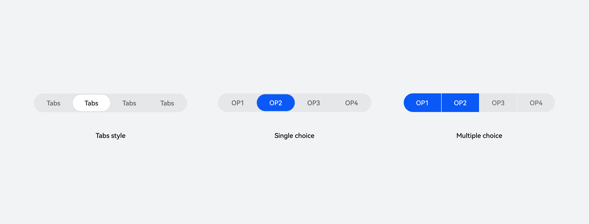

页签类单选默认为白色背板，关联页面切换；单选类 & 多选类默认为蓝色背板，仅作为选项切换。

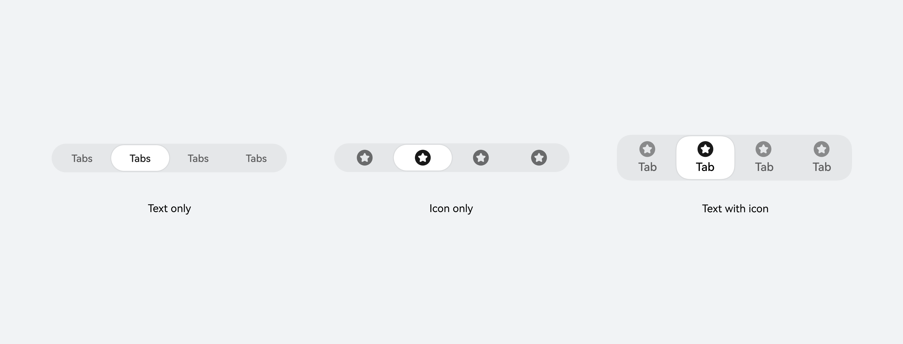

也可以组合图标与文本的单独样式和组合样式。通过配置 SegmentButtonIconItem 的相关属性进行自定义。

| 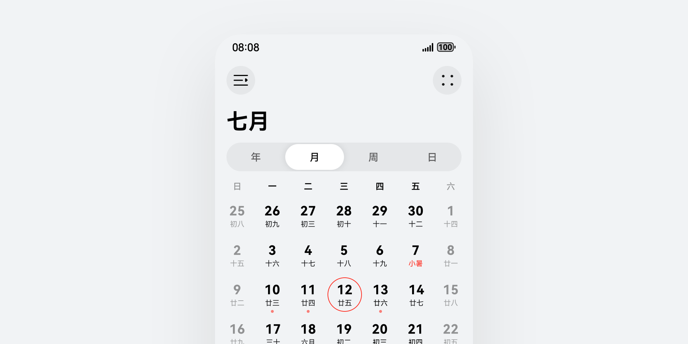 | 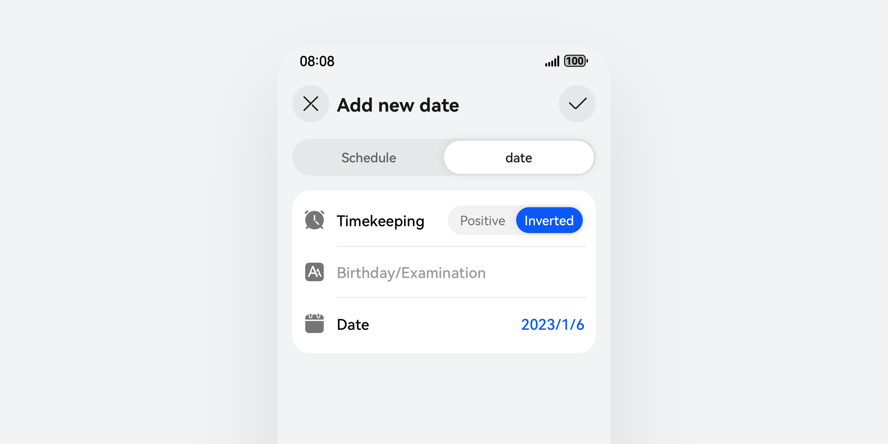 | 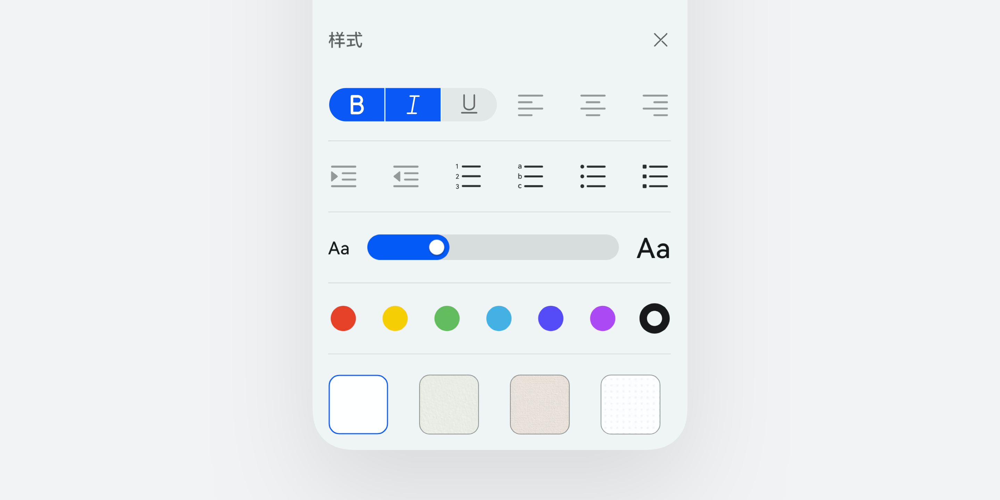 |
| --- | --- | --- |
| 页签分段按钮 用于页面快速切换选项。 | 单选分段按钮 用于表单的选项选择。有文字、图标、图标 + 文字、图片 + 文字类型。 | 多选分段按钮 一组同类功能的按钮布局使用分段多选按钮，如选择文本样式场景。 |

## 布局规则

手机

竖屏

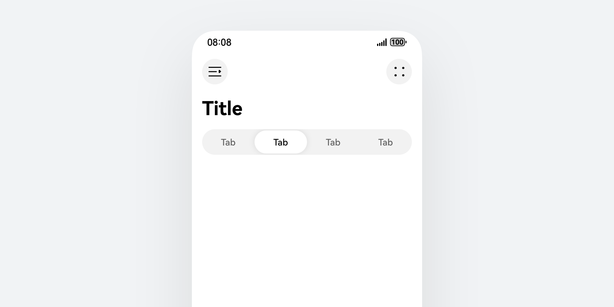

横屏

横屏时最大扩展到 448vp。

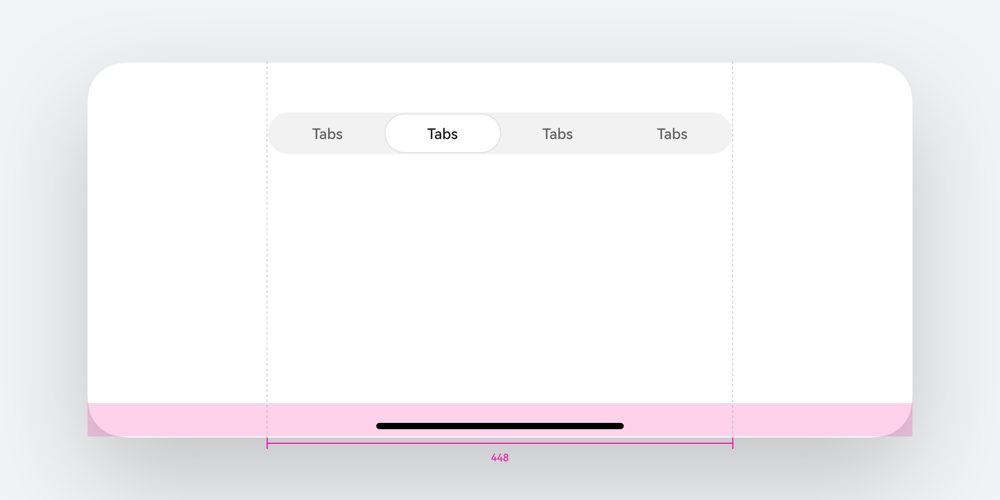

在半模态中使用遵循同样规格。

半模态最大宽度 480vp 的场景下，分段按钮两边距离半模态保留左右各 16vp 间距，使分段按钮宽度与全屏显示宽度保持一致。

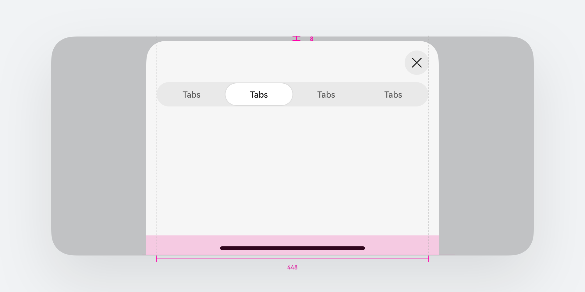

平板

平板设备适配

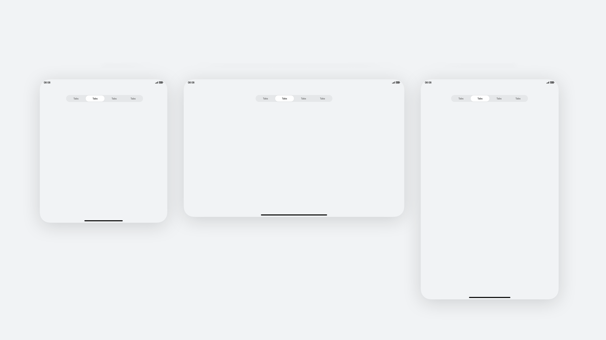

在更大屏幕上，按钮保持最大 448vp 的宽度，不再跟随屏幕伸缩而改变宽度。

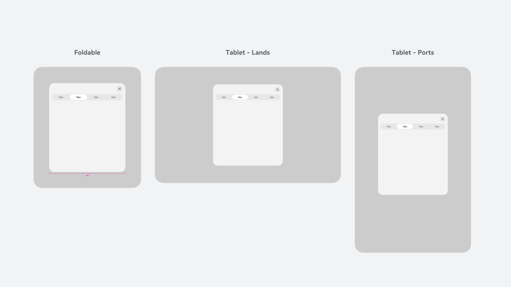

在半模态等窗口化场景下保持同样规则，基于容器的宽度减去两侧 16vp 间距，保持最大 448vp 按钮宽度。

电脑

在电脑设备上，分段按钮使用小圆角以体现设备风格。

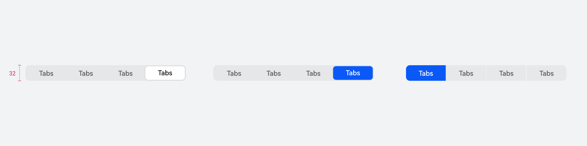

页签类单选默认为白色背板，关联页面切换；单选类 & 多选类默认为蓝色背板，仅作为选项切换。

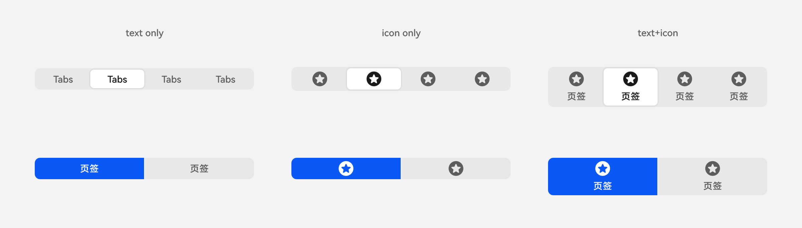

同时也可以组合图标与文本的单独样式和组合样式，通过控件能力自定义配置。

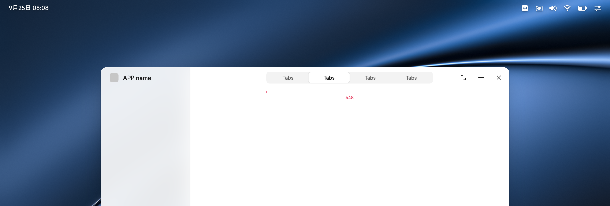

宽度规格与多端保持一致，最大宽度 448vp。

## 开发文档

SegmentButton

ChipGroup
