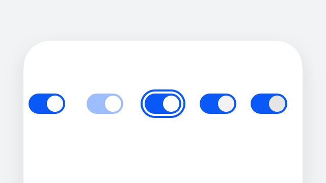
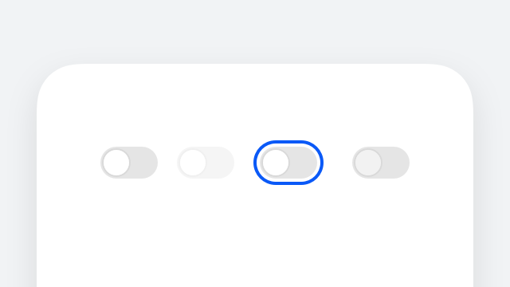
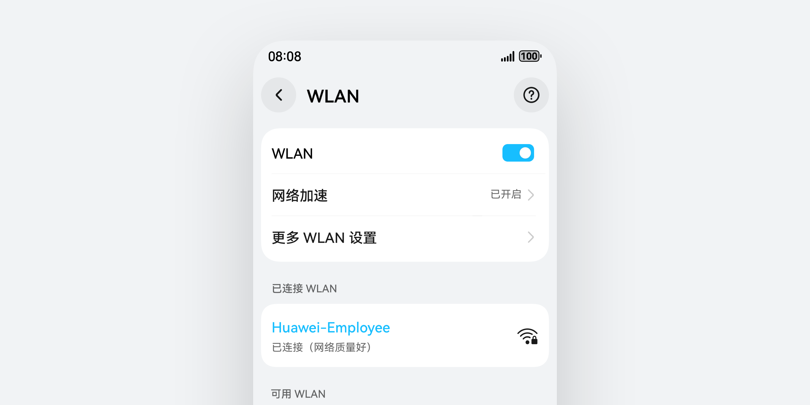
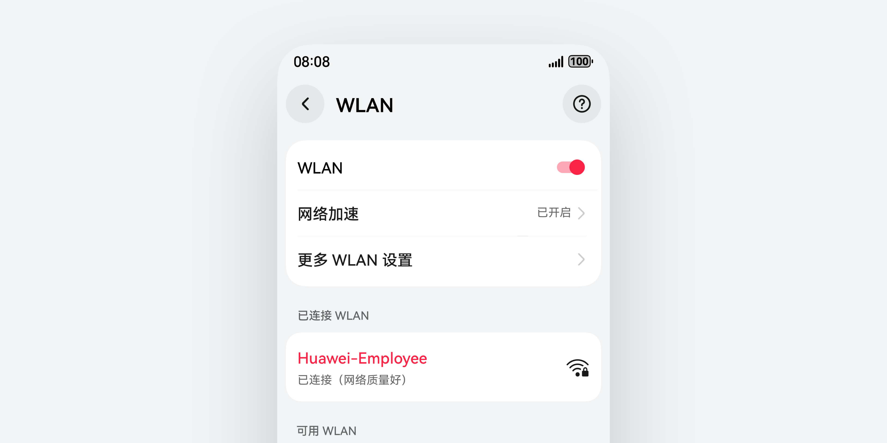
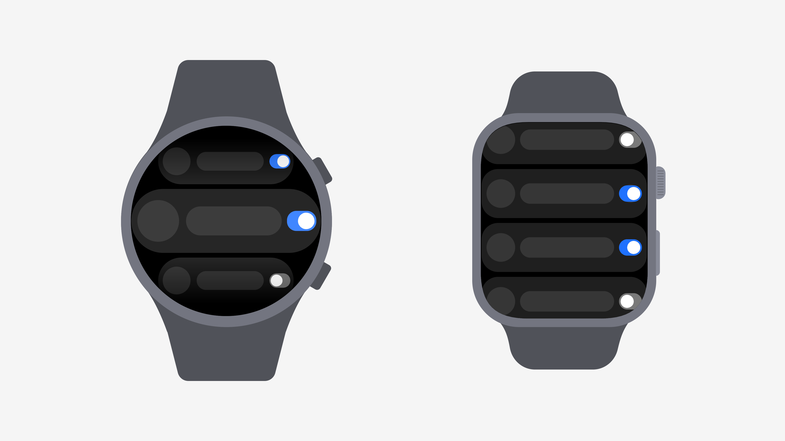
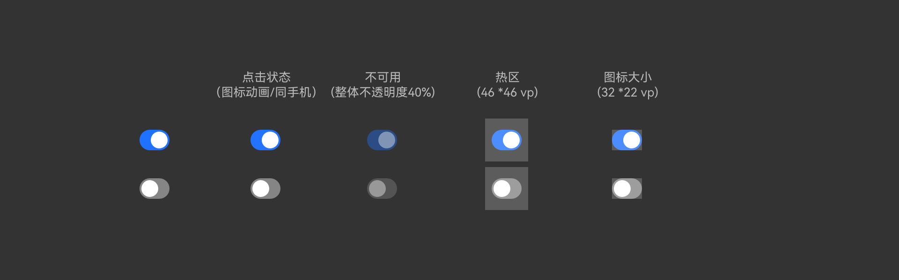
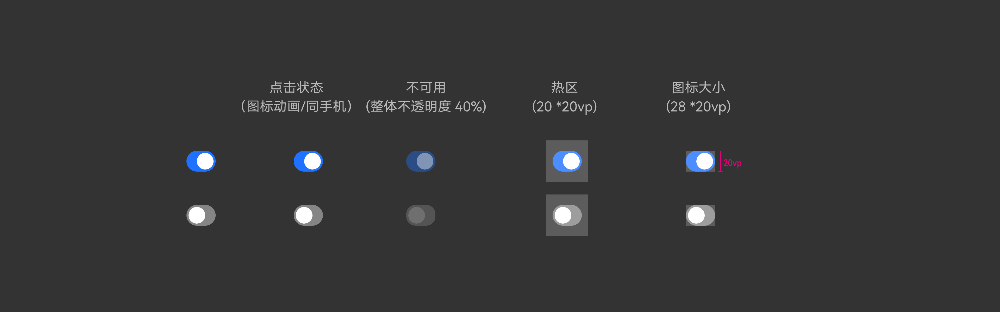

# 开关

更新时间：2025-06-20 00:27:40

来源：https://developer.huawei.com/consumer/cn/doc/design-guides/toggleswitch-0000001956852745

通过开关，开启或关闭某个功能。开发相关描述请参考 Toggle 文档。

## 如何使用

开关控件属于 Toggle 类控件中的一个类型样式，是一种用于打开或关闭某个功能和设置状态的控件，通过在 ToggleType 中选择 Switch 样式使用。

呈现明确的开关状态。开关控件通常由一个手柄和一段滑块区域组成，通过点击可以改变手柄的位置，并在滑块区域给出明显的色彩反馈，用来表明当前已开启状态。即使在自定义场景下，也需要明确区分开与关的状态反馈。

强化操作认知和风险规避。如果开关控件控制的是重要功能或会产生重大影响的设置，可以在切换时增加确认弹出框让用户进行二次确认。

开关控件的交互应该简单直观，避免过多的步骤或复杂的操作。开关控件一般情况下搭配列表使用，在基础交互场景下一般用于打开某一项功能，也可以关联并绑定其他组件的交互事件，例如通过打开操作，允许用户操作另外几个列表选项。当列表项之间有关联关系时，那些未激活的列表需要变为不可用状态。

开关控件的交互应该简单直观，避免过多的步骤或复杂的操作。通过点击或者滑动开关来开启或关闭功能项，点击列表其他区域则不响应开关操作。

自定义开关样式。开发者可以使用系统默认的风格样式，基础样式可以直接修改其色彩。若对其他元素仍然有自定义诉求，例如尺寸、圆角、手柄半径等等，可以通过对 SwitchStyle 配置不同参数来实现。

|  |  |
| --- | --- |
| 默认开启状态 | 默认关闭状态 |
|    |    |
|  |  |
| 自定义圆角和颜色等参数 | 自定义尺寸和颜色等参数 |

穿戴设备开关

通过开关，开启或关闭某个功能。

视觉规则

圆形表：

方形表：

## 开发文档

Toggle
