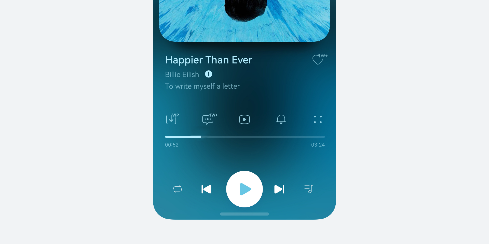
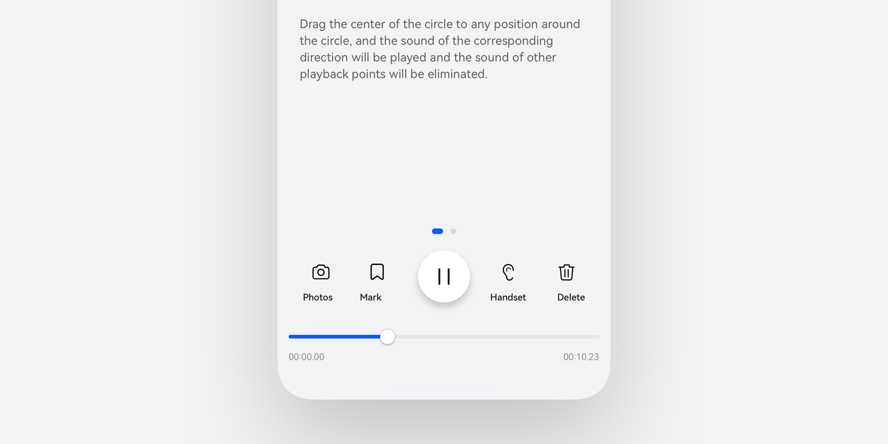
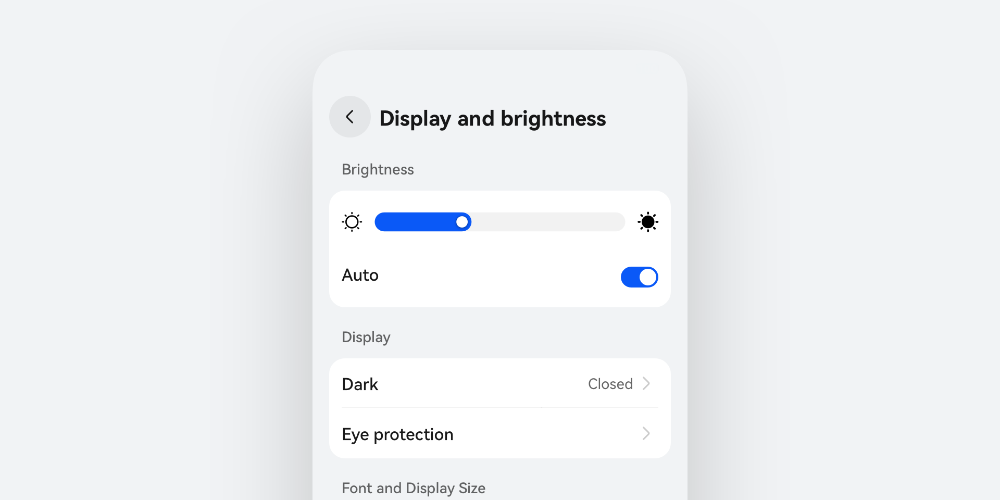
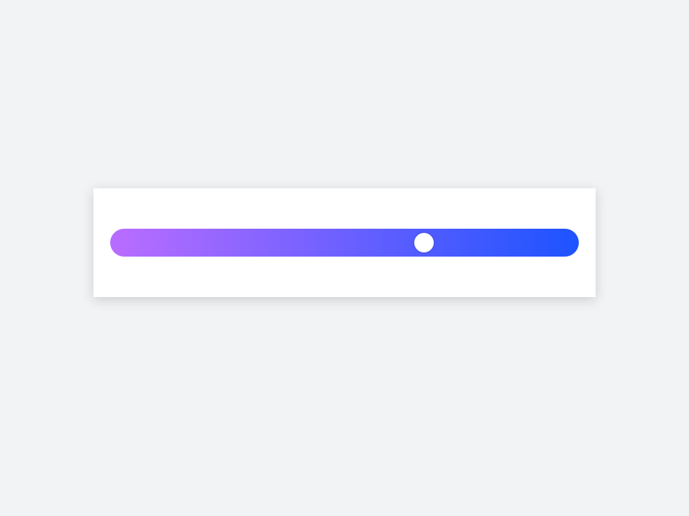
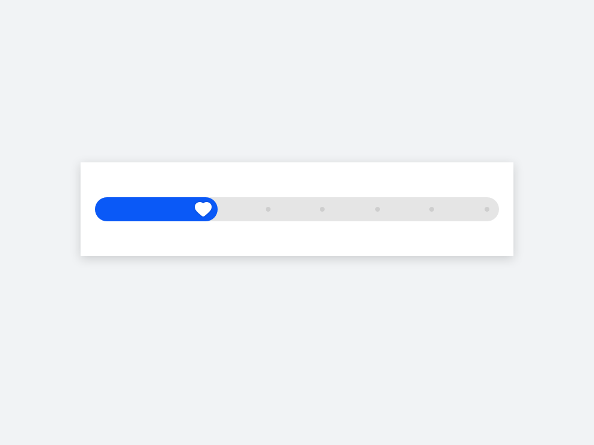
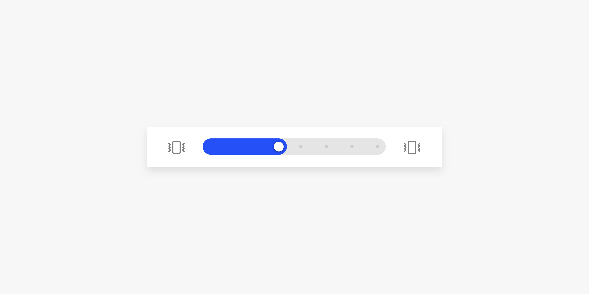
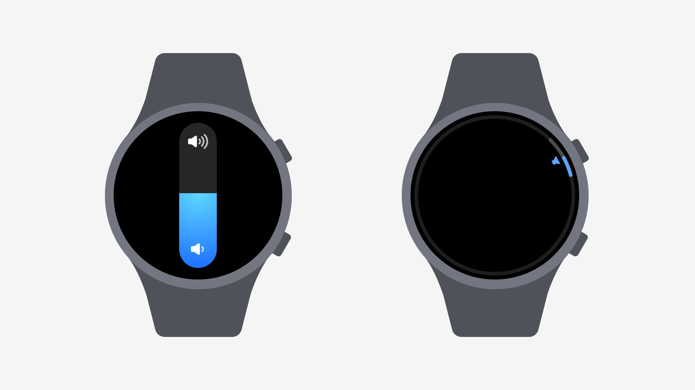
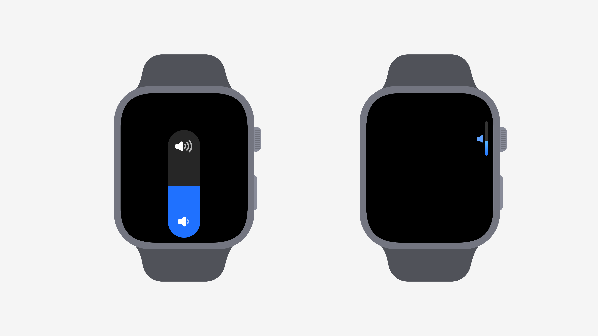
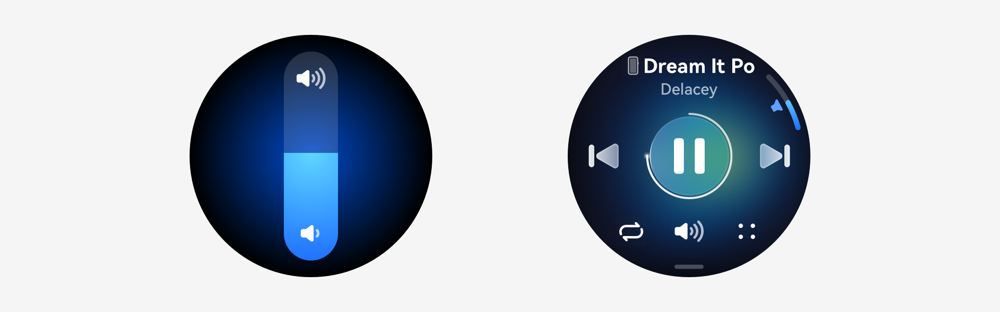
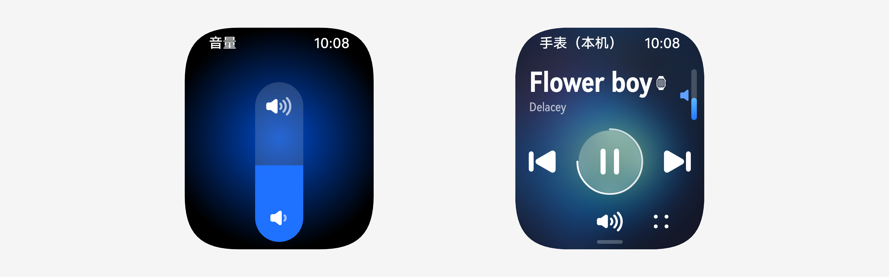

# 滑动条

更新时间：2025-06-20 00:27:40

来源：https://developer.huawei.com/consumer/cn/doc/design-guides/slider-0000001957012565

滑动条是一种常见的移动端的进度控制类控件，用于在界面中选择一个数值或调节某个设置。它通常由一个长条形的轨道和一个可以沿轨道滑动的拖动块组成。拖动块的位置代表了当前选择的数值，滑动条可以是水平或垂直方向的。开发相关文档请参考 Slider 文档。

## 如何使用

选择合适的滑动条样式。滑动条在使用场景中可分为有明确刻度和无明确刻度两种类型，有明确刻度的滑动条通常会在控件内显示最小值和最大值范围，并在轨道两端以文字或图标的形式标明。当用户拖动滑块时，应实时反映出当前选择的数值，可以在滑块上方或附近显示。无明确刻度的一般使用无极滑动条，这种滑动条不会显示具体的刻度信息，根据开发者设定的滑动步幅来进行手势适配。

如果滑动条的数值范围较大，可以考虑将轨道分成若干个等分段，并在每个分段处标注数值。通过 showSteps 为滑动条增加刻度。滑动条也可以支持点击轨道来快速定位滑块位置，可以搭配刻度点来一起使用。

类型

从控件样式上划分可以分为外置滑动条、内置滑动条和无极滑动条。外置与内置主要区别于滑动手柄的布局规则是否超出滑动条容器本身，而无极滑动条则没有滑动手柄，会极大程度的降低界面复杂度，但无极滑动条的进度展示只能为直角，可以更直观的展示当前进度或即将抵达边缘时的反馈，避免较大圆角带来的视觉错差。

|  |  |  |
| --- | --- | --- |
| Slider         无手柄样式，多用于较密集进度调节的场景，或用于降低界面元素复杂度时使用。 | OutSetSlider         用于界面轻量化展示，可用于音乐播放、视频播放等等。 | InSetSlider         用于强调性场景使用，可以直观的感受到参数调节反馈，如音量、亮度、色彩饱和度以及字体大小等。 |

## 定制化场景

滑动条也可以使用在色彩选择场景，通过 trackColor 接口配置可以自定义渐变色的属性。

可以为业务场景自定义滑块的样式，通过 SliderBlockType 接口可以选择不同的类型，默认会跟随系统使用圆形滑块。若使用 Image 样式则可以自定义滑块的资源样式，也可以通过 Shape 来对圆形滑块的圆角进行自定义参数。

|  |  |  |
| --- | --- | --- |
| LinearGradient         使用渐变色定义滑动条的背景色。 | Shape         同时自定义滑动条整体的圆角，搭配滑块的圆角一同使用。 | Image         可用于个性化定制资源。 |

## 常用组合类型

连续滑动

不求精准，以主观感觉为主的设置，使用连续滑动条。

部分场景缓冲进度，如在线音乐播放界面。

带气泡的滑动条：通过气泡指示当前选择的值，在需要给用户展示当前选择值的时候使用。

|  |  |
| --- | --- |
| 连续滑块的蓝色条跟手运动。 | 连续滑块带气泡，蓝色条和气泡都会跟手运动。 |
|    |    |
|  |  |
| 带气泡滑动条 | 连续滑块跟手移动 |

间续滑动

在固定值中选择时，使用间续滑动。

【推荐】：滑动条两边的预览文字／图标，可点击调整设置值。

调节时白底和蓝色条会在磁力曲线的作用下向前进一个刻度。

|  |  |
| --- | --- |
|  |  |

智能穿戴滑动条

用来快速调节设置值，如音量、亮度、色彩饱和度。

如何使用

· 对于连续数值变化的调节（如音量、亮度），整体控件独占界面，任何区域均可连续滑动, 支持通过表冠滚动调节；上下图标区域支持点击，每次点击变化增减 5%。

· 对于档位变化的调节（如字体大小），整体控件独占界面，任何区域均可连续滑动, 支持通过表冠滚动调节，每次滑动或滚动调节一个档位；上下图标区域支持点击每次点击变化增减一个档位。

## 开发文档

Slider
