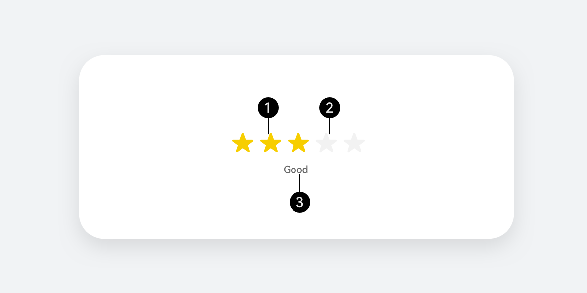

# 评分条

更新时间：

来源：https://developer.huawei.com/consumer/cn/doc/design-guides/rating-0000001929853906

表示用户使用感受的衡量标准条。开发相关描述请参考 [Rating](https://developer.huawei.com/consumer/cn/doc/harmonyos-references/ts-basic-components-rating) 文档。

#### 如何使用

**明确使用场景和评分规格。**评分条控件是一种允许用户对某个对象进行星级评分的交互控件。通过一组五个元素让用户进行选择，通过激活元素数量来提供对应分数的映射。主要使用场景为：电商应用中对商品进行评分；在线服务评价中对服务质量进行评分；内容分享平台中对内容质量进行评分、游戏、应用，或软件评分等等。

**评分等级的图形元素应该具有明确的视觉区分，避免用户混淆。**评分后应该有明确的反馈，让用户知道评分是否成功提交。开发者考虑是否需要为评分添加文字说明的输入框，以便用户补充评论。

**为了提高可用性，评分条控件应该支持点击或滑动等多种交互方式。**控件提供了基础的点击交互，用户可以直接点击想要选择的等级进行评分。也可以通过滑动多个元素进行交互，选择想要的评分等级。明确评分反馈，评分成功后，应该有视觉或文字反馈来确认评分已提交。

**根据使用场景设定滑动步幅。**评分反馈的分数与选择元素的数量有直接关系，在默认规格中，评分步幅按照 0.5 为基础值为一个单位，即每一次滑动元素递增的

| 序号 | 标题 | 描述 |
| 1 | 已选中星星 | 必选。可配置默认状态是否为选中。 |
| 2 | 未选中星星 | 必选。可配置默认状态是否为全部未选中。 |
| 3 | 评价文字 | 可选。不同评价等级为不同文字。 |

| 可操作评分条 | 不可操作评分条 |
| --- | --- |
| 用于如应用商店、购物场景、应用/功能的评分。也可以横向滑动对内容进行评分，跟手滑动状态变化，支持步长为整颗星星。 | 不可操作评分条仅用于评价量化展示。 |

#### 开发文档

[Rating](https://developer.huawei.com/consumer/cn/doc/harmonyos-references/ts-basic-components-rating)
