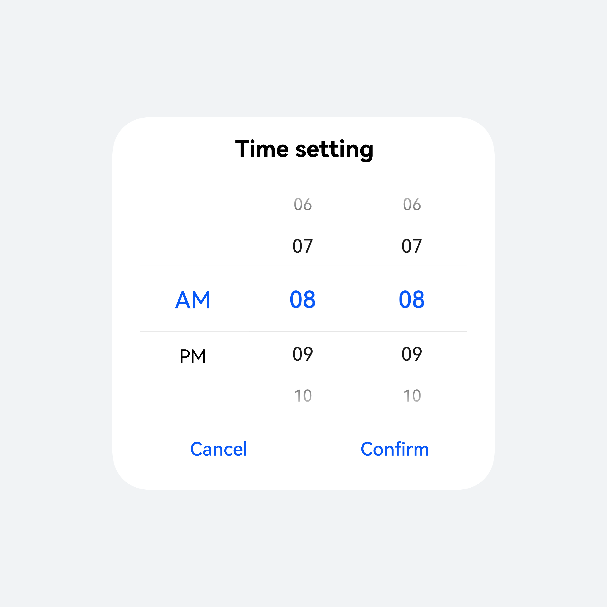
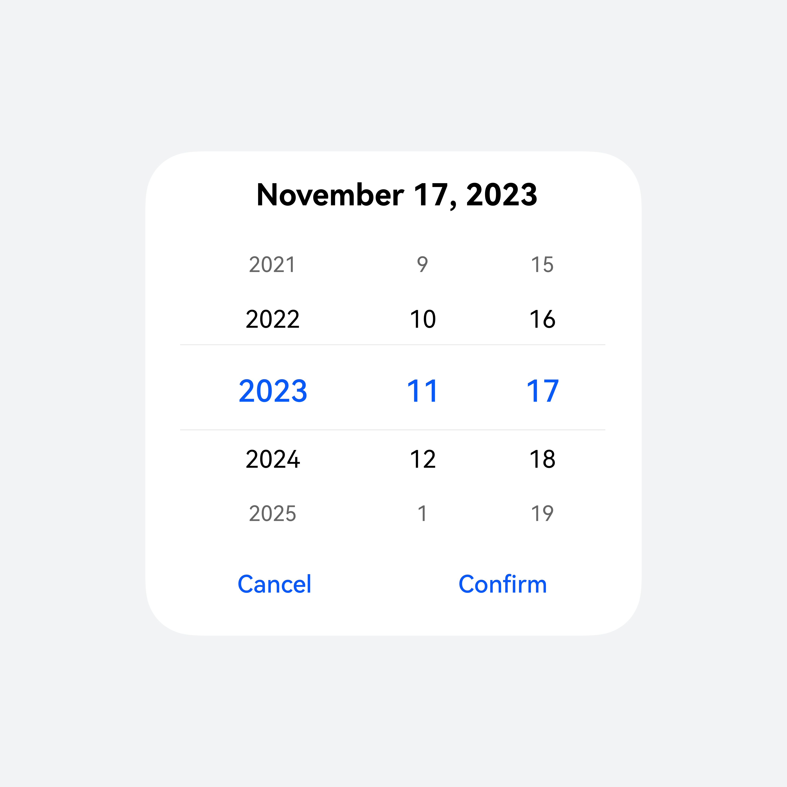
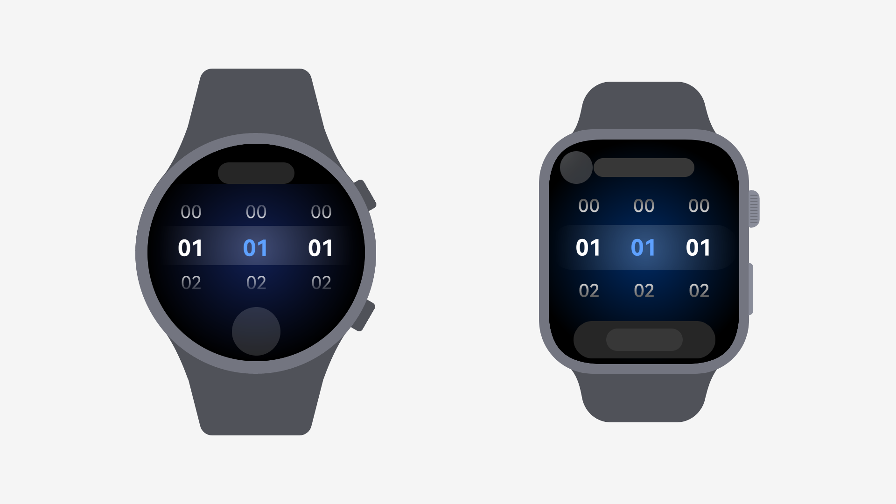
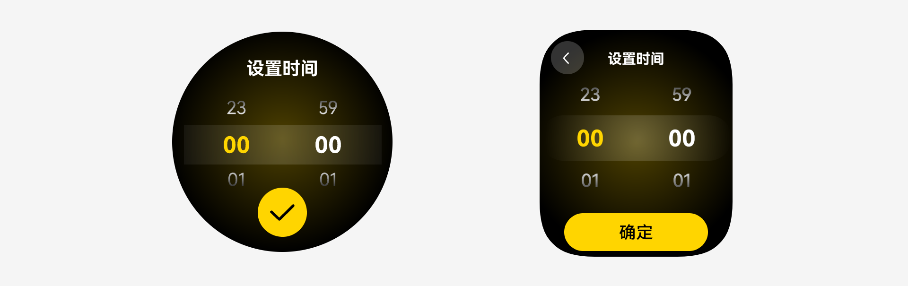

# 选择器

更新时间：2026-04-01 09:53:30

来源：https://developer.huawei.com/consumer/cn/doc/design-guides/picker-0000001956852749

当需要从单个维度或多个维度进行组合做选择时使用。月历视图日期选择器开发相关描述请参考 CalendarPicker 文档。滚动选择器开发相关描述请参考 DatePicker、TimePicker、TextPicker文档。

## 如何使用

通过选择不同的 Picker 组件实现对应效果。组件提供 TimePicker、DatePicker、TextPicker 三种组件类型，特殊的 Picker 内容可以通过 TextPicker 自定义实现。

在 CustomContentDialog 内添加 Picker 组件以实现与弹出框的组合。弹出框组件详细指导见 Dialog 。

|  |  |  |
| --- | --- | --- |
| TimePicker | DatePicker | TextPicker |

## 类型

|  |  |
| --- | --- |
| 滚动选择器 | 月历视图日期选择器 |

电脑设备

月历选择

月历时间段选择

|  |  |
| --- | --- |
| 单个月历日期面板，用于选择日期。 | 连月历日期面板，在选择日期段时使用。 |

月历选择

|  |    |
| --- | --- |
| 电脑必选月历日期选择入口 |    |

| 序号 | 元素名称 | 描述 |
| --- | --- | --- |
| 1 | 入口触发方式 | 电脑必选，手机端可自定入口触发方式 |
| 2 | 标题区 | 显示选中的年月，单箭头切换月份，双箭头切换年。 |
| 3 | 内容区 | 显示日期选项，可左右滑动，可配置显示农历。 |
| 4 | 操作区 | 操作为“取消”，“确定”，电脑可选。 |
| 5 | 容器 | 弹出框。 |

智能穿戴滑动选择器

当需要从单维度或多个维度单选进行组合做选择时使用。

时间选择器

时间选择器使用弹出框或者内嵌的方式，在智能穿戴上选择单个时间（小时:分钟:秒的格式）。

例如设置闹钟/计时器

其他选择器

· 通常有两种：数字选择器，文本选择器。

· 数字选择器默认按从小到大排序。

· 根据选择项的属性选择合适的默认选项，以减少大多数用户的操作。

例如设置熄屏时间/高度校准

## 开发文档

DatePicker

TimePicker

TextPicker

CalendarPicker
