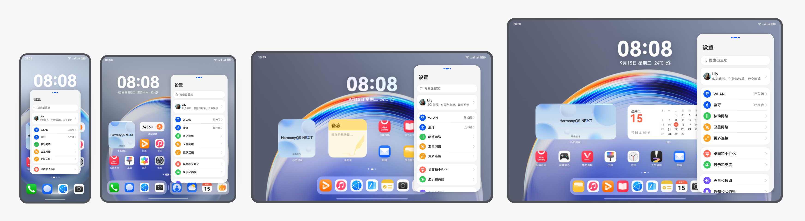
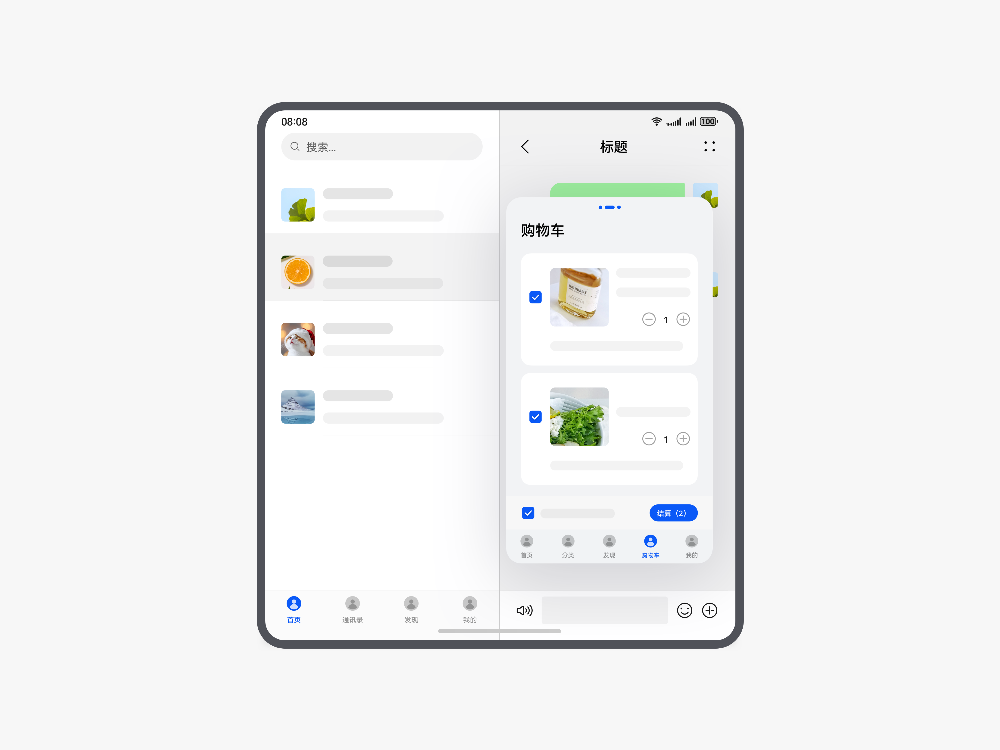

# 多窗口交互

更新时间：2026-03-11 06:16:00

来源：https://developer.huawei.com/consumer/cn/doc/design-guides/system-features-multi-window-interaction-0000001795392917

折叠屏展开态、平板等大屏幕设备，具有多任务并行和效率型任务处理的先天优势。

系统提供了悬浮窗、分屏、画中画三种多窗口交互，为用户在大屏幕设备上的多任务并行、便捷的临时任务处理提供更佳的使用体验。

#### 多窗口类型

| 多窗口类别 | 定位 | 体验价值 | 适用场景 |
| --- | --- | --- | --- |
| 悬浮窗 | 临时处理某个任务或短时间多任务并行使用 | 减少跳转 | 多应用多任务 单应用多任务 |
| 分屏 | 两个应用/任务长时间并行处理 | 多任务并行 | 多应用多任务 单应用多任务 |
| 画中画 | 特定场景下的任务与当前应用或者其他应用并行使用 | 特定场景多任务并行 | 视频播放、直播、视频会议、视频通话、座舱驾驶影像等 |

#### 基础要求

 - **保证布局良好**

应用内的元素布局应进行响应式设计，保证应用界面在全屏、悬浮窗、分屏不同窗口模式间进行切换时、在设备横竖屏旋转时、调整系统字号、调整系统显示模式后，依然保持可用、良好的布局，不出现应用元素无法显示的问题。

 - **窗口内布局的特殊处理**

悬浮窗口和分屏窗口内，在应用界面顶部会显示拖拽横条，应用界面中需要增加一个横条高度，来避免出现横条和应用顶部的功能热区重叠，导致应用功能无法操作的问题。分屏窗口需要隐藏系统状态栏。

 - **保证应用任务的连续性**

当应用以分屏、悬浮窗显示时，需要保证应用不被特殊情况所打断进程。例如应用在不同窗口模式间切换时、在设备横竖屏旋转时、调整系统字号、调整系统显示模式后，应用不会发生重启、闪退等问题。且切换之前的任务和相关状态得以保存和延续，或者能够快速恢复，给用户提供连续的体验。

 - **保证多个任务同时正常使用**

例如用户正在玩游戏或看视频，同时在使用其他应用。只要游戏或视频应用还在前台显示，依然要保证能正常运行，不会因为用户正在使用的是另一个应用，而导致游戏暂停或视频暂停。

 - **音频冲突处理**

当应用正在播放视频或播放音乐时，新打开一个窗口应用，并触发了新的音频任务，原应用对音频的处理要符合用户预期，例如临时暂停音视频的播放或降低音量，以便于用户听到新的音频。

 - **多窗口体验切换**

可通过点击顶部横条并拖拽的交互，实现分屏和悬浮窗之间的互换。实现多窗口体验融合。

| 窗口互换 | 交互方式 |
| --- | --- |
| 悬浮窗到分屏 | 点击悬浮窗的顶部横条，拖拽到屏幕左/右边缘区域停留 |
| 分屏到悬浮窗 | 点击分屏的顶部横条，拖拽到屏幕中间区域 |
| 分屏左右互换 | 点击分屏的顶部横条，拖拽到另一侧分屏区域 |
| PIP&悬浮窗互换 | 不支持 |
| PIP&分屏互换 | 不支持 |

#### 悬浮窗

悬浮窗用于在已有的任务基础上，临时处理另一个任务短时间多任务并行使用。

直板手机、折叠屏折叠状态下，一屏幕内最多显示一个悬浮窗；平板或折叠屏展开状态下，一屏幕内最多显示两个悬浮窗；悬浮窗可以最小化收起到侧边条，悬浮窗适用于玩游戏看视频等沉浸式场景下临时回复消息，购物时临时使用计算器等。

#### 悬浮窗比例与适配

**多端的悬浮窗比例**

悬浮窗默认靠右。同一设备上横竖屏旋转，窗口会回到默认位置，且窗口比例保持不变。

| 设备 | 竖向悬浮窗 | 横向悬浮窗 |
| --- | --- | --- |
| 直板机/折叠屏折叠状态 | 3:4.575 | 16:9 |
| 折叠屏展开状态 | 9:16 | 16:9 |
| 11 寸以下平板 | 9:16，3:4 | 3:2 |
| 11 寸以上平板 | 9:18，3:4 | 3:2 |

**平板上的自由浮窗适配**

直板机和折叠屏上，悬浮窗只支持等比缩放。

平板上，悬浮窗支持无级缩放调节，且支持全屏时，通过从左/右下角向内滑触发大悬浮窗。

平板上的应用需要针对 3:2 的横向大悬浮窗进行适配，适配规则如下：

**侧边导航的适配**

 - 应用全屏显示时有侧边导航的，3:2 的横向悬浮窗也保持侧边导航。切换至竖向悬浮窗时，导航在悬浮窗内的底部显示。
 - 应用全屏显示时是底部导航的，3:2 的横向悬浮窗也保持底部导航。        

|  |
| 3:2 的横向悬浮窗保持侧边导航的示例 |

|  |
| 竖向悬浮窗底部导航的示例 |

|  |
| 应用全屏显示时是底部导航的，在 3:2 的横向悬浮窗保持底部导航的示例 |

**分栏的适配**

应用全屏显示时有分栏布局的，3:2 的横向悬浮窗也保持分栏布局显示。切换至竖向悬浮窗时，不再分栏显示。

|  |
| 应用全屏显示时是分栏布局的，在 3:2 的横向悬浮窗保持分栏布局的示例 |

|  |
| 竖向悬浮窗不再分栏显示的示例 |

#### 悬浮窗类型

目前支持 2 种悬浮窗：

 - 应用悬浮窗：悬浮窗承载整个应用的功能，在同一个悬浮窗内可进行应用内不同功能的切换和跳转。应用悬浮窗一般带底部页签，可切换不同功能。
 - 任务悬浮窗：悬浮窗承载一个特定的任务，悬浮窗内只能执行本任务相关的功能。 任务悬浮窗一般不带底部页签，无法切换至其他功能。

| 应用悬浮窗 | 任务悬浮窗 |

#### 悬浮窗的应用

**临时任务处理**

可通过悬浮窗显示需要临时使用的任务，全屏显示需要长时间使用的任务，从而实现任务的短暂并行或快速处理。实现临时任务处理，主要有以下三种方式：

 - 一步小窗手势触发
 - 应用内 Dock 触发
 - 应用内特定按钮触发

想要有更自然的交互体验，更推荐进行“应用内可触发悬浮窗”的适配，通过应用内特定按钮触发悬浮窗。

例如，全屏播放视频时，遇到需要支付或购买 VIP 的情况，点击支付按钮，调出支付界面悬浮窗，通过该悬浮窗快速完成支付过程，避免全屏的页面跳转，让视频播放的过程更顺畅。除支付外，临时查看附件、拨打电话、查看地图、IM 对话、登录等场景，都非常适合使用应用内悬浮窗。

应用内触发支付悬浮窗，不跳转页面完成支付的示例

应用内触发地图悬浮窗，不跳转页面完成导航的示例

#### 跨窗口拖拽

打开悬浮窗后，从某个窗口内拖拽内容到另一个窗口，即为跨窗口拖拽。

跨窗口拖拽图片的示例

#### 分屏

分屏一般用于两个应用长时间并行处理的场景。例如一边看购物攻略一边浏览商品；一边看视频一边玩游戏；一边看学习类视频一边做笔记等。

#### 分屏样式

目前支持 2 种分屏样式：左右分屏和上下分屏。在大尺寸设备上，适配分屏后，可以提供较好的无遮挡的任务并行体验。

 - 左右分屏适合通用的任务并行，例如一边 IM 对话一边购物等；
 - 上下分屏适合视频、游戏、会议等横向布局内容的任务并行，例如一边看视频一边 IM 对话等。

| 左右分屏 | 上下分屏 |

**上下分屏的布局适配**

上下分屏时，需要确保顶部标题、底部页签、页面内的核心操作按钮等完整显示。

支持直板机横屏的应用，需要按照横屏布局进行适配显示。以下为参考示例。

图库的上下分屏适配示例

#### 分屏类型

目前支持 2 种类型的分屏：应用分屏和任务分屏。

 - 应用分屏：不同应用组成的分屏。例如畅连应用和浏览器形成分屏。
 - 任务分屏：单个应用内的不同任务组成的分屏，两侧屏幕可以同时展示不同的任务或都展示同一个任务。例如当前正在全屏使用备忘录，再在侧边栏长按后拖出备忘录应用图标，将备忘录的两个笔记任务形成分屏。支持多实例的应用，可以实现任务分屏。

|  |  |
| 应用分屏 | 任务分屏 |

#### 分屏的应用

**跨应用任务并行**

不同应用之间，可通过分屏实现两个任务并行。触发跨应用的分屏任务并行，主要有以下两种方式：

 - 一步分屏手势触发
 - 应用内 Dock 触发

通过分屏进行两个应用任务并行的示例

**应用内任务并行**

支持多实例的应用，可通过分屏实现一个应用的多任务并行。

系统的分屏交互“一步分屏手势”，或“应用内 Dock”可触发应用内的任务并行分屏，但要想获得自然的交互体验，更建议通过应用内入口触发任务分屏。应用内入口触发任务分屏，主要有以下两种方式：

 - 应用内按钮触发
 - 应用内点击特定功能自动触发

|  |
| 通过应用内分屏按钮触发任务分屏的示例 |

|  |
| 通过应用内全屏按钮退出任务分屏的示例 |

|  |
| 通过应用内分屏按钮触发任务分屏的示例 |

|  |
| 通过关闭按钮退出任务分屏的示例 |

|  |
| 直接点击小程序链接触发任务分屏的示例 |

**跨窗口拖拽**

形成分屏或打开悬浮窗后，从某个窗口内拖拽内容到另一个窗口，即为跨窗口拖拽。

|  |
| 跨窗口拖拽图片的示例 |
