# 导航条

更新时间：2025-08-14 12:14:00

来源：https://developer.huawei.com/consumer/cn/doc/design-guides/navigation-0000001957075737

导航条是 HarmonyOS 系统的典型特征，是手势导航等重要功能的提示入口，是应用必须适配的要求。

## 设计原则

要做到导航条和应用内的底部交互不干扰，达到和谐的使用体验，需要注意以下几点：

1) 调用最新的系统控件，且窗口没有声明全屏，导航条自动抬高避让 。

2) 如果窗口声明了全屏 (适用于视频、游戏等沉浸式应用场景)，需要根据开发指南调用系统能力进行导航条避让适配。

3) 需要根据开发指南实现导航条的沉浸式背景效果。

4) 使用 Webview 或三方框架开发的应用，同样需要进行导航条的抬高避让和沉浸式背景适配

底部导航条的开发适配指南请参阅开发应用沉浸式效果。

## 沉浸式背景

系统基于深色、浅色等不同背景，为导航条提供智能反色的能力。应用在进行界面设计时，需要确保为导航条底部提供沉浸式的背景和28vp高度的抬高避让。

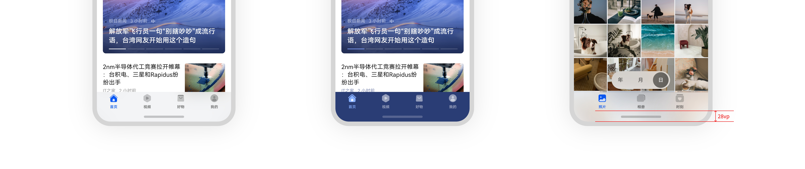

## 导航条适配

需要考虑应用内的导航条适配，避免导航条遮挡底部内容或交互

- 可滚动页面
- 底部固定控件&键盘
- 底部悬浮控件
- 半模态&弹出框
- 多窗场景
- 横屏场景
- 沉浸式场景
- 短视频场景

### 可滚动页面

可滚动页面，无需避让导航条，当滚动的内容滑到最底部时，需要进行最底部内容的抬高适配，避免被导航条遮挡。

### 可滚动列表实例

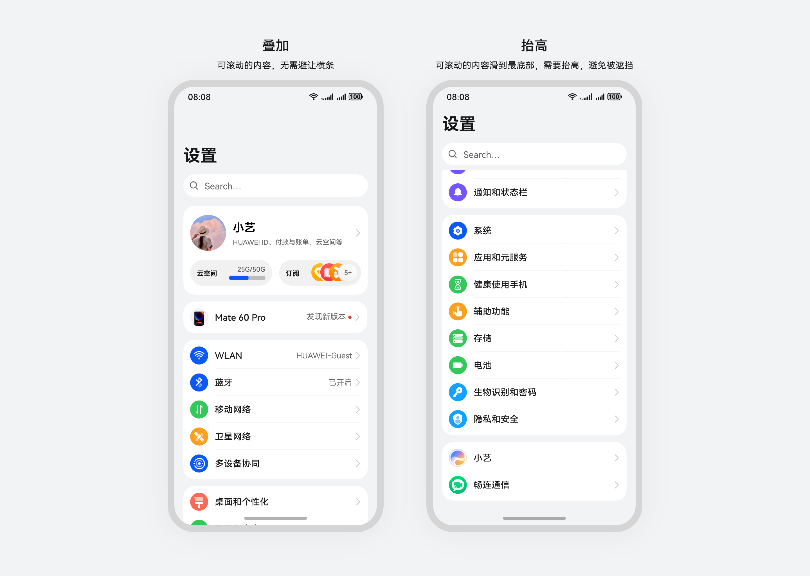

### 可滚动网页示例

网页的可滚动内容，也需要遵循以上适配要求，例如下图示例：

1) 可滚动内容，无需避让导航条；

2) 网页缩放后也遵循以上适配要求，可滚动内容无需避让导航条；

3) 可滚动内容，滑到最底部，内容需要抬高，避免被导航条遮挡；

4) 网页底部有滚动条时，滚动条和导航条要避免显示重叠。

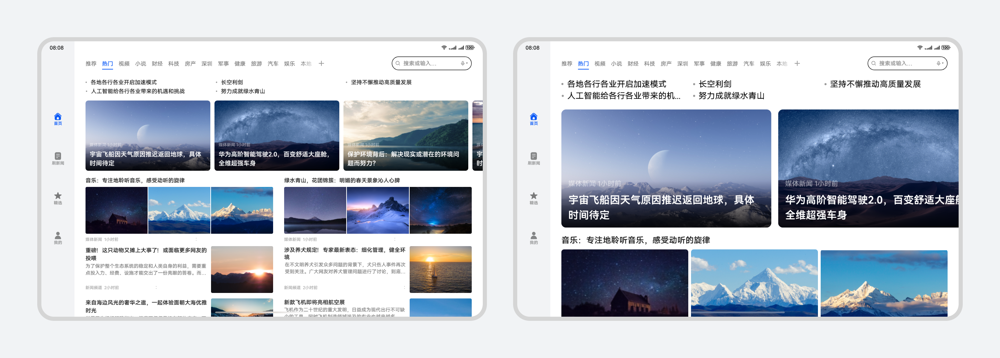

### 底部固定控件&键盘

| 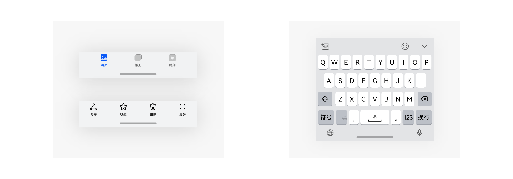 |
| --- |
|           推荐（底部固定控件抬高，避免和导航条互相遮挡，且提供沉浸式背景效果） |
| 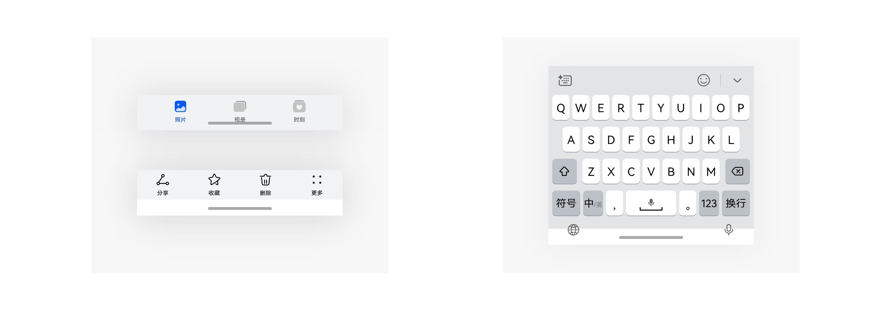 |
|           不推荐（导航条和底部控件互相遮挡；导航条没有沉浸式背景效果） |

### 底部悬浮控件

| 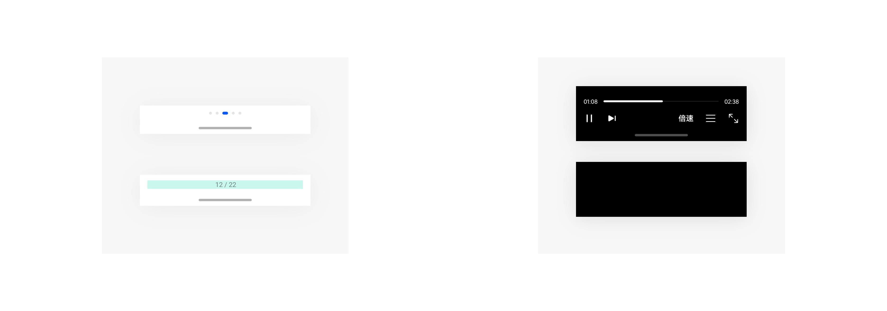 |
| --- |
|           推荐（底部悬浮控件抬高，避免和导航条遮挡；Video控件导航条可超时不处理自动隐藏） |
| 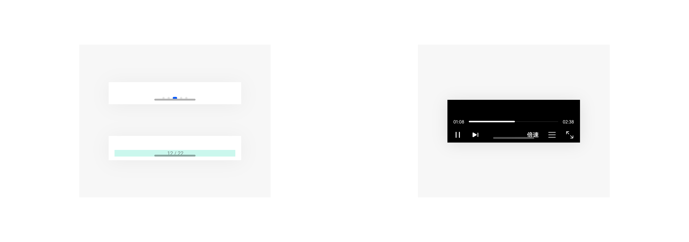 |
|           不推荐（导航条和底部控件互相遮挡） |

### 半模态&弹出框

半模态控件中可滚动的内容可显示在导航条下方，可滚动内容滑到最底部时需要向上抬高，避免最底部的交互被导航条遮挡；有弹出层控件时，弹出层控件与导航条要避免互相遮挡，导航条层级比弹出层控件高。

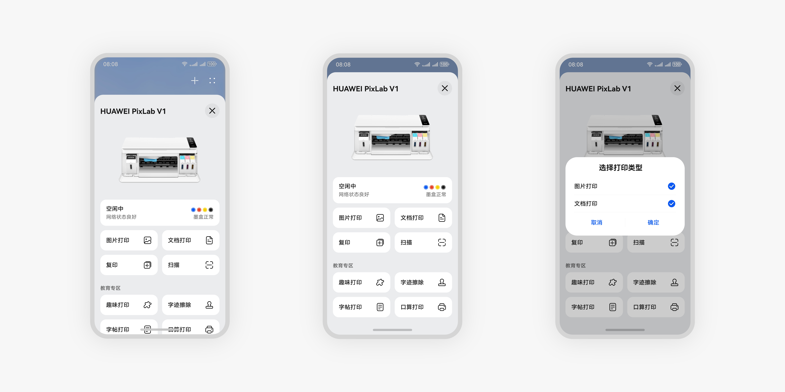

## 多窗场景

多窗存在悬浮窗、分屏和画中画三种窗口形态。分屏时需要进行导航条的适配，悬浮窗内、画中画内都无需显示导航条也无需进行导航条适配。

### 上下分屏

下分屏应用的底部需要进行导航条适配，上分屏应用底部控件需要避免抬高过高。

| 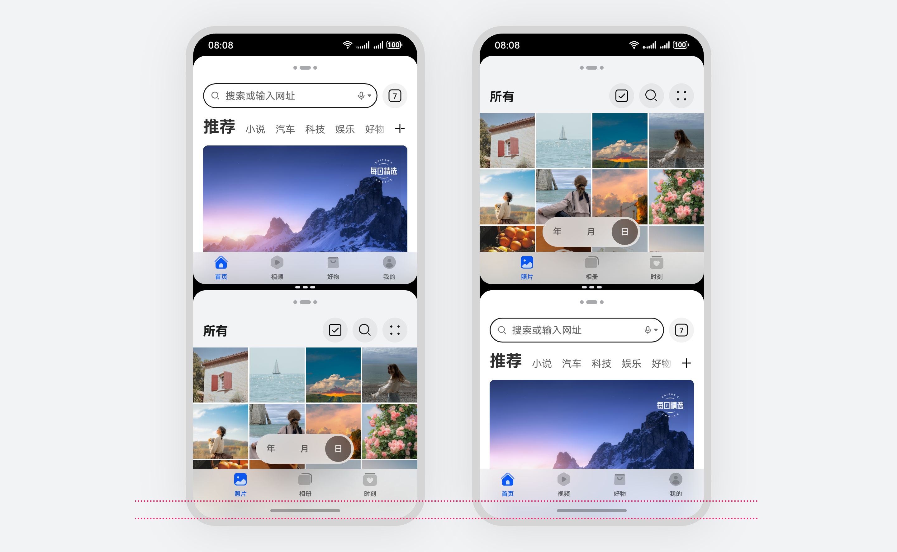                    推荐（下分屏应用适配导航条） | 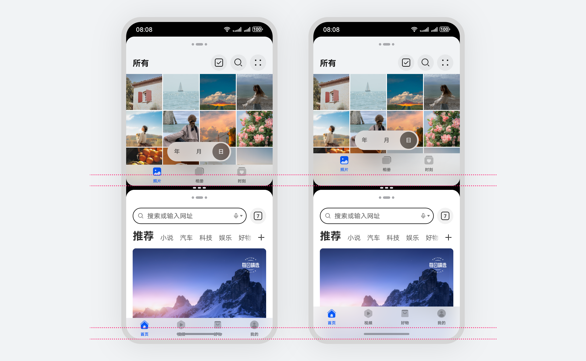                    不推荐（上分屏应用底部抬高过高，浪费可显示空间，下分屏未适配导致显示叠加） |
| --- | --- |

### 左右分屏

两侧分屏应用的底部均要适配导航条，避免应用底部控件与导航条相互遮挡。

|                     推荐（左右分屏时，两侧应用均适配导航条） | 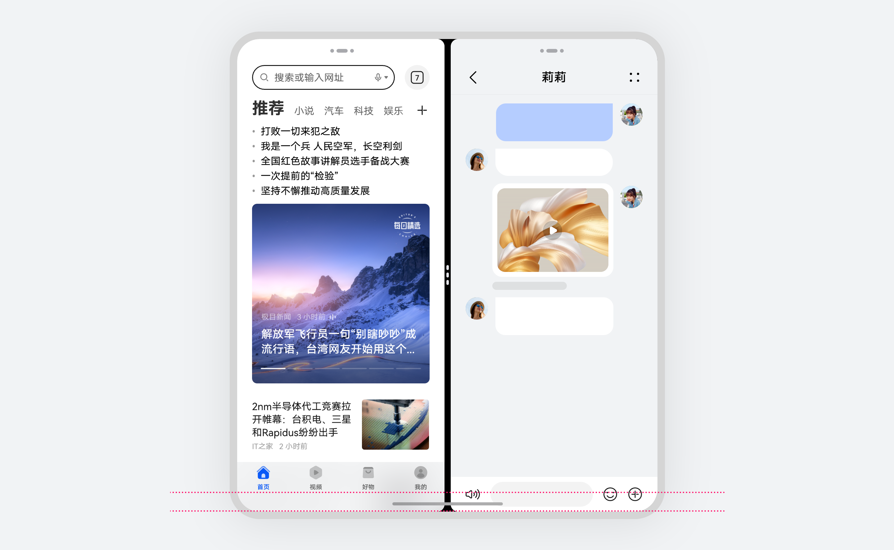                    不推荐（应用底部固定控件与导航条相互遮挡） |
| --- | --- |

### 悬浮窗

导航条为系统特性，不会在悬浮窗内显示。当应用在悬浮窗内显示时，需要避免窗口内底部抬高过高导致浪费显示空间。

|                     推荐（窗口内应用底部固定控件正常显示） | 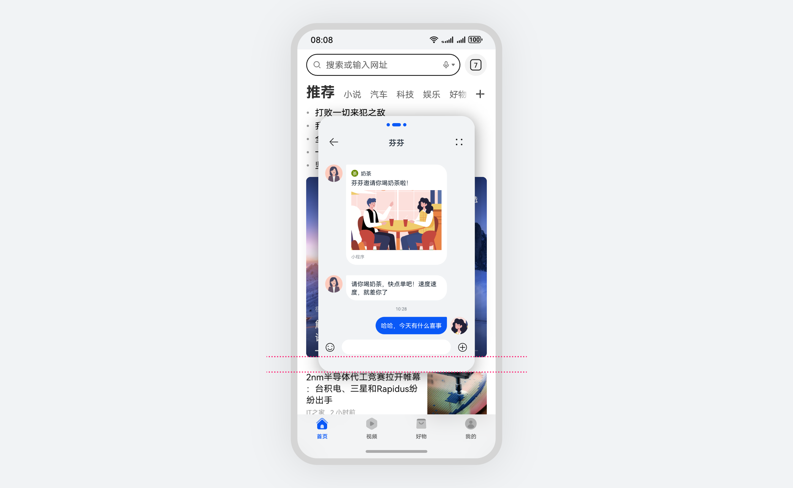                    不推荐（窗口内应用底部控件预留了抬高，浪费空间） |
| --- | --- |

## 横屏场景

### 普通横屏场景

适配了直板机横屏的应用内，横屏时导航条正常显示，应用需要进行导航条的适配。通常横屏场景隐藏底部控件。

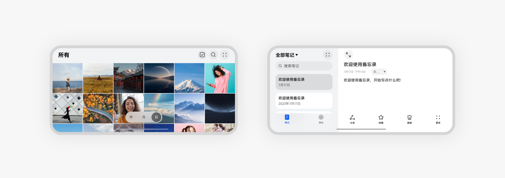

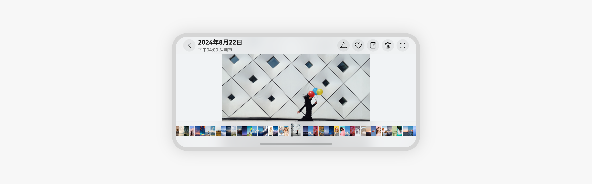

## 沉浸式场景

典型沉浸式场景：游戏、全屏播放长视频、全屏看大图、拍摄、录像等。

沉浸式场景下，默认显示导航条，超过 2 秒不处理，自动隐藏。导航条隐藏后，从屏幕底部上滑可恢复导航条的显示。

### 长视频示例

沉浸式播放视频，默认显示导航条，2秒后自动隐藏的示例。

### 横屏沉浸式场景示例

在横屏的沉浸式场景下，导航条支持默认显示，超过2秒自动隐藏。例如，横屏查看图片详情时，默认显示，2秒后自动隐藏导航条。

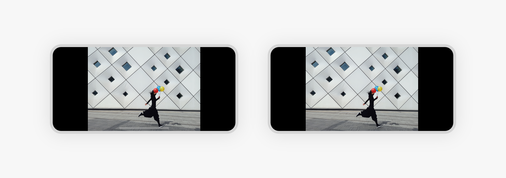

### 图片详情示例

图片详情页查看大图，默认显示导航条，进入沉浸看图状态后，先显示导航条，2秒后自动隐藏的示例。

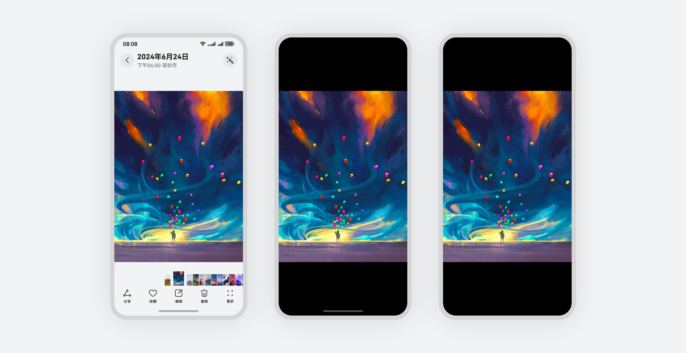

宽屏设备上的沉浸式场景，建议上下或左右撑满显示，避免因为导航条影响可显示区域的大小。

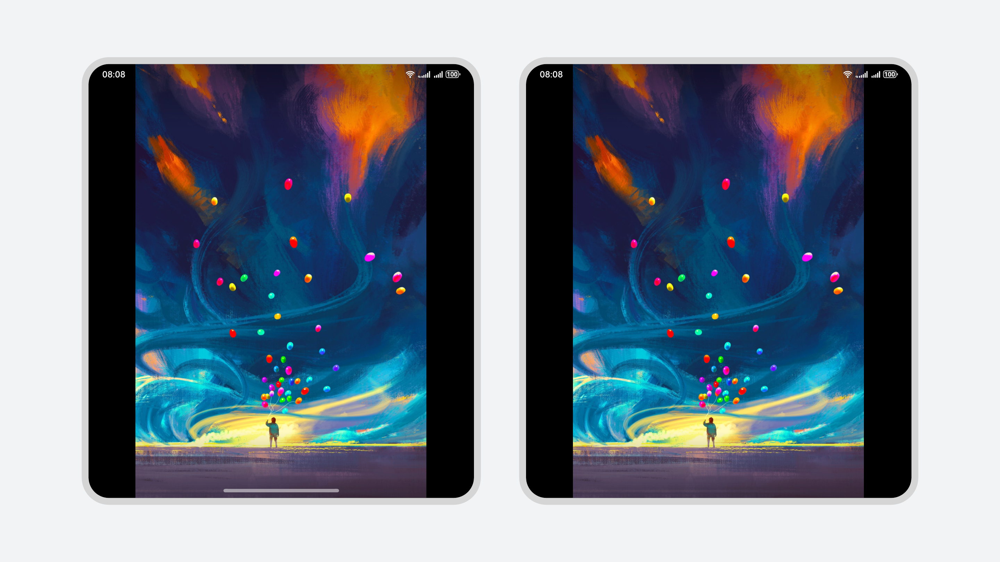

推荐（全屏显示，上下高度撑满全屏）

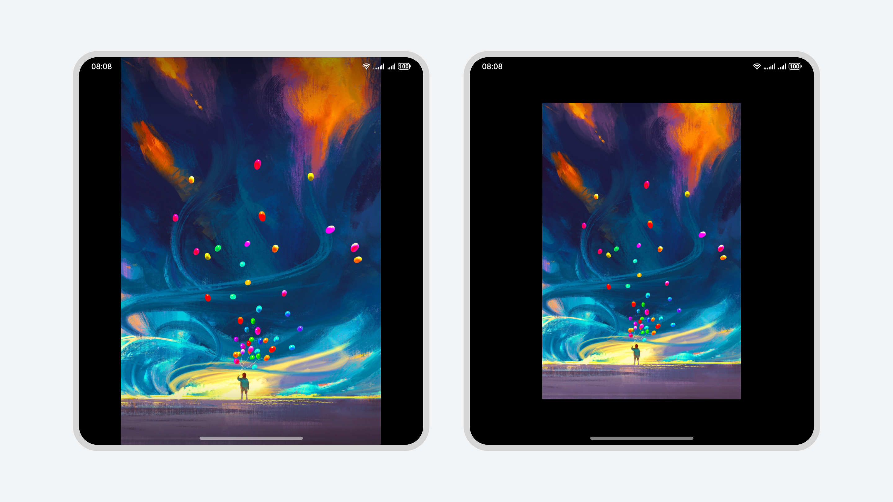

不推荐（导航条没有超过2秒自动隐藏，或大图高度未撑满全屏）

### 游戏示例

游戏场景默认显示导航条，超过2秒自动隐藏。从底部向上滑恢复显示导航条。游戏场景需要进行手势导航的防误触适配，所以从底部上滑两次手势导航才生效，全屏页面才会跟手缩小；其他场景从底部上滑一次即可手势导航生效，全屏页面跟手缩小。

## 短视频场景

短视频场景建议上下撑满画面，同时底部控件抬高，避免底部控件与导航条相互遮挡。

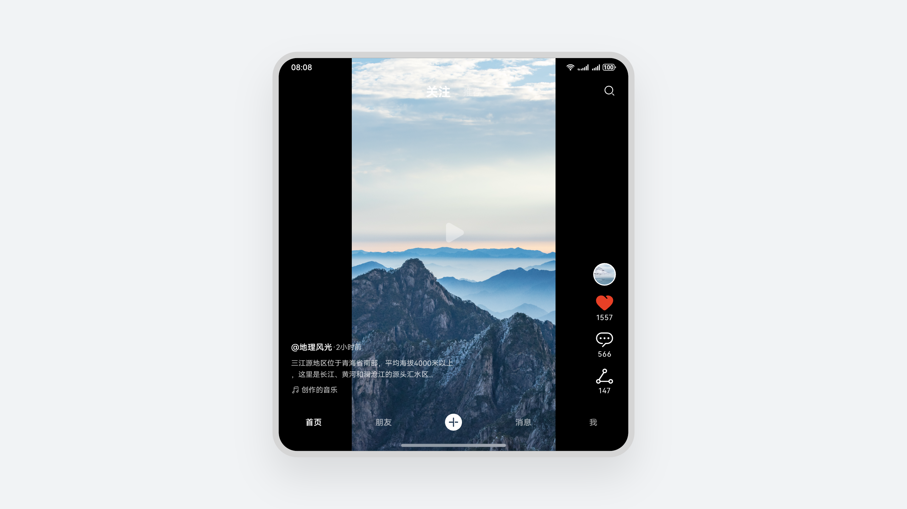

推荐（视频上下撑满，更沉浸的显示效果）

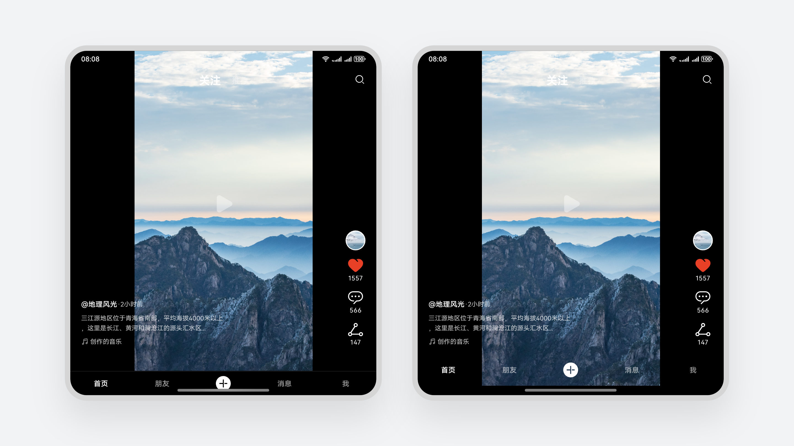

不推荐（底部固定控件与导航条相互遮挡，或视频画面未上下撑满全屏）
