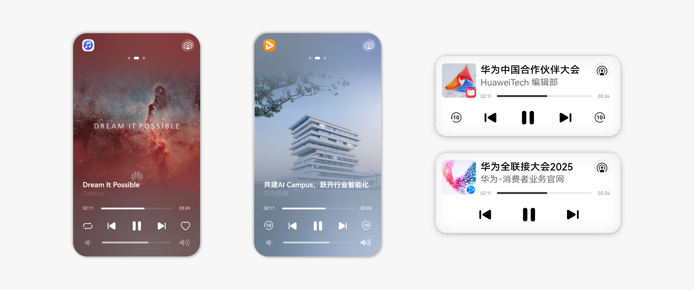
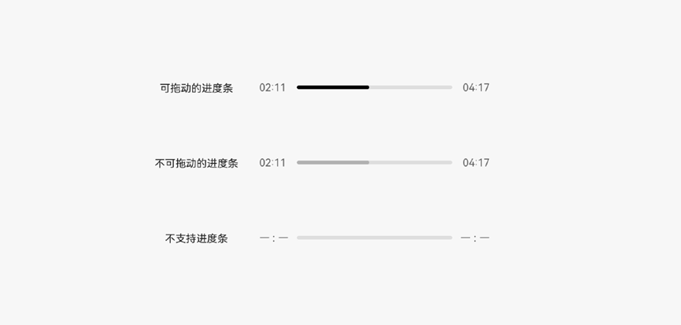
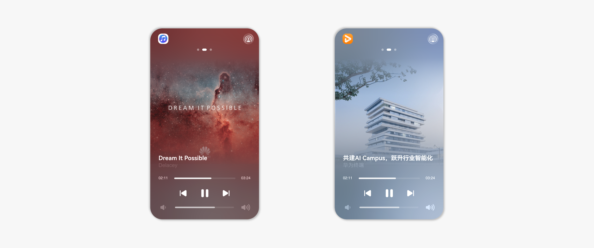
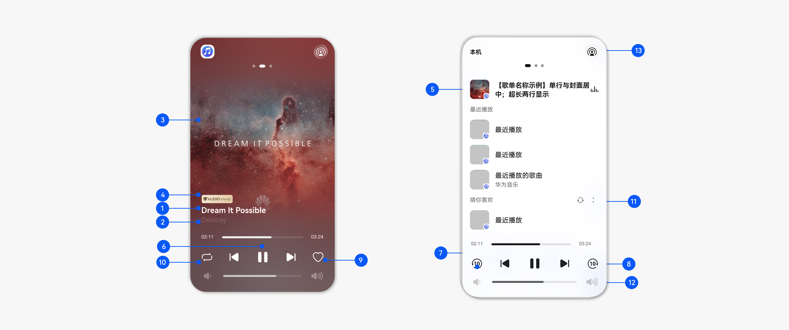
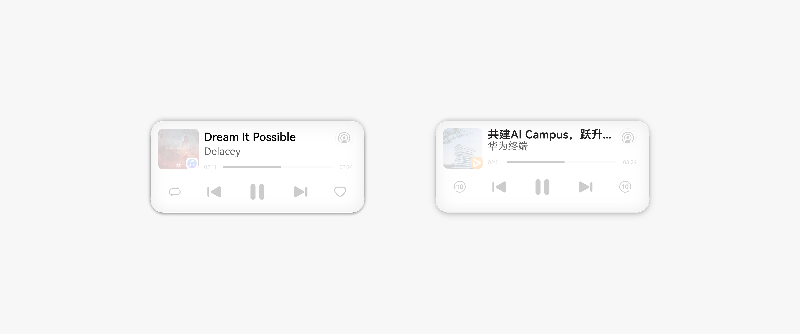
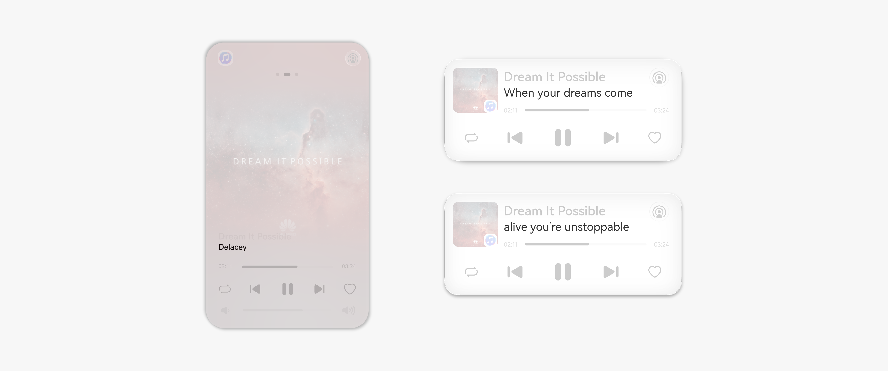
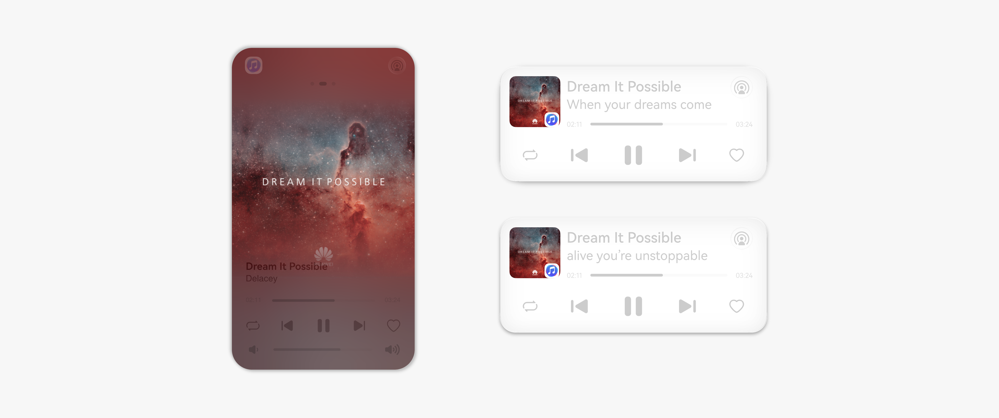
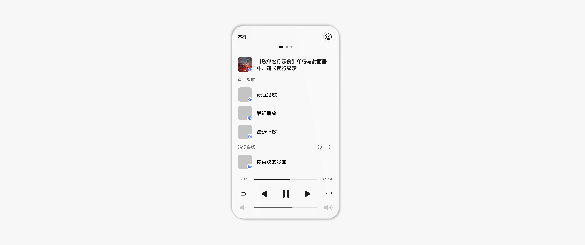
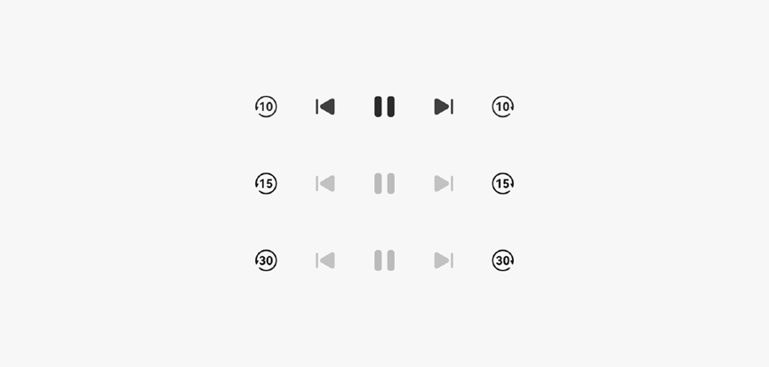
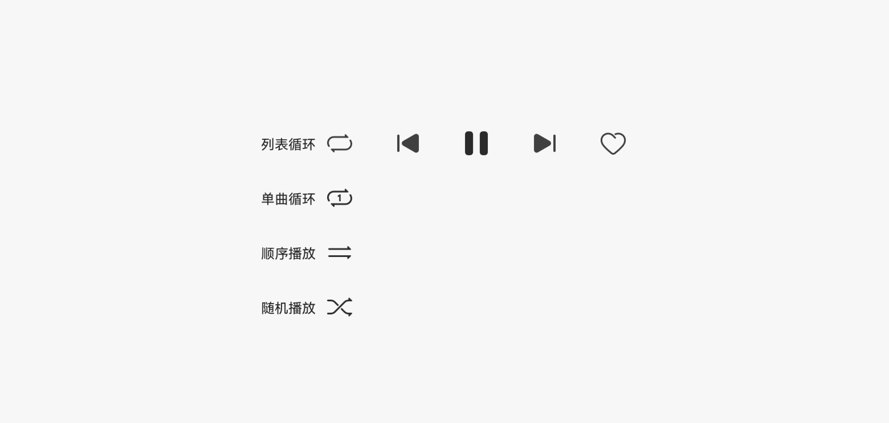

# 播控中心

更新时间：2026-04-13 09:40:30

来源：https://developer.huawei.com/consumer/cn/doc/design-guides/broadcasting-control-0000001957017133

##### 媒体播控

媒体播控用于显示当前设备正在播放的音视频媒体信息，以及帮助用户高效快捷地管理媒体内容的播放。
 
媒体播控可用于音乐、视频播放，直播，听书，网页流媒体播放等多种场景，并在不同场景下针对性地提供不同功能与统一的界面体验。
 

 

 
 

##### 媒体播控设计原则

- 为用户提供媒体内容预览和播放控制功能。
- 媒体内容的展示遵循规范，多端各场景保证体验一致性。

 
 

##### 播控模板构成

播控卡片模板由媒体信息和播控功能两类内容组成。
 

 
**媒体信息**
 
媒体信息是媒体内容自有的属性类信息，不因用户的播放行为而改变。
 
媒体信息包括：
 
1.标题（主、副标题）；
 
2.歌词；
 
3.封面图片；
 
4.资源标签；
 
5.歌单；
 

 
**播控功能**
 
播控功能是用于控制、管理媒体播放的系统能力。根据媒体内容类型，或应用服务不同，提供给用户的播控功能也会有差异。
 
播控功能包括：
 
6.播放/暂停；
 
7.上一首/下一首；
 
8.快进/快退；
 
9.收藏；
 
10.切换播放模式；
 
11.播放进度；
 
12.音量；
 
13.投播。
 
 

##### 标题

标题分为主、副标题，在所有的播控场景中都会显示。
 
主标题用于显示歌曲名、影片名等内容名称，建议采用简短的字符串。字符串超长时会从右向左滚动显示。
 
副标题用于显示媒体内容的辅助信息，如歌曲的歌手名、影片的发布者信息、剧集/综艺节目的选集信息等。
 

 
副标题区域在一定条件下，可以实时显示歌词信息，详见下一节 “歌词”。
 
 

##### 歌词

歌曲类媒体内容如有歌词信息，需要在副标题区域显示歌词。
 
在歌词开始显示前，需要保证副标题处的辅助信息至少显示1秒。
 
歌词以句为单位显示，单句歌词的字符超长时，可以在副标题区域从右向左滚动显示。
 

 
歌曲暂停播放后，保持当前歌词显示位置。
 
用户拖动进度条的过程中歌词保持原速度刷新显示，不会实时响应进度条变化刷新。
 
 

##### 封面图片

应用提供媒体内容的封面图片，如音乐专辑封面、视频海报。
 
音乐类媒体内容应提供比例为 1:1 的方形封面图片，建议分辨率为 800px * 800px（如果应用提供的图片分辨率更大，将被压缩到 800px * 800px 显示），最小分辨率是 300px * 300px。
 

 
 

##### 资源标签

应用可以提供当前播放的媒体内容的资源标签信息。
 
根据媒体资源的属性，应用可用提供标签信息以体现该媒体内容的特殊性，如：AudioVivid、Hi-Res、192kHz、VIP等。
 
支持应用提供自定义标签，不超过10个字符。
 
资源标签除AudioVivid 为预置图标外，其他常见标签及自定义标签均以文本格式显示。
 

 
**资源标签显示优先级**
 
AudioVivid ＞ Hi-Res ＞ 其他自定义标签
 
自定义标签中，影响媒体内容完整性的标签（如 Vip / 付费 类标签）＞ 其他标签
 
 

##### 歌单

播放音频类媒体内容时，播控可以显示应用提供的歌单信息。
 

 
**显示规则**
 
支持歌单显示的音频媒体内容有：音乐歌曲、有声书、播客等。视频媒体内容、直播类媒体内容暂不支持歌单。
 
应用根据用户播放当前音频媒体时选择的入口，向播控提供对应的歌单信息。歌单信息仅包括：歌单封面（图片显示规则等同于歌曲封面）、歌单标题（不支持显示副标题）。
 

 
**交互规则**
 
歌单分为 “最近播放” 的历史歌单，和 “为你推荐” 的个性化歌单；分别通过用户播放行为记录和应用推荐产生。
 
用户如未开启 “播控推荐服务”，歌单列表仅展示 “最近播放”。播控会记录用户播放过的音频内容所属的歌单信息。如果多个音频内容同属一个歌单，则只记录为一个歌单信息。最多可展示 4 个最近播放的歌单。
 

 
如果用户开启了 “播控推荐服务”，歌单列表展示 “为你推荐”。最多可展示 8 个基于算法推荐的歌单。
 
用户在点击歌单封面时，播控会立即切换显示对应歌单，并播放歌单中的音频媒体。
 
如果歌单存在内容失效、用户权限不足等问题时，应用需要向播控发出销毁对应歌单的请求。
 
 

##### 快进快退

对于需要频繁调节播放进度的媒体内容（如播客、听书等长音频媒体，或长视频媒体），应用可以提供快进快退功能。
 
可选择快进快退的时间长度：10s、15s、30s。
 
快进快退可以分别选用不同的时长。
 

 
 

##### 切换播放模式

应用可以提供切换播放模式的功能。
 
播控可支持的播放模式有：顺序播放、列表循环、单曲循环、随机播放。
 
如存在某n项（n≤2）播放模式应用不支持，则切换时跳过不支持的模式。
 
如应用不支持上述播放模式中的3或4项，播控将置灰此按钮，用户无法点击。
 

 
 

##### 播放进度

应用提供当前播放的媒体内容的（时间）进度信息及功能交互。
 
播放进度需要显示的时间信息有：总时长（最大 999min59s）、当前播放时间（最大999min59s）。
 

 
**交互规则**
 
进度条支持交互，用户可以按住进度条左右拖动以快速定位到不同时间点播放。
 
直播类媒体内容不需要提供进度信息，进度条默认置灰显示。
 
 

##### 基础功能模板

如果不支持快进/快退、收藏或切换播放模式，仅显示基础功能按钮—— “播放/暂停”、“上一首”、“下一首”。
 
如果这三项基础功能按钮也不支持（例如直播场景无法暂停，某些播单没有上下首），则将不可用的基础播控功能置灰。
 

 
 

##### 播控场景及模板规格

播控模板会在不同场景下以不同形式展示给用户。根据使用场景的差异和显示面积的不同，播控模板展示的内容数量可能会有一定程度的精简。
  
| 场景 | 播控模板 | 显示内容 | 备注 |
| --- | --- | --- | --- |
| 控制中心（一级页） | 小卡片/部分折叠为沉浸卡片 | 媒体标题；封面图片；播放/暂停；上一首/下一首；快进/快退；投播 | 二级页入口 |
| 控制中心（二级页） | 沉浸卡片 | 媒体标题；封面图片；资源标签；歌单；播放/暂停；上一首/下一首；快进/快退；切换播放模式；进度条；音量条；投播 | 完整的全量内容规格 |
| 控制中心（二级页） | 中卡片 | 同上，但封面图片显示为小图 | 仅在展示投播设备列表时显示此布局 |
| 通知中心、锁屏 | 通知卡片 | 媒体标题；封面图片；资源标签；播放/暂停；上一首/下一首；快进/快退；切换播放模式；进度条；投播 |    |
| 锁屏（沉浸模式） | 大卡片 | 同 “大卡片”，但不显示音量条 |    |
 
 

 
开发相关描述清参阅[基础播控](https://developer.huawei.com/consumer/cn/doc/harmonyos-guides/basic-playback-control)文档。
