# 服务卡片

更新时间：2026-02-10 06:11:30

来源：https://developer.huawei.com/consumer/cn/doc/design-guides/system-features-service-widget-0000002087671904

##### 概述

服务卡片，简称“卡片”，是 HarmonyOS 系统一种呈现信息和交互操作的载体，在应用或元服务中提取出及时、核心、实用的信息和操作，提供给用户简洁、高效的体验。

##### 卡片简介

将 HarmonyOS 应用和元服务的重要信息以卡片的形式展示在桌面，用户可通过快捷手势使用卡片，通过轻量交互行为实现服务直达、减少层级跳转的目的。卡片的核心理念在于提供用户容易使用且一目了然的信息内容，将智慧化能力融入到服务卡片的体验中供用户选择，同时满足在不同终端设备上的展示和自适应。

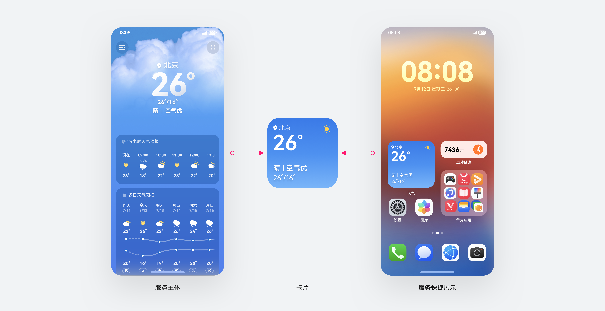

##### 卡片的添加入口

用户可以轻松查找和管理卡片，HarmonyOS 中提供多种入口供用户发现和添加

 - **从待机屏保中添加**

用户在待机屏保下，通过双指捏合/长按进入编辑态，可选择增加/移除卡片。

 - **从桌面或锁屏添加**

在桌面管理界面的入口中通过长按应用图标或双指捏合用户可以查找服务卡片，选择尺寸后添加至桌面。在锁屏界面通过长按时钟或双指捏合可以查找锁屏的卡片并添加。

 - **从应用中添加**

用户在应用内长按卡片，如果该卡片支持服务卡片能力，可以直接添加至桌面；通过元服务的系统服务面板可调起对应的卡片面板，将卡片添加至桌面。

 - **从元服务中添加**

用户在元服务中点击右上角胶囊中“更多”调起元服务面板，可选择卡片添加至桌面。

##### 体验原则

 - **突出服务内容，而非全是跳转入口**

谨慎使用按钮这类操作控件，若一个卡片仅有一组信息内容，则点击卡片进入服务或应用即可。避免使用按钮给用户暗示以吸引用户点击按钮的情况，除非展示的内容需要有明确的指令。另外，卡片仍然是以展示服务信息为主，过多的使用按钮和操作块会使卡片看起来更像是一个快捷操作或入口，请在设计中避免上述情况。

 - **明确划分有限的操作空间**

卡片的使用空间非常有限，请合理地排布文本、图片和操作入口之间的关系。用户一般不会对一张卡片浏览太久，因此展示过于密集的信息会影响阅读体验，将更多的内容和排布留给较大尺寸的卡片。如果在卡片内设计了可操作的入口按钮，请考虑用户操作热区和误操作的概率。此外，请不要在卡片内使用滑动、拖拽和长按等交互手势，避免与系统交互手势产生冲突。

 - **展示必要的信息和图片**

在小尺寸的卡片内，展示 1 到 2 个信息点即可，即使用户切换到更大尺寸的卡片，也不要提供过于分散的入口操作。所有信息都请务必关联到应用的业务能力，不要提供不相关的运营内容、广告或流量入口。设计一个整洁的卡片界面，不要为了吸引眼球而使用跳脱的颜色。

 - **轻量交互原则**

简化用户可感知的行为，在卡片内请勿定义复杂的交互和场景，通过点击直达服务或进入新服务界面即可。切勿在卡片内执行流程型工作，例如通过点击按钮出现二级选项后再选择命令，或在卡片内使用长按或多指操作。

##### 卡片的构成

卡片的显示主要由内容主体、归属的应用/元服务名称和卡片名称构成。开发者应该借助卡片内容和卡片名称清晰地向用户传递所要提供的服务信息。

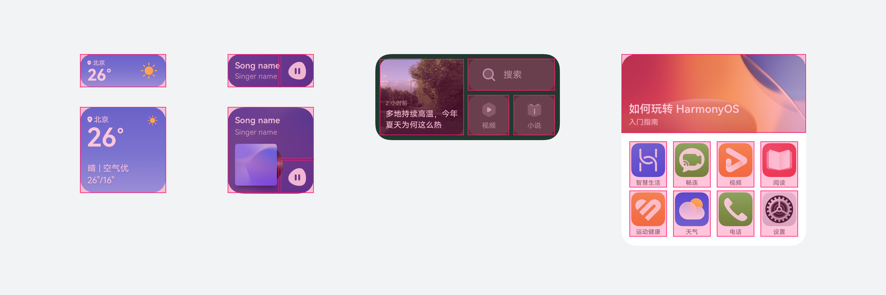

 - 卡片在卡片中心显示的名称为应用/元服务名称，不可更改此名称的展示规则。
 - 同一个应用还支持多种不同类型的卡片，不同尺寸与类型可以通过卡片管理界面进行切换和选择。
 - 服务卡片在上架时建议要包含小尺寸卡片，即 2*2 尺寸卡片，该尺寸在不同设备上具备最佳兼容性。        

##### 卡片的尺寸和使用场景

 - 圆形（图例）用于锁屏和穿戴设备
 - 微尺寸（图例）用于桌面和锁屏
 - 小尺寸（图例）用于桌面和待机屏保
 - 中尺寸（图例）用于桌面
 - 大尺寸（图例）用于桌面

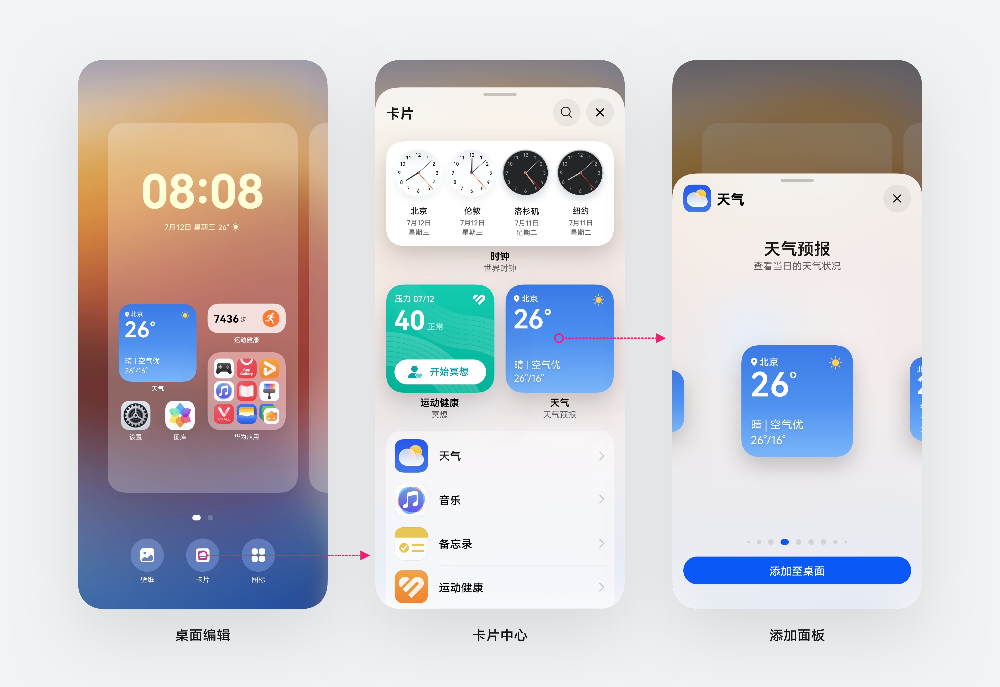

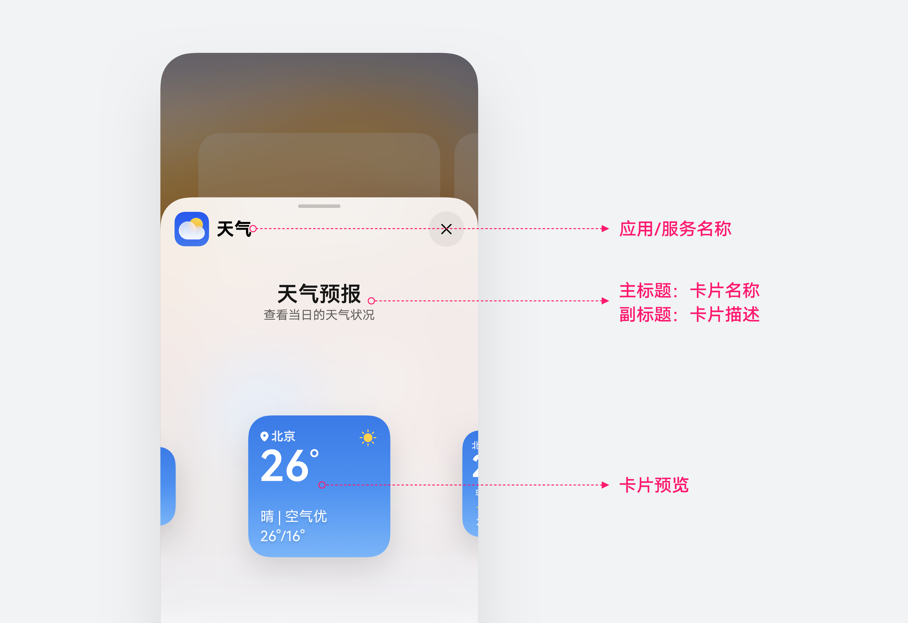

##### 卡片交互

##### 卡片交互基本原则

 - **前后呼应**

卡片内支持多热区，跳转到与之对应的内容界面。

 - **简单交互**

不要在卡片内设计整张卡片响应的左右滑动；如非必要，也不要提供上下滑动操作；不要在卡片内设计多指、多次点击等复杂手势交互。

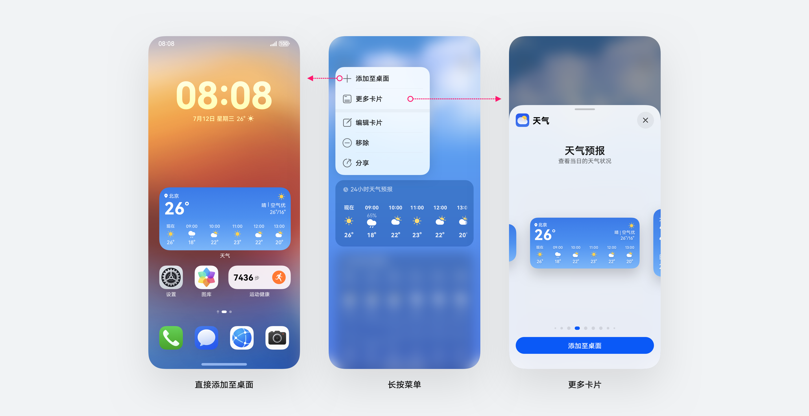

 - **避免冲突**

在桌面长按卡片可拖动或管理卡片，因此卡片内不支持长按和拖动操作。

##### 卡片与应用界面跳转规则

 - 卡片点击可跳转至对应的元服务或应用内界面；
 - 当用户进入到元服务或应用界面时，返回到桌面，再次对卡片进行点击时，仍然会到对应元服务或应用界面，而不是上次停留的界面；
 - 从应用服务界面返回到桌面时，服务窗口应该先回到当前卡片的位置，而不是应用图标的位置，遵循从哪来到哪去的基本原则；
 - 不要在卡片内通过点击或其他操作后出现弹窗、半模态等其他操作界面，卡片是拉起服务的主要入口，避免不一致的交互行为；
 - 元服务或应用提供的卡片，点击后只能进入卡片对应的元服务或应用。

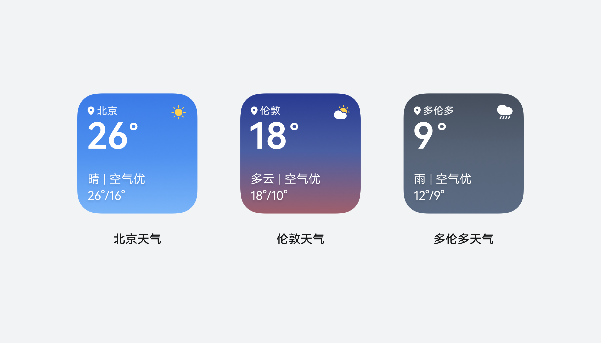

      | 全局手势返回 当点击卡片后进入对应服务界面，若使用全局返回手势，则返回上一次用户使用界面，即回到卡片本身。 |  |
| 界面内返回 若用户在界面内点击左上角返回，则回到该界面的上一级内容（应用本身界面），直到没有返回键头。 |  |

##### 卡片热区定义

开发者需要保证可操作热区与界面内容的交互逻辑一致，否则可能影响用户对卡片可操作内容的判断。

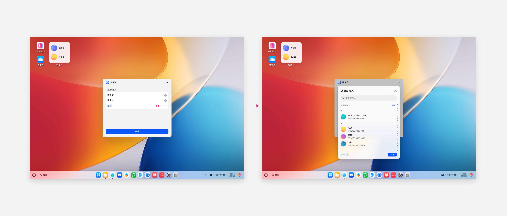

 - 建议整张卡片为一个热区，降低用户操作成本。

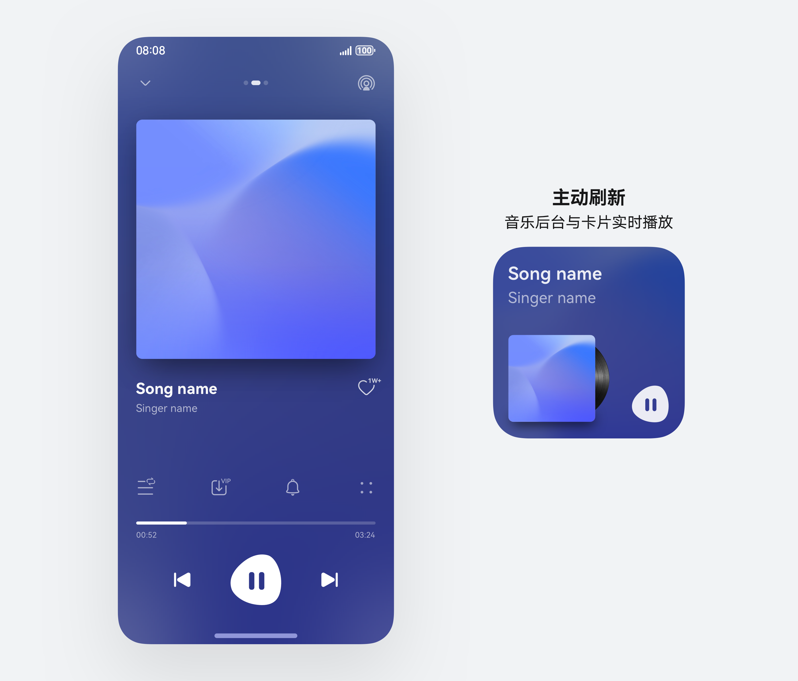

 - 若要在卡片内展示多个热区，需要明确进行划分，防止用户误触。

 - 卡片的目的是为用户提供更加直观的服务信息呈现，不要让过多的操作按钮占用卡片空间，使卡片看起来过于零碎。
 - 划分多功能区时每个对应的热区都应提供点击效果，给用户明确指示哪些是有效的可点击元素。
 - 如果某一块内容与应用内的界面关联度很高，可以作为一整个热区展示。

##### 卡片的添加

系统提供桌面、负一屏、应用内等多个卡片添加至桌面的入口，适用相同的交互规则，在添加过程中会显示卡片的应用/服务名称、卡片名称、卡片描述，开发者在上架过程中必须配置上述字段，以确保用户查询和浏览卡片时能快速了解卡片的提供方和所提供的功能。

      |  |  |

请在卡片名称和描述中简洁、清晰的呈现卡片的功能和作用；卡片名称 2 - 7 个字符为最佳，最长不超过 30 个字符；卡片描述支持换行，最长不超过 255 个字符。

**应用内卡片添加至桌面**

若应用中包含支持添加至桌面的卡片，在界面中长按对应卡片后可展开卡片菜单。

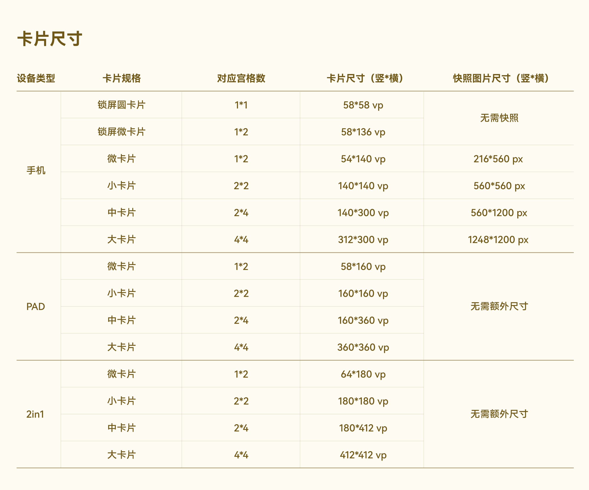

卡片菜单包含 2 部分：
1. 系统级卡片添加菜单，配置能力后不允许更改；
2. 应用卡片操作菜单，如应用的卡片编辑、排序、更改内容等操作。

系统级卡片添加菜单包含 2 个操作：
1. “添加至桌面”直接将该卡片添加到用户当前空余的桌面位置，完成加桌操作；
2. “更多卡片”可以调起卡片添加面板，用户查看该应用/元服务提供的所有卡片并选择添加至桌面。

##### 卡片编辑与多实例

每个应用可以配置多个服务卡片，开发者可根据业务需要来设计不同的卡片。同时，每个卡片也支持多种尺寸选择，可根据展示信息的多少来匹配适合的尺寸，小尺寸卡片为必开发选项。

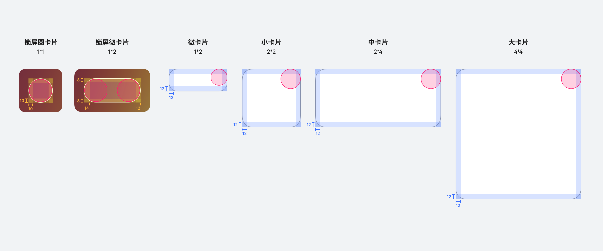

此外卡片支持多实例选择，例如：用户手动添加了当地天气的服务卡片，可以通过对单个卡片的重复添加来实现多个实例。

**卡片编辑流程**

开发者可以根据业务需求为卡片设计简要的编辑能力。请调用系统提供的卡片编辑模板，保证在 HarmonyOS 上用户体验的一致性，不要在服务卡片上直接使用“编辑”字样或图标进行暗示，避免不同的编辑方式混乱用户的使用逻辑。

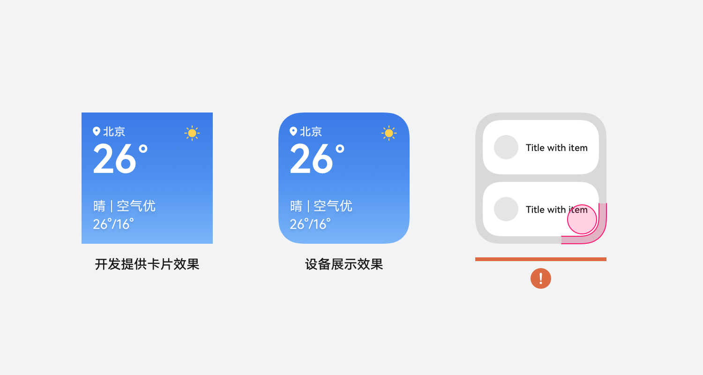

用户在桌面 icon 长按卡片即可发现编辑选项，点击后进入编辑界面。编辑流程的最长操作路径不要超过 2 级界面。
1. 在桌面找到卡片后，若卡片支持编辑，即可长按卡片找到编辑菜单；
2. 点击编辑菜单后进入一级编辑页；
3. 此页为编辑项的详细介绍及入口；图例中①为系统提供的卡片实时预览，不可编辑，②为开发者自定义编辑项
4. 点击直接生效配置，通过系统返回或左上角图标回到上一级，请在半模态面板中完成所有操作和跳转，请勿使用多级半模态交互；
5. 设置编辑流程时请同时考虑多端效果。

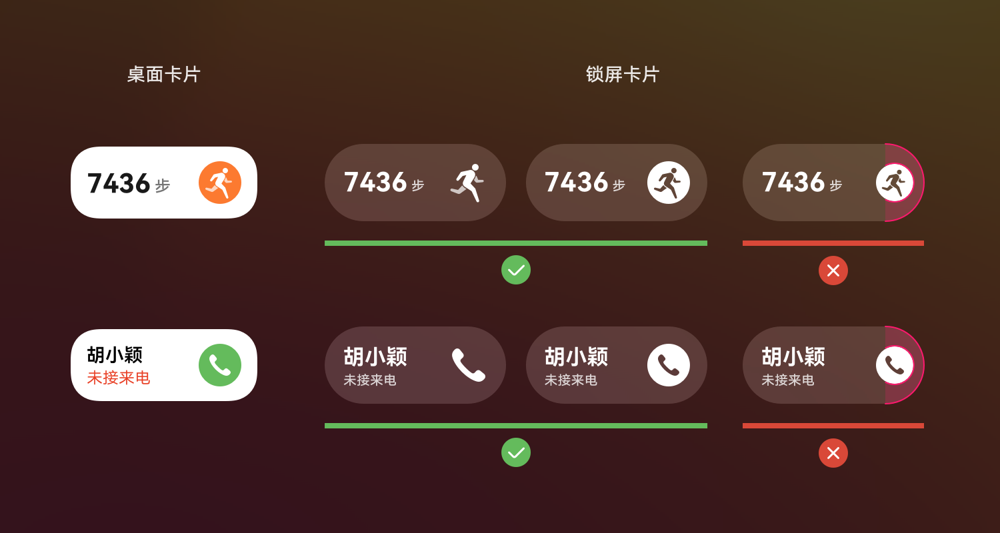

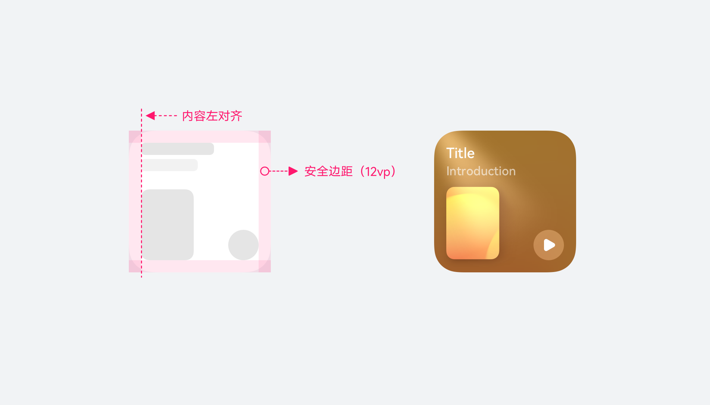

##### 卡片的刷新机制

卡片提供自动刷新机制，开发者可以定义卡片自动刷新时间和频率，让用户时刻享受最新的服务内容，有规律的内容变更也更符合用户的心理预期。但频繁的内容刷新并不能带来显著的流量增益，甚至会引起用户对信息真实性的质疑以及使用体验。因此，开发者可以根据业务属性对时间的依赖性进行配置，例如消费类卡片，根据就餐时间刷新卡片内容。让卡片的内容刷新更贴近用户使用的自然规律。

      | 主动刷新 由应用主动发起或事件更新后执行的内容刷新行为。 |  |
| 被动刷新 在没有在后台运行的服务内容仍然需要保持最新状态，可定义固定时间或间隔对卡片进行更新。卡片刷新时间的频率以 30 分钟为基础，开发者可根据业务性质向上叠加时间长度。例如，影音娱乐类的卡片没有在后台运行时，用户可以每隔 2 小时获取到最新的数据信息，以减少系统后台运行的功耗开销。 |  |

##### 卡片刷新的动效过渡

无论主动还是被动刷新，当用户停留的桌面上需要执行卡片刷新时，为避免用户界面的大幅跳变，应使用恰当的动效衔接完成卡片刷新。常见的动效过渡包含：

      |  |  |
| 变化 卡片内按钮等小元素需要响应用户的操作刷新时可使用简单变化的方式或使用 symbol 图标的默认动效，以达到快速响应的效果。例如：点击播放音乐后，播放按钮刷新为暂停按钮。 | 元素滑动 日期、数据等数字元素可使用元素翻转的选择器滑动动效，以展示距离上次刷新时的变化。例如：天气实时温度发生变化时，翻转数字显示较上次刷新温度上升或下降了。 |
|  |  |
| 渐隐渐现 整张卡片内容、底图、背板等大面积元素变化时建议使用渐变效果以保障桌面上卡片显示的稳定性。例如：信息资讯切换新的推送内容在卡片上执行变化刷新。 | 推移补位 当卡片的内容进行周期性变化或轮播时，可使用带有方向性的推移补位动效以表达卡片内容在一定范围内变化。例如：图库的图片内容定时刷新。 |

建议卡片开发中选择 HarmonyOS 的动效形式，开发出一致、高效、流畅的卡片动效体验。

##### 卡片内容设计

开发者可以定义每一张卡片的功能，通常来说，卡片尺寸越小对应展示的功能和信息就越少，所能使用的控件也会受限制。请根据核心诉求进行卡片设计，聚焦在关键信息的展示上。

##### 尺寸与基础参数

卡片按照桌面宫格布局，以手机 4*6 宫格为基础分为 4 种尺寸；在锁屏上还支持 1*1 圆形卡片尺寸。

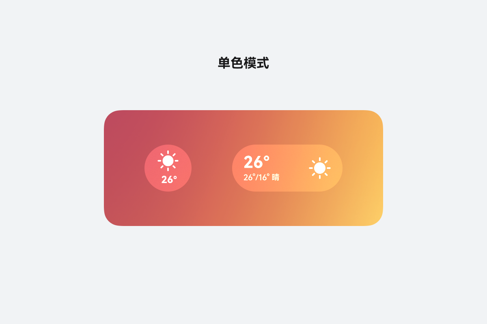

##### 卡片圆角

卡片内容尽可能保证在安全范围内，在圆角剪裁时避免对内容造成影响。

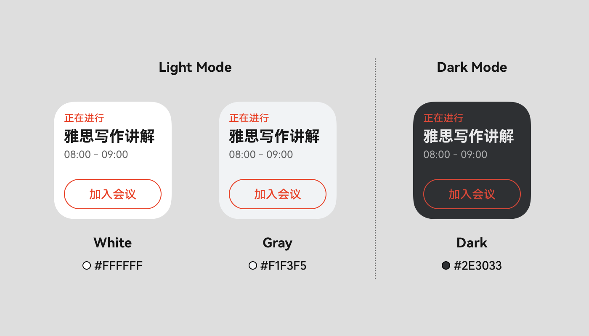

设计师在进行设计时如果需要保证最终效果，可以在设计工具里使用 1*2、2*2 宫格 18vp，2*4、4*4 宫格 22vp 圆角预览效果，交付时确保直角即可。

      |  |  |
| 在交付卡片时请保证背景是直角矩形，服务卡片的宿主会提供对应的圆角剪裁，保证在不同设备上卡片圆角效果一致。 因卡片圆角会根据场景动态变化，不建议使用大量卡片内嵌套圆角矩形的设计方式，确保卡片整体精致度。 | 锁屏场景下 1*1、1*2 卡片按最大圆角裁切为圆形、胶囊形，请在设计中注意圆角裁切的位置。 若使用图标，建议不要嵌套几何形背板，直接展示图标图形可避免非同心圆的裁切问题。 |

##### 卡片布局

卡片的布局应当追求秩序感、整洁度以及特征性。秩序感是对卡片内容布局的规则性约束，要确保内容是有序的，对齐的，阅读流畅的。整洁度以内容质量为主，除核心信息外，不要附加格外的，确保一定留白，保证用户的首眼体验。特征性可以考虑以卡片垂类或是自身品牌特征作为体验，例如品牌色和品牌纹理的使用，特征图形和布局的呈现。

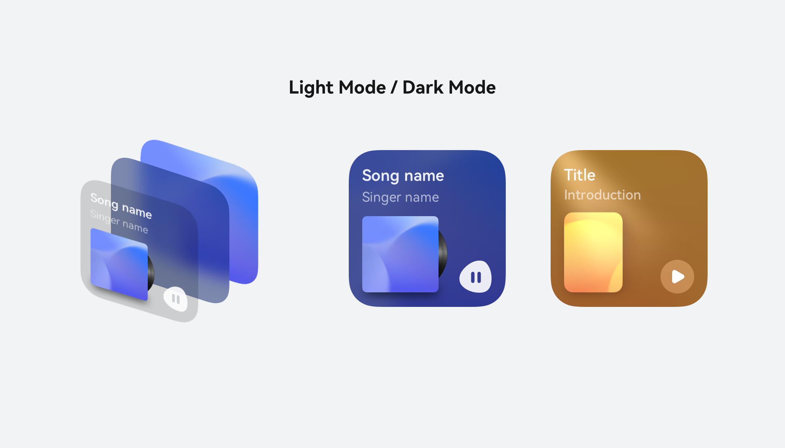

当卡片内容布局在不同场景下都是固定时，建议默认以左对齐为主。卡片内容需要保证距离边缘 12vp 的安全边距，以免在圆角剪裁时对内容展示造成影响。

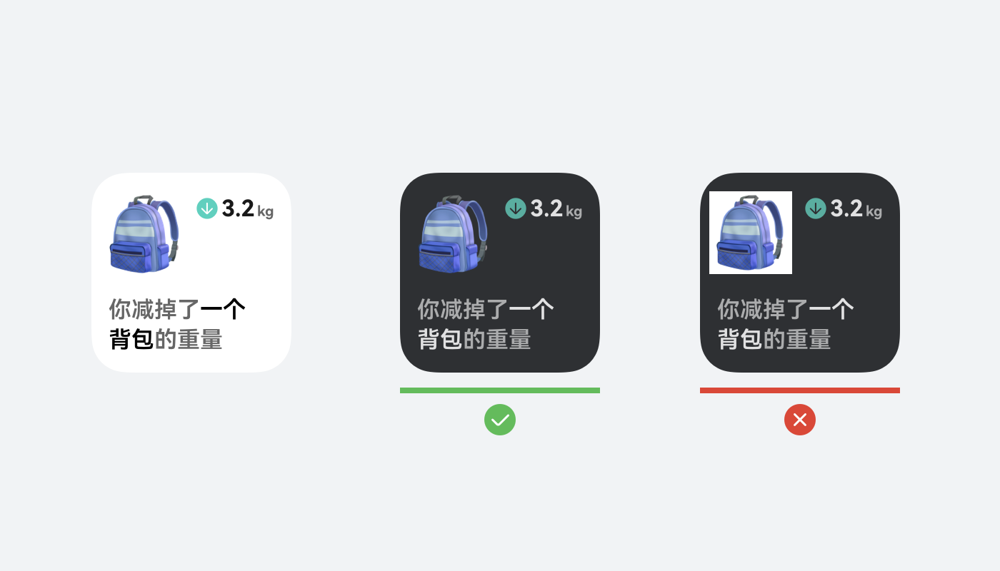

在特殊布局下，也依然要遵守卡片的基础对齐、留白、间距等原则。

##### 卡片色彩

**色彩模式**

      |  |  |
| 全彩模式 一般场景下均使用全彩显示。 | 单色模式 锁屏场景下使用单色模式，通过透明度和模糊区分元素，不使用任何色相。 |

**卡片默认背景色**

      |  |  |

1. 常规富信息卡片的背景色尽可能保持干净整洁，不使用过度激烈的颜色，避免引起用户的视觉疲劳。
2. 如果需要体现品牌色特征，请控制在合理范围内，保证用户阅读性和心理感受。
3. 系统在 Light 模式下默认使用白色，当用户修改系统主题为 Dark 模式时，对应的卡片需要适配 Dark 模式的色彩。灰色背景主要用于卡片上还有其他白色色块场景时使用，用于防止和白色色块重叠。
4. 除此之外为了提升卡片整体的设计感，也可使用透明度的毛玻璃效果作为卡片背景，如使用此效果需要调用系统的模糊能力。

**卡片取色**

包含图片或用色丰富的沉浸式卡片，背景色可考虑吸取内容图中的色彩，此场景下在深/浅模式下共用一套颜色，可不随系统深/浅模式切换。

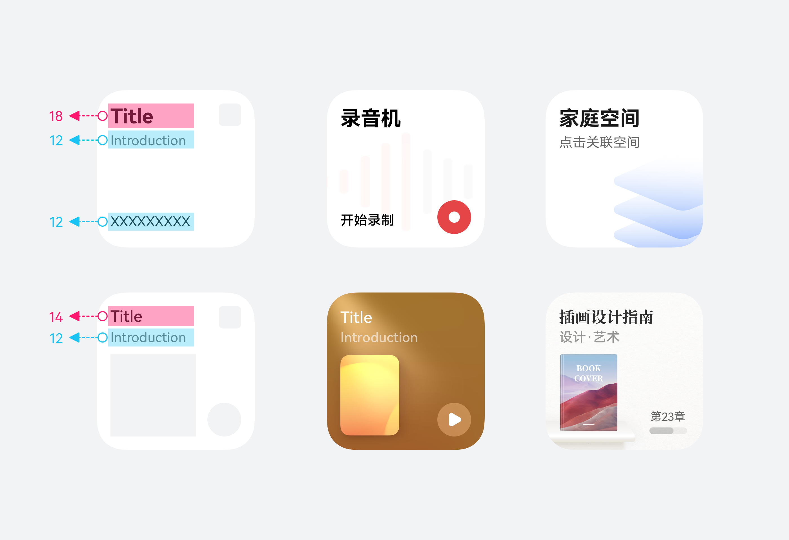

**深色模式**

卡片背景若不使用模糊效果，在 Light 模式下默认使用背景色#FFFFFF，Dark 模式下默认使用#2E3033 。

      | 场景1 局部元素使用透明度为 0 的 png 资源，保证深色模式下不会渗出底色。 文本对应系统色板，使用分层参数匹配色彩值。 图片本身不处理深色模式，不用搭配多套资源。 |  |
| 场景2 多彩色的使用对应系统参数。若使用品牌色调，请按照业务自身的 VI 色彩处理深色模式。 |  |

##### 卡片字体

卡片内可展示空间较小，在字号使用上尽量避免使用大字号。保证内容信息在界面中可以被明确区分且易于识别即可。

合理运用 Regular、Medium、semi-bold、bold 字重在卡片内的关系，帮助用户在阅读相对复杂的信息卡片时能够及时做出筛选。

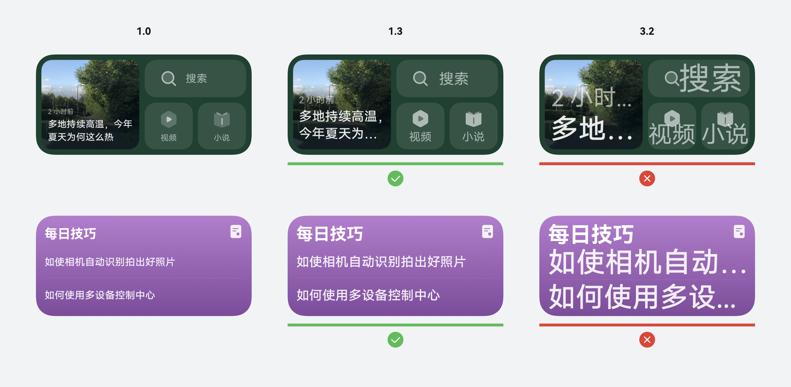

**文本组合**

 - 在卡片内如果使用左上角标题，建议使用 18、14fp 的字体大小，默认距离卡片左上角 12vp 的位置。
 - 数字字体：支持使用 20、32、40fp 等不同档位，业务可根据场景需要选择。
 - 文本列表组合建议使用手机正文字体大小，显示有效信息会更多，卡片会更具精致感。

      |    |    |
|    |    |
|  |  |
| 桌面 1*2 卡片字号 主标题：14fp 副标题：12fp | 桌面 1*2 卡片字号 数字：20fp 副标题：12fp |
|  |  |
| 桌面 2*2 卡片字号 主标题：14、18fp 副标题、辅助信息：12fp | 桌面 2*2 卡片字号 数字：32、40fp 副标题、辅助信息：12fp、14fp |

**默认文本色**

卡片内的多彩色参照 HarmonyOS 的色彩标准，可用于高亮文本和图标予以提示作用，突出卡片核心信息。多彩色的饱和度较高，请不要过度使用，例如将多彩色直接用于整张卡片的背景或整段文字。

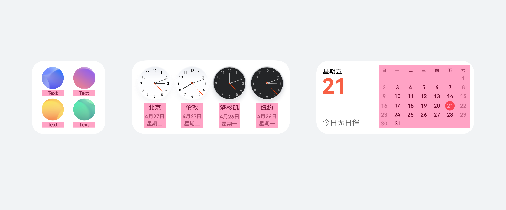

**提供一定程度的字体放大适配**

卡片显示的尺寸有限，适老化大字体对内容阅读影响较大，可能影响卡片内容的整体布局。因此在放大比例上定义了最大放大比，以保证卡片内容整体的正常使用。

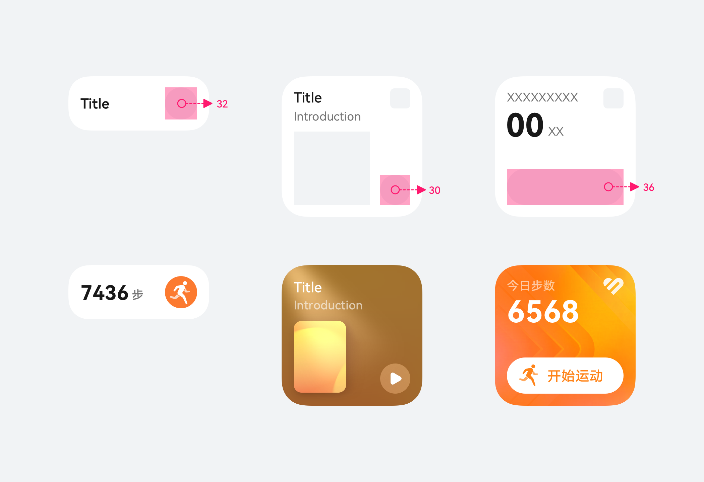

**定义最大和最小适配比例**

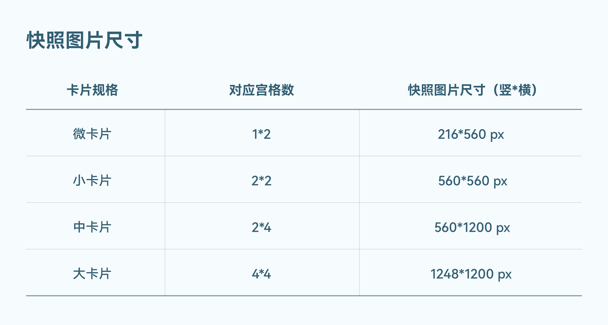

 - 按照手机字体大小适配调节规则，从 0.8 倍到 1.45 倍及适老化最大字体不等，卡片适配控制在最大 1.3 倍以下。
 - 排除不需要做适配的部分以外，针对需要自适应的文本定义最大放大比例，例如最大到 1.15 倍或 1.3 倍，更大比例的伸缩则不再响应。
 - 当手机切换字体到 0.8 倍时，服务卡片内字体也会做对等的字体缩小。

      |  |  |
| 超过 20fp 的字号不响应大字体和适老化 大号数据文本对卡片布局影响较大，且已经能够满足正常视力阅读，不建议在卡片内再进行适配。 | 锁屏卡片的文字字号不响应大字体和适老化 锁屏卡片的信息呈现区域有限，不建议在卡片内再进行适配。 |

**选择性对卡片内的文本进行适配**

在卡片中，受布局影响，并非所有文本都需要做尺寸适配。针对性的对一些关键信息作响应。

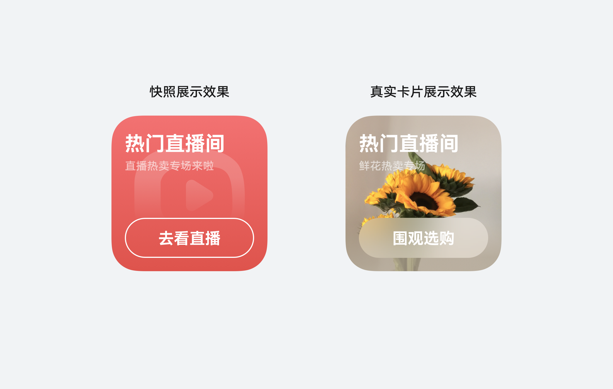

##### 按钮使用原则

根据 HarmonyOS 设计规则，请使用圆形和胶囊形按钮样式。

卡片中需要点击操作的元素，为确保用户点击的准确性，要求视觉尺寸不得小于 24vp，热区大小不得小于 40vp。

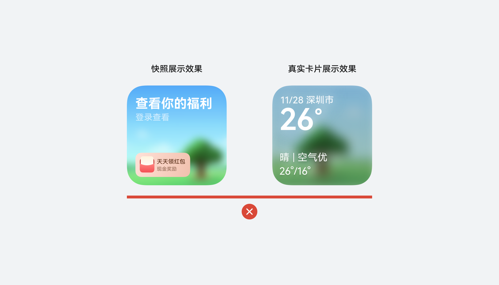

按钮一般分为圆形按钮和胶囊按钮，按钮尺寸可根据业务场景和卡片尺寸灵活选择使用，按钮颜色根据主题色搭配或使用系统高亮色。

 - 1*2宫格 按钮视觉推荐尺寸：32*32vp
 - 2*2宫格 按钮视觉推荐尺寸：30*30vp
 - 胶囊按钮高度视觉推荐尺寸：36vp宽度可根据卡片进行自定义，但请保证距离卡片四周12vp的间距
 - 按钮文本大小：14fp，Medium

##### 提供卡片快照

开发者设计元服务卡片时需要提供对应的卡片快照。快照是系统中分发卡片时提供给用户的卡片预览图，用户在系统内负一屏、应用市场、智慧搜索等场景预览未使用过的服务时，用来让用户直观的理解到卡片所提供的服务内容、功能和样式。请参照下表提供对应尺寸的卡片快照。

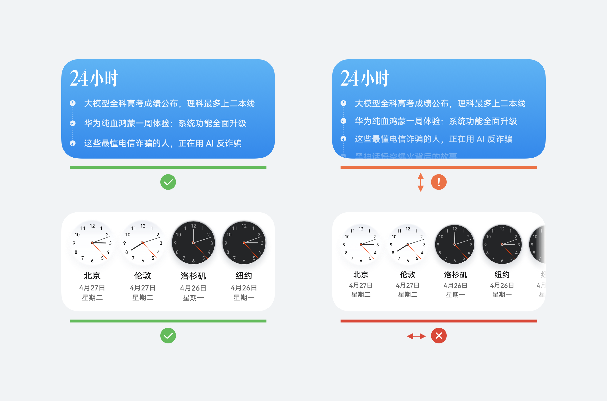

1. 快照与服务卡片展示内容应当一致，或快照应当属于卡片多种状态中具有功能代表性的布局之一。
2. 若部分图片资源敏感或资源不确定性较高，可以考虑使用抽象图形进行代替，突出卡片关键的内容信息即可。
3. 禁止在快照中提交任何带有广告色彩的内容和元素，包括但不限于：红包、抽奖、活动等。

**开发者提供的快照资源**

卡片快照必须提供直角图片且适配深浅模式，提交时请不要提前进行圆角剪裁。

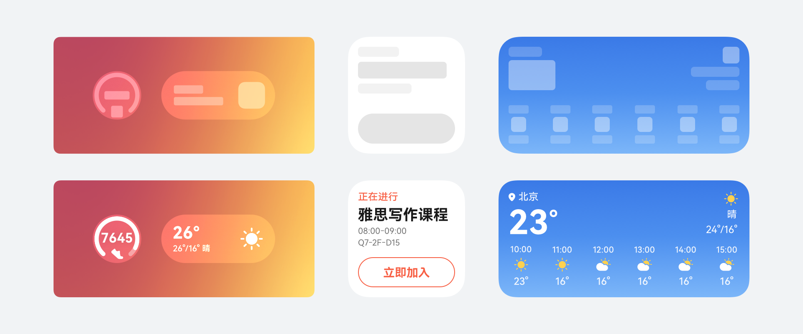

 - **推荐**

快照与用户实际使用卡片一致，部分数据涉及刷新，符合预期。

      |  |  |
| 数据类型 主体为显示信息或用户数据的卡片，快照布局与样式与实际卡片一致，填充虚拟的数据内容。 | 内容类型 主体为在线内容或图像的卡片，快照可使用同类型内容的固定预置图像资源填充。 |

 - **不推荐**

快照与卡片真实布局完全发生变化，且不属于卡片所有状态中的形态之一。

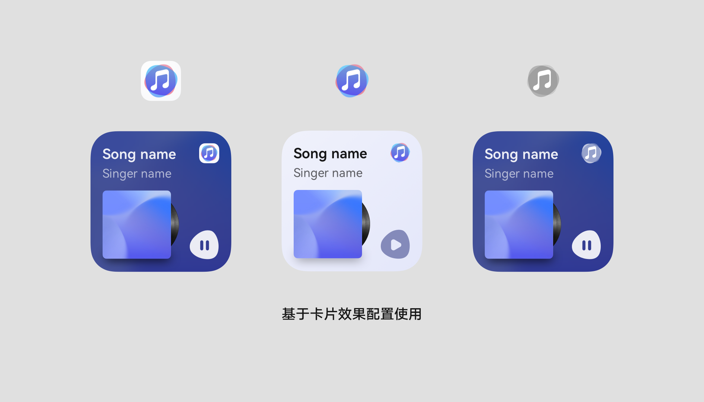

##### 提供预览占位图

满足用户的合理预期，请考虑在网络连接不畅的情况下，卡片内容的预览样式。给予用户一个合理的预期，了解卡片即将展示的内容。可以提供占位文字或统一颜色的色块来代替未能及时显示的内容，保证占位图或符号与展示卡片的一致性。

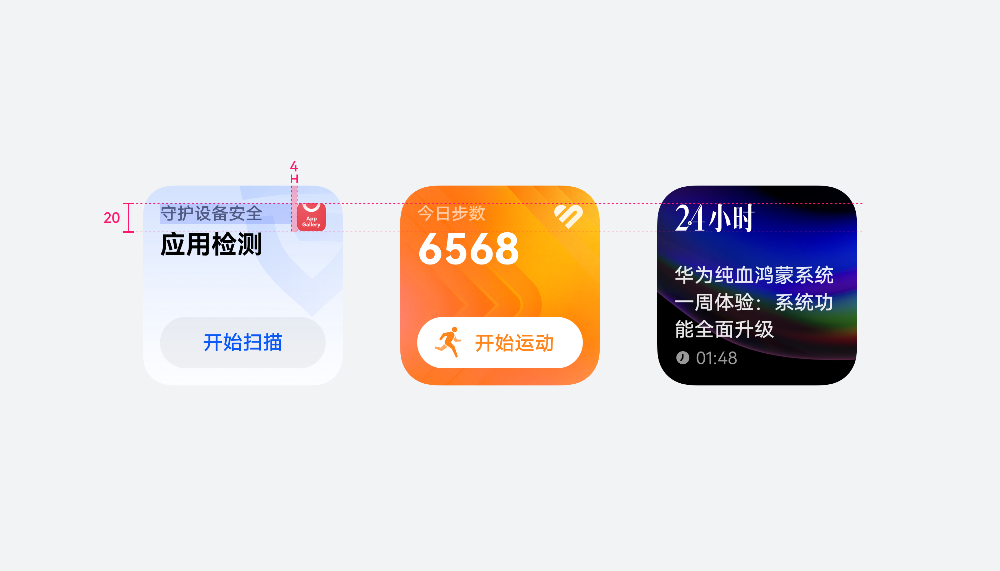

**文本占位**

文本可替换为固定高度的横条符号代替，横条颜色可匹配当前文本的颜色及透明度，对应的宫格图片可使用同尺寸的几何图形代替。

**图标占位**

图标以及标签内容可以使用几何图形替代图案，颜色根据图标参数进行适配，如纯色图标则使用纯色几何图形，可叠加透明度；复杂或写实图标，根据图标最大面积颜色进行填充。

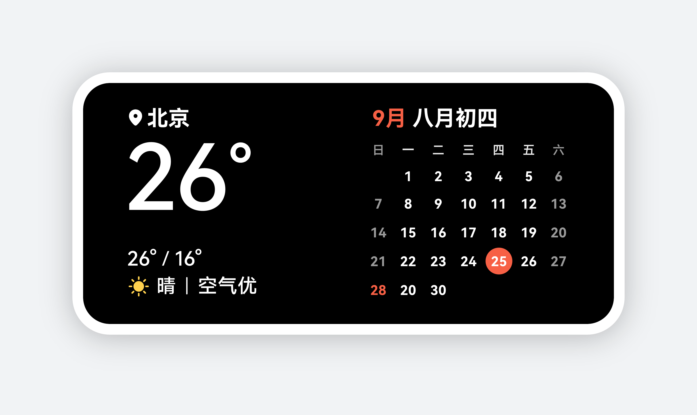

**尺寸**

 - 可根据实际内容自定义。

**颜色**

 - 一档占位色：10%#000000（浅色）、40%#FFFFFF（深色）
 - 二档占位色：5%#000000（浅色）、20%#FFFFFF（深色）

**圆角**

 - 占位内容区域高度大于 10vp 时使用一档圆角，小于 10vp 时（含10vp）使用二档圆角
 - 一档圆角：4vp
 - 二档圆角：2vp

##### 合理融入品牌特征

适当的将应用品牌色或标示融入到卡片中，从而让卡片更具有辨识度，但请不要打破卡片设计规范原有的规则。

卡片内不建议再出现应用名称，在 HarmonyOS 出现卡片的场景都会伴随着服务名称或所归属的应用名称，因此珍惜卡片内有限的空间用来展示更重要的信息内容。

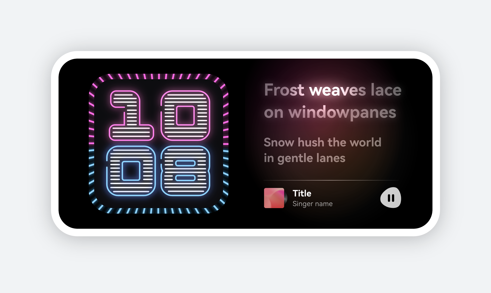

你可以使用文字 LOGO 或有效的服务信息名来作为卡片标题，服务信息名称并不等同于应用名称，请统一放置在左上角。若使用纯图标，请统一放置在右上角。

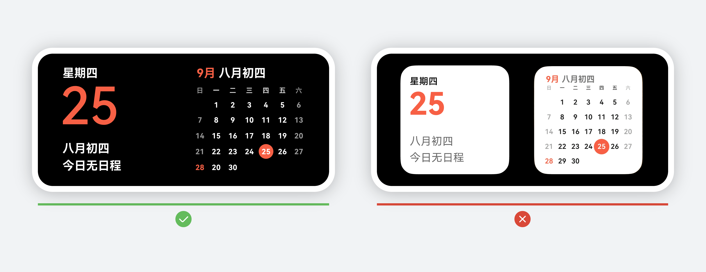

为了方便凸显应用的品牌形象，可以选择在卡片右上角露出应用图标，或可以选择使用其他的异形图标作为点缀。

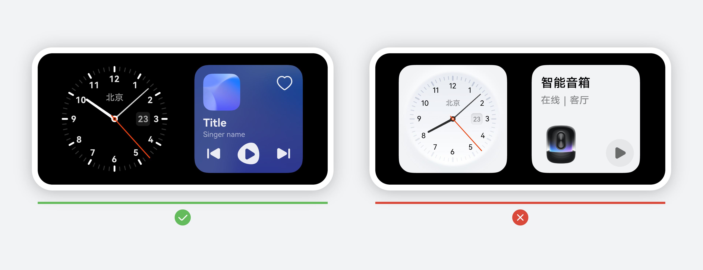

文字 LOGO 一般运营属性较强，通常形状上较长且不规则，在布局上建议以左对齐为主，符合用户的阅读和视觉动线。

单独使用品牌 LOGO 时，请使用 20*20vp 大小的图标，以及 4vp 的圆角。若 LOGO 造型为异形，请确保尺寸不要超过标准尺寸大小，注意色彩及反白等情况，避免图标与背景分离不清晰。

##### HarmonyOS 特征卡片

##### 待机屏保

卡片支持待机屏保。在待机屏保下，系统会并排展示 2 个 2*2 尺寸的卡片，并放大以填充锁屏。

**设计原则**

      |  |  |  |
| 清晰可见 用户的使用场景主要集中在中远场浏览，请注重信息呈现，确保信息可从较远距离轻松浏览。 | 沉浸视觉 合理使用丰富的多色彩搭配，使卡片内容无缝融入环境，给用户带来沉浸式体验。应避免大面积使用明度过高的浅色导致视觉割裂感。 | 轻量交互 支持轻量级交互，并合理运用动效来让体验更优。 |

**清晰可见**

待机屏保下出现的卡片建议通过放大和重新排列文本来充分利用展示空间，让用户可以从较远的距离轻松浏览卡片内容。

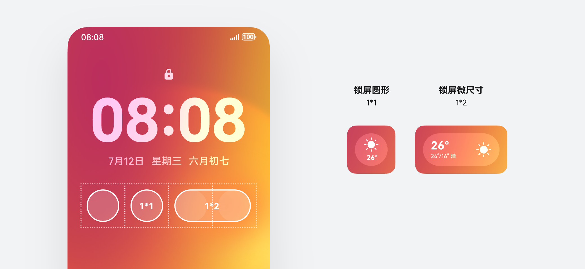

**沉浸视觉**

待机屏保下出现的卡片应避免大面积使用明度过高的浅色给用户造成视觉上的割裂感，应合理运用色彩的对比度来提升内容的识别度。

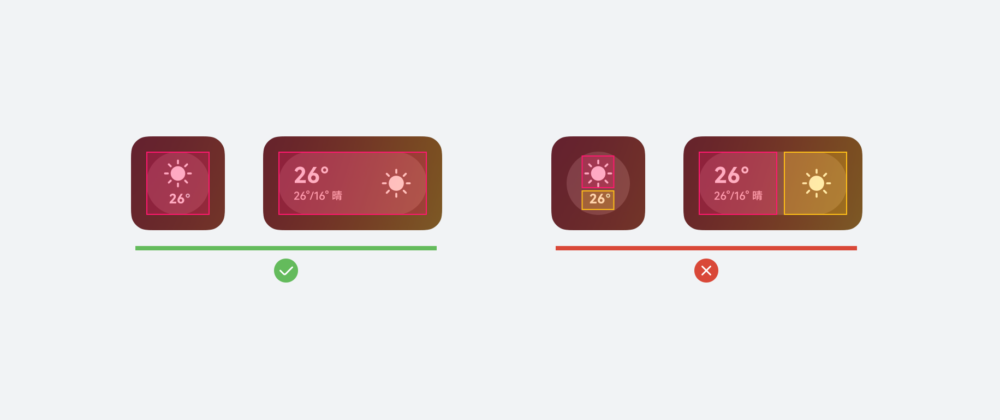

**轻量交互**

待机屏保下出现的卡片也应遵循简单交互的基本原则。用户在待机屏保下，通过双指捏合/长按进入编辑态，可选择增加/移除卡片。为了避免与待机屏保的系统交互手势相冲突，请不要在卡片内设计左右滑动和上下滑动操作，也不要在卡片内设计长按、拖动、多指、多次点击等复杂手势交互。

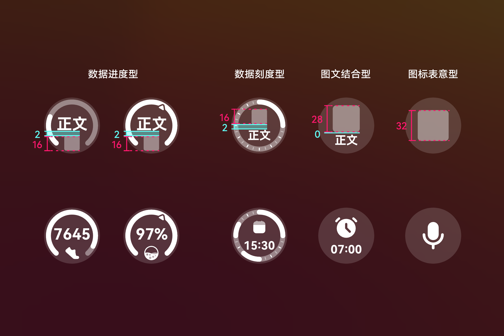

**刷新动效**

遵循卡片的基础刷新动效规则，在待机屏保下需要执行卡片刷新时，尤其是用户交互时，推荐使用使用恰当的动效衔接完成卡片内容刷新。常见的动效过渡包含：

      |  |  |
| 变化 卡片内按钮等小元素需要响应用户的操作刷新时可使用简单变化的方式或使用 symbol 图标的默认动效，以达到快速响应的效果。例如：点击播放音乐后，播放按钮刷新为暂停按钮。 | 渐隐渐现 整张卡片内容、底图、背板等大面积元素变化时建议使用渐变效果以保障桌面上卡片显示的稳定性。例如：图库的图片内容定时刷新。 |

##### 锁屏卡片

锁屏场景下卡片使用单色模式，通过透明度和模糊区分元素，不使用任何色相。

**卡片尺寸**

卡片支持圆形 (1*1) 和微尺寸 (1*2) 用于锁屏。

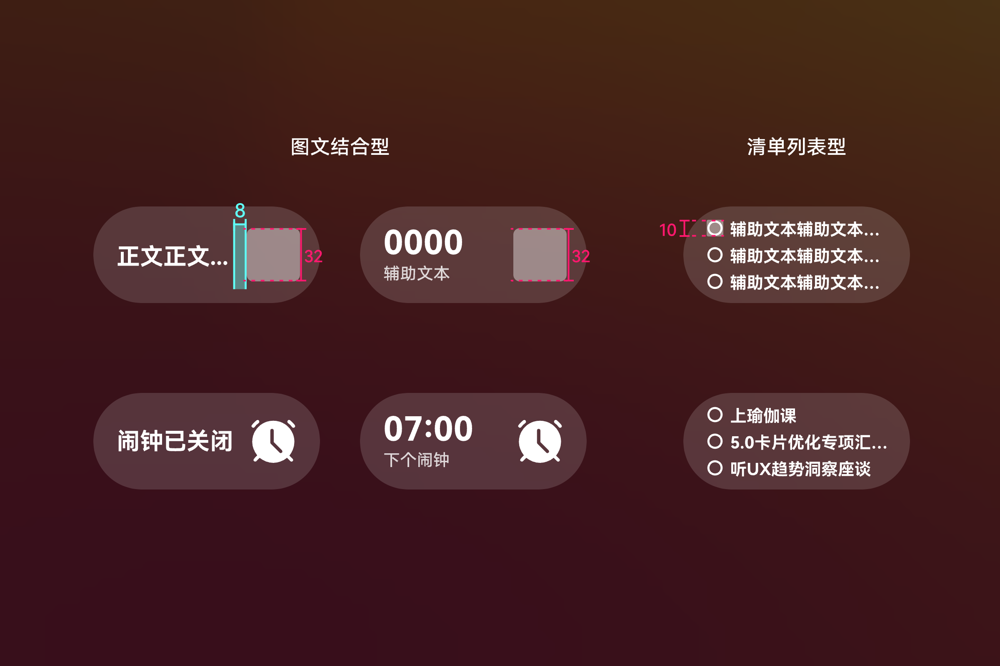

**卡片热区**

建议整张卡片为一个热区，降低用户操作成本。

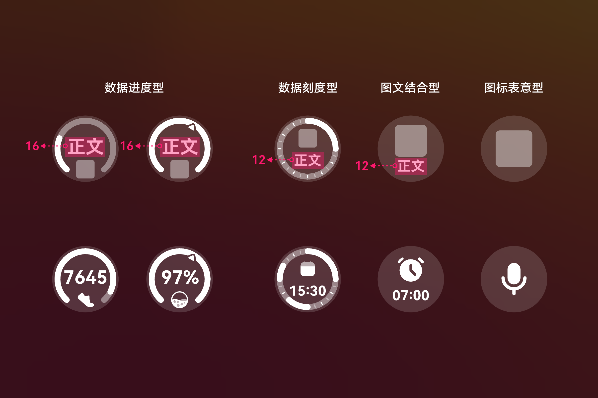

**卡片布局**

      |  |  |
| 锁屏 1*1 卡片 数据进度型、数据刻度型数据条粗细：6vp 数据进度型、数据刻度型图标大小：16vp 图文结合型图标大小：28vp 图标表意型图标大小：32vp | 锁屏 1*2 卡片 图文结合型图标大小：32vp 清单列表型图标大小：10vp |

**文本组合**

      |  |  |
| 锁屏 1*1 卡片字号 数据进度型：16fp 数据刻度型、图文结合型：12fp | 锁屏 1*2 卡片字号 图文结合型：10、14、20fp 清单列表型：10fp |

**卡片圆角和适老化规则**

      |  |  |
| 请在设计中注意圆角裁切的位置 1. 锁屏场景下 1*1、1*2 卡片按最大圆角裁切为圆形、胶囊形。 2. 若使用图标，建议不要嵌套几何形背板，直接展示图标图形可避免非同心圆的裁切问题。 | 锁屏卡片的文字字号不响应大字体和适老化 锁屏卡片的信息呈现区域有限，不建议在卡片内再进行适配。 |

**资源提供规范**

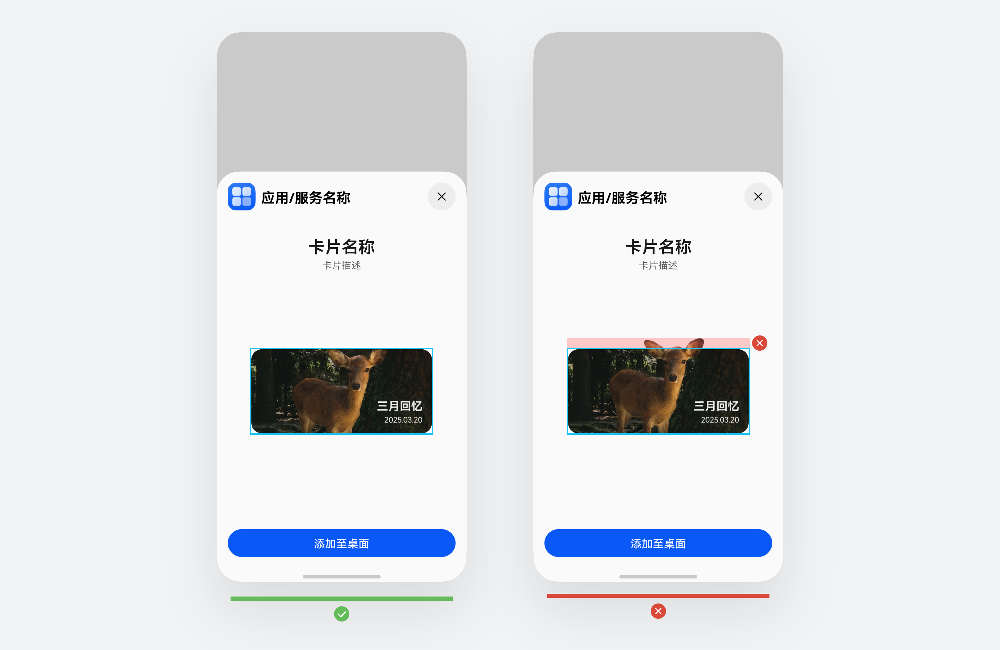

1. 卡片由前景和背板组合而成，开发者只需要提供前景内容即可，背板由系统锁屏统一添加。

2. 主图形与主信息部分需要采用 #FFFFFF，100%透明度。

##### 互动卡片

在 HarmonyOS 中支持桌面服务卡片元素超出服务卡片宫格的能力，支持开发者设计和开发效果更丰富、互动感更强的服务卡片，但在设计和开发中对 UI 元素和动效使用的要求更高，请按需选择互动卡片能力。

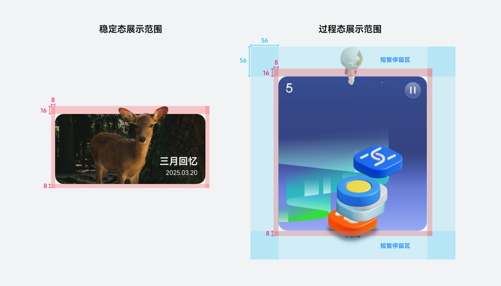

**互动卡片的显示场景**

在卡片中心、分享等非桌面场景，互动卡片仍然以常规服务卡片状态显示，禁止元素出框，请使用常规布局的卡片填充相关场景。

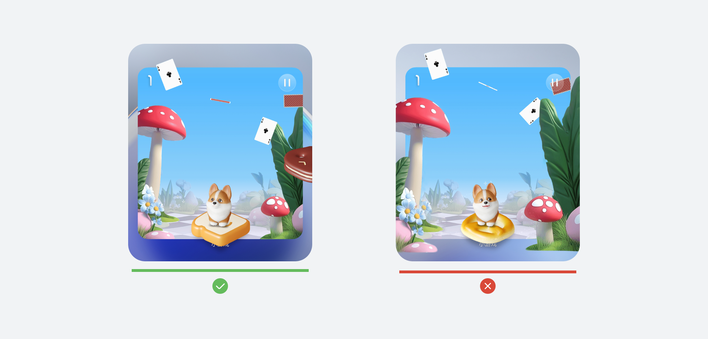

**互动卡片类型**

卡片被用户添加至桌面后，允许元素出框，区分以下 2 种能力，请仔细甄别能力与使用场景：

      |  |  |
| 场景刷新卡片 在卡片数据与元素执行刷新时 (主动刷新或被动刷新)，可执行 1 次刷新动效并伴随元素出框，通常用户静态元素的微动效展示。 | 交互刷新卡片 在用户点击卡片时，可执行 1 次刷新动效并伴随元素出框，随后在 1 秒内回到默认状态，通常用于高动态类游戏卡片的交互展示。 |

**元素出框的限制原则**

为保证卡片的整体性，建议元素选择单边或双边出框，尤其在场景刷新卡片中，避免所有边缘出框的情况。全出框仅限短暂的交互动态场景使用。

**元素出框的范围**

为了保证桌面元素不被干扰和遮挡。稳定态展示范围顶部不超过 16vp，底部和左右两侧不超过 8vp。过程态展示范围建议四周不超过 56vp。

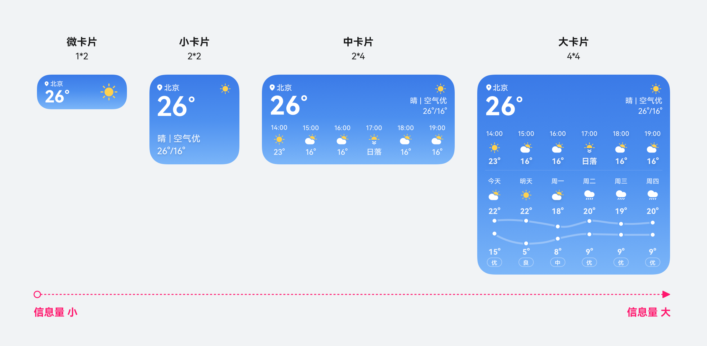

无论使用哪一种出框能力，都应限制出框内容的占比，避免出框内容占比过满，保证卡片的整体感和精致度。

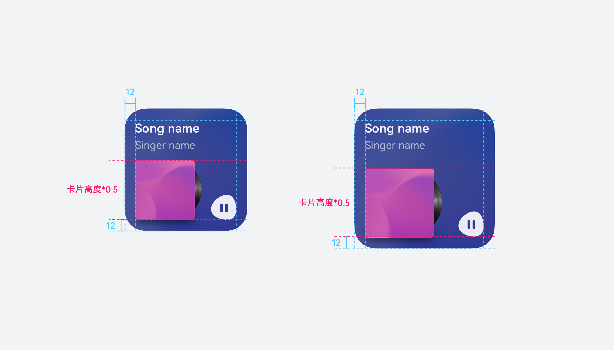

##### 卡片多设备适配

**根据尺寸的不同，提供对应的功能**

在卡片开发过程中请考虑多设备的适配性，特别是在泛手机端设备上，设备屏幕对卡片尺寸的改变直接影响了卡片内对数据信息的展示。请发挥想象力设计适合不同尺寸的卡片，避免在卡片内容不做任何处理的情况下直接适配成较大尺寸，原则上尺寸越大呈现的信息、内容成分要越丰富，可交互的范围也越大。

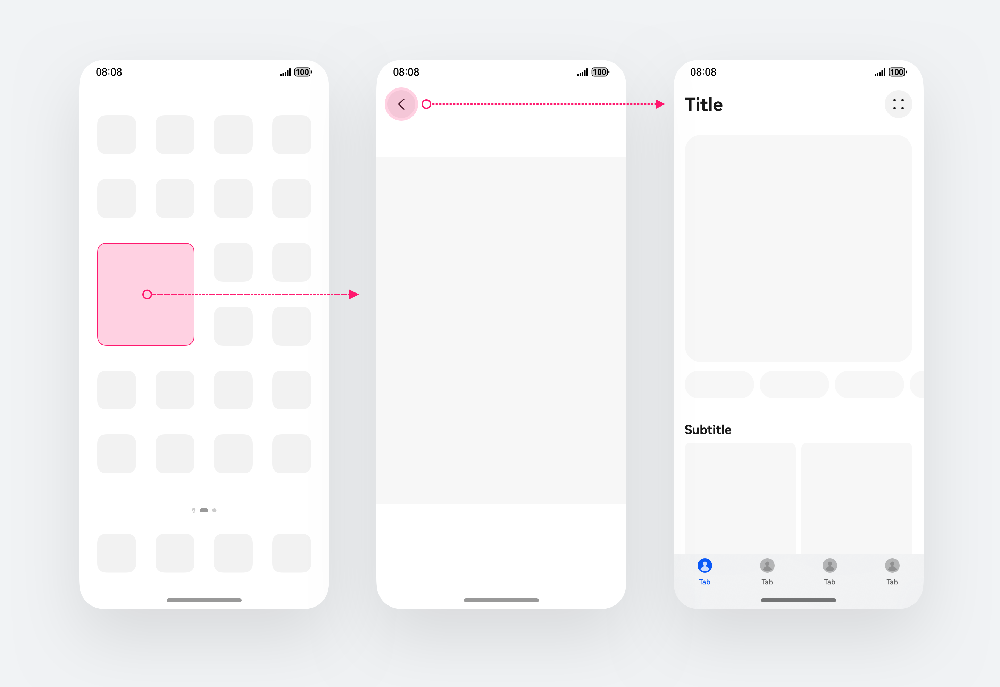

**使用百分比方式配合标注**

由于设备尺寸的不确定性会导致卡片的尺寸发生变化，设计师在交付卡片布局的过程中，可以适当的使用百分比进行标注。

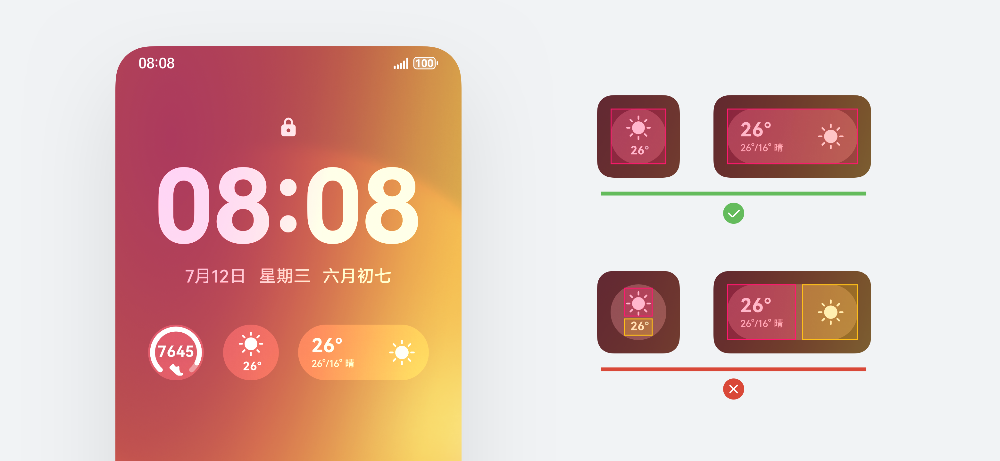

**多端适配尺寸**

卡片需要适配除手机以外的折叠屏及平板等设备，可以在此处下载对应文件，内包含对应的桌面宫格和详细尺寸描述。设计卡片时不可仅依赖卡片设计模板的样式，还需要查看桌面上根据宫格变化尺寸的预览效果，以确保合适的体验。

**获取服务卡片组件库设计资源：**[HarmonyOS NEXT 服务卡片组件库](https://developer.huawei.com/consumer/cn/design/resource/)
