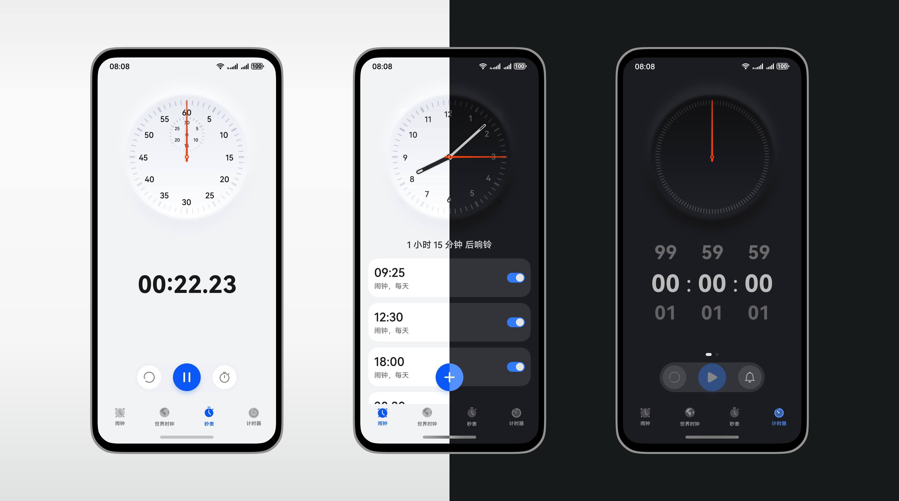

# 深色模式

更新时间：

来源：https://developer.huawei.com/consumer/cn/doc/design-guides/dark-mode-0000001823255497

深色模式满足更多个性化的需求，基于人因研究设计了深色模式下舒适的颜色范围。深色模式开启后，浅色主题应用界面背景会变成深色，而文字、图标等前景会变成浅色。深色模式的界面上内容更加突出、在 OLED 屏幕的设备上更加省电、能够给用户带来视觉舒适感和沉浸式体验。
 

 

#### 设计原则

由于深色模式下屏幕总发光量更少，部分用户倾向于在暗环境使用深色模式；但同时，也有相当比例的用户出于对深色风格的喜爱或出于节能省电的需求（深色模式下OLED屏幕功耗更低）而全天开启深色模式。
 
因此，在深色模式的设计中需要考虑在全天不同环境下清晰易读，同时特别关注在暗环境的使用舒适性，另外还需要保持与浅色模式在层级感知、色彩语义方面的一致性。
 
 

#### 易读性

深色模式下为了保证清晰易读，文本、图标等前景与深色背景之间仍需要满足最小对比度要求。根据WCAG（Web Content Accessibility Guidelines）的要求和华为人因团队研究结果，文字、图标满足最低的对比度要求，分级标准如下：
  
| 场景 | 推荐（优秀） | 一般 | 不建议 |
| --- | --- | --- | --- |
| 大字号（17fp或15fp以上粗体）、辅助文本（如列表二级文本，或其他对识别效率要求不高的场景）、功能性图标 | 大于3:1 | 1.9:1 – 3:1 | 小于1.9:1 |
| 非大字号主要文本（如长文本正文、列表一级文本） | 浅色模式大于4.5:1 深色模式大于5:1 | 浅色模式3:1-4.5:1 深色模式大于3:1-5:1 | 小于3:1 |
| 建议表示活动状态的可交互控件 | 控件背板与背景之间对比度不小于2.2:1 | \ | \ |
 
 
注：装饰性文本、表示disable状态的文本、logo等特殊场景不需要满足以上要求
  
| 正文与背景对比度不低于5:1 | 正文与背景对比度低于5:1 |
 
  
| 辅助文本与背景对比度不低于5:1 | 辅助文本与背景对比度低于1.9:1 |
 
  
| 可点击控件背景填充色与页面背景对比度不低于2.2:1 | 可点击控件背景填充色与页面背景对比度低于2.2:1 |
 
 
对于同时使用多个多彩色用于表示不同状态或用于相邻位置时，在适应对比度要求的基础上，还需要满足色彩差异要求：
  
| 场景 | 要求 |
| --- | --- |
| 一般要求 | 两个需要区分的颜色或相邻颜色，色彩差异△Euv >= 20 ； |
| 无障碍要求 | 考虑色盲群体无障碍需要，使用色盲模拟器后，两个要区分的颜色或相邻颜色，色彩差异△Euv >= 20 |
 
  
|  |  |
 
 
 

#### 舒适性

由于部分用户时常在暗环境选择使用深色模式，深色模式建议遵从以下原则以尽量避免刺眼等舒适性问题。
  
| 要求 | 推荐（优秀） | 一般 | 不合格 |
| --- | --- | --- | --- |
| 文字对比度上限 | 文字需要谨慎使用大于17.6:1的高对比度 | 15.7:1-17.6:1 | 大于17.6:1 |
| 小图片、图标背板 | 对比度建议不大于15.7:1 | \ | \ |
| 浅色控件使用与适配 | 同时满足以下三条要求： -深色模式下应用应切换为深色背景 -应用内避免黑白跳转的页面 -页面上不建议使用大面积白色图片或背景 | 深色模式下应用切换为深色背景，但存在黑白跳转的页面或大面积白色图片 | 深色模式下应用仍为浅色界面 |
 
  
|  |  |
 
  
|  |  |
 
 
 

#### 一致性

由于多数应用设计以及用户使用的默认模式为浅色模式，建议在深色模式的设计中需要注意与浅色模式保持一致性，主要包括以下几方面
 
- **层级的一致性** 浅色模式下明度不是唯一的表达层级的视觉线索，而在深色模式尤其是在黑色背景上，用户对投影的感知程度降低，通常使用明度表达层级，因此不同层级之间需要有一定的明度区分，并与浅色模式感知一致
- **色彩语义的一致性** 深色模式下，表示警示、通话等具有语义信息的颜色需要保持一致，可以在保持色相一致的前提下对明度进行调整
- **同类控件风格一致性** 深色模式下，在用应用或不同页面中的同类控件，视觉风格（颜色、形状等）保持一致

  
|  | 正确示例 | 错误示例：色彩语义不一致 |
