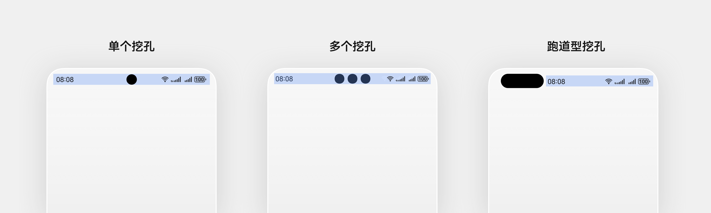
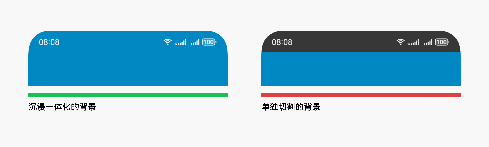
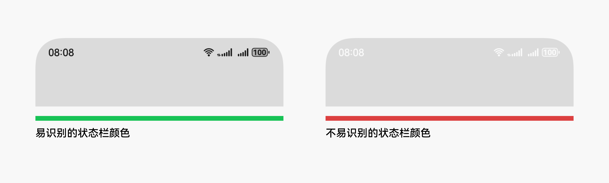
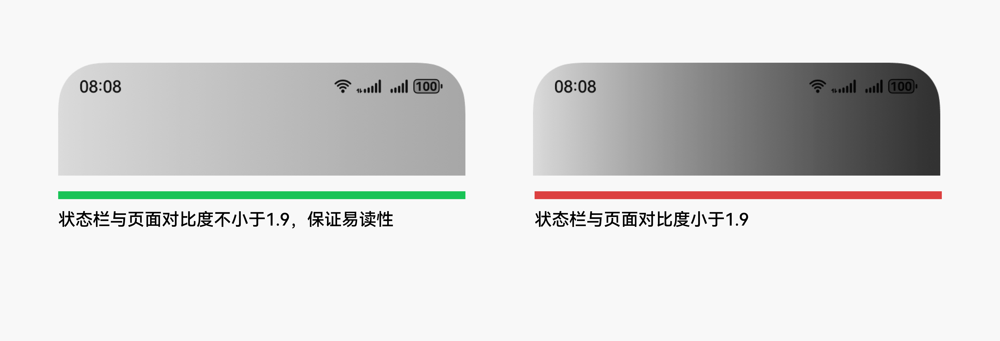

# 状态栏

更新时间：

来源：https://developer.huawei.com/consumer/cn/doc/design-guides/status-bar-0000001776775568

状态栏用于显示设备当前的状态信息，包括时间、WLAN、移动数据、电量等。状态栏一般显示在整个屏幕的顶部区域，与设备顶部的挖孔进行避让。
 

 

#### 状态栏设计原则

状态栏背景默认为透明，可以透出底下的内容，因此在设计该区域的背景时需要注意信息的易读性。
 
1.采用沉浸一体化的背景设计，保证效果的整体性，避免状态栏区域被单独切割。
 

 

 
2.根据页面内状态栏区域的背景色选择合适的状态栏颜色 (黑/白)，保证易读性。
 

 

 
3.避免在状态栏背景区域内采用左右半区对比差异过大的颜色，导致部分状态栏信息无法阅读。
 

 

 
 

#### 状态栏隐藏原则

在部分全屏沉浸的场景下 (如游戏、视频等)，为了保证用户对于沉浸内容的体验，可暂时隐藏状态栏。
 
手机在横屏显示时，为呈现更多内容信息，默认临时隐藏状态栏。
 
在隐藏状态栏时，保证用户可以通过简单的手势重新显示状态栏，方便用户对时间等实时状态进行查看。例如，在图库预览图片时，可以临时隐藏状态栏，避免对用户的沉浸浏览造成干扰。
 

