# 画中画

更新时间：

来源：https://developer.huawei.com/consumer/cn/doc/design-guides/pip-0000001927422624

画中画是一种视频内容或视频通话的显示方式，利用“画中画”可以在使用其他应用的同时，观看视频内容或使用视频通话，覆盖场景包括视频播放、直播、视频通话、视频会议等。

#### 基础方式

画中画有多种触发方式，业务可根据具体场景需要进行选择。

固定入口：通过应用内的固定入口触发，点击按钮开启画中画。

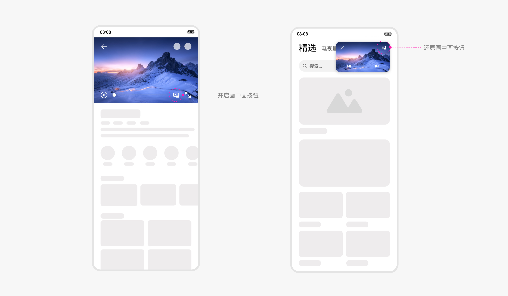

应用返回：通过应用内点击"返回"按钮或手势返回，返回至应用上一级，开启画中画。

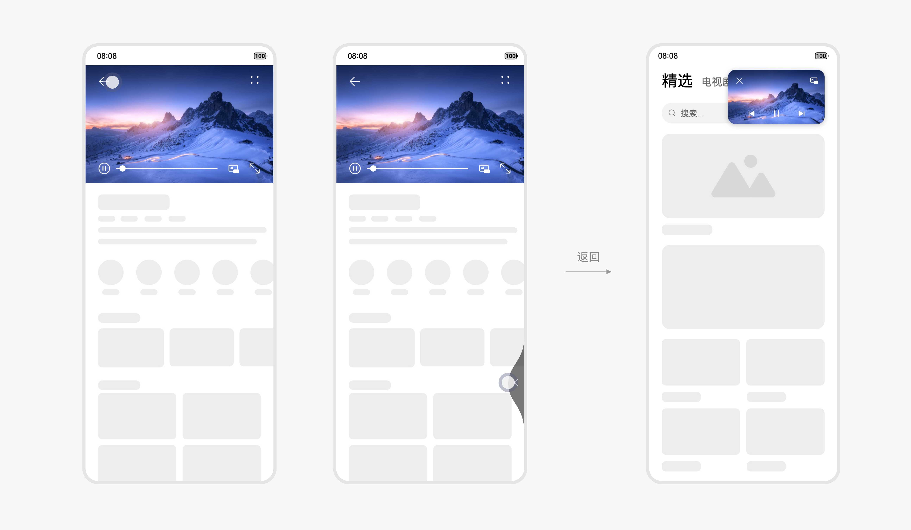

注：使用本方式，需先在系统设置中开启“自动开启画中画”

返回桌面：在应用内返回桌面，开启画中画。

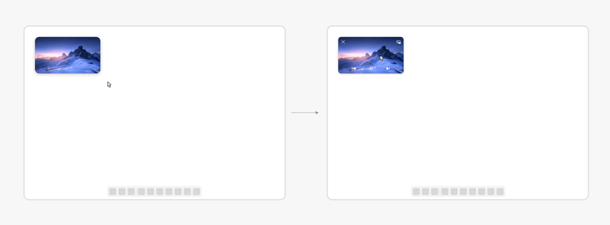

注：使用本方式，需先在系统设置中开启“自动开启画中画”

#### 窗口大小调节

可以通过以下方式调节窗口大小：

1、双击窗口放大。

2、拖拽窗口左下角或右下角，窗口等比例大小缩放。

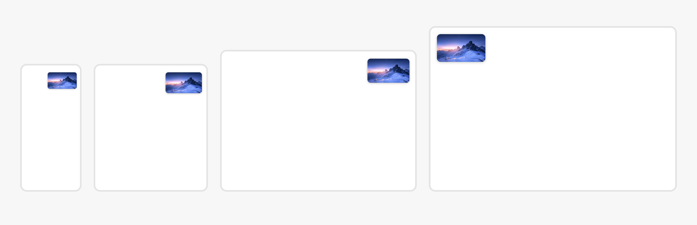

3、手指捏合或张开，在最大和最小尺寸之间等比例缩放窗口。

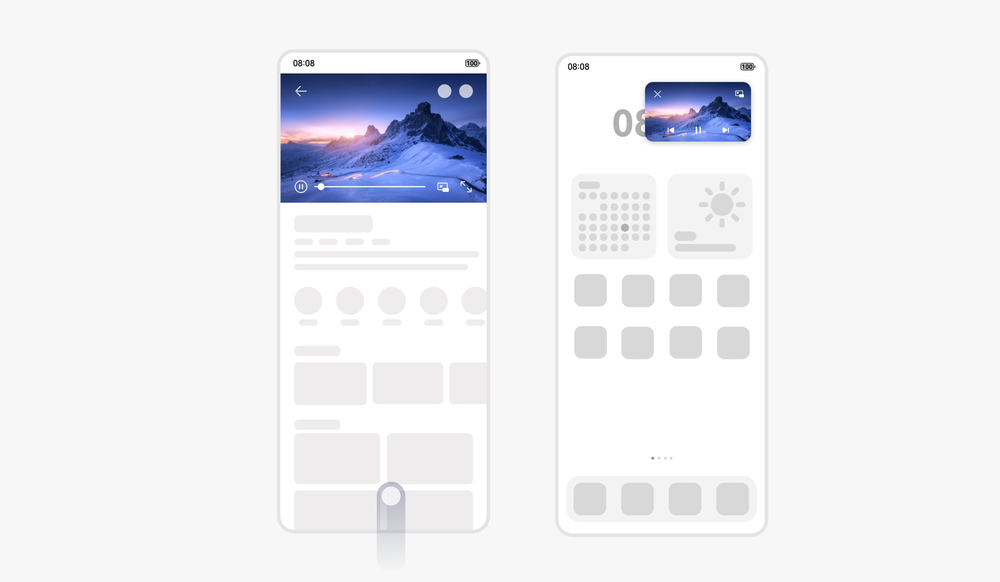

#### 窗口最小化

拖动画中画窗口到屏幕边缘，画中画收起到侧边悬浮条，任务不中断。点击侧边条，可从侧边条中恢复画中画窗口。

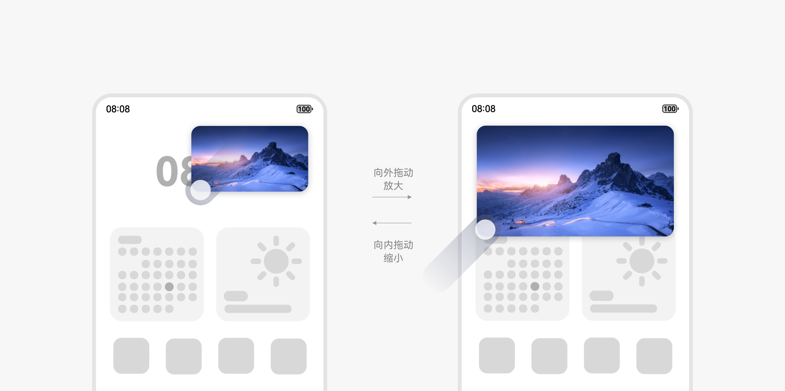

#### 窗口控制面板

系统提供根据业务场景提供统一的控制面板。

**【控制面板结构**】

系统定义画中画窗口显示区域、按钮数量和功能，针对不同业务场景提供对应的控制模版。

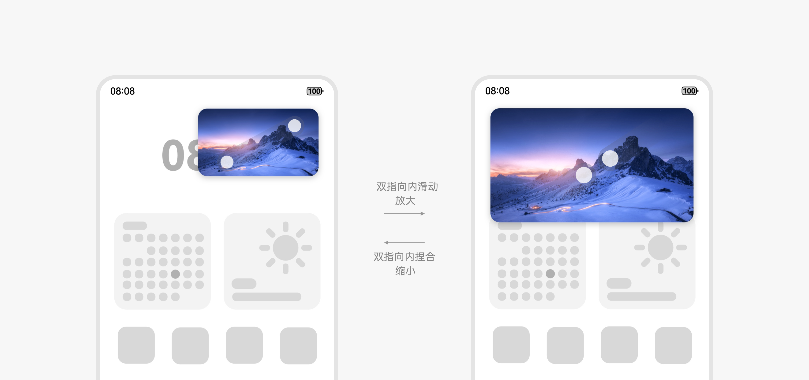

不同业务场景的窗口模版：

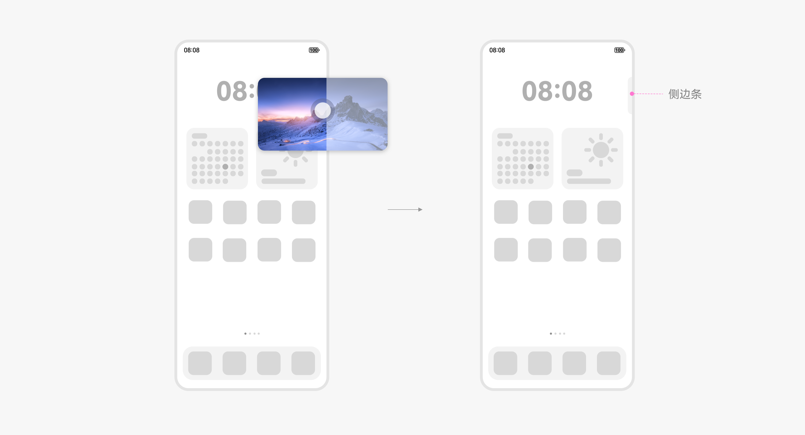

**【控制面板交互**】

默认小窗启动，显示控制面板，控制面板 3 秒不操作，自动隐藏。

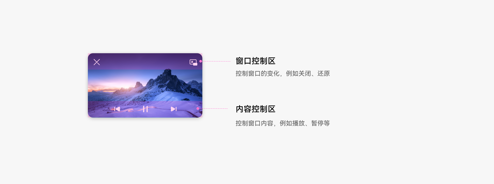

控制面板隐藏，单击窗口控制面板显示。

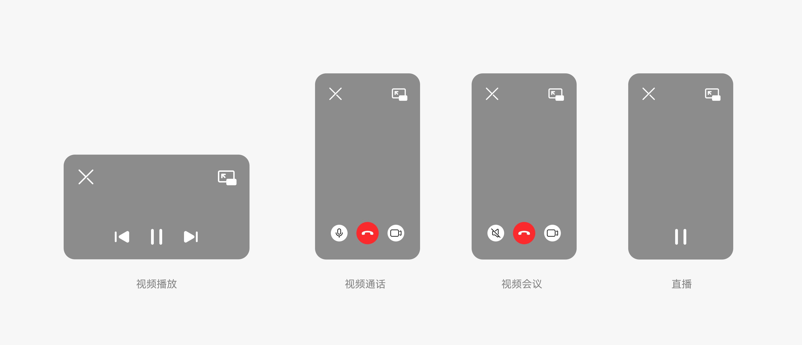

2 in 1端鼠标移动到画中画窗口上悬停，控制面板显示。

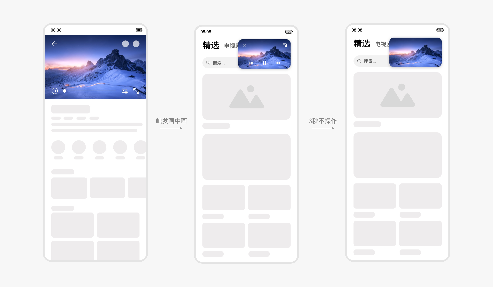

不同业务场景的控制按钮支持可配置，可根据场景需要配置显示不同的功能按钮。

| 业务场景 | 窗口控制区 | 内容控制 |    | 备注 |
|    |    | 必选 | 可选 |    |
| 视频播放 | 关闭、还原 | 播放/暂停 | 上一个&下一个、快进&快退 | 可选控件只能成对出现，不支持拆分；上一个&下一个与“快进&快退”仅可配置一对，不可同时出现。 |
| 直播 | 关闭、还原 | 无 | 外放静音、播放/暂停 |    |
| 视频通话 | 关闭、还原 (配置任意可选按钮后显示) | 无 | 打开/关闭麦克风、挂断、打开/关闭摄像头、外放静音 | 1、默认无按钮，点击画中画窗口任意位置还原； 2、选择任意可选按钮，“还原”和“关闭”按钮自动显示。 |
| 视频会议 |    | 关闭、还原 (配置任意可选按钮后显示) | 无 | 打开/关闭麦克风、挂断、打开/关闭摄像头、外放静音 |

#### 视觉规格

#### 窗口默认大小、位置

画中画默认显示最小窗口尺寸，手机端、折叠屏和平板端默认显示在屏幕右上角，2 in1 端默认显示在屏幕左上角。

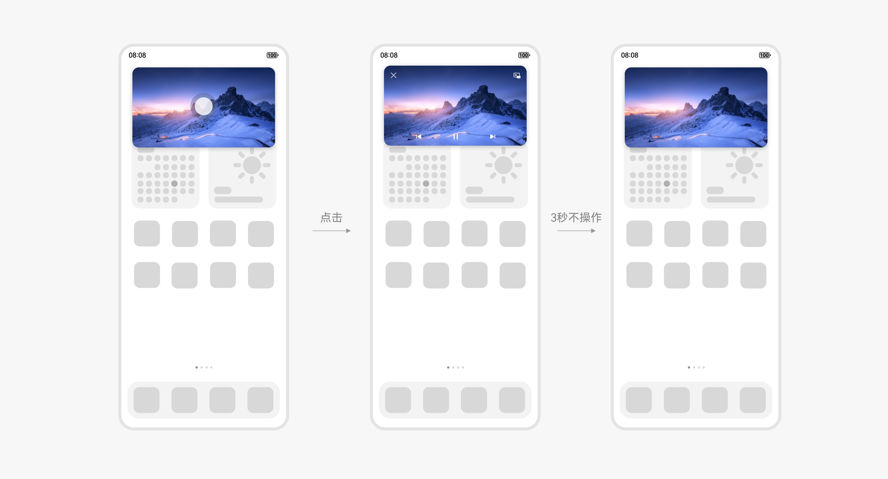

#### 画中画窗口尺寸

系统定义了竖向和横向两种比例的的画中画窗口，两种比例的窗口在不同设备上分别有最小（默认）和最大两个尺寸，应用可设定画中画窗口的显示比例，系统根据设定比例自动适配画中画的窗口大小。

| 设备状态 | 竖向画中画窗口 |    | 横向画中画窗口 |    |
|    | 默认尺寸 | 最大尺寸 | 默认尺寸 | 最大尺寸 |
| 直板机/折叠屏折叠态 | 窗口短边为屏幕短边的 30% | 窗口宽度占 3 栅格 | 窗口短边为屏幕短边的 30% | 窗口宽度占 4 栅格 |
| 折叠屏展开态 | 窗口短边为屏幕折叠态短边的 30% | 窗口宽度占 3 栅格 | 窗口短边为屏幕折叠态短边的 30% | 窗口宽度占 5 栅格 |
| 平板 | 窗口尺寸为默认悬浮窗窗口大小的 30% | 窗口宽度占 4 栅格 | 窗口宽度为屏幕短边的 30% | 窗口宽度占 5 栅格 |
