# 通知

更新时间：

来源：https://developer.huawei.com/consumer/cn/doc/design-guides/system-features-notification-0000001793074217

通知旨在让用户以合适的方式及时获得有用的新消息，帮助用户高效地处理任务。
 

#### 通知设计原则

- 为用户提供有价值的通知内容信息。
- 不要重复发送相同内容的通知打扰用户。
- 采用规范布局，不允许自定义复杂布局，以保证通知体验的一致性。
- 不要将通知作为小工具或广告板使用。
- 不要出于商业目的强制改变属性 (如采用实况窗强制置顶显示)，避免损害用户使用体验。

 
  
|  |  |  |
| 避免自定义复杂布局，破坏通知一致性 | 不要将通知作为小工具或广告板使用 | 不要强行置顶通知 |
 
 

#### 通知详情

 

#### 单条通知

**单条通知的基本元素包括图标、主副文本、时间：**
 

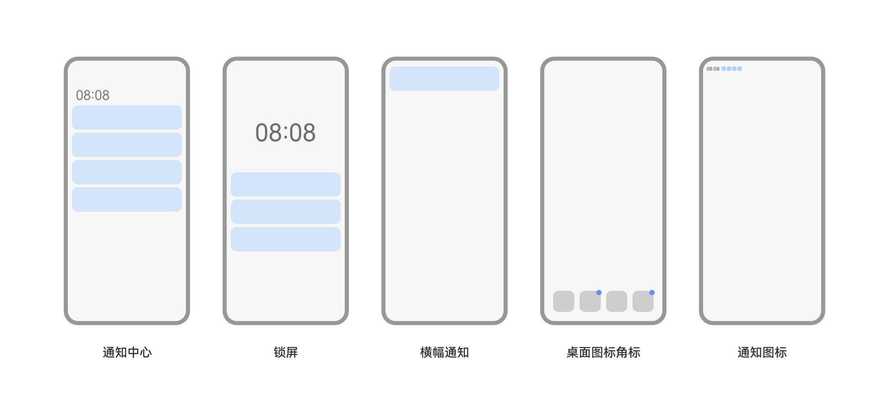

 
 

 
**通知元素**
 1. 通知图标：表示通知的功能与类型，由系统统一获取应用或元服务图标。
2. 通知标题：通知内容的简要概括或功能描述。避免直接使用应用或服务的名称。
3. 时间：发送通知的时间，系统默认显示。
4. 内容详情：描述通知的具体内容或详情。最多显示 3 行，超长则“…”截断。
 

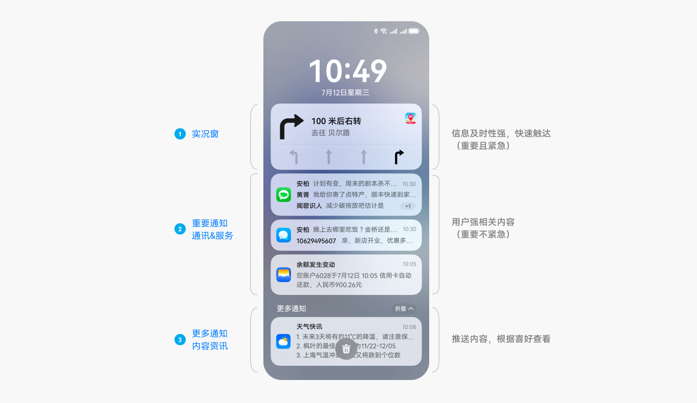

 

 
**交互规则**
 
点击整条通知跳转至对应的详情界面。
 

 

#### 组合通知

**应用如果发送多条通知，在同一分区内的则需设为一条组合通知。**
 

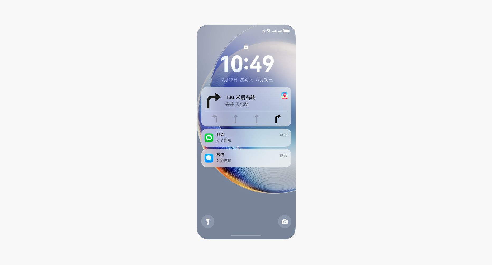

 

 
**展开前**
 1. 通知图标：表示该组通知的来源，由系统统一获取应用或元服务图标。
2. 通知内容：最新 3 条通知的标题及内容详情。
3. 时间：最新 1 条通知的时间。
4. 条数示意：表示未显示通知的数量，超过 3 条的显示 “ + N”，如为 2-3 条则无此示意。
 

 
**展开后**
 
5.标题区：该组通知的图标、名称和收起箭头。
 
6.内容区：每条子通知的标题和内容详情。
 
 

#### 模板样式

 

#### 普通通知

默认采用 3 行普通通知样式。
  
| 单条通知 |
|  |
 
  
| 单条内容超三行 |
|  |
 
 
 

#### 图片预览通知

适用于有图片预览的通知。
 
- 图片建议为方形、高质量的图片，其他形状可能会导致内容被裁切。
- 图片需要与通知内容强相关，避免使用与内容无关的图片。
- 不要使用与应用图标重复的图片。

 

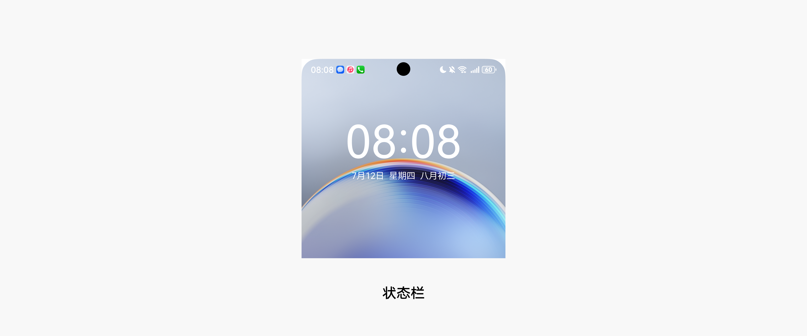

 
 

#### 通讯对话类通知

适用于通讯类或对话类的通知，左侧显示用户头像。
 

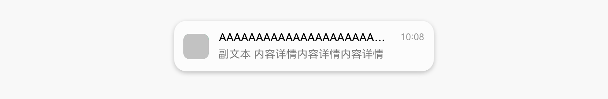

 
 

#### 多行文本类通知

适用于需要换行显示的文本内容。
 
最多可显示 3 行内容详情，每行超长后 “…” 截断。
 

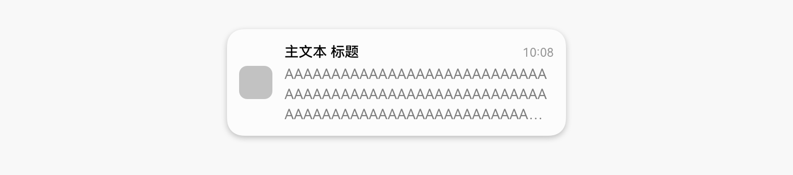

 
 

#### 通知提示场景

**通知会在不同场景以不同形式提示用户。应用发出一条通知时，可配置通知的提示场景。**
 
开发指南请参阅[Push Kit简介](https://developer.huawei.com/consumer/cn/doc/harmonyos-guides/push-kit-introduction)
 

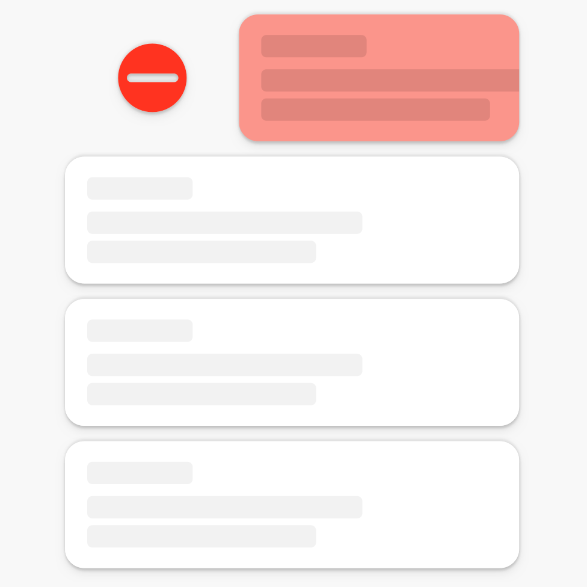

 1. 通知中心：通知浏览界面，通知在通知中心中根据类别排序，每个类别内按时间排序。
2. 锁屏通知：锁屏上仅显示本次锁屏期间接受的通知，显示样式默认为底部图标和数量，可展开成列表。
3. 横幅通知：在界面顶部显示 5s 后消失，非沉浸态显示 3 行高度，沉浸态显示 1 行高度。
4. 桌面图标角标：角标表示本应用或元服务有消息，消息与通知中心的内容不对应，由服务方自己定义。
5. 通知图标：以图标形式显示在状态栏、AOD 界面。
 
 

#### 通知中心

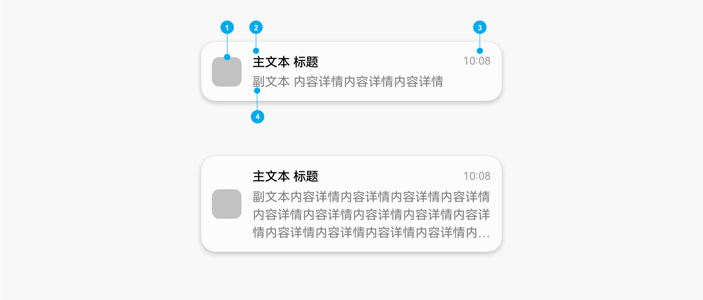

 1. 实况窗显示在通知中心顶部，分区内按创建时间排序。
2. 重要通知包括通讯社交和服务提醒类通知，排在实况窗后面，分区内按时间排序。
3. 内容资讯类通知显示在更多通知分区，分区内按时间排序。
4. 通知默认在通知中心显示，应用无需配置。
 
 

#### 锁屏通知

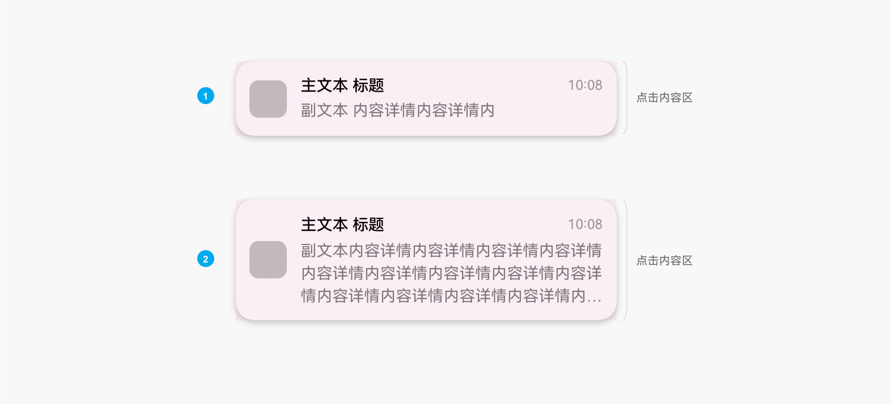

 
- 锁屏上仅显示本次锁屏期间接收的普通通知。
- 打开 “锁定时显示预览” 开关，通知内容不会被隐藏。
- 应用可配置通知是否显示在锁屏上。锁屏通知受到通知设置中提醒方式的管控。

 
 

#### 横幅通知

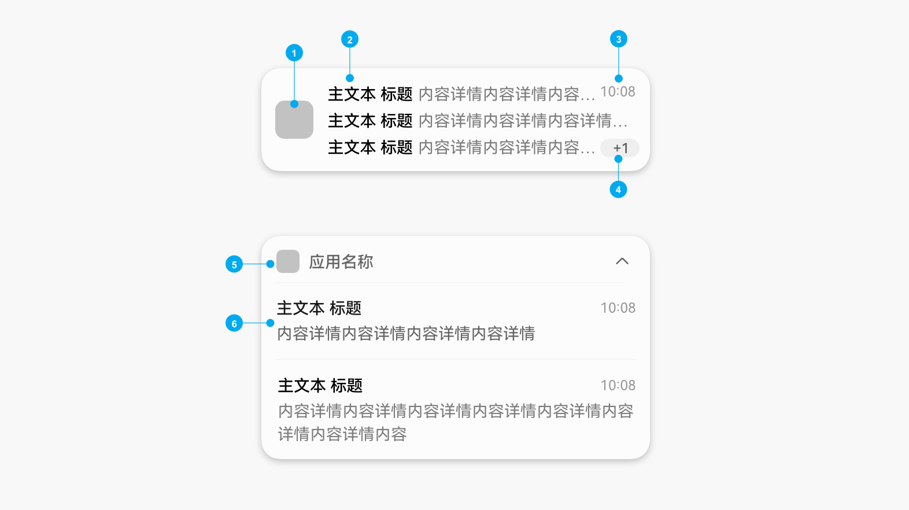

 1. 横幅通知为高提示性场景，仅开启了横幅提醒方式的应用可生效。
2. 横幅通知在界面顶部显示 5s 后消失。例外：来电、闹钟类横幅通知为长时间停留。
3. 同时接收多条横幅通知时，仅显示最新一条通知。
4. 非沉浸态界面显示 3 行副文本的通知高度。
5. 沉浸态界面下，通知显示单行高度。
 
 

#### 桌面图标角标

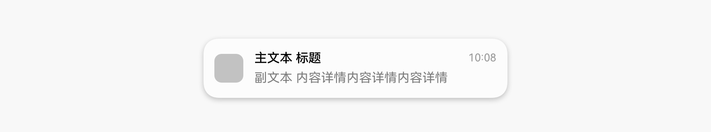

 
- 桌面图标角标为数字角标。
- 数字角标是应用新消息的提示，不完全对应通知。
- 数字角标最多显示 “99 + ”。

 
 

#### 通知图标

- 通知以图标形式显示在状态栏等位置，与通知卡片图标为同一资源。
- 通知图标由系统取应用或服务的图标。

 

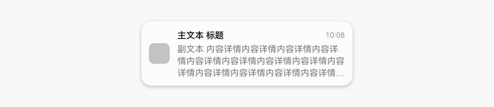

 
 

#### 文本超长显示规则

 

#### 通知标题

- 标题最多显示 22 个英文字符，或 15 个中文字。建议完整显示字串。
- 不支持换行，超过 1 行“…”截断。

 

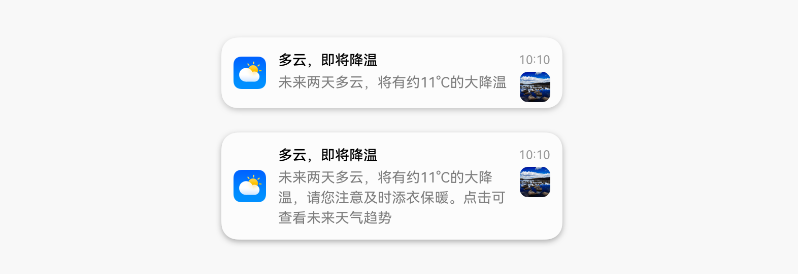

 

 
 

#### 通知内容详情

- 内容详情最多显示 84 个英文字符，或 57 个中文字。建议完整显示字串。
- 最多可显示 3 行，显示不下“…”截断。

 

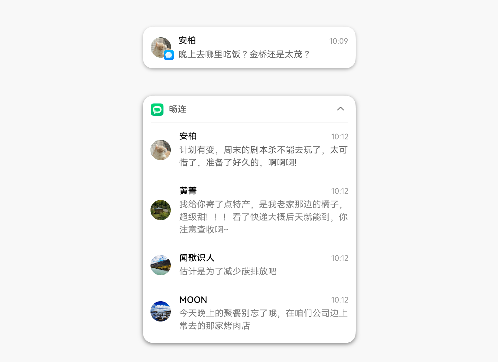
