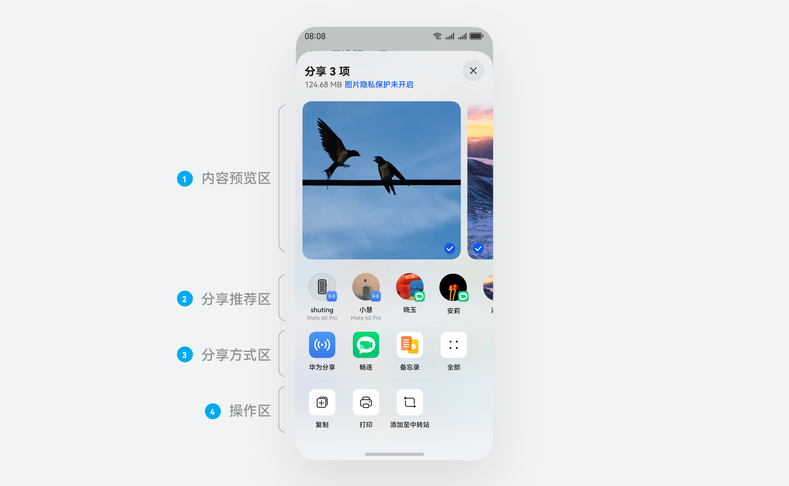
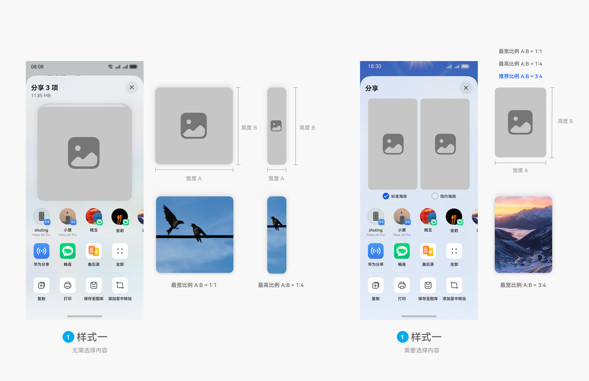
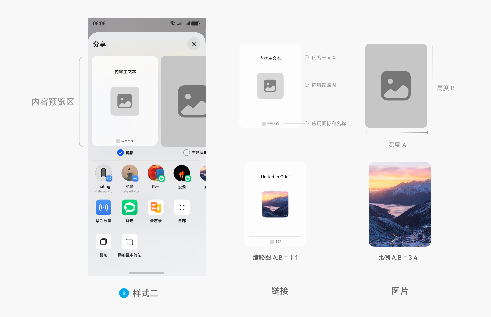
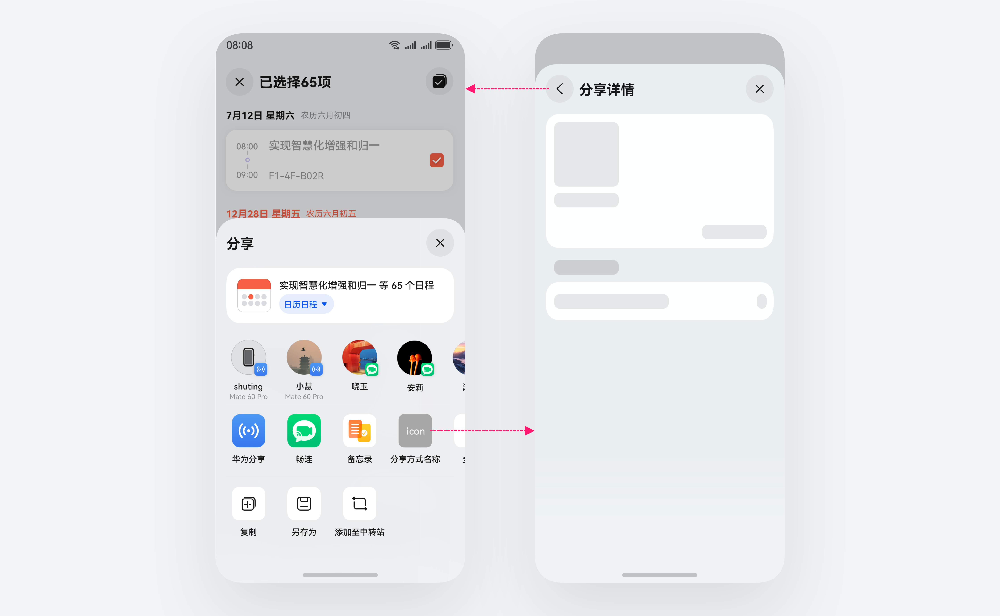
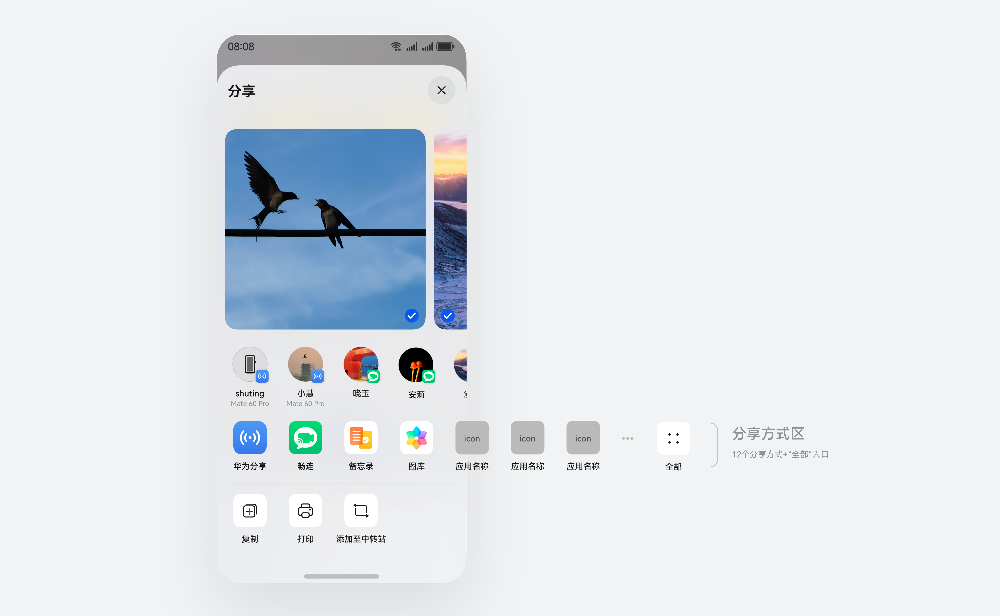
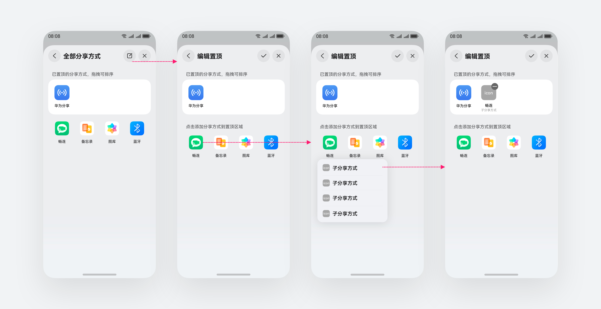

# 分享

更新时间：

来源：https://developer.huawei.com/consumer/cn/doc/design-guides/share-0000001957076313

用户可通过“分享”操作，将当前内容分享给他人。
 

#### 分享一致性

- 应用需通过“分享”图标或“分享”选项调用最新的分享控件。使用分享图标请参阅[图标库](https://developer.huawei.com/consumer/cn/design/harmonyos-symbol/)
- 关于分享的开发适配指南，请参阅[Share Kit](https://developer.huawei.com/consumer/cn/doc/harmonyos-guides/share-introduction)

  
|  |  |
 
 
 

#### 分享面板构成

分享面板由四部分构成：
 1. 内容预览区：提供 2 类预览模板，应用可根据不同需求选择不同模板。
2. 分享推荐区：推荐“华为分享”的近场设备和应用最近联系人。不支持应用自定义。
3. 分享方式区：默认显示 12 个分享方式 + “全部”入口。不支持应用自定义。
4. 操作区：不同的分享内容会提供相对应的系统操作。
 

 
 

#### 分享内容模板

根据不同的分享内容，提供 2 类预览模板，应用可根据不同需求选择不同模板。
 
 

#### 大卡模版

 
**样式一**
 1. 适用场景：内容仅为图片或视频。
2. 应用自定义：
 
- 无需用户选择内容时，需传入缩略图，推荐传入 1:1 至 1:4 比例缩略图效果为最佳，超过比例范围会剪裁。
- 需要用户选择内容时，需传入缩略图、缩略图名称。推荐传入 3:4 比例缩略图效果为最佳，超过 1:1 至 1:4 比例范围会剪裁。

 

 

 
**样式二**
 1. 适用场景：需在链接和图片格式中选择分享内容。
2. 应用自定义：
 
- 链接需传入缩略图、内容主文本、应用图标、应用名称。推荐传入 1:1 比例缩略图效果为最佳，超过比例范围会剪裁。
- 图片需传入缩略图、缩略图名称，推荐传入 3:4 比例缩略图效果为最佳，超过比例范围会剪裁。

 

 

#### 横卡模式

 
  
| 样式一 适用场景：内容为文档 (文件夹)、链接、应用特殊格式，或为多种类型的混合文件内容。应用自定义：需传入缩略图、内容主副文本。缩略图推荐传入能示意当前内容的图片，其次使用应用图标。 样式二 适用场景：需在文件、链接、图片、应用特殊格式等格式中选择一种格式分享。应用自定义：需传入每个格式的缩略图、内容主文本、格式名称。缩略图推荐传入能示意当前格式和内容的图片，其次使用应用图标。 |
|  |
 
 

#### 分享方式区

 
 

#### 基础交互
1. 点击 (子) 分享方式会跳转至“分享详情”页面，也可返回至分享面板。其中“分享详情”页面为分享接收的应用开发。
2. 应用可在“分享详情”页面展示精简、必要的分享详细内容，如进一步选择要分享的目标联系人、目标文件夹等。合理规划内容布局，当内容较少时推荐在顶部显示。不展示和分享无关的应用其他内容。
3. 关于“分享详情”页面的开发指南，请参阅[半模态面板](https://developer.huawei.com/consumer/cn/doc/design-guides/bindsheet-0000001956852753)

 
 

#### 选择分享方式
 
| 应用无多种分享方式时，点击图标即可分享。应用有多种分享方式时，点击图标后需在菜单中选择一种子分享方式分享。应用需传入每个子分享方式的图标和名称。 |
 
 
 

#### 全部分享方式

**分享方式区：**
 1. “华为分享”默认始终置顶显示。
2. 全部 (子) 分享方式按照用户手动置顶＞用户最近分享＞用户最新安装来动态排序，不支持应用自定义。默认显示 12 个分享方式 + “全部”入口。
 

 
**全部分享方式：支持查看和编辑置顶。**
 
- 应用无多种分享方式时，点击图标即可置顶。
- 应用有多种分享方式时，点击图标后需在菜单中选择一种子分享方式置顶。置顶的子分享方式会在分享方式区显示和排序。

 

 
 

#### 操作区

系统操作
 
- 不同的分享内容会提供相对应地系统操作，不支持应用自定义。

  
| 分享内容 | 分享内容预览 (业务自定义) | 系统操作 |
| --- | --- | --- |
| 图片 (单个、多个) | 1.主文本：分享 N 张图片 2.需传入缩略图 | 复制、打印、添加至中转站、保存至图库 |
| 视频 (单个、多个) | 1.主文本：分享 N 个视频 2.需传入缩略图 | 复制、添加至中转站、保存至图库 |
| 单个文件 (文本、音频、文档、文件夹、应用特殊格式) | 1.主文本：文件名称 2.推荐传入能示意内容的缩略图，其次传入文件图标 | 复制、打印 、另存为、添加至中转站 |
| 多个文件 (文本、音频、文档) | 1.主文本：N 个文件 2.需传入所有文件的缩略图 | 复制、打印 、另存为、添加至中转站 |
| 链接 (网页链接、应用页面链接、应用下载链接) | 推荐传入能示意内容的缩略图 、内容标题、内容辅助信息，其次传入应用图标、内容标题 、网址 | 复制、添加至中转站 |
