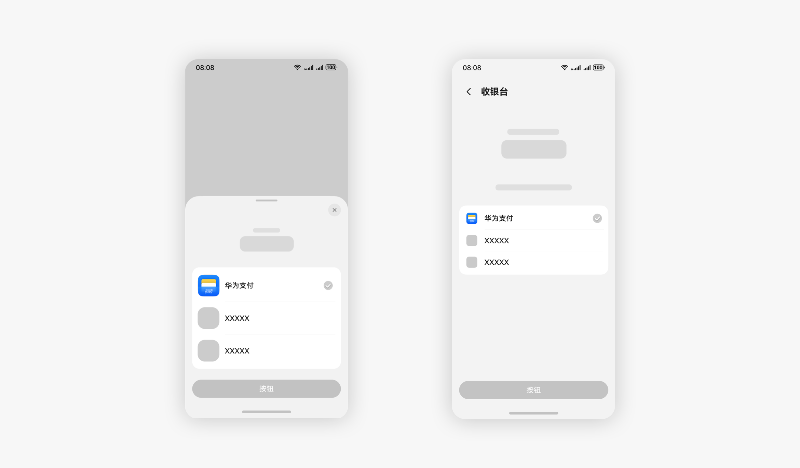
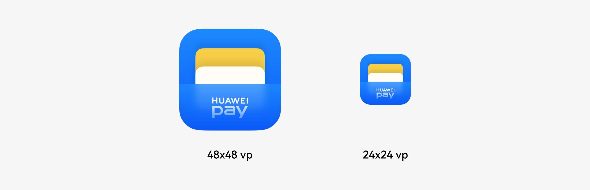
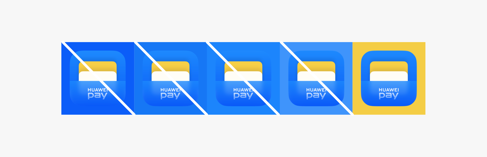
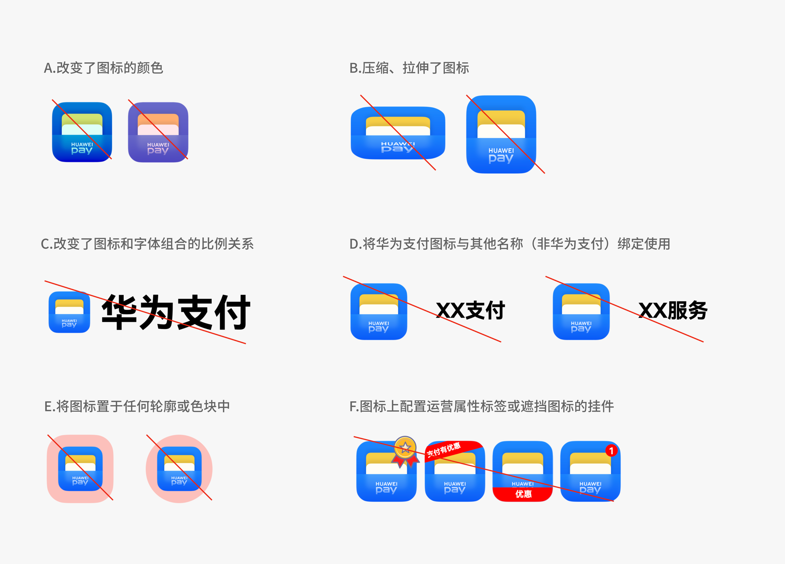

# 华为支付

更新时间：

来源：https://developer.huawei.com/consumer/cn/doc/design-guides/huaweipay-0000002054558905

华为支付是一种方便、安全和快捷的支付方式。
 

#### 场景介绍

华为支付图标通常在收银台等界面展示，如下图所示：
 

 
 

#### 图标大小

在核心使用场景下的实际尺寸通常有 48x48 vp、24x24 vp，请确保该尺寸下图标清晰易识别：
 

 
 

#### 背景控制

在使用华为支付图标时，请注意图标颜色和背景颜色的反差，避免图标要素不可读或者不易读。
 
辅助色背景控制 (在有色背景上使用，尽量避免使用蓝色系，以免造成图标边缘不清晰)：
 

 
若不可避免使用蓝色系背景，需加上不小于 0.5 px 的白色描边使图标边缘清晰：
 

 
 

#### 典型错误案例

