# 华为账号开放登录

更新时间：2025-11-20 08:37:05

来源：https://developer.huawei.com/consumer/cn/doc/design-guides/id-0000001880001344

华为账号提供登录体验设计规范，帮助用户使用已有的华为账号登录HarmonyOS生态内全部应用。遵循规范设计可享有以下好处：

(一) 简单易用：

登录界面的重点信息和操作突出，减少用户的理解成本。

(二) 体验一致：

多应用，多设备登录体验一致，为用户提供一致且熟悉的登录体验。

(三) 开发者友好：

1. 开发者拥有可自定义的范围：使用华为账号提供的登录按钮时，开发者可以调整按钮的大小、圆角、位置等。

2. 调用合适的登录组件：华为账号提供两种登录类型，开发者可以根据需要调用合适的登录组件。

## 概述

### 使用原则

使用华为账号开放登录请遵循以下原则：

(一) 建议仅在有价值时要求用户登录：

允许用户有足够的时间和机会体验应用的用途后，再决定是否注册/登录使用。禁止在用户进入 HarmonyOS 应用还未开始了解基础功能时，就强制要求注册/登录。若特定行业有国家相关要求，则要求注册/登录后才可以使用。

(二) 用户应当有拒绝登录的权利：

当 HarmonyOS 应用调用账号登录功能时，应提供清晰的取消或拒绝选项按钮，不得强制要求用户登录账号才能继续使用。如用户拒绝登录，可在用户表现出向 HarmonyOS 应用授权的意向后再次提示登录。

(三) 使用华为账号登录时，需作为首个登录页。

### 登录组件介绍

华为账号提供两种登录组件。

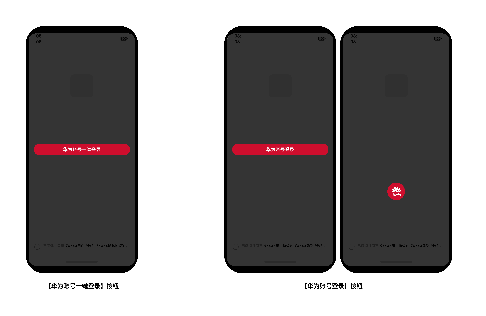

## 【华为账号一键登录】按钮

当应用有自定义的登录页时，开发者可以使用华为账号提供的【华为账号一键登录】按钮让用户完成登录。

### 体验流程

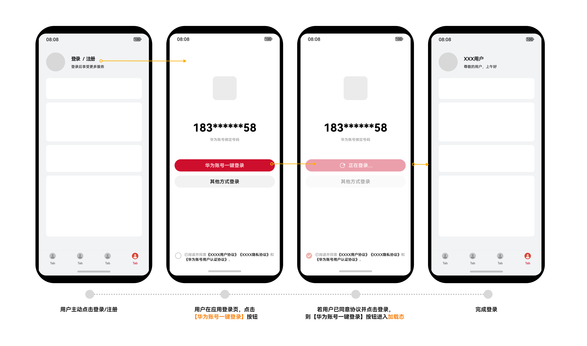

### 使用规范

调用【华为账号一键登录】按钮时，页面必须包含以下【必选】项。推荐使用图中登录页布局。

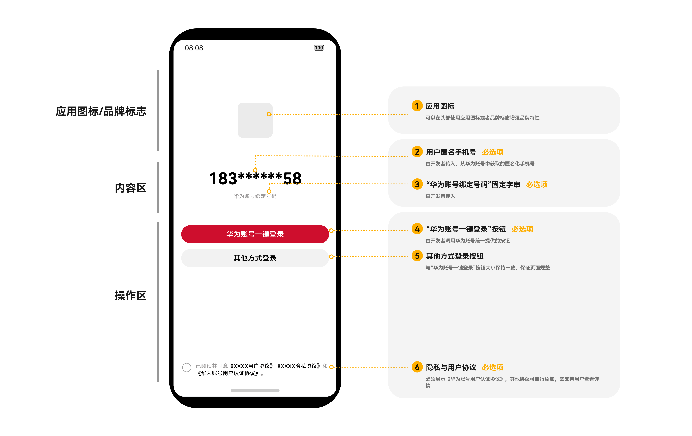

应用图标/品牌标志：

① 应用图标：可以使用应用图标或者品牌标志凸显品牌特性。

内容区：

②【必选】用户匿名手机号：由开发者传入，从华为账号中获取的匿名化手机号。

③【必选】“华为账号绑定号码”：由开发者传入，字符串固定，不可更改。

操作区：

④【必选】开发者调用【华为账号一键登录】按钮：必须是首个登录选项。使用华为账号统一提供的按钮 (请参阅下一节视觉规范)。选择的按钮颜色要与界面的背景色有一定的对比度。

⑤ 其他方式登录按钮：若添加其他方式登录按钮，必须放置在【华为账号一键登录】按钮下方。

⑥【必选】隐私与用户协议：必须展示《华为账号用户认证协议》，可选择展示其他协议，需支持用户查看详情。

### 视觉规范

① 不可自定义项：

A.  文字内容：“华为账号一键登录”需清晰呈现。

B.  按钮布局：按钮内文字居中展示。

② 可自定义项：

A.  文字字重：可配置。

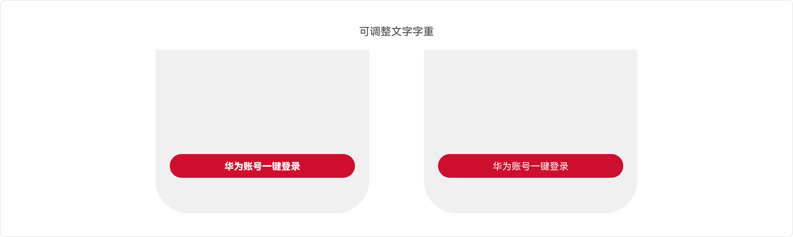

B.  文字字体：可配置（默认跟随系统字体）。

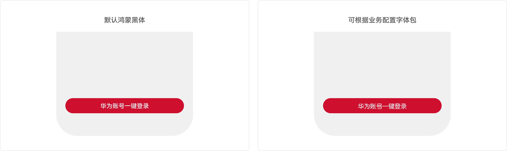

C.  按钮圆角：可配置（手机、平板、电脑默认均为全圆角）。

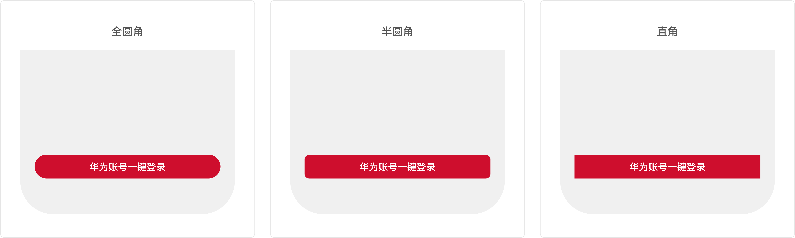

D.  按钮高度与文字大小：按钮高度范围在28vp ~ 60vp之间；文字大小为按钮高度的30% ~ 50%（四舍五入取整数），不超过12fp ~ 30fp区间。

E.  按钮宽度：不小于150vp，保证文本与按钮内安全边距至少16vp，同时按钮宽度要保证文本能够完整露出，不能截断。

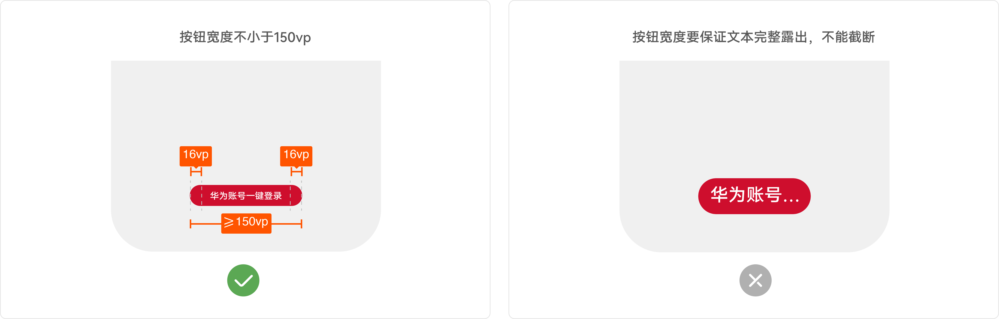

F.  按钮与屏幕安全间距：最小值16vp。

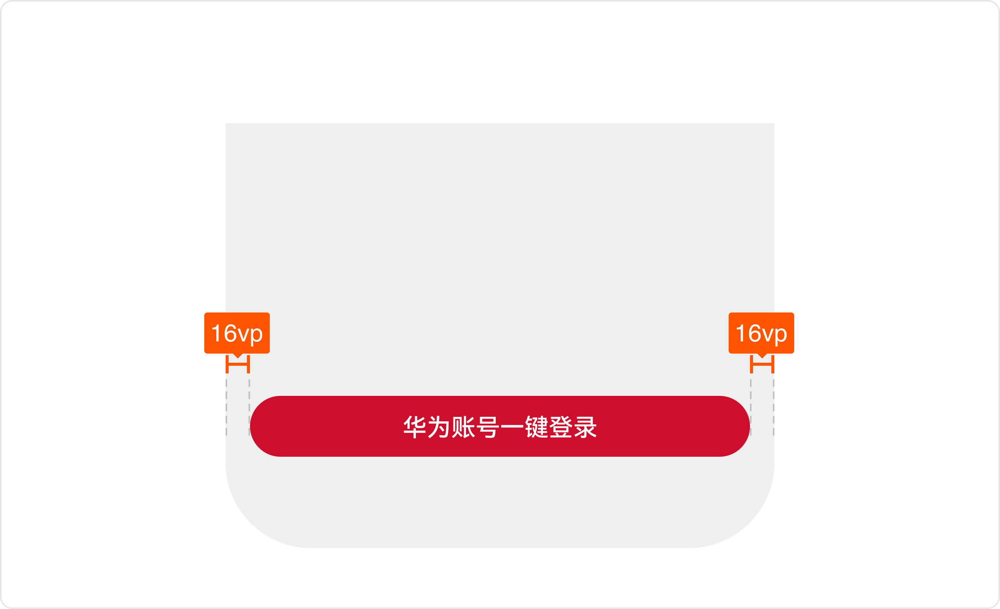

G.  按钮风格：可根据应用需要调整按钮风格。

## 【华为账号登录】按钮

当应用有自定义的登录页时，开发者可以使用华为账号提供的【华为账号登录】按钮让用户完成登录。

### 体验流程

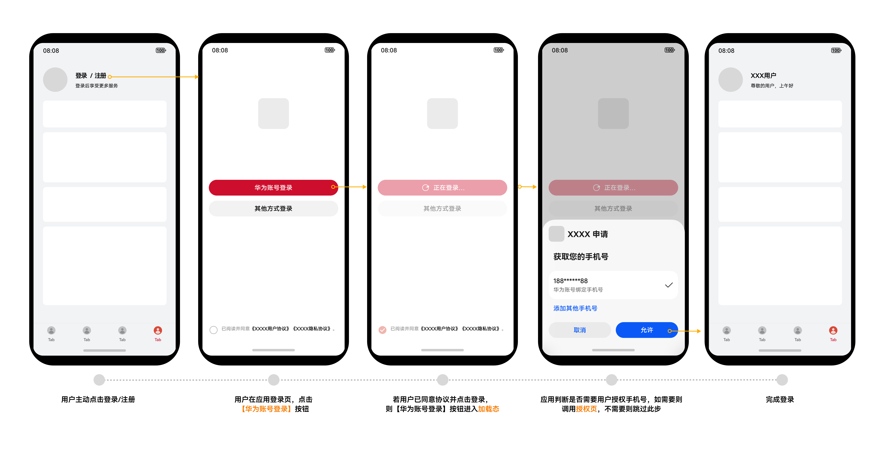

### 使用规范

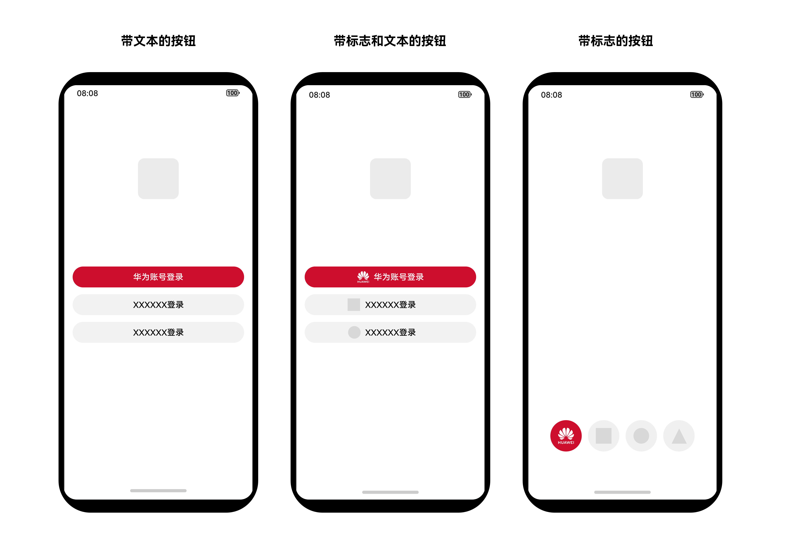

① 仅可使用华为账号提供的三种样式：

带文本的按钮、带标志和文本的按钮、带标志的按钮。

②【华为账号登录】按钮需放置在三方账号登录方式的首位：

若应用同时集成其他第三方账号 (非应用自身账号)， 则【华为账号登录】按钮需位于所有三方账号登录按钮的首位，避免【华为账号登录】按钮需滚动查看或隐藏等情况。

③ 选择的按钮颜色要与界面的背景色有一定的对比度。

④ 保证界面布局合理：

当页面有多个登录按钮时，开发者可以调整按钮的大小、圆角、位置等，以保证界面布局的一致性和美观性。

### 视觉规范

当应用有自定义的登录页时，华为账号提供了多种按钮样式，可以选择直接调用【华为账号登录】按钮，并享有以下好处：

- 确保按钮内容在开发者更改其样式时保持理想的比例。
- 按钮支持自动适配深色模式。
- 保证按钮使用华为规范内的样式。

若应用的登录页有自定义样式的需求，也可以根据以下规范制作【华为账号登录】按钮让用户完成登录。

华为账号提供三种登录按钮样式：带文本的按钮、带标志和文本的按钮、带标志的按钮。

样式一：带文本的按钮

① 不可自定义项：

A.  文字内容：“华为账号登录”需清晰呈现，不可更改。

B.  按钮布局：按钮内文字居中展示。

② 可自定义项：

A.  文字字重：可配置。

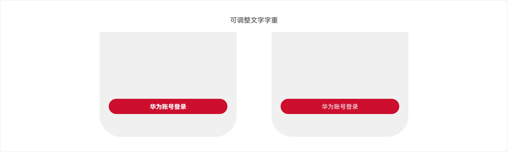

B.  文字字体：可配置文字字体（默认跟随系统字体）。

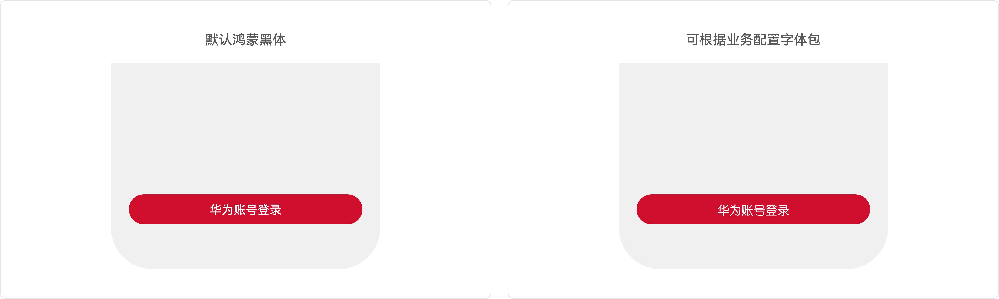

C.  按钮圆角：可配置（手机、平板、电脑默认均为全圆角）。

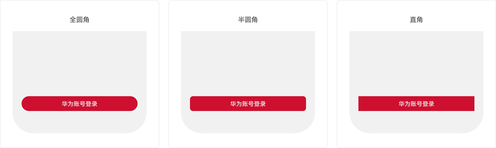

D.  按钮高度与文字大小：按钮高度范围在28vp ~ 60vp之间；文字大小为按钮高度的30% ~ 50%（四舍五入取整数），不超过12fp ~ 30fp区间。

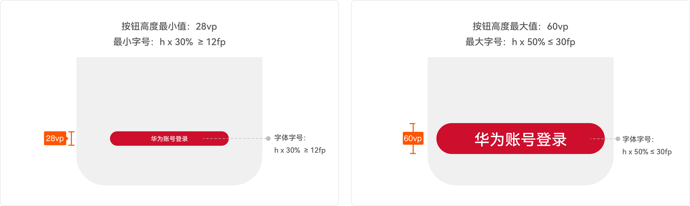

E.  按钮宽度：不小于150vp，保证文本与按钮内安全边距至少16vp，同时按钮宽度要保证文本能够完整露出，不能截断。

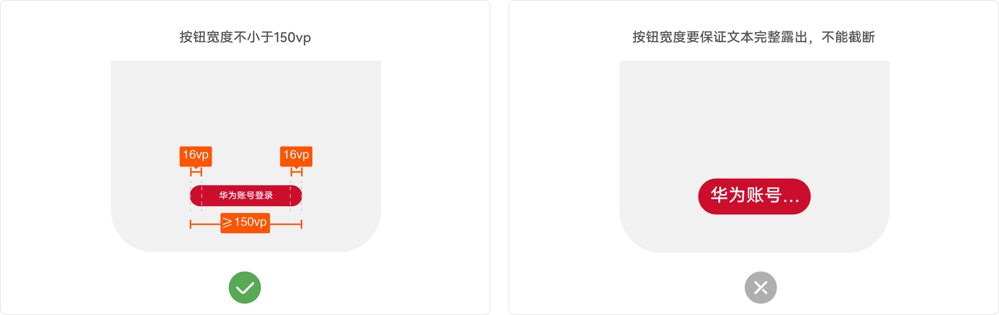

F.  按钮与屏幕安全间距：最小值16vp。

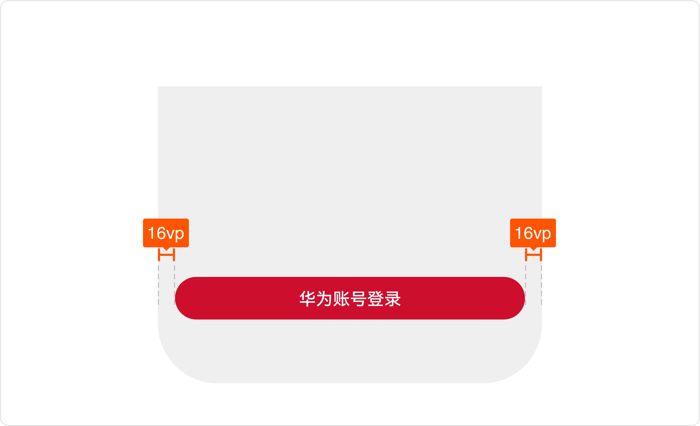

G.  按钮风格：可根据应用需要调整按钮风格。

H.  大字体规则

文字最大放大到3.2倍，按钮圆角不变。

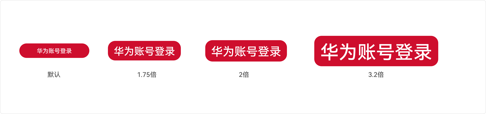

默认布局规格。

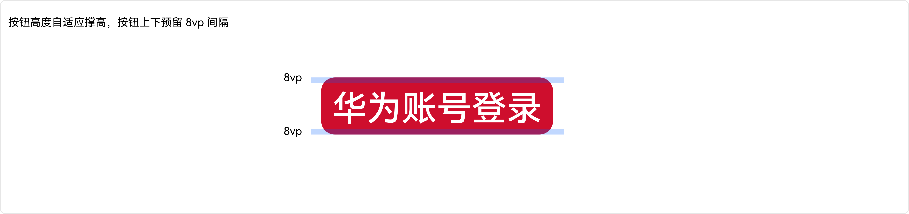

超长换行规则。

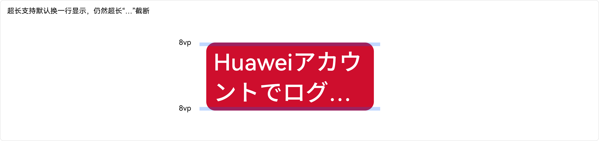

I.  多语言规则

双向&镜像原则

阿拉伯语、波斯语、乌尔都语、希伯来语等语言的书写方向为从右向左书写，和当今世界的主流语言（如英语）等从左向右书写的方向相反。受文字书写方向的影响，阿拉伯等语言的用户对左右逻辑的认知和英文等LTR（Left to Right）完全相反，比如习惯将右侧作为开始，左侧作为结束。为了支持RTL语言的这种语言和用户习惯特点，应用在本地化时，除了常规的翻译、区域特性适配等工作外，还需要在文本、界面布局、手势操作和动画、图标等交互元素中满足RTL的特殊要求。

样式二：带标志和文本的按钮

带标志的插图，请参阅设计资源-使用华为账号登录，切勿创建自定义华为标志。当创建自定义【华为账号登录】按钮时，请遵循以下使用标志插图文件规范：

① 请勿裁剪华为标志。

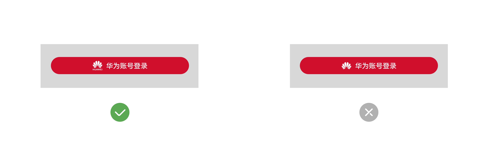

② 使标志的高度与按钮的高度相匹配。

③ 请勿添加垂直内边距。

请遵循以下规范制作登录按钮：

① 不可自定义项：

A.  文字内容：“华为账号登录”不可更改。

B.  字重：加粗（Medium）。

C.  字体：默认跟随系统字体。

D.  标志大小：与按钮文字字号（f）相关联，标志（logo）大小为1.5*f (四舍五入取整数)。

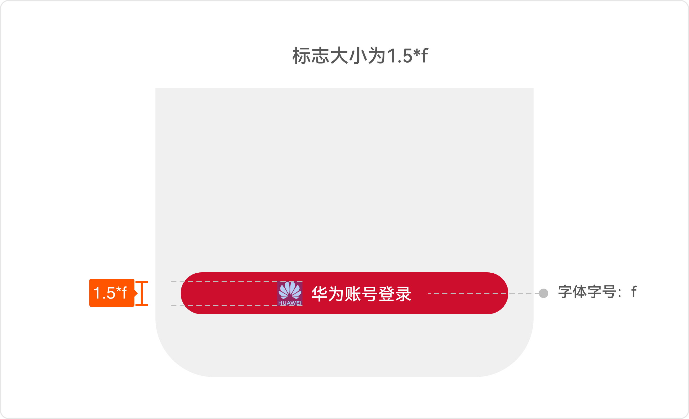

E.  按钮布局：内容区整体在按钮内居中展示。

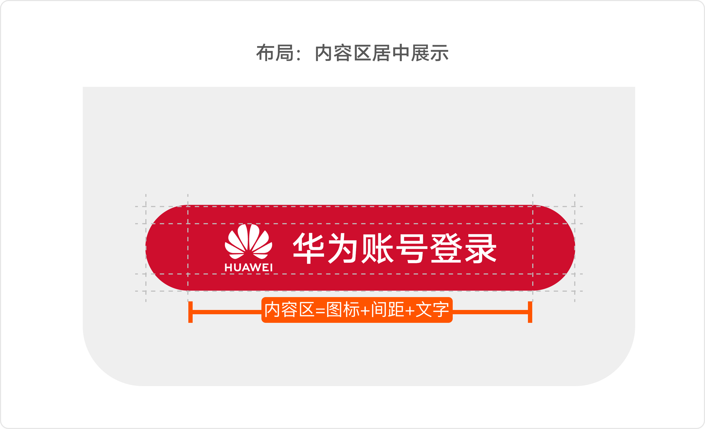

F.  按钮颜色：只能使用华为账号提供的固定颜色组合。

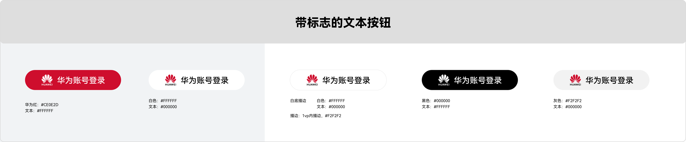

G.  按钮多态：按钮多态需按以下规则制作，loading态时图标与文字颜色相同（以华为红为例）。

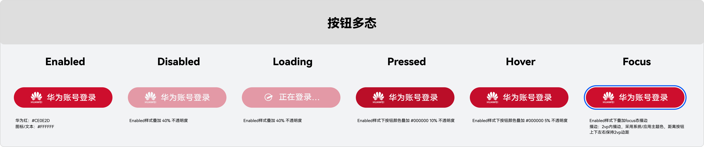

② 可自定义项

A.  按钮圆角：可配置（手机、平板、电脑默认均为全圆角）。

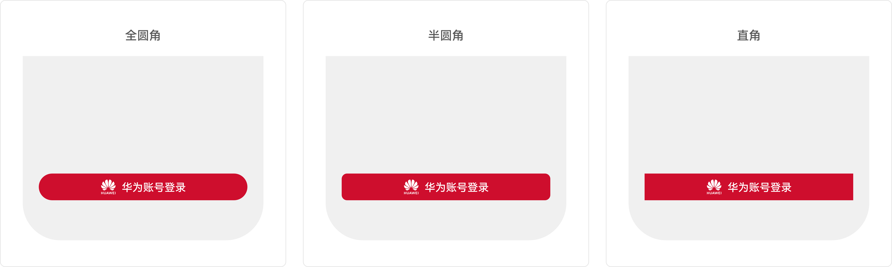

B.  按钮高度与文字大小：按钮高度范围在28vp ~ 60vp之间；文字大小为按钮高度的30% ~ 50%（四舍五入取整数），不超过12fp ~ 30fp区间。

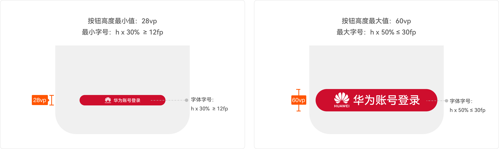

C.  按钮宽度：不小于150vp，保证文本与按钮内安全边距至少16vp，同时按钮宽度要保证文本能够完整露出，不能截断。

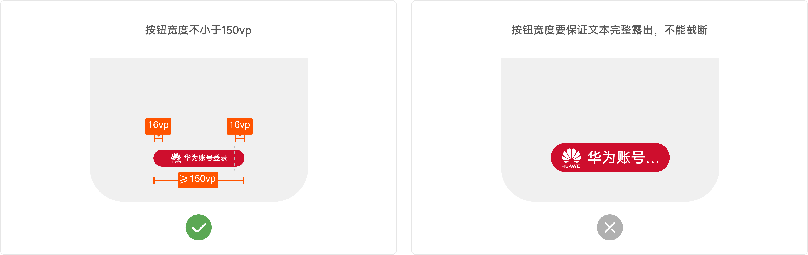

D.  标志与文本间距：范围在4vp ~ 16vp之间。

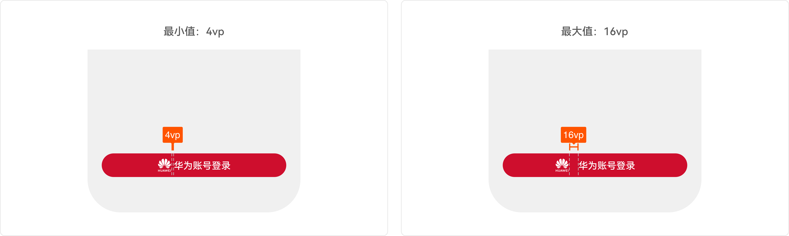

E.  按钮与屏幕安全间距：最小值16vp。

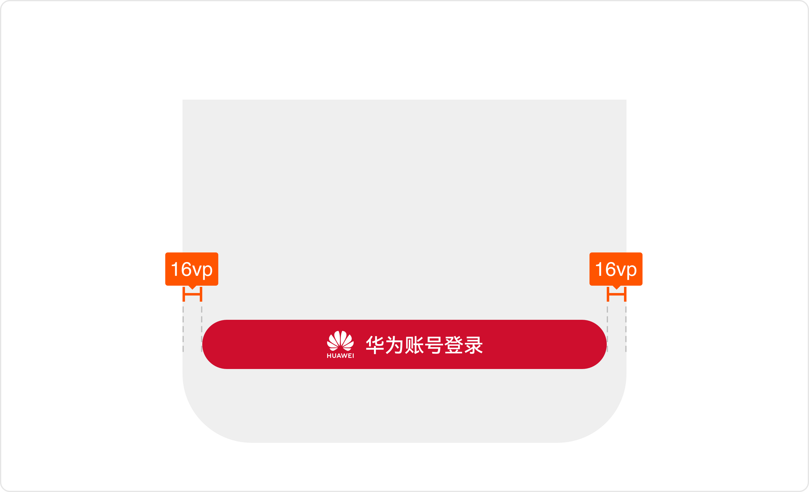

F.  大字体规则

文字最大放大到3.2倍，logo不跟随文字大小缩放，按钮圆角不变。

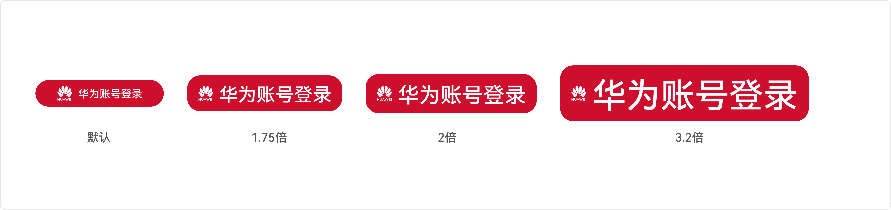

默认布局规格。

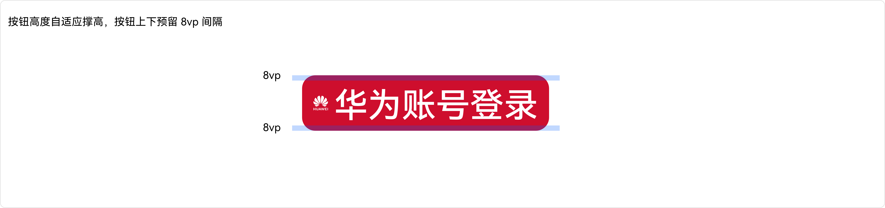

超长换行规则。

G.  多语言规则

双向&镜像原则

阿拉伯语、波斯语、乌尔都语、希伯来语等语言的书写方向为从右向左书写，和当今世界的主流语言（如英语）等从左向右书写的方向相反。受文字书写方向的影响，阿拉伯等语言的用户对左右逻辑的认知和英文等LTR（Left to Right）完全相反，比如习惯将右侧作为开始，左侧作为结束。为了支持RTL语言的这种语言和用户习惯特点，应用在本地化时，除了常规的翻译、区域特性适配等工作外，还需要在文本、界面布局、手势操作和动画、图标等交互元素中满足RTL的特殊要求。

样式三：带标志的按钮

带标志的插图，请参阅设计资源-使用华为账号登录，切勿创建自定义华为标志。当创建自定义【华为账号登录】按钮时，请遵循以下使用标志插图文件规范：

① 请勿将华为标志单独用作按钮。

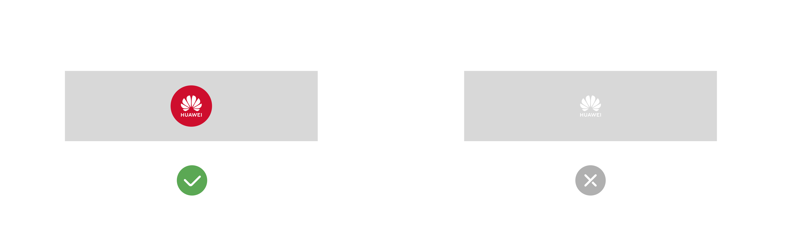

② 请勿裁剪华为标志。

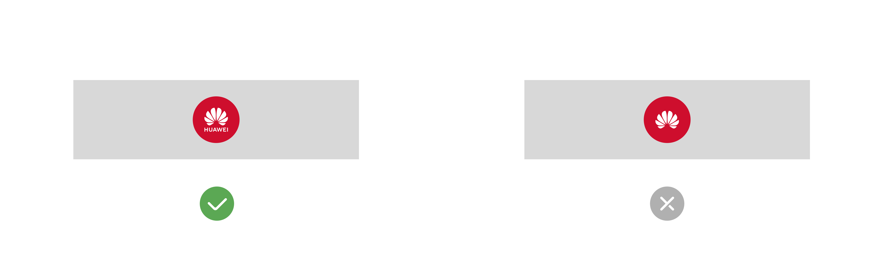

③ 使标志的高度与按钮的高度相匹配。

④ 请勿添加垂直内边距。

请遵循以下规范制作登录按钮：

① 不可自定义项：

A.  按钮布局：按钮内华为标志居中展示。

B.  按钮宽高比：带标志的按钮固定宽高比1：1。

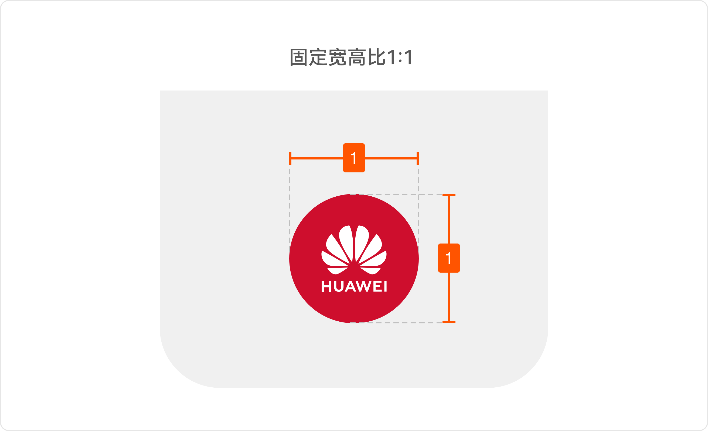

C.  按钮颜色：只能使用华为账号提供的固定颜色组合。

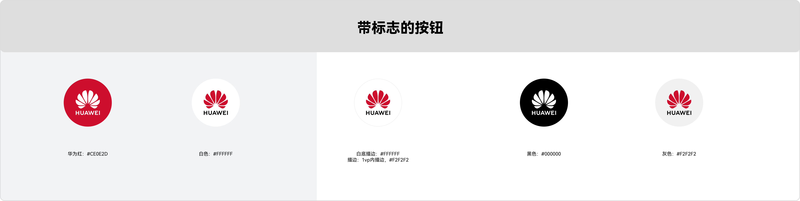

D.  按钮多态：按钮多态需按以下规则制作（以华为红为例）。

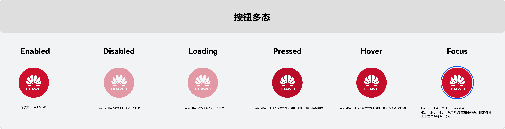

② 可自定义项：

A.  按钮标志大小：标志高度为按钮高度的40% ~ 64%（四舍五入取整数），最小16vp*16vp。

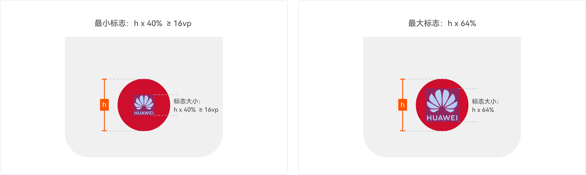

B.  按钮圆角：可配置（手机、平板、电脑默认均为全圆角）。

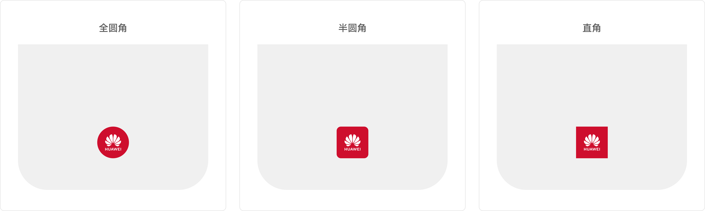

C.  按钮高度：按钮高度范围在28vp ~ 60vp之间。

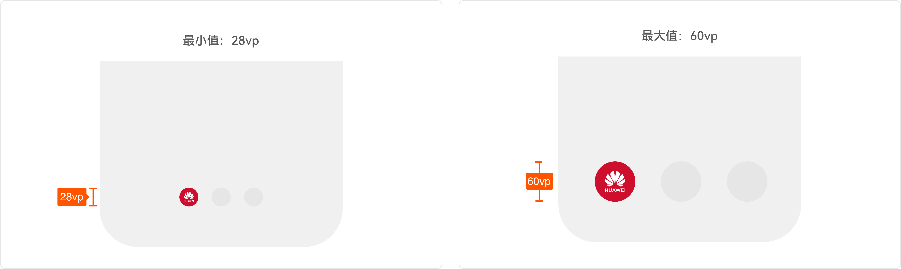

D.  按钮与屏幕安全间距：最小值16vp。

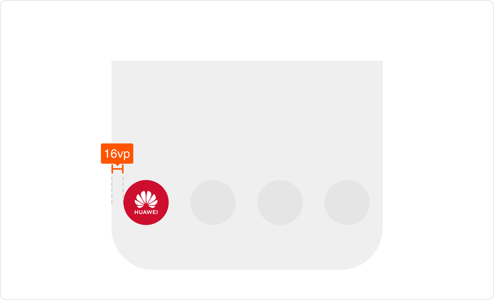
