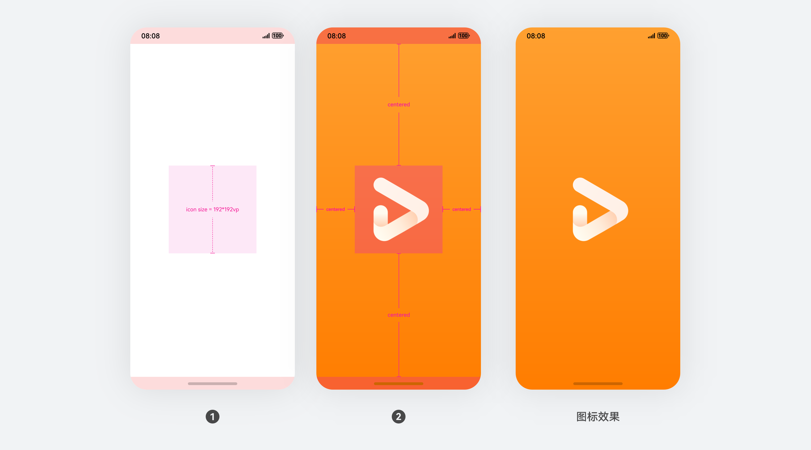
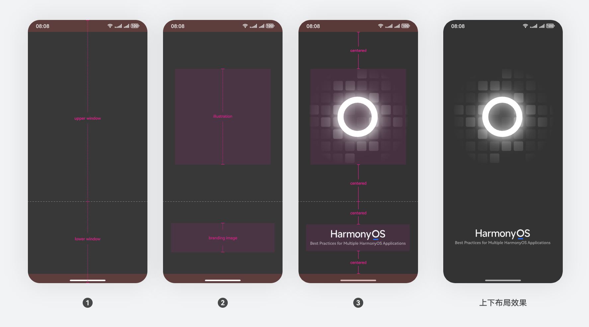
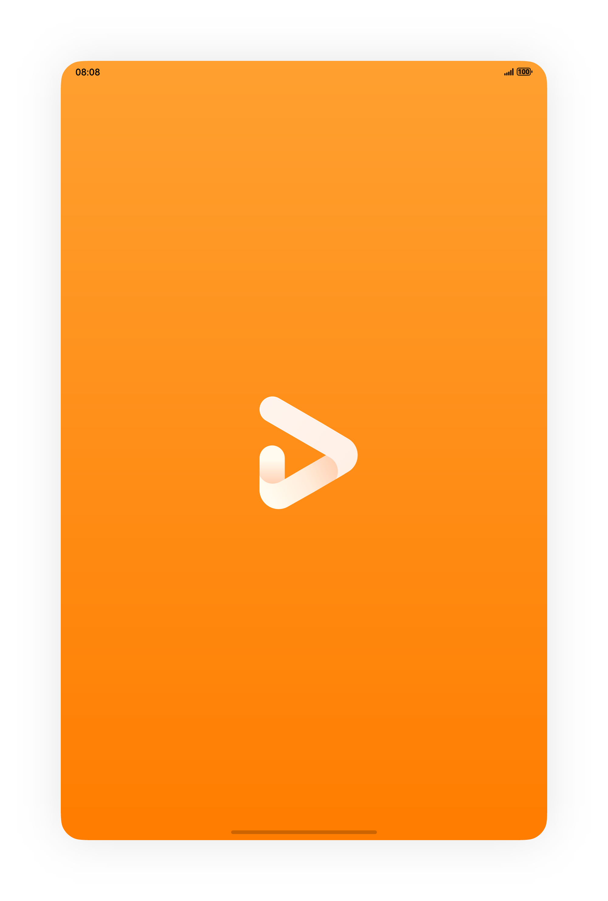

# 启动页

更新时间：

来源：https://developer.huawei.com/consumer/cn/doc/design-guides/system-capabilities-launch-page-0000002311335748

内容类应用启动页是用户开启应用时最先看到的界面。其承担传递品牌形象、获取用户必要权限（如存储、位置、相机等）的重任。设计时，需遵循鸿蒙系统规范，适配各设备屏幕特性，确保快速加载，自然融入授权流程，避免打断用户体验，为用户打造流畅且高效的应用启动开端。
 

##### 最佳实践

**简洁高效**
 
- 启动页应避免复杂内容，仅展示必要元素（如应用 Logo 或品牌标识）。
- 保持静态设计，减少使用动画或交互元素，以确保快速加载。

 
**视觉连贯**
 
- 启动页的设计应与应用首页（如主界面或引导页）风格一致，减少视觉跳跃感。
- 建议使用相同背景色、复用核心视觉组件（如品牌色、图标），确保平滑过渡。

 
**多设备适配**
 
- 基于设备或断点布局类型，提供对应启动页配置资源，确保在不同设备上观感最佳。
- 优先使用系统能力提供的启动页布局能力，确保在鸿蒙设备上的启动布局自适应。

 
**纯净展示**
 
- 启动页尽量避免包含促销信息、广告或第三方品牌内容，需专注于品牌展示。
- 启动页是短暂延迟，0.3-0.8秒内最佳，延长显示时间会降低体验。

 
 

##### 启动页资源规格

启动画面的可自定义元素包括应用图标、图标背景和窗口背景。
  
| 规格 | 维度 | 说明 |
| --- | --- | --- |
| 必备组件 | 配置背景颜色 | 可选纯色/渐变/图片背景，需适配多分辨率与安全区，不可透明 |
| 可选组件 | App Icon/插画 | 可为透明 |
 
 
 

##### 结构分类

**纯图标类**
 
为进一步强化业务品牌属性，开屏的沉浸式背景色为应用定义的主题色，大多数情况下可以与 icon 背板色彩进行呼应。
 

 
纯图标类的需提供图标分层资源，系统会根据默认规格进行缩放适配与界面布局。
 

 
**上下布局类**
 

 
上下布局类的需提供图插画和品牌标识资源，系统会根据默认规格进行缩放适配与界面布局。
 

 
 

##### 多设备适配

当前设备种类繁多，基于断点规则，确保在合适的设备上提供最优的用户体验，同时兼顾不同设备的适配性需求。有关指南，请参阅[布局](https://developer.huawei.com/consumer/cn/doc/design-guides/design-layout-basics-0000001795579413)
 
 

##### 图标类
 
| 设备/场景 | 图例 |
| --- | --- |
| 穿戴手表 |  |
| 手机竖屏 |  |
| 手机横屏 |  |
| 阔折叠竖屏、阔折叠外屏 |  |
| 阔折叠横屏 |  |
| 折叠屏 |  |
| 平板竖屏 |  |
| 平板横屏 |  |
| 电脑 |  |
 
 
 

##### 上下布局类
 
| 设备/场景 | 图例 |
| --- | --- |
| 穿戴手表 |  |
| 手机竖屏 |  |
| 手机横屏 |  |
| 阔折叠竖屏，阔折叠外屏 |  |
| 阔折叠横屏 |  |
| 折叠屏 |  |
| 平板竖屏 |  |
| 平板横屏 |  |
| 电脑 |  |
 
 
 

##### 深色模式

建议应用按照自身业务品牌色进行深色模式适配，确保资源结构类型与浅色模式一致，背景色最大限度降低亮度处理，可直接使用黑色。如果是插画类型，可适配深色模式插画资源。
 

 
 

##### 资源

请根据需要选择以下格式的设计模板和资源：
 
[启动页设计资源](https://developer.huawei.com/images/download/next/launch-page.zip)
