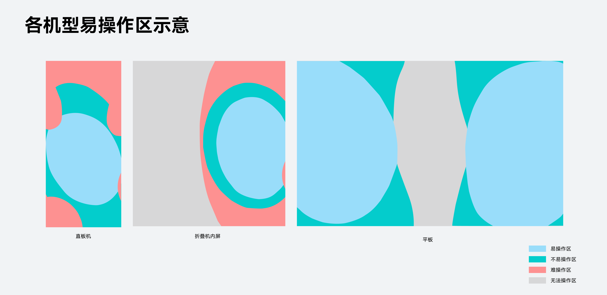
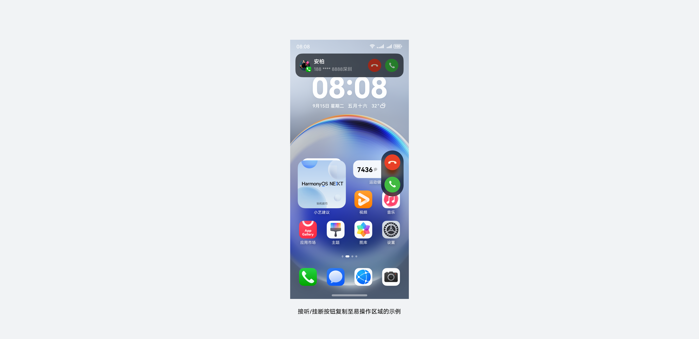
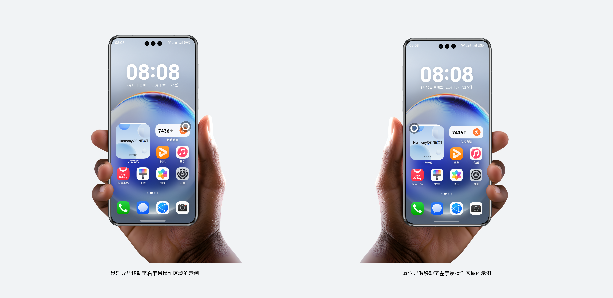
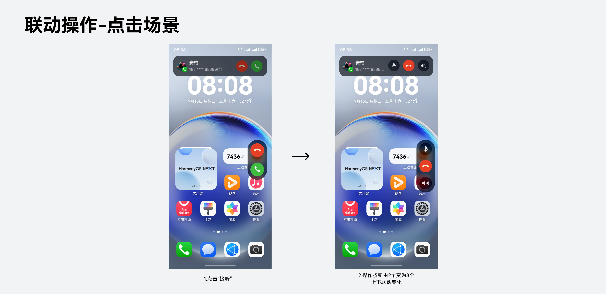
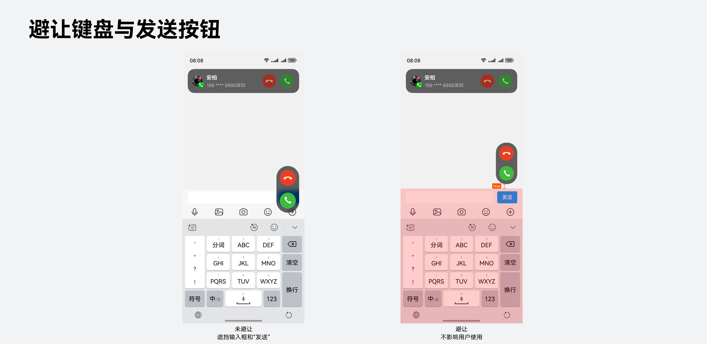

# 智感握姿

更新时间：2026-06-12 08:59:30

来源：https://developer.huawei.com/consumer/cn/doc/design-guides/smart-reachability-0000002556657823

#### 概述

#### 设计背景

用户在很多场景下需要单手使用手机，屏幕越大，单手能稳定触达的范围越有限。例如：直板机的远端与顶部、折叠机内屏等区域。关键操作一旦落在这些区域，就会操作吃力、误触增多。

#### 智感握姿

针对上述问题，HarmonyOS 提供**智感握姿**能力——实时识别用户与设备的交互姿态，应用可据此把部分高频组件动态调整到**易操作区**内，提升单手操作体验。智感握姿包括以下两种能力：

 - **握持手识别**——设备当前被哪只手握着 (左/右/双手/未握持) 。
 - **交互手识别**——用户当前用哪只手在屏上操作 (左/右手) 。

#### 接入原则

**基本原则**：只让“**高频且单手难触达**”的组件跟手。高频是指用户在当前页面频繁使用的关键操作；单手难触达是指组件的默认位置落在用户不易操作的区域。

**跟手方式**：
1. **新增跟手组件**：不改变原有组件位置，另在易操作区新增跟手组件；
2. **组件跟手位移**：相关组件整体跟手迁移到易操作区。

迁移/新增后，组件的**功能、状态、行为都与原来完全一致**。跟手组件的移动不要过于频繁，不要移动用户正按着的目标、也不打断进行中的操作。

**组件移动方式**：
1. 贴边的组件**从屏外绕行**到对侧；
2. 在底部或较宽的组件，**直接在屏内平移**过去。

**统一术语：**“智感握姿”为 HarmonyOS 独有能力，应用若露出相关介绍，必须准确使用“智感握姿”，避免使用其他类似用词混淆用户心智。

#### 典型场景

#### 来电横幅

来电/横幅浮层的接听/挂断是突发弹出、点错代价高的关键操作。建议**新增跟手组件**：原位置按钮保留，同时在**握持手**侧的易操作区另加一组同功能、同状态的按钮。两组交互需同步联动，保证两侧反馈一致。

#### 悬浮组件

悬浮按钮 (FAB)、侧边操作条等是页面高频常驻的主操作，默认贴在右下或侧边，左手不易触达。用户单手握持时，通过智感握姿可以让悬浮组件跟随**握持手**移动。

跟手移动时，不应更改垂直高度，侧边距左右一致。

#### 成组组件

工具栏、导航栏等成组组件**整组一起迁移，**保留组内顺序与间距不变。

#### 不接入场景

 - **低频/非操作类**组件不建议接入，避免界面不稳定。

 - **广告/诱导类 (**“前往/确认”“关闭”按钮) 不建议接入。

#### 动效规则

组件出场位移动画使用曲线 interpolatingSpring (velocity 0；mass 1；stiffness 200 ; damping17) 。

从屏幕外移出或移入的组件，动画使用曲线 interpolatingSpring (velocity 0；mass 1；stiffness 170 ; damping17)。

智感握姿开发文档请参阅：[获取用户动作开发指导](https://developer.huawei.com/consumer/cn/doc/harmonyos-guides/motion-guidelines)
