# 碰一碰

更新时间：2026-04-13 09:40:30

来源：https://developer.huawei.com/consumer/cn/doc/design-guides/onehop-0000002354602581

用户可通过设备间碰一碰，快速进行超近场分享。当前支持手机与手机、手机与电脑进行碰一碰分享。手机设备之间碰一碰可通过设备顶部碰一碰实现，手机与电脑则通过手机顶部轻触屏幕实现分享。关于碰一碰分享的开发适配指南，请参阅 [Share Kit](https://developer.huawei.com/consumer/cn/doc/harmonyos-guides/share-introduction)。
 

 

#### 适用场景

碰一碰分享适用于设备间的快速分享，支持分享内容有图片、视频、网络、联系人、链接等。
 

 
 

#### 碰一碰分享界面构成

设备碰一碰成功建立连接后，会形成分享界面。分享界面由以下 4 大部分组成
 
 
1、虫洞区：碰后设备间若成功建立连接，顶部出现虫洞，用于飞出或飞入卡片。不支持应用自定义。
 
2、卡片区：用于分享内容展示，提供 5 类模板，生态应用根据分享内容选择不同模板。
 
3、信息展示区：用于展示分享时对方的设备信息，包括华为账号头像以及设备名称。在 1 碰多的场景中会出现头像叠加。不支持应用自定义。
 
4、操作区：发送端和接收端分别为引导字符和按钮，展示交互方式和操作意图。不支持应用自定义。
 

 

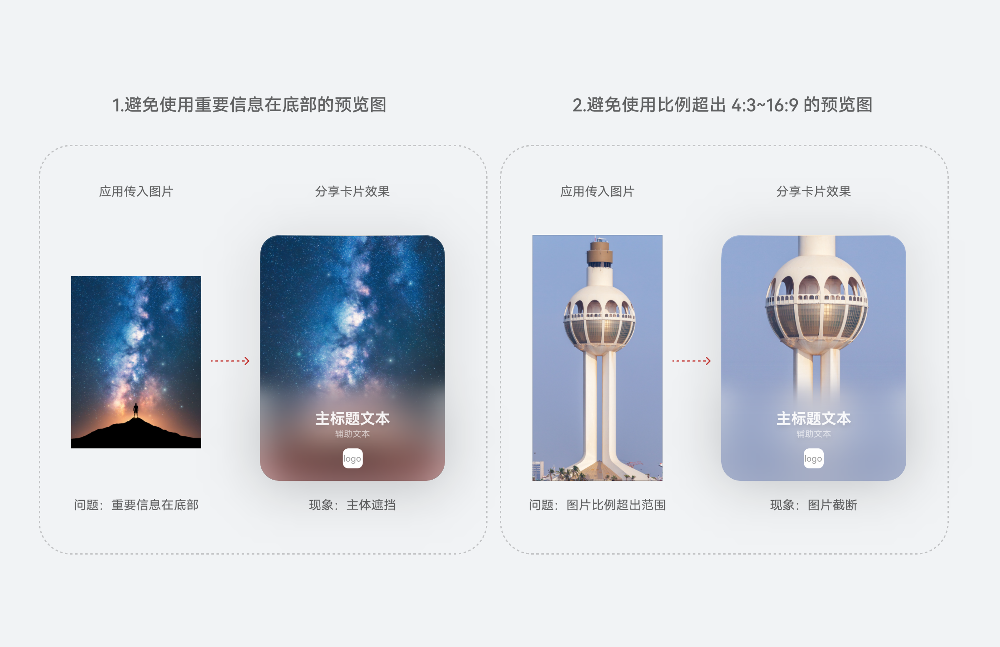

 

 

 

#### 卡片模板

根据不同的分享内容和业务诉求，按照接入内容不同提供 5 类模板，应用可根据不同需求选择不同模板。(备注:当前名片类模板仅对系统联系人应用开放)
 
 

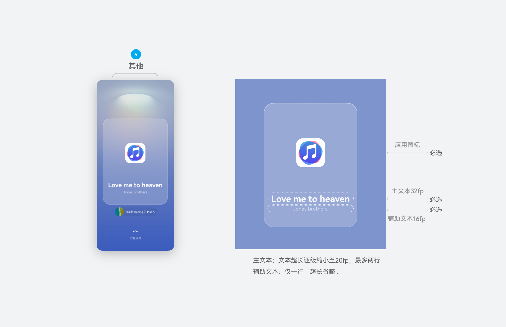

 

 

#### 图片、视频类卡片模板

1、适用场景：分享内容为图片或视频。
 
2、应用接入：应用需传入预览图片或者视频。
 
3、卡片详情：根据原图片比例进行自适应显示，支持比例范围为 4:1 ～ 1:4 ，超出进行图片居中裁剪。
 
 
手机
 

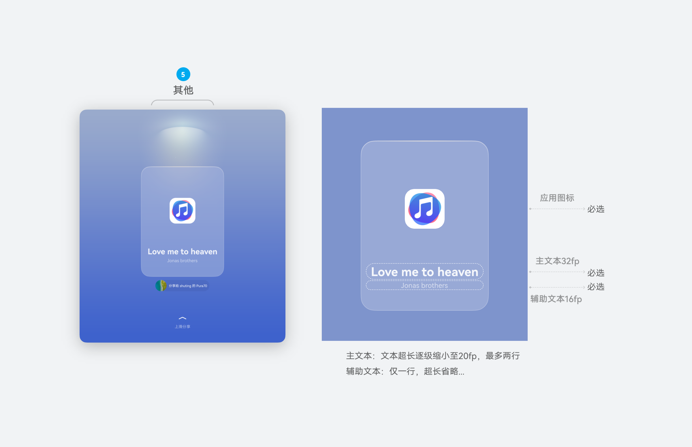

 
折叠屏
 

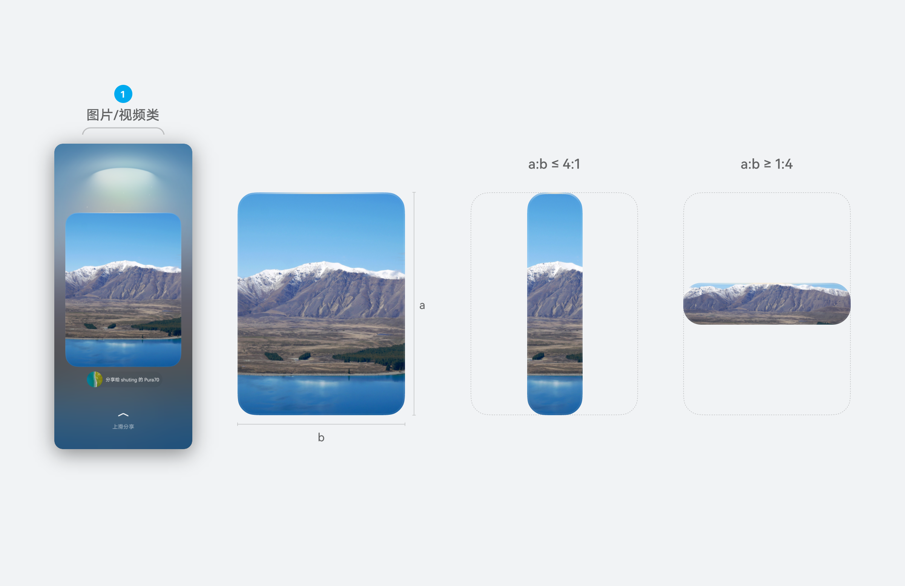

 

 

#### 文件类卡片模板

1、适用场景：分享内容为文件、WIFI 或者个人热点。
 
2、应用接入：应用需传入主副文本。文件类主文本为文件名称及类型，辅助文本为文件大小。
 
3、卡片详情：卡片比例固定为 4:3 。
 
 
手机
 

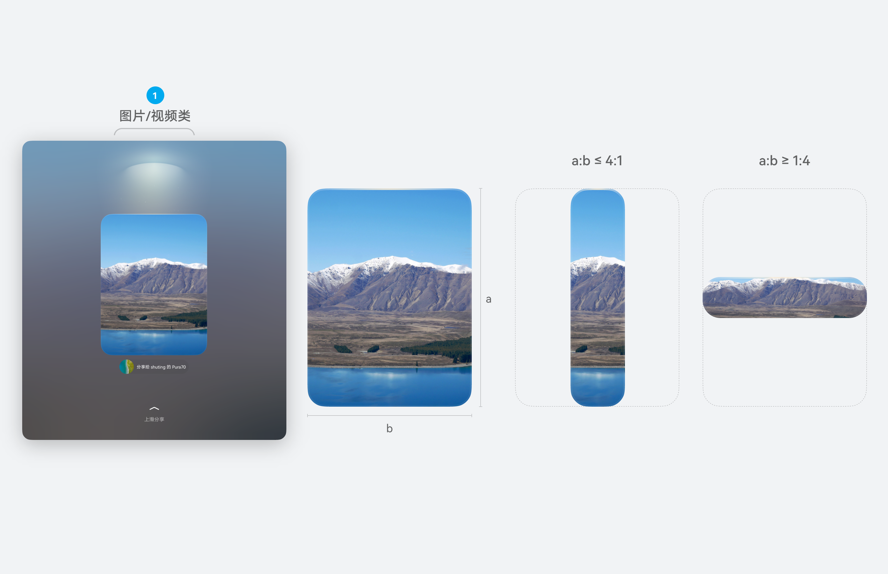

 
折叠屏
 

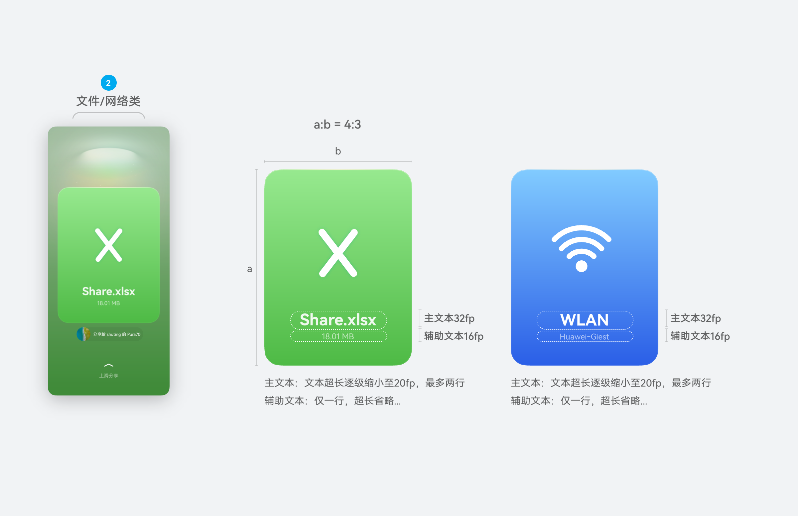

 

#### 链接类卡片模板

1、适用场景：分享内容为链接，例如音乐链接、视频链接、商品链接等等。
 
2、应用接入：应用需传入主副文本，预览图以及应用图标。若分享类型为名片，则还需传入用户头像。
 
3、卡片详情：最佳预览图比例为 4:3、1:1、16:9，应用请尽量传入上述比例预览图。超出 4:3 ～ 16:9 的比例图片居中裁剪。
 
 
手机
 

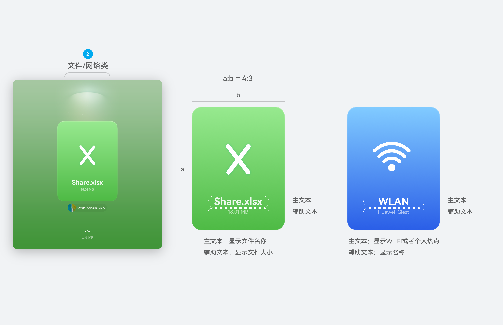

 
折叠屏
 

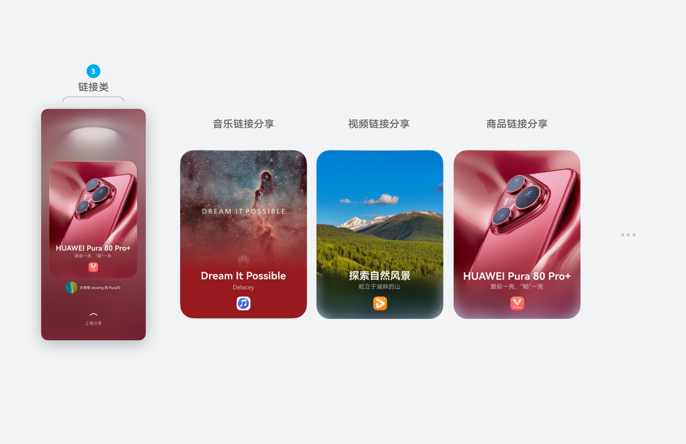

 
链接类模板可分为内容分享与名片分享两类，应用可根据分享内容进行匹配。
 

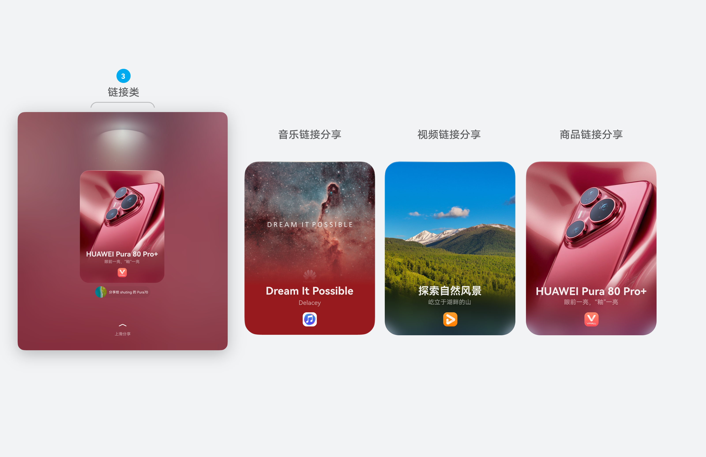

 
应用传入的预览图尽量保持在 4:3、1:1、16:9 三种比例，以此可保障画面不被裁剪。
 

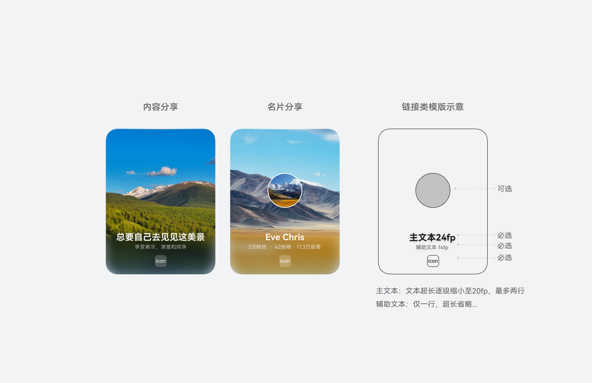

 
应用在传入预览图时，尽量选取主体明确、比例合适、底部无重要信息露出的图片，以获得最佳显示效果。
 

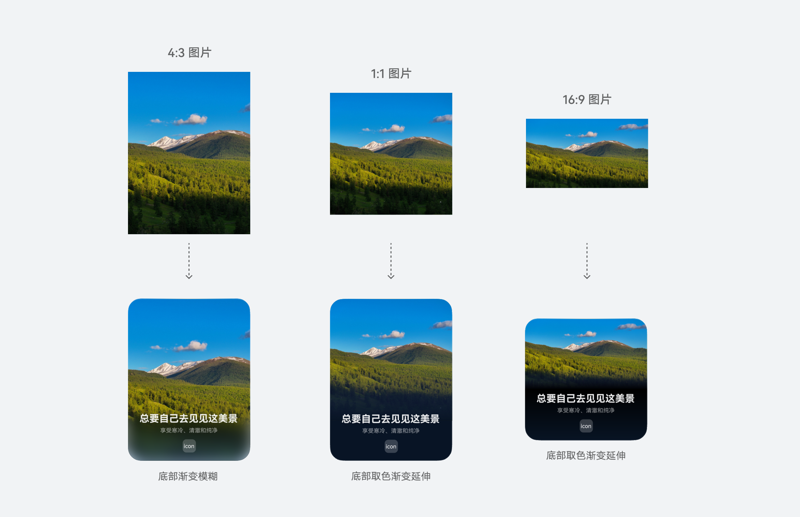

 

#### 其他卡片模板

1、适用场景：系统分享面板碰一碰&无预览图特殊场景。
 
2、应用接入：应用需传入主副文本，以及应用图标。
 
3、卡片详情：无预览图时，展示当前卡片样式。
 
 
手机
 

 
折叠屏
 

