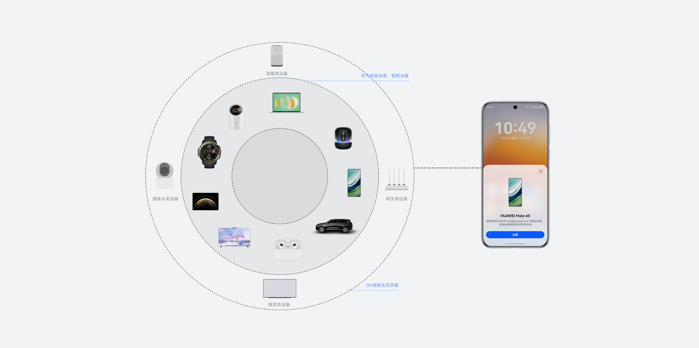
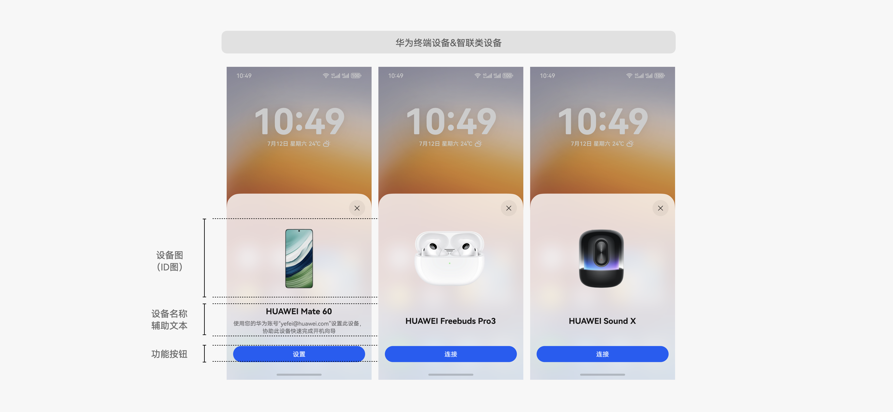
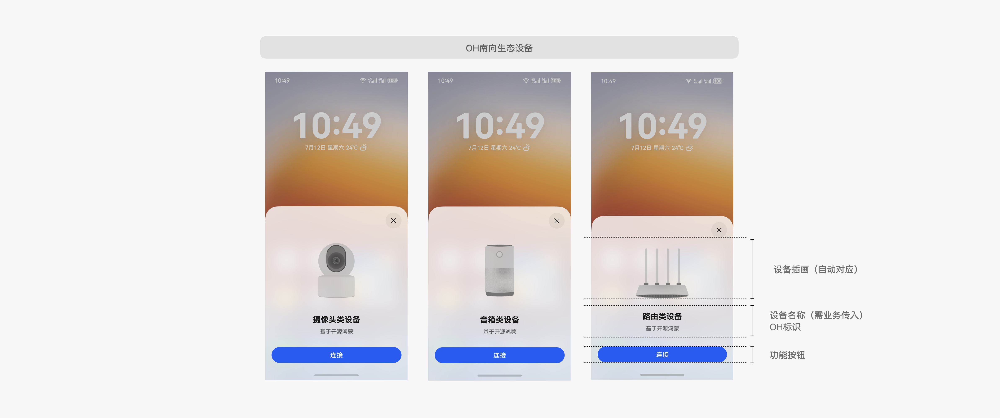
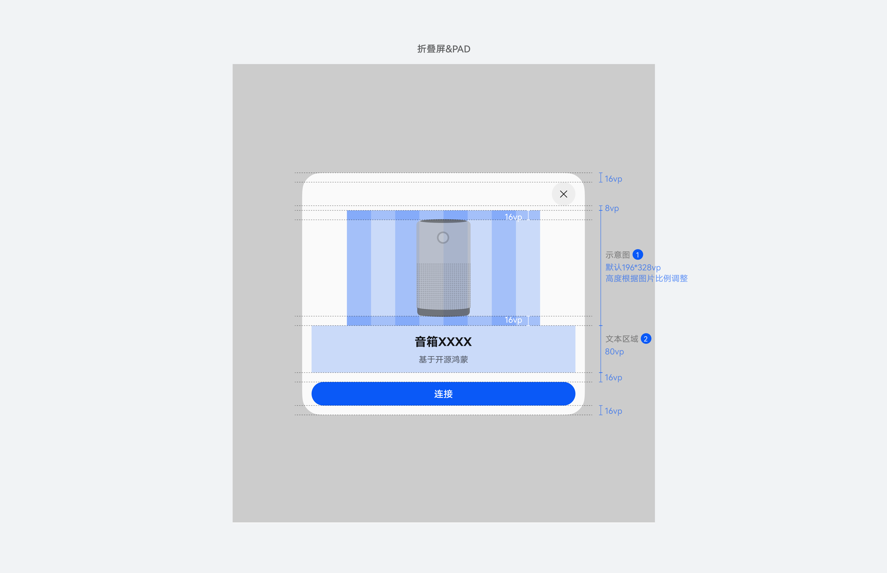
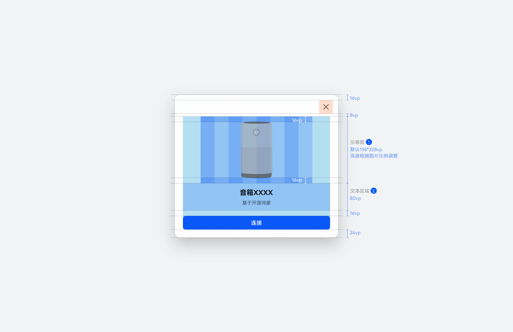

# 靠近发现

更新时间：2025-06-20 00:31:10

来源：https://developer.huawei.com/consumer/cn/doc/design-guides/i-connect-0000002354482789

用户可通过设备靠近，进行设备间的连接或协助新设备快速启用。可发现设备范围包括华为终端设备，鸿蒙智联设备以及开源鸿蒙 (OH) 智能生态设备。

## 基本分类与页面构成

可发现设备可以简单归结为两类，一类由华为终端设备和智联生态设备组成，另一类则为开源鸿蒙 (OH) 智能生态设备。界面主要由图片区域、文本区域以及按钮区域组成。

### 华为终端设备以及智联生态设备

华为终端设备包括耳机、音箱、手表、手机、平板、PC、智慧屏、车机。智联生态设备覆盖接入智慧生活 App 的生态设备。界面构成：有屏设备使用真实 ID+版本壁纸，无屏设备图使用真实 ID 图，与设备对应。

### 开源鸿蒙生态设备

开源鸿蒙 (OH) 生态设备根据功能区分为摄像头类、网关类、商显类以及音箱类设备。界面构成：使用插画示意设备类型，生态需传入设备名称以及设备类型。

## 视觉规则

### 多端布局规范

手机端：竖屏图片区域宽度默认 328 VP，高度根据产品比例调整。横屏图片区域进行等比缩放，高度自适应，整体比例与竖屏一致。

折叠屏以及平板：半模态宽度固定 480 VP，高度自适应。图片区域宽度默认 328 VP，高度根据产品比例调整。横竖屏保持一致。

电脑：半模态宽度固定 480 VP，高度自适应。竖屏图片区域宽度默认 328 VP，高度根据产品比例调整。

### 文本区域规范

文本区域由标题和辅助文本构成 (生态设备连接弹框辅助文本默认展示为 “基于开源鸿蒙”)。

·标题文本大小：Title_S (bold)

·标题文本颜色：font_primary

·辅助文本大小：Body_M (regular)

·辅助文本颜色：font_secondary

