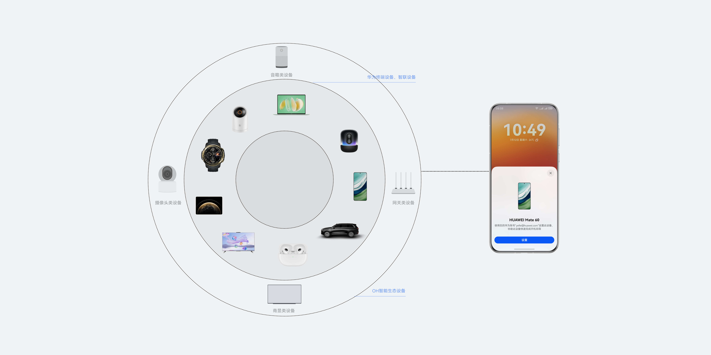
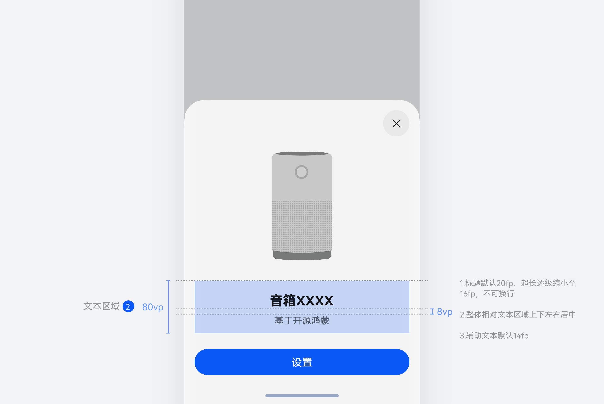

# 靠近发现

更新时间：2026-05-19 02:14:00

来源：https://developer.huawei.com/consumer/cn/doc/design-guides/i-connect-0000002354482789

用户可通过设备靠近，进行设备间的连接或协助新设备快速启用。可发现设备范围包括华为终端设备，鸿蒙智联设备以及开源鸿蒙 (OH) 智能生态设备。

#### 基本分类与页面构成
可发现设备可以简单归结为两类，一类由华为终端设备和智联生态设备组成，另一类则为开源鸿蒙 (OH) 智能生态设备。界面主要由图片区域、文本区域以及按钮区域组成。

#### 华为终端设备以及智联生态设备
华为终端设备包括耳机、音箱、手表、手机、平板、PC、智慧屏、车机。智联生态设备覆盖接入智慧生活 App 的生态设备。界面构成：有屏设备使用真实 ID+版本壁纸，无屏设备图使用真实 ID 图，与设备对应。

#### 开源鸿蒙生态设备
开源鸿蒙 (OH) 生态设备根据功能区分为摄像头类、网关类、商显类以及音箱类设备。界面构成：使用插画示意设备类型，生态需传入设备名称以及设备类型。

#### 交互规则
连接半模态需要展现设备连接状态，即连接中、连接完成、异常等情况。

连接中时，底部按钮替换为进度展示，可选用模糊进度或百分比进度，此时辅助文本可用于提示用户操作或显示详细状态信息。

连接流程中，通过右上角关闭按钮关闭半模态，通过点击底部按钮进入下一步。连接结束时，若不再有下一步，底部按钮也用于关闭半模态，推荐的按钮文本见下方。

尽量保证同一流程的模态高度保持一致，避免视图跳动。若前后步骤间内容差异大，无法保持模态高度一致，注意通过动效衔接高度变化，避免跳变。

#### 视觉规则
#### 多端布局规范
手机端：竖屏图片区域宽度默认 328 VP，高度根据产品比例调整。横屏图片区域进行等比缩放，高度自适应，整体比例与竖屏一致。

折叠屏以及平板：半模态宽度固定 480 VP，高度自适应。图片区域宽度默认 328 VP，高度根据产品比例调整。横竖屏保持一致。

电脑：半模态宽度固定 480 VP，高度自适应。竖屏图片区域宽度默认 328 VP，高度根据产品比例调整。

#### 文本区域规范
文本区域由标题、辅助文本 (可选展示)、附加元素 (可选展示) 构成，生态设备连接弹框辅助文本默认展示为 “基于开源鸿蒙”。
·标题文本大小：Title_S (bold)
·标题文本颜色：font_primary
·辅助文本大小：Body_M (regular)
·辅助文本颜色：font_secondary

#### 附加元素规则
根据业务需要，可选择附加 隐私声明、勾选项、标签。

#### 标题栏规范
对于设置类页面，如网络设置等，需要标题的，尽量使用半模态顶部统一控件。对于 开始连接、连接中、连接完成 这些简单页面，半模态顶部标题栏内无文字。以下为示例。

