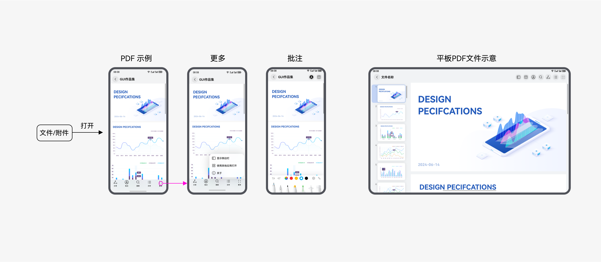
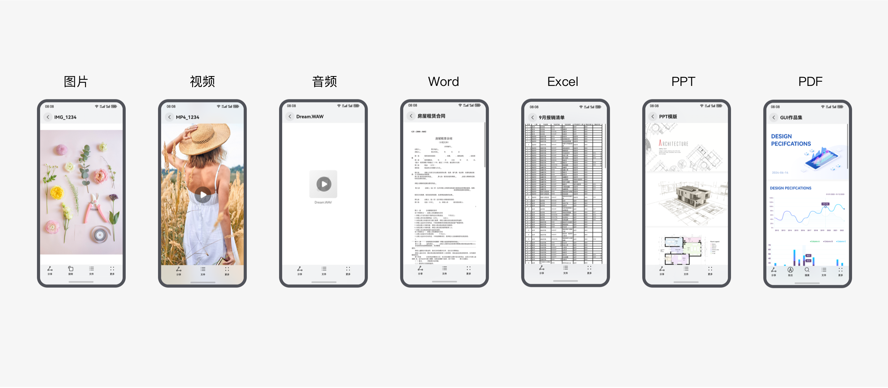
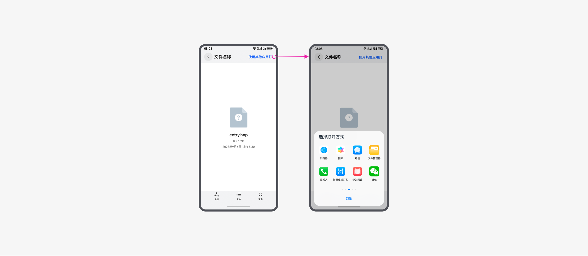
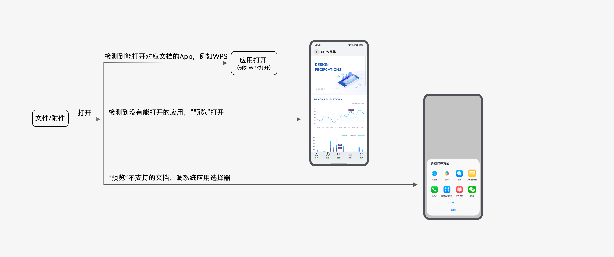

# 预览

更新时间：

来源：https://developer.huawei.com/consumer/cn/doc/design-guides/preview-0000001957112409

“预览”功能通常指编辑详细文档内容之前，能先快速浏览或查看其内容。提供该系统级文件预览框架和能力，建立统一的“一步预览”体验。适用场景包含：
 
- 在文件管理类应用中，点击文件查看文档内容或打印效果。
- 在邮件类应用中，点击附件打开预览。

 

 
**触发操作：**手机和折叠、平板通过点击打开文件，也可通过左右滑动切换文件；二合一产品通过鼠标双击和右键菜单打开
 
适用设备对象：手机、折叠、平板和二合一产品。
 

 
**适用场景规则：**
 
场景一 ( 应用主动接入）：打开文件直接用“预览”显示，接口开放可调用
 
场景二 ( 基于支持文件自动匹配）：
 
1. 有对应文档应用优先打开应用。
 
2. 没有或者未设定“默认打开应用”时，“预览”打开。
 
3. 应用被卸载后，自动切换至 “预览” 打开。
 

 
**场景一：应用主动接入**
 
应用主动接入预览接口后，点击文档默认打开预览，可以在菜单里选择其他应用打开。
 

 

 
文档类型示意：
 

 

 
预览不支持的文档，显示如下：
 

 

 
**场景二：基于文件自动匹配**
 
应用无需接入预览能力，系统默认自动匹配
 

